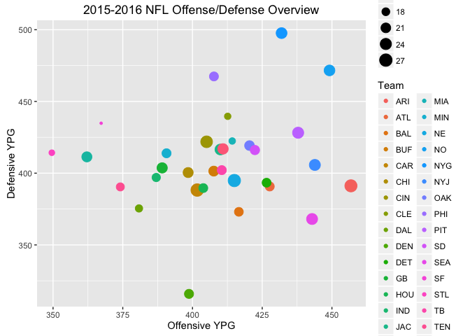
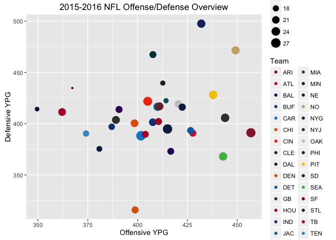
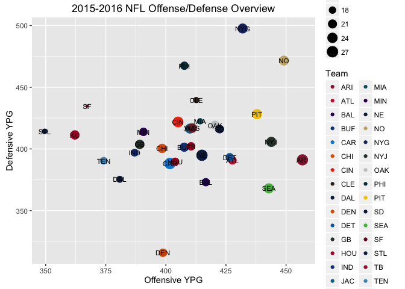

This is a step-by-step breakdown of my thought process for building a nice looking scatter plot using `ggplot2` in R. This analysis uses a dataset containing information on every play in the 2015-2016 NFL football season found [here on Kaggle](https://www.kaggle.com/maxhorowitz/nflplaybyplay2015). This season culminated in Super Bowl L in which the Denver Broncos defeated the Carolina Panthers 24-10. It was also the last professional football game for the legendary [Peyton Manning](https://en.wikipedia.org/wiki/Peyton_Manning). Not a bad way to go out.

In this exploration I'll take a look at some simple summary statistics of the various teams over the regular season and see if any interesting insights come out as to what made the Broncos/Panthers the final two standing for the year. I'll build a scatter plot comparing the total offense and defensive production of each team and use some simple web scraping to add the team colors to the visualization.

<!-- more -->

Data Analysis
-------------

First, load the relevant packages. I use the usual `dplyr` and `tidyr` for data frame manipulation, `magrittr` for the two-way chaining operator, `lubridate` for working with dates, and `ggplot2` for visualizations.

~~~ r
library(tidyr)
library(dplyr)
library(magrittr)
library(lubridate)
library(ggplot2)
~~~

Read in the CSV file and let's see what we have

~~~ r
df <- data.frame(read.csv('/Users/ajpryor/Downloads/NFLPlaybyPlay2015.csv',header=T, stringsAsFactors = FALSE))
df$Date <- as.Date(df$Date)
str(df)
~~~

    ## 'data.frame':    46129 obs. of  66 variables:
    ##  $ X                 : int  36 51 72 101 122 159 180 199 236 261 ...
    ##  $ Date              : Date, format: "2015-09-10" "2015-09-10" ...
    ##  $ GameID            : int  2015091000 2015091000 2015091000 2015091000 2015091000 2015091000 2015091000 2015091000 2015091000 2015091000 ...
    ##  $ Drive             : int  1 1 1 1 1 1 1 1 1 1 ...
    ##  $ qtr               : int  1 1 1 1 1 1 1 1 1 1 ...
    ##  $ down              : int  NA 1 1 2 1 1 1 2 2 3 ...
    ##  $ time              : chr  "15:00" "15:00" "14:21" "14:04" ...
    ##  $ TimeUnder         : int  15 15 15 15 14 13 13 12 11 11 ...
    ##  $ TimeSecs          : int  3600 3600 3561 3544 3506 3462 3425 3380 3353 3328 ...
    ##  $ PlayTimeDiff      : int  0 0 39 17 38 44 37 45 27 25 ...
    ##  $ SideofField       : chr  "NE" "PIT" "PIT" "PIT" ...
    ##  $ yrdln             : int  35 20 38 47 49 35 24 32 42 36 ...
    ##  $ yrdline100        : int  35 80 62 53 49 35 24 32 42 36 ...
    ##  $ ydstogo           : int  0 10 10 1 10 10 10 18 28 22 ...
    ##  $ ydsnet            : int  0 18 31 31 45 56 48 54 54 54 ...
    ##  $ GoalToGo          : int  0 0 0 0 0 0 0 0 0 0 ...
    ##  $ FirstDown         : int  NA 1 0 1 1 1 0 0 0 0 ...
    ##  $ posteam           : chr  "PIT" "PIT" "PIT" "PIT" ...
    ##  $ DefensiveTeam     : chr  "NE" "NE" "NE" "NE" ...
    ##  $ desc              : chr  "S.Gostkowski kicks 65 yards from NE 35 to end zone, Touchback." "(15:00) De.Williams right tackle to PIT 38 for 18 yards (D.Hightower)." "(14:21) B.Roethlisberger pass short right to A.Brown pushed ob at PIT 47 for 9 yards (D.Hightower)." "(14:04) De.Williams right guard to NE 49 for 4 yards (J.Collins; M.Brown)." ...
    ##  $ PlayAttempted     : int  1 1 1 1 1 1 1 1 1 1 ...
    ##  $ Yards.Gained      : int  0 18 9 4 14 11 -8 4 6 10 ...
    ##  $ sp                : int  0 0 0 0 0 0 0 0 0 0 ...
    ##  $ Touchdown         : int  0 0 0 0 0 0 0 0 0 0 ...
    ##  $ ExPointResult     : chr  NA NA NA NA ...
    ##  $ TwoPointConv      : chr  NA NA NA NA ...
    ##  $ DefTwoPoint       : chr  NA NA NA NA ...
    ##  $ Safety            : int  0 0 0 0 0 0 0 0 0 0 ...
    ##  $ PuntResult        : chr  NA NA NA NA ...
    ##  $ PlayType          : chr  "Kickoff" "Run" "Pass" "Run" ...
    ##  $ Passer            : chr  NA NA "B.Roethlisberger" NA ...
    ##  $ PassAttempt       : int  0 0 1 0 1 0 0 0 0 1 ...
    ##  $ PassOutcome       : chr  NA NA "Complete" NA ...
    ##  $ PassLength        : chr  NA NA "Short" NA ...
    ##  $ PassLocation      : chr  NA NA "right" NA ...
    ##  $ InterceptionThrown: int  0 0 0 0 0 0 0 0 0 0 ...
    ##  $ Interceptor       : chr  NA NA NA NA ...
    ##  $ Rusher            : chr  NA "D.Hightower" NA "J.Collins" ...
    ##  $ RushAttempt       : int  0 1 0 1 0 1 0 0 1 0 ...
    ##  $ RunLocation       : chr  NA "right" NA "right" ...
    ##  $ RunGap            : chr  NA "tackle" NA "guard" ...
    ##  $ Receiver          : chr  NA NA "A.Brown" NA ...
    ##  $ Reception         : int  0 0 1 0 1 0 0 0 0 1 ...
    ##  $ ReturnResult      : chr  "Touchback" NA NA NA ...
    ##  $ Returner          : chr  NA NA NA NA ...
    ##  $ BlockingPlayer    : chr  NA NA NA NA ...
    ##  $ Tackler1          : chr  NA "D.Hightower" "D.Hightower" "J.Collins" ...
    ##  $ Tackler2          : chr  NA NA NA "M.Brown" ...
    ##  $ FieldGoalResult   : chr  NA NA NA NA ...
    ##  $ FieldGoalDistance : int  NA NA NA NA NA NA NA NA NA NA ...
    ##  $ Fumble            : int  0 0 0 0 0 0 0 0 0 0 ...
    ##  $ RecFumbTeam       : chr  NA NA NA NA ...
    ##  $ RecFumbPlayer     : chr  NA NA NA NA ...
    ##  $ Sack              : int  0 0 0 0 0 0 1 0 0 0 ...
    ##  $ Challenge.Replay  : int  0 0 0 0 0 0 0 0 0 0 ...
    ##  $ ChalReplayResult  : chr  NA NA NA NA ...
    ##  $ Accepted.Penalty  : int  0 0 0 0 0 0 0 1 0 0 ...
    ##  $ PenalizedTeam     : chr  NA NA NA NA ...
    ##  $ PenaltyType       : chr  NA NA NA NA ...
    ##  $ PenalizedPlayer   : chr  NA NA NA NA ...
    ##  $ Penalty.Yards     : int  0 0 0 0 0 0 0 10 0 0 ...
    ##  $ PosTeamScore      : int  0 0 0 0 0 0 0 0 0 0 ...
    ##  $ DefTeamScore      : int  0 0 0 0 0 0 0 0 0 0 ...
    ##  $ ScoreDiff         : int  0 0 0 0 0 0 0 0 0 0 ...
    ##  $ AbsScoreDiff      : int  0 0 0 0 0 0 0 0 0 0 ...
    ##  $ Season            : int  2015 2015 2015 2015 2015 2015 2015 2015 2015 2015 ...

There's a ton of information here. It seems every play of every game in the regular season is catalogued. Each game has a `GameID` and the `Date` on which it was played. The offense and defense teams are given by `posteam` and `DefensiveTeam`, respectively. There's also the time on the clock, current down and distance, type of play, special teams information, information on the players involved, etc. It's really tempting to explore this in great detail, but for the purposes of this demonstration, let's keep it simple. I'll organize things a bit and create some summary statistics.

NFL games usually, but not always, are played on Sundays, so they are instead grouped by week. First, I'll assign the week number to each game relative to the first game of the season.

~~~ r
df %<>%
  mutate(week = as.numeric(df$Date - df[1,'Date'])%/%7 + 1)
~~~

Let's breakdown the overall offensive/defensive performance for each time to see which was the driving factor behind the Bronco's victory. To start I'll compare the total yards of offense per game, the total yards given up defensively per game, and the average number of points scored per game. We can get to these values by grouping the data by `posteam` or `DefensiveTeam` and aggregating `Yards.Gained` to get the total number of yards in the season. Dividing by the number of unique `GameID`'s for each team gets the average (just in case some teams played more games than others).

Defense first as it is a little simpler:

~~~ r
def <- df %>% 
  filter(!is.na(DefensiveTeam)& DefensiveTeam!='') %>%
  group_by(DefensiveTeam) %>% 
  summarise(def_ypg = sum(Yards.Gained[Penalty.Yards==0]) / n_distinct(GameID)) %>%
  arrange(def_ypg)
def <- data.frame(def)
def
~~~

    ##    DefensiveTeam  def_ypg
    ## 1            DEN 315.8750
    ## 2            SEA 368.0625
    ## 3            BAL 373.0625
    ## 4            DAL 375.4375
    ## 5            CAR 388.2500
    ## 6            HOU 389.6250
    ## 7            TEN 390.4375
    ## 8            ATL 390.7500
    ## 9            ARI 391.1875
    ## 10           DET 393.3750
    ## 11            NE 394.8750
    ## 12           IND 397.0000
    ## 13           CHI 400.4375
    ## 14           BUF 401.4375
    ## 15            TB 402.1250
    ## 16            GB 403.6875
    ## 17           NYJ 405.7500
    ## 18            KC 411.3750
    ## 19           MIN 413.8750
    ## 20           STL 414.2500
    ## 21            SD 416.1250
    ## 22           JAC 416.5000
    ## 23           WAS 416.9375
    ## 24           OAK 419.2500
    ## 25           CIN 421.8750
    ## 26           MIA 422.4375
    ## 27           PIT 428.1875
    ## 28            SF 434.8125
    ## 29           CLE 439.6250
    ## 30           PHI 467.4375
    ## 31            NO 471.6250
    ## 32           NYG 497.6250

Spoiler alert -- Denver had an amazing defense this year.

Now for the offense. The total yards per game is calculated essentially the same as for defense, but the total number of points scored per game (ppg) requires a little manipulation, as teams can score in any of the following ways:

-   Touchdown (6 points)
-   Extra Point (1 point)
-   Two-point Conversion (2 points)
-   Field-Goal (3 points)

In R this can be done as

~~~ r
off <- df %>% 
  filter(!is.na(posteam) & posteam!='') %>%
  group_by(posteam) %>% 
  summarise(off_ypg = sum(Yards.Gained[Penalty.Yards==0]) / n_distinct(GameID),
            ppg=(   sum(Touchdown*6, na.rm=TRUE) +
                    sum(ifelse(ExPointResult=="Success",1,0),na.rm=TRUE) + 
                    sum(ifelse(TwoPointConv=="Success",2,0),na.rm=TRUE)  +  
                    sum(ifelse(FieldGoalResult=="Good",3,0),na.rm=TRUE))/ n_distinct(GameID)) %>%
  arrange(desc(ppg))                                                 
off <- data.frame(off)
off
~~~

    ##    posteam  off_ypg     ppg
    ## 1      CAR 401.6875 27.1875
    ## 2       NE 415.0000 26.8125
    ## 3      ARI 456.8125 26.2500
    ## 4      CIN 405.0625 25.2500
    ## 5      PIT 437.8750 23.8750
    ## 6      NYJ 443.8750 23.6250
    ## 7      SEA 442.8750 23.5625
    ## 8      NYG 431.9375 23.1875
    ## 9      JAC 410.0000 23.0000
    ## 10      NO 449.1250 23.0000
    ## 11     WAS 410.9375 22.3750
    ## 12      GB 389.1250 22.0625
    ## 13      KC 362.1250 21.6875
    ## 14     CHI 398.4375 21.6250
    ## 15     BUF 407.6250 21.4375
    ## 16     OAK 420.4375 20.9375
    ## 17      SD 422.3750 20.3125
    ## 18     DEN 398.7500 19.8750
    ## 19     ATL 427.6875 19.8125
    ## 20     MIN 390.6875 19.8125
    ## 21      TB 410.5000 19.8125
    ## 22     PHI 407.6875 19.6875
    ## 23     HOU 403.8750 19.5625
    ## 24     DET 426.5625 19.5000
    ## 25     BAL 416.6250 19.4375
    ## 26     IND 387.0000 18.6875
    ## 27     TEN 374.1250 18.3750
    ## 28     DAL 380.8125 17.3750
    ## 29     MIA 414.2500 16.4375
    ## 30     CLE 412.6250 16.3750
    ## 31     STL 349.5625 15.6875
    ## 32      SF 367.2500 14.3750

If you're fact checking me you may wonder why these numbers are different than what was reported for the year (i.e. the [Cardinals were \#2 in ppg, not \#3](http://www.pro-football-reference.com/teams/crd/2015.htm)). However, note I've only calculated the points *scored by the offense*. The missing points are from kickoff returns for TD, pick-sixes, safeties, etc.

Now let's combine these two to get the stats for each team in one place

~~~ r
nfl <- def %>%
  inner_join(off,by=c('DefensiveTeam'='posteam')) %>%
  rename(Team=DefensiveTeam) %>%
  arrange(Team)
nfl
~~~

    ##    Team  def_ypg  off_ypg     ppg
    ## 1   ARI 391.1875 456.8125 26.2500
    ## 2   ATL 390.7500 427.6875 19.8125
    ## 3   BAL 373.0625 416.6250 19.4375
    ## 4   BUF 401.4375 407.6250 21.4375
    ## 5   CAR 388.2500 401.6875 27.1875
    ## 6   CHI 400.4375 398.4375 21.6250
    ## 7   CIN 421.8750 405.0625 25.2500
    ## 8   CLE 439.6250 412.6250 16.3750
    ## 9   DAL 375.4375 380.8125 17.3750
    ## 10  DEN 315.8750 398.7500 19.8750
    ## 11  DET 393.3750 426.5625 19.5000
    ## 12   GB 403.6875 389.1250 22.0625
    ## 13  HOU 389.6250 403.8750 19.5625
    ## 14  IND 397.0000 387.0000 18.6875
    ## 15  JAC 416.5000 410.0000 23.0000
    ## 16   KC 411.3750 362.1250 21.6875
    ## 17  MIA 422.4375 414.2500 16.4375
    ## 18  MIN 413.8750 390.6875 19.8125
    ## 19   NE 394.8750 415.0000 26.8125
    ## 20   NO 471.6250 449.1250 23.0000
    ## 21  NYG 497.6250 431.9375 23.1875
    ## 22  NYJ 405.7500 443.8750 23.6250
    ## 23  OAK 419.2500 420.4375 20.9375
    ## 24  PHI 467.4375 407.6875 19.6875
    ## 25  PIT 428.1875 437.8750 23.8750
    ## 26   SD 416.1250 422.3750 20.3125
    ## 27  SEA 368.0625 442.8750 23.5625
    ## 28   SF 434.8125 367.2500 14.3750
    ## 29  STL 414.2500 349.5625 15.6875
    ## 30   TB 402.1250 410.5000 19.8125
    ## 31  TEN 390.4375 374.1250 18.3750
    ## 32  WAS 416.9375 410.9375 22.3750

Let's make a scatter plot with defense on one axis and offense on the other. To add an extra dimension, I'll make the size of the points indicate the average points per game

~~~ r
plt <- ggplot(data=nfl,aes(x=off_ypg,y=def_ypg)) + geom_point(aes(color=Team, size=ppg)) +
   labs(title="2015-2016 NFL Offense/Defense Overview",x="Offensive YPG", y="Defensive YPG")
plt
~~~

That's an okay start, but the default colors, although pretty, are kind of confusing in this context. It would look a lot better if we colored each data point using the actual team colors. Time for some simple web scraping.

Coloring Data by Team Color
---------------------------

Google led me to find a list of the hex codes for each team's colors [here](http://dynasties.operationsports.com/team-colors.php?sport=nfl). Using `htmltab`, let's try to extract this information from the website.

~~~ r
library(htmltab)
url <- "http://dynasties.operationsports.com/team-colors.php?sport=nfl"
nfl.colors <- htmltab(url)
nfl.colors
~~~

    ##                                  Regular Teams (32)
    ## 2     Arizona Cardinals#FFB612#FFFFFF#1E1E1E#97233F
    ## 3       Atlanta Falcons#D2D3D5#FFFFFF#010005#C9233F
    ## 4      Baltimore Ravens#FFFFFF#D0B239#2A0365#000000
    ## 5                Buffalo Bills#FFFFFF#C0001D#0F4589
    ## 6     Carolina Panthers#FFFFFF#D8D8D8#0088D4#000000
    ## 7                Chicago Bears#FFFFFF#DF6108#03182F
    ## 8           Cincinnati Bengals#FFFFFF#000000#F03A16
    ## 9             Cleveland Browns#FFFFFF#DF6108#322820
    ## 10              Dallas Cowboys#D6D6D6#FFFFFF#0D254C
    ## 11              Denver Broncos#FFFFFF#DF6108#0D254C
    ## 12        Detroit Lions#D6D6D6#000000#FFFFFF#006DB0
    ## 13           Green Bay Packers#FFFFFF#F2C800#313F36
    ## 14              Houston Texans#FFFFFF#B20032#03182F
    ## 15                 Indianapolis Colts#FFFFFF#163F83
    ## 16 Jacksonville Jaguars#FFFFFF#D0B239#000000#007198
    ## 17   Kansas City Chiefs#FFFFFF#F2C800#000000#B20032
    ## 18       Miami Dolphins#0D254C#FFFFFF#DF6108#005E6A
    ## 19           Minnesota Vikings#FFFFFF#F0BF00#3B0160
    ## 20 New England Patriots#FFFFFF#D6D6D6#C0001D#0D254C
    ## 21          New Orleans Saints#FFFFFF#000000#C9B074
    ## 22      New York Giants#D6D6D6#FFFFFF#B20032#192E6C
    ## 23                      New York Jets#FFFFFF#313F36
    ## 24             Oakland Raiders#C4C8CB#FFFFFF#000000
    ## 25  Philadelphia Eagles#FFFFFF#C4C8CB#000000#003B48
    ## 26  Pittsburgh Steelers#BABDC0#FFFFFF#F2C800#000000
    ## 27   San Diego Chargers#FFFFFF#009EE1#F2C800#0B264D
    ## 28  San Francisco 49ers#FFFFFF#000000#C9B074#840026
    ## 29     Seattle Seahawks#FFFFFF#54BA4C#04163C#2C5A84
    ## 30              St. Louis Rams#FFFFFF#C9B074#0D254C
    ## 31        Tampa Bay Buccaneers#CFCCCC#000000#B20032
    ## 32     Tennessee Titans#E43A3C#FFFFFF#4C96C4#141A44
    ## 33         Washington Redskins#FFFFFF#FDB518#7A2D39
    ## 34                                Special Teams (2)
    ## 35                      AFC All-Stars#FFFFFF#C50B2F
    ## 36                      NFC All-Stars#FFFFFF#003B66

`htmltab` has a lot more sophisticated features for parsing website data, but after seeing the output in this form I knew I could work with it so I didn't bother digging any deeper into their documentation. I'll just ignore the rows for the All-Stars teams, and since I want to use the team's primary color I'll discard any black, white, or gray colors with a little regular expression magic.

~~~ r
nfl.colors <- nfl.colors[1:32,]
nfl.colors <- gsub("#FFFFFF|#000000|(#D[0-9]D[0-9]D[0-9])","",nfl.colors)
nfl.colors <- data.frame(data=nfl.colors)
head(nfl.colors)
~~~

    ##                                     data
    ## 1 Arizona Cardinals#FFB612#1E1E1E#97233F
    ## 2          Atlanta Falcons#010005#C9233F
    ## 3         Baltimore Ravens#D0B239#2A0365
    ## 4            Buffalo Bills#C0001D#0F4589
    ## 5               Carolina Panthers#0088D4
    ## 6            Chicago Bears#DF6108#03182F

At this point some teams have only one color, some have several, and for a few of them the color I would choose is backwards. First let's split this string into columns, and fill in the blanks with duplicated colors.

~~~ r
nfl.colors %<>% separate(col=data,into=c("Team","ThirdColor","SecondColor","FirstColor"),sep="#")
nfl.colors$FirstColor[is.na(nfl.colors$FirstColor)] <- nfl.colors$SecondColor[is.na(nfl.colors$FirstColor)]
nfl.colors$FirstColor[is.na(nfl.colors$FirstColor)] <- nfl.colors$ThirdColor[is.na(nfl.colors$FirstColor)]
nfl.colors$SecondColor[is.na(nfl.colors$SecondColor)] <- nfl.colors$FirstColor[is.na(nfl.colors$SecondColor)]
nfl.colors %<>% mutate(FirstColor=paste("#",FirstColor,sep="")) %>%
  mutate(SecondColor=paste("#",SecondColor,sep="")) %>%
  mutate(ThirdColor=paste("#",ThirdColor,sep="")) %>%
  arrange(Team)
head(nfl.colors)
~~~

    ##                Team ThirdColor SecondColor FirstColor
    ## 1 Arizona Cardinals    #FFB612     #1E1E1E    #97233F
    ## 2   Atlanta Falcons    #010005     #C9233F    #C9233F
    ## 3  Baltimore Ravens    #D0B239     #2A0365    #2A0365
    ## 4     Buffalo Bills    #C0001D     #0F4589    #0F4589
    ## 5 Carolina Panthers    #0088D4     #0088D4    #0088D4
    ## 6     Chicago Bears    #DF6108     #03182F    #03182F

Now I'll match the color with the stats I calculated earlier by giving each team a temporary id by alphabetical order and joining.

~~~ r
nfl.colors %<>% mutate(id=1:nrow(nfl.colors))
nfl %<>% mutate(id=1:nrow(nfl)) %>%
  left_join(y=nfl.colors, by="id") %>%
  select(Team=Team.x, def_ypg, off_ypg, ppg,FirstColor,SecondColor,ThirdColor)
head(nfl)
~~~

    ##   Team  def_ypg  off_ypg     ppg FirstColor SecondColor ThirdColor
    ## 1  ARI 391.1875 456.8125 26.2500    #97233F     #1E1E1E    #FFB612
    ## 2  ATL 390.7500 427.6875 19.8125    #C9233F     #C9233F    #010005
    ## 3  BAL 373.0625 416.6250 19.4375    #2A0365     #2A0365    #D0B239
    ## 4  BUF 401.4375 407.6250 21.4375    #0F4589     #0F4589    #C0001D
    ## 5  CAR 388.2500 401.6875 27.1875    #0088D4     #0088D4    #0088D4
    ## 6  CHI 400.4375 398.4375 21.6250    #03182F     #03182F    #DF6108

Great! Well, almost. Putting the abbreviations and full names both in alphabetical order means that 'Seattle' and 'San Francisco' are in a different order than 'SF' and 'SEA'. Easy to fix.

~~~ r
tmp.color.SF <- nfl$FirstColor[nfl$Team=="SF"]
tmp.color.SEA <- nfl$FirstColor[nfl$Team=="SEA"]
nfl$FirstColor[nfl$Team=="SF"]  <- tmp.color.SEA
nfl$FirstColor[nfl$Team=="SEA"] <-tmp.color.SF

tmp.color.SF <- nfl$SecondColor[nfl$Team=="SF"]
tmp.color.SEA <- nfl$SecondColor[nfl$Team=="SEA"]
nfl$SecondColor[nfl$Team=="SF"]  <- tmp.color.SEA
nfl$SecondColor[nfl$Team=="SEA"] <-tmp.color.SF

tmp.color.SF <- nfl$ThirdColor[nfl$Team=="SF"]
tmp.color.SEA <- nfl$ThirdColor[nfl$Team=="SEA"]
nfl$ThirdColor[nfl$Team=="SF"]  <- tmp.color.SEA
nfl$ThirdColor[nfl$Team=="SEA"] <-tmp.color.SF
~~~

Almost there. For a few teams, the color that has ended up as `FirstColor` is not the one I want to use, so I'll manually switch them.

~~~ r
color.scheme <- nfl$FirstColor
swap.color.T <- c("DEN","HOU","CHI","SEA")
swap.color.S <- c("TEN")
color.scheme[nfl$Team %in% swap.color.S] <- nfl$SecondColor[nfl$Team %in% swap.color.S]
color.scheme[nfl$Team %in% swap.color.T] <- nfl$ThirdColor[nfl$Team %in% swap.color.T]
~~~

Finally, let's apply this color scheme to our plot. The aesthetic color palette in `ggplot2` can be controlled using `scale_color_manual`.

~~~ r
plt <- ggplot(data=nfl,aes(x=off_ypg,y=def_ypg)) + geom_point(aes(color=Team, size=ppg)) +
  labs(title="2015-2016 NFL Offense/Defense Overview",x="Offensive YPG", y="Defensive YPG")  + scale_color_manual(values=color.scheme) 
plt
~~~

Awesome, it worked. Now to touch up this plot to make it look nice.

Plot Customization
------------------

With so many different teams and colors, let's remove the color legend in favor of text labels. The labels can be added with a `geom_text`

~~~ r
plt <- ggplot(data=nfl,aes(x=off_ypg,y=def_ypg)) + geom_point(aes(color=Team, size=ppg)) +
  labs(title="2015-2016 NFL Offense/Defense Overview",x="Offensive YPG", y="Defensive YPG")  + scale_color_manual(values=color.scheme) +
  geom_text(aes(label=Team),size=3.0) 
plt
~~~

The bubbles are too small for some datapoints (poor 49ers....). I'll make things a bit bigger.

~~~ r
plt <- ggplot(data=nfl,aes(x=off_ypg,y=def_ypg)) + geom_point(aes(color=Team, size=ppg)) +
  labs(title="2015-2016 NFL Offense/Defense Overview",x="Offensive YPG", y="Defensive YPG")  + scale_color_manual(values=color.scheme) +
  geom_text(aes(label=Team),size=3.0)  + 
  xlim(350, 460) + ylim(310,500) +  scale_size(range=c(5,17))
plt
~~~

I'd prefer the background to be clean, so let's remove the grid lines and use `theme_bw()` to make the background white.

~~~ r
plt <- ggplot(data=nfl,aes(x=off_ypg,y=def_ypg)) + geom_point(aes(color=Team, size=ppg)) +
  labs(title="2015-2016 NFL Offense/Defense Overview",x="Offensive YPG", y="Defensive YPG")  + scale_color_manual(values=color.scheme) +
  geom_text(aes(label=Team),size=3.0)  +
  theme_bw() + xlim(350, 460) + ylim(310,500) +
  theme(panel.grid.major = element_blank(), panel.grid.minor = element_blank()) +
  theme(axis.text=element_text(size=10), title=element_text(size=16)) +
  scale_size(range=c(5,17)) 
plt
~~~

Now let's remove the color legend and move the size legend to the bottom.

~~~ r
plt <- ggplot(data=nfl,aes(x=off_ypg,y=def_ypg)) + geom_point(aes(color=Team, size=ppg)) +
  labs(title="2015-2016 NFL Offense/Defense Overview",x="Offensive YPG", y="Defensive YPG")  + scale_color_manual(values=color.scheme) +
  geom_text(aes(label=Team),size=3.0)  + 
  theme_bw() + xlim(350, 460) +
  ylim(310,500) +
  theme(panel.grid.major = element_blank(), panel.grid.minor = element_blank()) +
  theme(axis.text=element_text(size=10), title=element_text(size=16)) +
  scale_size(range=c(5,17)) +
  guides(color=FALSE) +
  theme(legend.position = "bottom")
plt
~~~

Moving the legend freed up some space, so I'll slightly resize the labels. Lasly, let's deal with the cluttered overlapping points by adding some transparency, which is called `alpha` in most software.

~~~ r
plt <- ggplot(data=nfl,aes(x=off_ypg,y=def_ypg)) + geom_point(aes(color=Team, size=ppg),alpha=0.75) +
labs(title="2015-2016 NFL Offense/Defense Overview",x="Offensive YPG", y="Defensive YPG")  + scale_color_manual(values=color.scheme) +
  geom_text(aes(label=Team),size=4.5)  + 
  theme_bw() + xlim(350, 460) + ylim(310,500) +
  theme(panel.grid.major = element_blank(), panel.grid.minor = element_blank()) +
  theme(axis.text=element_text(size=22), title=element_text(size=28)) +
  scale_size(range=c(8,23)) + guides(color=FALSE) + theme(legend.position = "bottom")
plt + coord_fixed(ratio = .5)
~~~

Looks pretty good!

Now that we did all that work, what can we learn from a graph like this? On such a plot, it's better to be low and right, meaning your defense doesn't give up much and your offense is producing well. Although many teams are sort of middle-of-the-road, the Broncos defense really stands out, and many would agree this was the driving force behind their Super Bowl win. Peyton Manning is one of the best to ever play the game, holding the all-time record for touchdown passes, passing yards, and overall wins. He is [surely destined for the Hall-of-Fame](http://broncoswire.usatoday.com/2016/03/06/peyton-manning-will-be-eligible-for-nfl-hall-of-fame-in-2021/); however, his performance in his final season was somewhat mediocre in comparison. Luckily, the Broncos had Super Bowl MVP Von Miller who did [this](http://www.nfl.com/videos/nfl-game-highlights/0ap3000000634410/Von-Miller-highlights). Looks like defense made the difference this season.
