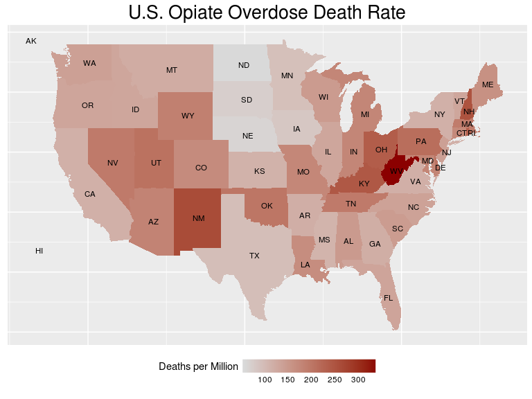
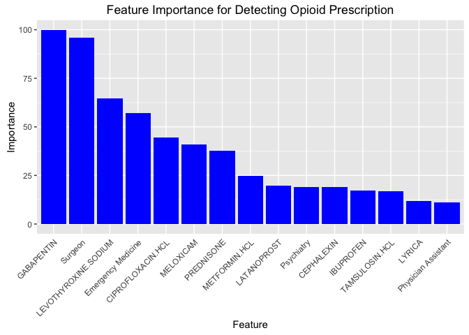
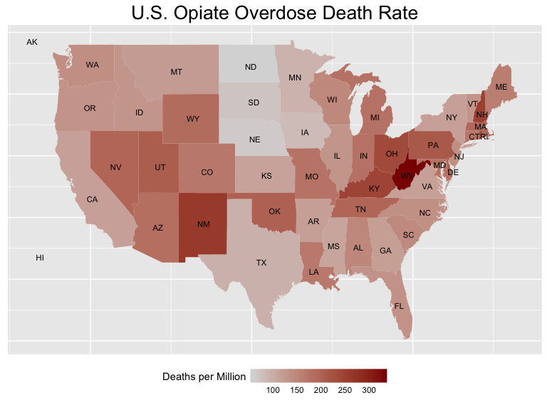

Over the past 15 years, deaths from prescription opiates have [quadrupled](https://www.cdc.gov/drugoverdose/epidemic/#), but so has the amount of opiates prescribed. This massive increase in prescription rates has occurred while the levels of pain experienced by Americans has [remain largely unchanged](http://time.com/3663907/treating-pain-opioids-painkillers/). Intuitively it follows that unneccessary prescriptions potentially play a significant role in the increase in opioid overdoses. An effective strategy for identifying instances of overprescribing is therefore a potentially life saving endeavor.

To that end, the goal of this experiment is to demonstrate the possibility that predictive analytics with machine learning can be used to predict the likelihood that a given doctor is a significant prescriber of opiates. I'll do some cleaning of the data, and build a predictive model using a gradient boosted classification tree ensemble that predicts with &gt;80% accuracy that an arbitrary entry is a significant prescriber of opioids. I'll also do some analysis and visualization of my results combined with those pulled from other sources.

Here is a visualization of the distribution of fatal overdose rate across the country. By the end of this post, you'll see exactly how such an image can be built.

<!-- more -->

*Disclaimer I am absolutely not suggesting that doctors who prescribe opiates are culpable for overdoses. These are drugs with true medical value when used appropriately. The idea is rather that a systematic way for identifying sources may reveal trends in particular practices, fields, or regions of the country that could be used effectively to combat the problem.*

Building a Dataset
------------------

The primary source of the raw data I will be pulling from is [cms.org](https://www.cms.gov/Research-Statistics-Data-and-Systems/Statistics-Trends-and-Reports/Medicare-Provider-Charge-Data/Part-D-Prescriber.html). Part of Obamacare requires more visilibity into government aid programs, so this dataset is a compilation of drug prescriptions made to citizens claiming coverage under Class D Medicare. It contains approxiately 24 million entries in .csv format. Each row contains information about one doctor and one drug, so each doctor occurs multiple times (called long format). We want to pivot this data to wide format so that each row represents a single doctor and contains information on every drug.  

Those of you who have used Excel on large datasets will know very well that anything close to a million rows in Excel is painfully slow, so if you have ever wondered how to manage such a file, I've included the R code I used to build the dataset [here](https://github.com/apryor6/apryor6.github.io/tree/master/_posts/Identifying-Opioid-Prescribers).

This kind of work is pretty code-dense and not exactly riveting, so I won't include the gory details here. Let's just skip to the fun part. The final trimmed result is a dataset containing 25,000 unique doctors and the numbers of prescriptions written for 250 drugs in the year 2014. Specifically, The data consists of the following characteristics for each prescriber

-   NPI – unique National Provider Identifier number
-   Gender - (M/F)
-   State - U.S. State by abbreviation
-   Credentials - set of initials indicative of medical degree
-   Specialty - description of type of medicinal practice
-   A long list of drugs with numeric values indicating the total number of prescriptions written for the year by that individual
-   Opioid.Prescriber - a boolean label indicating whether or not that individual prescribed opiate drugs more than 10 times in the year

Data Cleaning
-------------

Load the relevant libraries and read the data

~~~ r

library(dplyr)
library(magrittr)
library(ggplot2)
library(maps)
library(data.table)
library(lme4)
library(caret)

df <- data.frame(fread("prescriber-info.csv",nrows=-1))
~~~

First, we have to remove all of the information about opiate prescriptions from the data because that would be cheating. Conveniently, the same source that provided the raw data used to build this dataset also includes a list of all opiate drugs exactly as they are named in the data.

~~~ r
opioids <- read.csv("opioids.csv",skip=2)
opioids <- as.character(opioids[,2]) # second column contains the names of the opiates
opioids <- gsub("\ |-",".",opioids) # replace hyphens and spaces with periods to match the dataset
df      <- df[, !names(df) %in% opioids]
~~~

Convert character columns to factors. I'm sure there is a nicer way to code this, but it's late and this works for now. Feel free to comment the better way.

~~~ r
char_cols      <- c("NPI",names(df)[vapply(df,is.character,TRUE)])
df[,char_cols] <- lapply(df[,char_cols],as.factor)
~~~

Now let's clean up the factor variables

~~~ r
str(df[,1:5])
~~~

    ## 'data.frame':    25000 obs. of  5 variables:
    ##  $ NPI        : Factor w/ 25000 levels "1003002320","1003004771",..: 18016 6106 10728 16695 16924 13862 10913 10107 679 20644 ...
    ##  $ Gender     : Factor w/ 2 levels "F","M": 2 1 1 2 2 2 2 1 2 1 ...
    ##  $ State      : Factor w/ 57 levels "AA","AE","AK",..: 48 4 38 6 37 42 34 42 48 54 ...
    ##  $ Credentials: Factor w/ 888 levels "","(DMD)","A.N.P.",..: 244 507 403 507 403 314 507 839 697 507 ...
    ##  $ Specialty  : Factor w/ 109 levels "Addiction Medicine",..: 19 29 28 42 36 29 25 63 66 42 ...

Looks like the id's are unique and two genders is expected, but there's a few too many states and way too many credentials.

~~~ r
df %>%
  group_by(State) %>%
  dplyr::summarise(state.counts = n()) %>%
  arrange(state.counts)
~~~

    ## # A tibble: 57 x 2
    ##     State state.counts
    ##    <fctr>        <int>
    ## 1      AA            1
    ## 2      AE            2
    ## 3      GU            2
    ## 4      ZZ            2
    ## 5      VI            3
    ## 6      WY           38
    ## 7      AK           39
    ## 8      VT           65
    ## 9      ND           66
    ## 10     MT           77
    ## # ... with 47 more rows

[This site](http://www.infoplease.com/ipa/A0110468.html) indicates that some of these are legitimate, but rare, labels Like Guam (GU), but others appear to be typos. Let's create an "other" category for the rarely occurring abbreviations

~~~ r
rare.abbrev <- df %>%
  group_by(State) %>%
  dplyr::summarise(state.counts = n()) %>%
  arrange(state.counts) %>%
  filter(state.counts < 10) %>%
  select(State)

# Insert a new level into the factor, then remove the old names 
levels(df$State) <- c(levels(df$State),"other")
df$State[df$State %in% rare.abbrev$State] <- "other"
df$State <- droplevels(df$State)
~~~

As a quick sanity check to make sure we still don't have any bogus states, let's pull that table from the web and make sure our abbreviations are valid

~~~ r
library(htmltab)
state.abbrevs <- data.frame(htmltab("http://www.infoplease.com/ipa/A0110468.html",which=2))
state.abbrevs <- state.abbrevs$Postal.Code
if (all(levels(df$State)[levels(df$State)!="other"] %in% state.abbrevs)){print("All abbreviations are valid")} else{print("Uh oh..")}
~~~

Looking ahead, I'm going to be interested in the variable importance state-by-state, so instead of using a single factor I'll convert to dummy variables so each can be scored separately.

~~~ r
df <- cbind(df[names(df)!="State"],dummy(df$State))
~~~

Let's look at `Credentials` now

~~~ r
df %>%
  group_by(Credentials) %>%
  dplyr::summarise(credential.counts = n()) %>%
  arrange(credential.counts) %>% 
  data.frame() %>% 
  head(n=25)
~~~

    ##            Credentials credential.counts
    ## 1                (DMD)                 1
    ## 2        A.P.R.N. N.P.                 1
    ## 3       A.P.R.N., B.C.                 1
    ## 4   A.P.R.N., W.H.N.P.                 1
    ## 5  A.R.N.P. , PMHNP-BC                 1
    ## 6        A.R.N.P.-B.C.                 1
    ## 7   A.T.,C. , C.S.C.S.                 1
    ## 8        ACNP-BC, CCNS                 1
    ## 9         ACNP-BC, MSN                 1
    ## 10            ACNP/FNP                 1
    ## 11             ACNS-BC                 1
    ## 12            ADULT NP                 1
    ## 13              AGACNP                 1
    ## 14                AGNP                 1
    ## 15           AGPCNP-BC                 1
    ## 16               AHCNS                 1
    ## 17 ANNA TAVAKKOLI M.D.                 1
    ## 18             ANP B-C                 1
    ## 19         ANP-BC, GNP                 1
    ## 20          ANP-FNP-BC                 1
    ## 21              ANP,BC                 1
    ## 22                ANP.                 1
    ## 23             ANP/CNP                 1
    ## 24                ANRP                 1
    ## 25           APN FNP-C                 1

The credentials are quite the mess. Titles are inconsistently entered with periods, spaces, hyphens, etc, and many people have multiple credentials. While it's easy to make use of regular expressions to clean them, I won't bother because I suspect most of the predictive information contained in `Credentials` will be captured by `Specialty`.

~~~ r
# 7 years of college down the drain
df %<>%
  select(-Credentials)
~~~

On that note, let's look at `Specialty`

~~~ r
df %>%
  group_by(Specialty) %>%
  dplyr::summarise(specialty.counts = n()) %>%
  arrange(desc(specialty.counts)) %>% 
  data.frame() %>% 
  head(n=25)
~~~

    ##                                                         Specialty
    ## 1                                               Internal Medicine
    ## 2                                                 Family Practice
    ## 3                                                         Dentist
    ## 4                                              Nurse Practitioner
    ## 5                                             Physician Assistant
    ## 6                                              Emergency Medicine
    ## 7                                                      Psychiatry
    ## 8                                                      Cardiology
    ## 9                                           Obstetrics/Gynecology
    ## 10                                             Orthopedic Surgery
    ## 11                                                      Optometry
    ## 12 Student in an Organized Health Care Education/Training Program
    ## 13                                                  Ophthalmology
    ## 14                                                General Surgery
    ## 15                                               Gastroenterology
    ## 16                                                      Neurology
    ## 17                                                       Podiatry
    ## 18                                                    Dermatology
    ## 19                                                        Urology
    ## 20                                         Psychiatry & Neurology
    ## 21                                              Pulmonary Disease
    ## 22                                                 Otolaryngology
    ## 23                                               General Practice
    ## 24                                                     Nephrology
    ## 25                                            Hematology/Oncology
    ##    specialty.counts
    ## 1              3194
    ## 2              2975
    ## 3              2800
    ## 4              2512
    ## 5              1839
    ## 6              1087
    ## 7               691
    ## 8               688
    ## 9               615
    ## 10              575
    ## 11              571
    ## 12              547
    ## 13              519
    ## 14              487
    ## 15              399
    ## 16              371
    ## 17              369
    ## 18              344
    ## 19              328
    ## 20              266
    ## 21              262
    ## 22              260
    ## 23              247
    ## 24              236
    ## 25              218

There's a ton of ways to go about attacking this feature. Since there does not appear to be too much name clashing/redundancy, I'll use a couple of keywords to collapse some specialties together, and I'll also lump the rarely occurring ones together into an "other" category like before.

~~~ r
# Get the common specialties, we won't change those
common.specialties <- df %>%
  group_by(Specialty) %>%
  dplyr::summarise(specialty.counts = n()) %>%
  arrange(desc(specialty.counts)) %>% 
  filter(specialty.counts > 50) %>%
  select(Specialty)
common.specialties <- levels(droplevels(common.specialties$Specialty))

# Default to "other", then fill in. I'll make special levels for surgeons and collapse any category containing the word pain
new.specialties <- factor(x=rep("other",nrow(df)),levels=c(common.specialties,"Surgeon","other","Pain.Management"))
new.specialties[df$Specialty %in% common.specialties] <- df$Specialty[df$Specialty %in% common.specialties]
new.specialties[grepl("surg",df$Specialty,ignore.case=TRUE)] <- "Surgeon"
new.specialties[grepl("pain",df$Specialty,ignore.case=TRUE)] <- "Pain.Management"
new.specialties <- droplevels(new.specialties)
df$Specialty    <- new.specialties
~~~

~~~ r
df %>%
  group_by(Specialty) %>%
  dplyr::summarise(specialty.counts = n()) %>%
  arrange(desc(specialty.counts)) %>% 
  data.frame() %>% 
  head(n=25)
~~~

    ##                                                         Specialty
    ## 1                                               Internal Medicine
    ## 2                                                 Family Practice
    ## 3                                                         Dentist
    ## 4                                              Nurse Practitioner
    ## 5                                             Physician Assistant
    ## 6                                                         Surgeon
    ## 7                                              Emergency Medicine
    ## 8                                                      Psychiatry
    ## 9                                                      Cardiology
    ## 10                                          Obstetrics/Gynecology
    ## 11                                                      Optometry
    ## 12 Student in an Organized Health Care Education/Training Program
    ## 13                                                  Ophthalmology
    ## 14                                                          other
    ## 15                                               Gastroenterology
    ## 16                                                      Neurology
    ## 17                                                       Podiatry
    ## 18                                                    Dermatology
    ## 19                                                        Urology
    ## 20                                         Psychiatry & Neurology
    ## 21                                              Pulmonary Disease
    ## 22                                                 Otolaryngology
    ## 23                                               General Practice
    ## 24                                                     Nephrology
    ## 25                                            Hematology/Oncology
    ##    specialty.counts
    ## 1              3194
    ## 2              2975
    ## 3              2800
    ## 4              2512
    ## 5              1839
    ## 6              1689
    ## 7              1087
    ## 8               691
    ## 9               688
    ## 10              615
    ## 11              571
    ## 12              547
    ## 13              519
    ## 14              454
    ## 15              399
    ## 16              371
    ## 17              369
    ## 18              344
    ## 19              328
    ## 20              266
    ## 21              262
    ## 22              260
    ## 23              247
    ## 24              236
    ## 25              218

Looks good. Like we did with `states`, let's make it a dummy so we can score the importance by specialty.

~~~ r
df <- df[!is.na(df$Specialty),]
df <- cbind(df[,names(df)!="Specialty"],dummy(df$Specialty))
~~~

Because this data is a subset of a larger dataset, it is possible that there are drugs here that aren't prescribed in any of the rows (i.e. the instances where they were prescribed got left behind). This would result in columns of all 0, which is bad. Multicollinear features are already bad because they mean the feature matrix is rank-deficient and, therefore, [non-invertible](https://en.wikipedia.org/wiki/Invertible_matrix#Other_properties). But beyond that, pure-zero features are a special kind of useless. Let's remove them.

~~~ r
df <- df[vapply(df,function(x) if (is.numeric(x)){sum(x)>0}else{TRUE},FUN.VALUE=TRUE)]
~~~

I used `vapply` because [sapply is unpredictable](https://blog.rstudio.org/2016/01/06/purrr-0-2-0/)

Model Building
--------------

I'll use a gradient boosted classification tree ensemble with `gbm` and `caret`. My reasoning is that with so many different features in the form of individual drugs, it's extremely likely that some of them are highly correlated (i.e. high blood pressure, heart medication, Aspirin). Something like an L1 regularized logistic regression followed by feature trimming would also work, but one of the nice things about this type of tree model is that it doesn't care about multicollinear features.

First, split the data.

~~~ r
train_faction <- 0.8
train_ind     <- sample(nrow(df),round(train_faction*nrow(df)))
~~~

Remove the non-features, and convert the target label to something non-numeric (this package requires that)

~~~ r
df %<>% select(-NPI)
df$Opioid.Prescriber <- as.factor(ifelse(df$Opioid.Prescriber==1,"yes","no"))
train_set <- df[train_ind,]
test_set  <- df[-train_ind,]
~~~

Now we build the model. I'll use a 5-fold cross validation to optimize hyperparameters for the boosted tree ensemble. A downside of trees is they take a while to train (though they predict quickly). A production model would call for an exhaustive hyperparameter search, but to keep the running time of this script reasonable I will search only a few parameters. I'll run this and go grab some coffee.

~~~ r
objControl <- trainControl(method='cv', number=5, returnResamp='none', summaryFunction = twoClassSummary, classProbs = TRUE, verboseIter = TRUE,savePredictions = TRUE)
model <- train(train_set %>% select(-Opioid.Prescriber),train_set$Opioid.Prescriber, 
                                   method='gbm', 
                                   metric = "ROC",
                                   # metric = "Accuracy",
                                   trControl=objControl,
                                   tuneGrid=data.frame(n.trees=c(50,150,200),
                                                       interaction.depth=c(3),
                                                       shrinkage=c(0.1),
                                                       n.minobsinnode=c(10)))
~~~

    ## + Fold1: shrinkage=0.1, interaction.depth=3, n.minobsinnode=10, n.trees=200 
    ## Iter   TrainDeviance   ValidDeviance   StepSize   Improve
    ##      1        1.2427             nan     0.1000    0.0567
    ##      2        1.1495             nan     0.1000    0.0466
    ##      3        1.0717             nan     0.1000    0.0389
    ##      4        1.0058             nan     0.1000    0.0325
    ##      5        0.9489             nan     0.1000    0.0286
    ##      6        0.9012             nan     0.1000    0.0237
    ##      7        0.8592             nan     0.1000    0.0208
    ##      8        0.8234             nan     0.1000    0.0178
    ##      9        0.7920             nan     0.1000    0.0153
    ##     10        0.7646             nan     0.1000    0.0135
    ##     20        0.6128             nan     0.1000    0.0043
    ##     40        0.5327             nan     0.1000    0.0006
    ##     60        0.5071             nan     0.1000    0.0004
    ##     80        0.4907             nan     0.1000    0.0001
    ##    100        0.4782             nan     0.1000    0.0002
    ##    120        0.4669             nan     0.1000    0.0001
    ##    140        0.4599             nan     0.1000    0.0000
    ##    160        0.4522             nan     0.1000   -0.0000
    ##    180        0.4468             nan     0.1000    0.0001
    ##    200        0.4405             nan     0.1000    0.0000
    ## 
    ## - Fold1: shrinkage=0.1, interaction.depth=3, n.minobsinnode=10, n.trees=200 
    ## + Fold2: shrinkage=0.1, interaction.depth=3, n.minobsinnode=10, n.trees=200 
    ## Iter   TrainDeviance   ValidDeviance   StepSize   Improve
    ##      1        1.2442             nan     0.1000    0.0565
    ##      2        1.1520             nan     0.1000    0.0463
    ##      3        1.0744             nan     0.1000    0.0388
    ##      4        1.0093             nan     0.1000    0.0326
    ##      5        0.9533             nan     0.1000    0.0277
    ##      6        0.9053             nan     0.1000    0.0238
    ##      7        0.8644             nan     0.1000    0.0205
    ##      8        0.8286             nan     0.1000    0.0177
    ##      9        0.7982             nan     0.1000    0.0153
    ##     10        0.7712             nan     0.1000    0.0134
    ##     20        0.6192             nan     0.1000    0.0042
    ##     40        0.5393             nan     0.1000    0.0008
    ##     60        0.5099             nan     0.1000    0.0009
    ##     80        0.4908             nan     0.1000    0.0002
    ##    100        0.4802             nan     0.1000    0.0001
    ##    120        0.4713             nan     0.1000    0.0000
    ##    140        0.4638             nan     0.1000   -0.0001
    ##    160        0.4576             nan     0.1000   -0.0001
    ##    180        0.4516             nan     0.1000   -0.0001
    ##    200        0.4456             nan     0.1000    0.0001
    ## 
    ## - Fold2: shrinkage=0.1, interaction.depth=3, n.minobsinnode=10, n.trees=200 
    ## + Fold3: shrinkage=0.1, interaction.depth=3, n.minobsinnode=10, n.trees=200 
    ## Iter   TrainDeviance   ValidDeviance   StepSize   Improve
    ##      1        1.2441             nan     0.1000    0.0561
    ##      2        1.1515             nan     0.1000    0.0464
    ##      3        1.0738             nan     0.1000    0.0384
    ##      4        1.0080             nan     0.1000    0.0329
    ##      5        0.9531             nan     0.1000    0.0275
    ##      6        0.9056             nan     0.1000    0.0237
    ##      7        0.8646             nan     0.1000    0.0205
    ##      8        0.8287             nan     0.1000    0.0180
    ##      9        0.7984             nan     0.1000    0.0154
    ##     10        0.7710             nan     0.1000    0.0136
    ##     20        0.6187             nan     0.1000    0.0042
    ##     40        0.5380             nan     0.1000    0.0007
    ##     60        0.5118             nan     0.1000    0.0002
    ##     80        0.4944             nan     0.1000    0.0005
    ##    100        0.4827             nan     0.1000   -0.0001
    ##    120        0.4743             nan     0.1000    0.0002
    ##    140        0.4669             nan     0.1000    0.0001
    ##    160        0.4591             nan     0.1000    0.0000
    ##    180        0.4531             nan     0.1000    0.0000
    ##    200        0.4479             nan     0.1000   -0.0000
    ## 
    ## - Fold3: shrinkage=0.1, interaction.depth=3, n.minobsinnode=10, n.trees=200 
    ## + Fold4: shrinkage=0.1, interaction.depth=3, n.minobsinnode=10, n.trees=200 
    ## Iter   TrainDeviance   ValidDeviance   StepSize   Improve
    ##      1        1.2433             nan     0.1000    0.0568
    ##      2        1.1511             nan     0.1000    0.0461
    ##      3        1.0727             nan     0.1000    0.0391
    ##      4        1.0061             nan     0.1000    0.0325
    ##      5        0.9514             nan     0.1000    0.0275
    ##      6        0.9034             nan     0.1000    0.0237
    ##      7        0.8619             nan     0.1000    0.0206
    ##      8        0.8264             nan     0.1000    0.0175
    ##      9        0.7958             nan     0.1000    0.0152
    ##     10        0.7688             nan     0.1000    0.0133
    ##     20        0.6168             nan     0.1000    0.0045
    ##     40        0.5383             nan     0.1000    0.0005
    ##     60        0.5088             nan     0.1000    0.0005
    ##     80        0.4929             nan     0.1000    0.0004
    ##    100        0.4806             nan     0.1000    0.0002
    ##    120        0.4699             nan     0.1000    0.0001
    ##    140        0.4625             nan     0.1000    0.0000
    ##    160        0.4549             nan     0.1000    0.0001
    ##    180        0.4503             nan     0.1000   -0.0000
    ##    200        0.4453             nan     0.1000   -0.0000
    ## 
    ## - Fold4: shrinkage=0.1, interaction.depth=3, n.minobsinnode=10, n.trees=200 
    ## + Fold5: shrinkage=0.1, interaction.depth=3, n.minobsinnode=10, n.trees=200 
    ## Iter   TrainDeviance   ValidDeviance   StepSize   Improve
    ##      1        1.2440             nan     0.1000    0.0569
    ##      2        1.1507             nan     0.1000    0.0465
    ##      3        1.0730             nan     0.1000    0.0388
    ##      4        1.0067             nan     0.1000    0.0328
    ##      5        0.9509             nan     0.1000    0.0276
    ##      6        0.9030             nan     0.1000    0.0239
    ##      7        0.8618             nan     0.1000    0.0207
    ##      8        0.8257             nan     0.1000    0.0179
    ##      9        0.7948             nan     0.1000    0.0153
    ##     10        0.7672             nan     0.1000    0.0136
    ##     20        0.6146             nan     0.1000    0.0044
    ##     40        0.5379             nan     0.1000    0.0014
    ##     60        0.5094             nan     0.1000    0.0002
    ##     80        0.4923             nan     0.1000    0.0002
    ##    100        0.4804             nan     0.1000   -0.0000
    ##    120        0.4720             nan     0.1000    0.0001
    ##    140        0.4640             nan     0.1000   -0.0001
    ##    160        0.4581             nan     0.1000    0.0002
    ##    180        0.4512             nan     0.1000    0.0000
    ##    200        0.4462             nan     0.1000   -0.0000
    ## 
    ## - Fold5: shrinkage=0.1, interaction.depth=3, n.minobsinnode=10, n.trees=200 
    ## Aggregating results
    ## Selecting tuning parameters
    ## Fitting n.trees = 200, interaction.depth = 3, shrinkage = 0.1, n.minobsinnode = 10 on full training set
    ## Iter   TrainDeviance   ValidDeviance   StepSize   Improve
    ##      1        1.2444             nan     0.1000    0.0567
    ##      2        1.1511             nan     0.1000    0.0464
    ##      3        1.0737             nan     0.1000    0.0387
    ##      4        1.0077             nan     0.1000    0.0327
    ##      5        0.9520             nan     0.1000    0.0276
    ##      6        0.9038             nan     0.1000    0.0237
    ##      7        0.8630             nan     0.1000    0.0206
    ##      8        0.8273             nan     0.1000    0.0176
    ##      9        0.7966             nan     0.1000    0.0153
    ##     10        0.7689             nan     0.1000    0.0137
    ##     20        0.6179             nan     0.1000    0.0042
    ##     40        0.5393             nan     0.1000    0.0017
    ##     60        0.5108             nan     0.1000    0.0003
    ##     80        0.4923             nan     0.1000    0.0002
    ##    100        0.4826             nan     0.1000    0.0001
    ##    120        0.4728             nan     0.1000    0.0000
    ##    140        0.4656             nan     0.1000    0.0000
    ##    160        0.4589             nan     0.1000    0.0001
    ##    180        0.4533             nan     0.1000    0.0002
    ##    200        0.4494             nan     0.1000   -0.0000

~~~ r
predictions <- predict(model,test_set%>% select(-Opioid.Prescriber),type="raw")
confusionMatrix(predictions,test_set$Opioid.Prescriber,positive="yes")
~~~

    ## Confusion Matrix and Statistics
    ## 
    ##           Reference
    ## Prediction   no  yes
    ##        no  1951  417
    ##        yes   70 2562
    ##                                          
    ##                Accuracy : 0.9026         
    ##                  95% CI : (0.894, 0.9107)
    ##     No Information Rate : 0.5958         
    ##     P-Value [Acc > NIR] : < 2.2e-16      
    ##                                          
    ##                   Kappa : 0.8032         
    ##  Mcnemar's Test P-Value : < 2.2e-16      
    ##                                          
    ##             Sensitivity : 0.8600         
    ##             Specificity : 0.9654         
    ##          Pos Pred Value : 0.9734         
    ##          Neg Pred Value : 0.8239         
    ##              Prevalence : 0.5958         
    ##          Detection Rate : 0.5124         
    ##    Detection Prevalence : 0.5264         
    ##       Balanced Accuracy : 0.9127         
    ##                                          
    ##        'Positive' Class : yes            
    ## 

Looks like we did a good job, the accuracy is not bad for a first attempt. If our goal is to predict significant sources of opioid prescriptions for the purpose of some government agency doing investigative work, then we would likely care more about precision (Pos Pred Value in this package) than accuracy. The reason is because a false positive is potentially sending people on a wild goose chase, wasting money and time.

The other nice thing about trees is the ability to view the importance of the features in the decision making process. This is done by cycling through each feature, randomly shuffling its values about, and seeing how much that hurts your cross-validation results. If shuffling a feature screws you up, then it must be pretty important. Let's extract the importance from our model with `varImp` and make a bar plot.

~~~ r
importance <- as.data.frame(varImp(model)[1])
importance <- cbind(row.names(importance), Importance=importance)
row.names(importance) <-NULL
names(importance)     <- c("Feature","Importance")
importance %>% arrange(desc(Importance)) %>%
  mutate(Feature=factor(Feature,levels=as.character(Feature))) %>%
  slice(1:15) %>%
  ggplot() + geom_bar(aes(x=Feature,y=(Importance)),stat="identity",fill="blue") + 
  theme(axis.text.x=element_text(angle=45,vjust = 1,hjust=1),axis.ticks.x = element_blank()) +ylab("Importance") +ggtitle("Feature Importance for Detecting Opioid Prescription")
~~~

Our best feature was a drug called [Gabapentin](https://www.drugs.com/gabapentin.html), which unsurprisingly is used to treat nerve pain caused by things like shingles. It's not an opiate, but likely gets prescribed at the same time. The `Surgeon` feature we engineered has done quite well. The other drugs are for various conditions including inflamatation, cancer, and athritis among others.

It probably doesn't surprise anybody that surgeons commonly prescribe pain medication, or that the people taking cancer drugs are also taking pain pills. But with a very large feature set it becomes entirely intractable for a human to make maximal use of the available information. I would expect a human analyzing this data would immediately classify candidates based upon their profession, but machine learning has enabled us to break it down further based upon the specific drug prescription trends doctor by doctor. Truly a powerful tool.

Summary/Analysis
----------------

We succeeded in building a pretty good opiate-prescription detection algorithm based primarily on their profession and prescription rates of non-opiate drugs. This could be used to combat overdoses in a number of ways. Professions who show up with high importance in the model can reveal medical fields that could benefit in the long run from curriculum shifts towards awareness of the potential dangers. Science evolves rapidly, and this sort of dynamic shift of the "state-of-the-art" opinion is quite common. It's also possible that individual drugs that are strong detectors may identify more accurately a sub-specialty of individual prescribers that could be of interest, or even reveal hidden avenues of illegitimate drug access.

As a parting way of illustrating how widespread this problem is across the country, I'll generate a map plot showing the relative number of fatal overdoses across the country.

~~~ r
all_states    <- map_data("state")
od            <- read.csv("overdoses.csv",stringsAsFactors = FALSE)
od$State      <- as.factor(od$State)
od$Population <- as.numeric(gsub(",","",od$Population))
od$Deaths     <- as.numeric(gsub(",","",od$Deaths))

od %>%
  mutate(state.lower=tolower(State), Population=as.numeric(Population)) %>%
  merge(all_states,by.x="state.lower",by.y="region") %>%
  select(-subregion,-order) %>% 
  ggplot() + geom_map(map=all_states, aes(x=long, y=lat, map_id=state.lower,fill=Deaths/Population*1e6) )  + ggtitle("U.S. Opiate Overdose Death Rate") +
  geom_text(data=data.frame(state.center,od$Abbrev),aes(x=x, y=y,label=od.Abbrev),size=3) +
  scale_fill_continuous(low='gray85', high='darkred',guide=guide_colorbar(ticks=FALSE,barheight=1,barwidth=10,title.vjust=.8,values=c(0.2,0.3)),name="Deaths per Million") + theme(axis.text=element_blank(),axis.title=element_blank(),axis.ticks=element_blank(),legend.position="bottom",plot.title=element_text(size=20))
~~~

As you can see, it's a serious problem. Maybe we as data scientists have the tools to make a difference.
