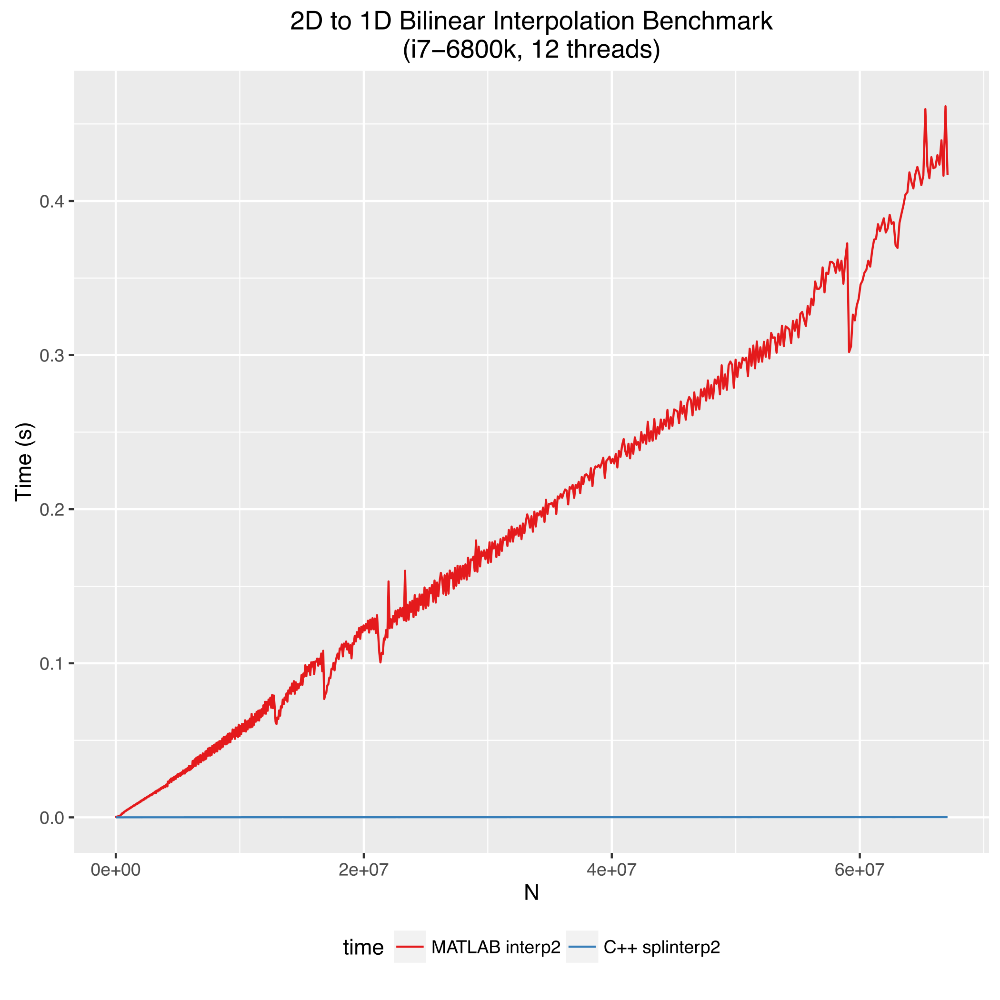
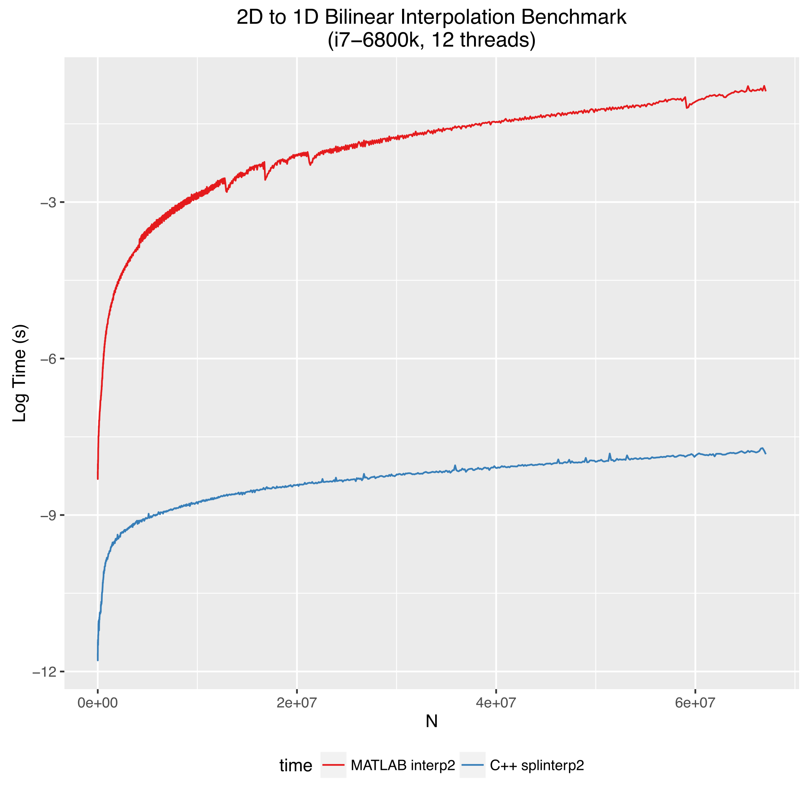
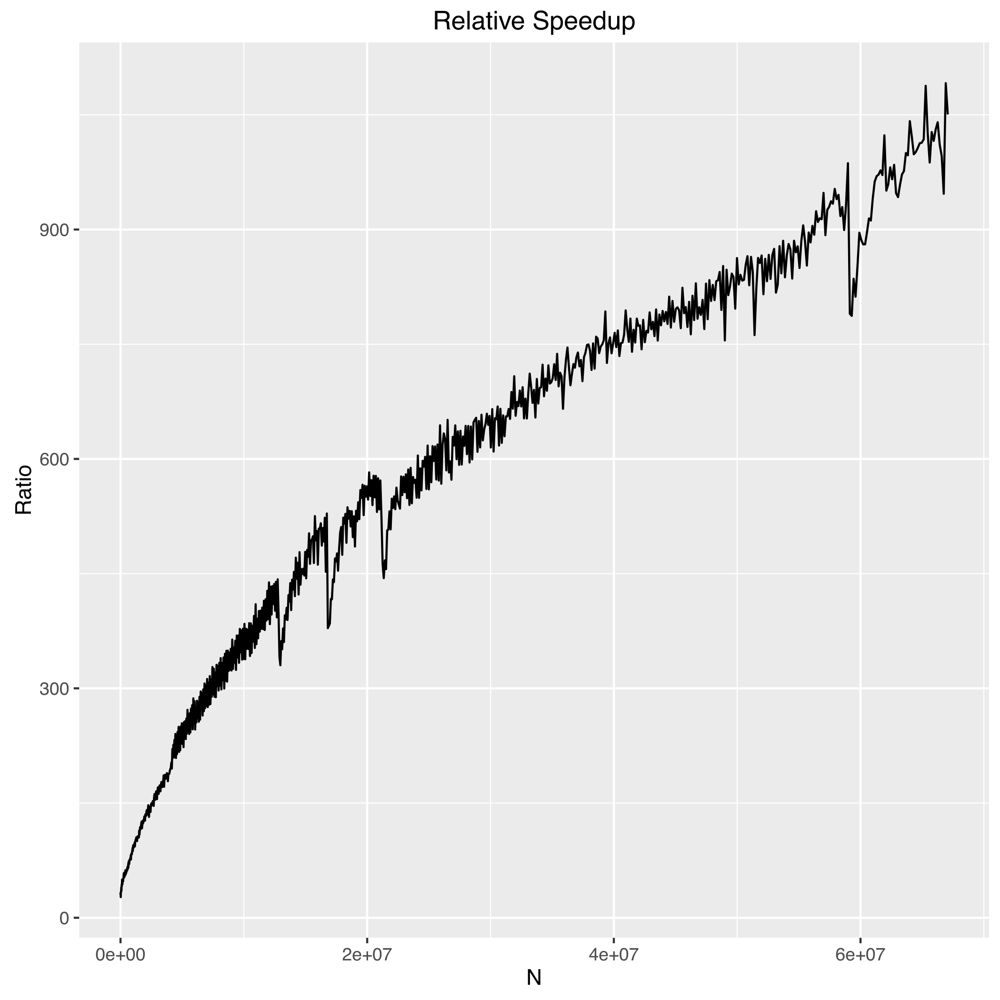

<figure class="half center">
	 </figure class="half center">
	 
	 
[MATLAB](https://www.mathworks.com) is a useful tool for exploratory data analysis, rapid algorithm prototyping, and data visualization that is widely used in science and engineering communities. Some of MATLAB's functions, such as the FFT, are relatively fast. MATLAB uses [FFTW](http://www.fftw.org) under the hood which has separate, optimized routines for performing, for example, real-to-complex transforms faster than the more general complex-to-complex, and MATLAB is smart about figuring out what kind of data you gave it and then choosing the optimal FFTW routine. I actually tested this at one point and found a hand-written C program using FFTW was only about 15% faster than MATLAB, and that was only when I used the optimal routines.

However, more often than not MATLAB is slow.

<!-- more --> 

As a [dynamically-typed language](https://en.wikipedia.org/wiki/Type_system#Static_and_dynamic_type_checking_in_practice), there is a lot of overhead in native MATLAB code for making sure data is of the same type, performing bounds checking, looking up names, etc. In contrast, compiled languages like C++ enforce stricter rules at compile time and can produce code that executes significantly faster. While a relative speed difference of milliseconds vs. microseconds may not be noticeable for a small script, when a problem is scaled up this becomes the difference in an hour and a few seconds. In such cases faster code is highly desireable and enhances productivity.

So, why not just prototype your algorithm in MATLAB and then port it to C++ to produce a final, fast version? You certainly can, and provided your C++ code was efficient this would be the solution with the highest performance. However, developing C++ code generally takes more time, and saving time was the whole point of wanting to make your code run faster in the first place. We want to find a nice balance between developer time and execution time. Enter MEX functions. MEX functions are a way to write C++ code that is directly accessible by MATLAB. In this way, we can prototype algorithms in MATLAB, and then leverage the power of a compiled language in small bursts to accelerate bottlenecks.  

Recently, I applied this technique to accelerate MATLAB's [interp2](https://www.mathworks.com/help/matlab/ref/interp2.html) by factors roughly between 5-500x depending upon array sizes. In this post I will show you how I did so by writing a serial implementation of bilinear interpolation in C++, extending it to run on multiple threads, and finally how to write a MEX function to expose the code to MATLAB. 
 
*The improvement gained here was significant enough that I also implemented linear and trilinear interpolation routines that altogether became a C++ template library called [splinterp](https://github.com/apryor6/splinter). Splinterp contains MEX functions that can be used as drop-in replacements for MATLAB's `interp1`, `interp2`, and `interp3`.*

## Serial Implementation

As a demonstration, I'll consider the case of bilinear interpolation on an input dataset that is real-valued. Linear interpolation in 1D is just a linear weighted average of the two nearest datapoints based upon the distance from each, and bilinear interpolation is just the repeated application of linear interpolation in two directions. I assume that the data is sampled on a regularly-spaced grid with integer valued positions, and from here we can interpolate any continuous (x,y) position within the array.  

Since this is C++ we will take advantage of [function templates](http://en.cppreference.com/w/cpp/language/function_template) so that we can write code once and call it for either single or double precision. The function prototype is then

~~~ c++
template <typename T>
void interp2_F(const T* const data,
               const size_t& nrows, const size_t& ncols,
               const T* const x, const T* const y,
               const size_t& N, T* result,
               const long long& origin_offset=0)
~~~

The `_F` indicates that this function assumes column-major (Fortran) ordering of the array, which is MATLAB's convention. We take the input `data` by const T* const which means `data` is an unchanging pointer to data elements which are constant. The parameters `nrows` and `ncols` are the dimensions of the input data, `x` and `y` are the coordinates of the continuously valued locations to interpolate, `N` is the number of datapoints to compute, and the data will be stored in `result`. The last parameter is an offset that can be used to convert from 1-based indexing in MATLAB to 0-based in C++. Otherwise you would have to manually subtract 1 from all indices anytime you called this from MATLAB.  

For each set of coordinates, we must figure out the coordinates of the four bounding datapoints, fetch the data, compute the weighting factors, and write out the result. The implementation follows

~~~ c++
template <typename T>
void interp2_F(const T* const data,
               const size_t& nrows, const size_t& ncols,
               const T* const x, const T* const y,
               const size_t& N, T* result,
               const long long& origin_offset=0){

    for (auto i = 0; i < N; ++i) {

       // get coordinates of bounding grid locations
       long long x_1 = ( long long) std::floor(x[i]) - origin_offset;
       long long x_2 = x_1 + 1;
       long long y_1 = ( long long) std::floor(y[i]) - origin_offset;
       long long y_2 = y_1 + 1;

       // handle special case where x/y is the last element
       if (x_1 == (nrows-1) )   { x_2 -= 1; x_1 -= 1;}
       if (y_1 == (ncols-1) )   { y_2 -= 1; y_1 -= 1;}

       // return 0 for target values that are out of bounds
       if (x_1 < 0 | x_2 > (nrows - 1) |  y_1 < 0 | y_2 > (ncols - 1)){
            result[i] = 0;

        } 
        else {
            
            // get the array values
            const T& f_11 = data[x_1 + y_1*nrows];
            const T& f_12 = data[x_1 + y_2*nrows];
            const T& f_21 = data[x_2 + y_1*nrows];
            const T& f_22 = data[x_2 + y_2*nrows];

            // compute weights
            T w_x1 = x_2 - (x[i] - origin_offset);
            T w_x2 = (x[i] - origin_offset) - x_1;
            T w_y1 = y_2 - (y[i] - origin_offset);
            T w_y2 = (y[i] - origin_offset) - y_1;

            T a,b;
            a = f_11 * w_x1 + f_21 * w_x2;
            b = f_12 * w_x1 + f_22 * w_x2;
            result[i] = a * w_y1 + b * w_y2;
        }
    }
}
~~~
There are a couple of cases that we need to check for at the beginning. If a value to interpolate is outside of the input data, 0 is returned by default. The other pitfall results from how the 4 bounding points are computed. The lower points `x_1`, `y_1` are obtained with `std::floor` and then the upper ones are these values + 1. If the target point (`x,y`) lies exactly on an integer, then the interpolation formula will exactly return the value of `data` at this point, which is what we want. However, if either `x` or `y` is the end of the array, we would be indexing out of bounds with `x_2` or `y_2`, which results in undefined behavior (segmentation fault). Rather than introducing a bunch of complicated logic, a simple solution is to just shift the box back one position in the direction(s) where the end is being targeted.

And that's it for the serial implementation.

## Parallelization
Running this function in parallel has the potential to further speed up the code by a factor up to how many cores your machine has. When a computing solution contains a loop whose iterations are completely independent of another such as above, it is known as embarassingly parallel. All we have to do to run this concurrently is to divide up the workload into chunks, and pass these off to separate threads. C++11 makes this even easier by introducing `std::thread`.  

To accomplish this, we write a wrapper that takes in an interpolation function like the one we just wrote and its parameters. We then figure out how much work to give to each thread by dividing the total work by the number of threads, which is defined by a macro. Wrapping it in `#ifndef/#endif` allows the user to specify a number of threads to be set at compile time with the -D flag.

~~~ c++
#ifndef NUM_THREADS
#define NUM_THREADS 8
#endif

template <typename T>
using func2D = void(*)(const T* const, 
                       const size_t&,
                       const size_t&,
                       const T* const,
                       const T* const,
                       const size_t&, T*,
                       const long long&);
                           
template <typename T>
void parallel_interp2(func2D<T> f, 
                      const T* const data, 
                      const size_t& nrows,
                      const size_t& ncols,
                      const T* const x,
                      const T* const y,
                      const size_t& N, 
                      T* result,
                      const long long& origin_offset){

        // launch multiple threads
        unsigned long long THREAD_CHUNK_SIZE = N / NUM_THREADS;

        std::vector<std::thread> workers;
        workers.reserve(NUM_THREADS);
        const T *tmp_x = x;
        const T *tmp_y = y;
        T *tmp_result = result;
        int i;
        for ( i = 0; i < NUM_THREADS; ++i){

            if ( i == (NUM_THREADS - 1) ){
                workers.emplace_back(std::thread(f,data,nrows,ncols,tmp_x,tmp_y,(size_t)(x+N-tmp_x),tmp_result,origin_offset));
                break;
            }
            else{
                workers.emplace_back( std::thread(f,data,nrows,ncols,tmp_x,tmp_y,THREAD_CHUNK_SIZE,tmp_result,origin_offset) );
            }
            
            tmp_x+=THREAD_CHUNK_SIZE;
            tmp_y+=THREAD_CHUNK_SIZE;
            tmp_result+=THREAD_CHUNK_SIZE;
        }
        for (auto& t:workers)t.join();    
};
~~~    

Basically you first figure out how many elements each threads works on, and then each job computes the same number of elements from different starting points in the array. There are many different ways to divide up the work -- here I just choose `N / NUM_THREADS` elements and then for the last thread make sure it runs to completion (some work could be lost by integer division). With this scheme, the last thread will often do more work than the others, but only up to NUM_THREADS-1 elements, which is negligible. Lastly, make sure to join the threads so that the work is done before the function exits. 

One other thing to keep in mind is that when writing multithreaded code is that there is a reasonably significant overhead involved with spawning a thread. If the amount of time it takes to launch the thread is significant compared to how much work there is to do, you may actually see a decrease in performance. I will add in a constant value below which the calculation will just be performed on one thread. It turns out that you actually have to be interpolating a lot of values before the value of multithreading kicks in, the equivalent of a 2k x 2k image or so. This is probably because the actual calculation being done is quite simple.

~~~ c++
#ifndef NUM_THREADS
#define NUM_THREADS 8
#endif
#ifndef SERIAL_LIMIT
#define SERIAL_LIMIT 4194304
#endif

template <typename T>
using func2D = void(*)(const T* const, 
                       const size_t&,
                       const size_t&,
                       const T* const,
                       const T* const,
                       const size_t&, T*,
                       const long long&);
                           
template <typename T>
void parallel_interp2(func2D<T> f, 
                      const T* const data, 
                      const size_t& nrows,
                      const size_t& ncols,
                      const T* const x,
                      const T* const y,
                      const size_t& N, 
                      T* result,
                      const long long& origin_offset){

    if ( N <= SERIAL_LIMIT){ // for small numbers of elements just use 1 thread
        f(data,nrows,ncols,x,y,N,result,origin_offset);
    }
    else{ // launch multiple threads
        unsigned long long THREAD_CHUNK_SIZE = N / NUM_THREADS;

        std::vector<std::thread> workers;
        workers.reserve(NUM_THREADS);
        const T *tmp_x = x;
        const T *tmp_y = y;
        T *tmp_result = result;
        int i;
        for ( i = 0; i < NUM_THREADS; ++i){

            if ( i == (NUM_THREADS - 1) ){
                workers.emplace_back(std::thread(f,data,nrows,ncols,tmp_x,tmp_y,(size_t)(x+N-tmp_x),tmp_result,origin_offset));
                break;
            }
            else{
                workers.emplace_back( std::thread(f,data,nrows,ncols,tmp_x,tmp_y,THREAD_CHUNK_SIZE,tmp_result,origin_offset) );
            }
            
            tmp_x+=THREAD_CHUNK_SIZE;
            tmp_y+=THREAD_CHUNK_SIZE;
            tmp_result+=THREAD_CHUNK_SIZE;
        }
        for (auto& t:workers)t.join();
    }
};
~~~    

Now that we have an implementation and a way to call it in parallel, time to expose this to MATLAB with a MEX function.

## Writing the MEX function

MATLAB accesses C/C++ code through a special function called `mexFunction`. To create a function called `splinterp2` that will be callable from MATLAB just like `interp`, we must define `mexFunction` inside of a file called `splinterp2.cpp`. A mexFunction always has the same signature:

~~~ c++
void mexFunction(int nlhs, mxArray *plhs[],
			     int nrhs, const mxArray *prhs[])
~~~

where `nrls` and `nlrs` are the number of arguments on the left and right side of the MATLAB function call, respectively, and `plhs` and `plrs` represent the arrays themselves using MATLAB's custom `mxArray` type. Notice that these variables have both `*` and `[]`, which in C++ is equivalent to `**`, meaning `prhs` and `plhs` are both arrays of arrays. As such, `plhs[0]` is a pointer to the first input argument from MATLAB, etc.  

MATLAB's data types contain more information than just the raw pointers to the data, so what we want to do is extract the data from each array into a form that C++ likes, run the interpolation, and then format the data back into a MATLAB object. This is easily done with the help of `mxGetPr`, which returns a pointer to the real part of the underlying data held in an `mxArray`.

~~~ c++
// -- splinterp2.cpp --
// Created by AJ Pryor on 2/2/17.
//
#include <vector>
#include "mex.h"
#include "splinterp.h"

void mexFunction(int nlhs, mxArray *plhs[],int nrhs, const mxArray *prhs[]) {

    double const *Matrix; 
    double const *x;
    double const *y;
    double *result;
    
    size_t nrows   = mxGetM(prhs[0]);
    size_t ncols   = mxGetN(prhs[0]);
    
    const mwSize ndims  = mxGetNumberOfDimensions(prhs[1]);
    const mwSize *dims  = mxGetDimensions(prhs[1]);
    size_t npoints = 1;
    for (auto i = 0; i < ndims; ++i) npoints*=dims[i];
    plhs[0] = mxCreateNumericArray(ndims, dims, mxDOUBLE_CLASS, mxREAL);

    Matrix = mxGetPr(prhs[0]);
    y      = mxGetPr(prhs[1]);
    x      = mxGetPr(prhs[2]);
    result = mxGetPr(plhs[0]);
    splinterp::parallel_interp2(splinterp::interp2_F<double>,Matrix, nrows, ncols, x, y, npoints, result, 1);    
}

~~~

First we create pointers that will hold our C++ datatypes. We then get the dimensions of the 2D input data with `mxGetM` and `mxGetN`. Next, determine the size of the Nd array of values to interpolate, and create an output array of the same size with `mxCreateNumericArray`. This way, you can call `splinterp2` with any size array of values to interpolate, which is useful because rather than making multiple individual calls to `splinterp2`, if you know in advance every datapoint you need then only one call is necessary. Finally, extract the underlying pointers from the MATLAB arrays with `mxGetPr` and then launch our interpolation function. All of these `mx` helper functions are documented [here](https://www.mathworks.com/help/matlab/cc-matrix-library-api.html). 

This example just considered the case where the input `data` is real, but in general one would want to check if it was complex, and call a different interpolation routine. This is what is done in the full versions of the MEX functions, which can be found in [splinterp](https://github.com/apryor6/splinter/blob/master/splinterp2.cpp).

## Benchmarks
The following are benchmarks for computing a 1D line of length N from a 2D array of size NxN

