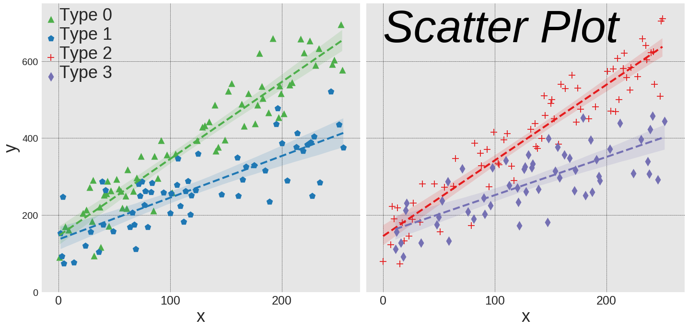
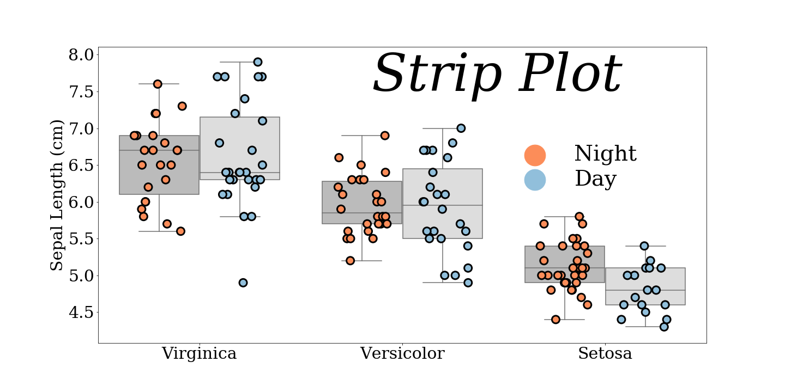
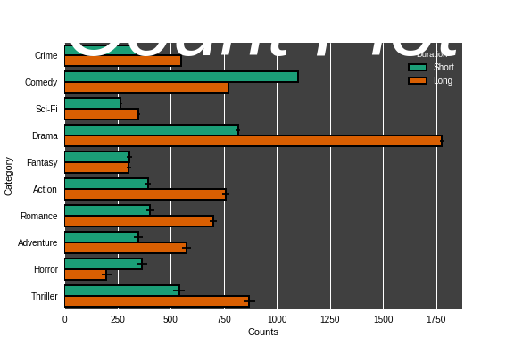
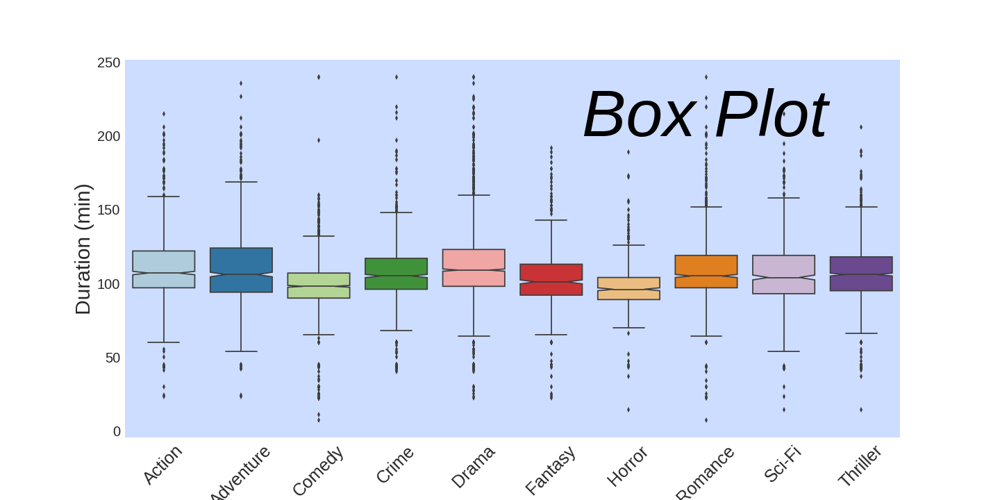
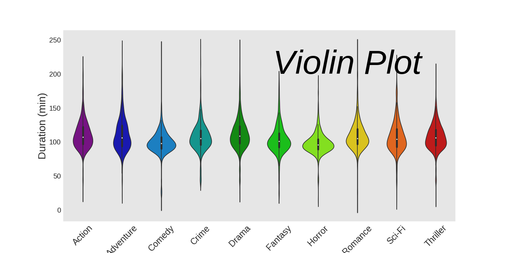
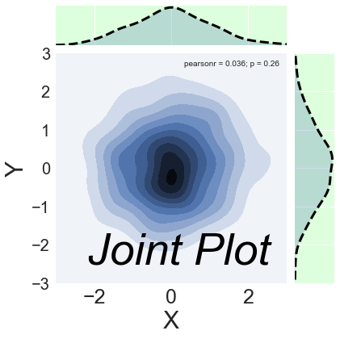
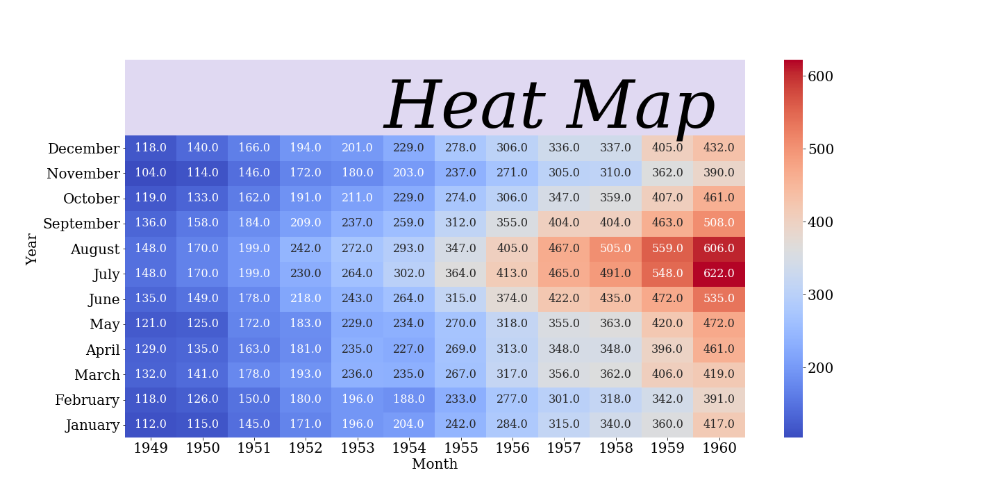

## Gallery (Under Construction)
Below is a collection of data visualizations. Each final image below links to the markdown output of a Jupyter notebook with the code required to make that image as well as exploration of other adjustable parameters for that type of plot. Each notebook is designed to explore mainly the parameters that are specific to that type of plot in the corresponding library in order to avoid repetition (e.g. adjusting labels or titles is usually the same for all types of plots within a library), and at the very end extra modifications are made to make the final result look nice.

### Table of contents 
- [**Seaborn**](#seaborn)  
&nbsp;&nbsp;&nbsp;&nbsp; - [Scatter/Line plot](#seaborn-lmplot)  
&nbsp;&nbsp;&nbsp;&nbsp; - [Bar plot](#seaborn-barplot)   
&nbsp;&nbsp;&nbsp;&nbsp; - [Strip plot](#seaborn-stripplot)   
&nbsp;&nbsp;&nbsp;&nbsp; - [Count plot](#seaborn-countplot)   
&nbsp;&nbsp;&nbsp;&nbsp; - [Box plot](#seaborn-boxplot)   
&nbsp;&nbsp;&nbsp;&nbsp; - [Violin plot](#seaborn-violinplot)   
&nbsp;&nbsp;&nbsp;&nbsp; - [Joint plot](#seaborn-jointplot)   
&nbsp;&nbsp;&nbsp;&nbsp; - [Heat map](#seaborn-heatmap)  
- [**Plotly**](#plotly)  
&nbsp;&nbsp;&nbsp;&nbsp; - [Line plot](#plotly-line)  
- [**Bokeh**](#bokeh)  
&nbsp;&nbsp;&nbsp;&nbsp; - [Glyphs](#bokeh-glyphs)  
&nbsp;&nbsp;&nbsp;&nbsp;&nbsp;&nbsp;&nbsp;&nbsp; - [Annular Wedge](#bokeh-glyphs-annular_wedge)  
&nbsp;&nbsp;&nbsp;&nbsp;&nbsp;&nbsp;&nbsp;&nbsp; - [Annulus](#bokeh-glyphs-annulus)  
&nbsp;&nbsp;&nbsp;&nbsp;&nbsp;&nbsp;&nbsp;&nbsp; - [Arc](#bokeh-glyphs-arc)  
&nbsp;&nbsp;&nbsp;&nbsp;&nbsp;&nbsp;&nbsp;&nbsp; - [Asterisk](#bokeh-glyphs-asterisk)  
&nbsp;&nbsp;&nbsp;&nbsp;&nbsp;&nbsp;&nbsp;&nbsp; - [Circle](#bokeh-glyphs-circle)   
&nbsp;&nbsp;&nbsp;&nbsp;&nbsp;&nbsp;&nbsp;&nbsp; - [Circle Cross](#bokeh-glyphs-circle_cross)  
&nbsp;&nbsp;&nbsp;&nbsp;&nbsp;&nbsp;&nbsp;&nbsp; - [Circle X](#bokeh-glyphs-circle_x)  
&nbsp;&nbsp;&nbsp;&nbsp;&nbsp;&nbsp;&nbsp;&nbsp; - [Cross](#bokeh-glyphs-cross)  
&nbsp;&nbsp;&nbsp;&nbsp;&nbsp;&nbsp;&nbsp;&nbsp; - [Diamond](#bokeh-glyphs-diamond)  
&nbsp;&nbsp;&nbsp;&nbsp;&nbsp;&nbsp;&nbsp;&nbsp; - [Diamond Cross](#bokeh-glyphs-diamond_cross)  
&nbsp;&nbsp;&nbsp;&nbsp;&nbsp;&nbsp;&nbsp;&nbsp; - [Ellipse](#bokeh-glyphs-ellipse)  
&nbsp;&nbsp;&nbsp;&nbsp;&nbsp;&nbsp;&nbsp;&nbsp; - [Hbar](#bokeh-glyphs-hbar)  
&nbsp;&nbsp;&nbsp;&nbsp;&nbsp;&nbsp;&nbsp;&nbsp; - [Image](#bokeh-glyphs-image)   
&nbsp;&nbsp;&nbsp;&nbsp;&nbsp;&nbsp;&nbsp;&nbsp; - [Image RGBA](#bokeh-glyphs-image_rgba)  
&nbsp;&nbsp;&nbsp;&nbsp;&nbsp;&nbsp;&nbsp;&nbsp; - [Image URL](#bokeh-glyphs-image_url)  
&nbsp;&nbsp;&nbsp;&nbsp;&nbsp;&nbsp;&nbsp;&nbsp; - [Inverted Triangle](#bokeh-glyphs-inverted_triangle)  
&nbsp;&nbsp;&nbsp;&nbsp;&nbsp;&nbsp;&nbsp;&nbsp; - [Line](#bokeh-glyphs-line)  
&nbsp;&nbsp;&nbsp;&nbsp;&nbsp;&nbsp;&nbsp;&nbsp; - [Oval](#bokeh-glyphs-oval)  
&nbsp;&nbsp;&nbsp;&nbsp;&nbsp;&nbsp;&nbsp;&nbsp; - [Patch](#bokeh-glyphs-patch)  
&nbsp;&nbsp;&nbsp;&nbsp;&nbsp;&nbsp;&nbsp;&nbsp; - [Patches](#bokeh-glyphs-patches)  
&nbsp;&nbsp;&nbsp;&nbsp;&nbsp;&nbsp;&nbsp;&nbsp; - [Quad](#bokeh-glyphs-quad)  
&nbsp;&nbsp;&nbsp;&nbsp;&nbsp;&nbsp;&nbsp;&nbsp; - [Quadratic](#bokeh-glyphs-quadratic)  
&nbsp;&nbsp;&nbsp;&nbsp;&nbsp;&nbsp;&nbsp;&nbsp; - [Ray](#bokeh-glyphs-ray)  
&nbsp;&nbsp;&nbsp;&nbsp;&nbsp;&nbsp;&nbsp;&nbsp; - [Square](#bokeh-glyphs-square)   
&nbsp;&nbsp;&nbsp;&nbsp;&nbsp;&nbsp;&nbsp;&nbsp; - [Triangle](#bokeh-glyphs-triangle)   
&nbsp;&nbsp;&nbsp;&nbsp;&nbsp;&nbsp;&nbsp;&nbsp; - [Vbar](#bokeh-glyphs-vbar)  

## Seaborn

## Plotly

## Bokeh

#### Glyphs
Glyphs are the fundamental building block of plots in `Bokeh`.

{bokeh_glyphs_annular_wedge}

{bokeh_glyphs_annulus}

{bokeh_glyphs_arc}

{bokeh_glyphs_asterisk}

{bokeh_glyphs_circle}

{bokeh_glyphs_circle_cross}

{bokeh_glyphs_circle_x}

{bokeh_glyphs_cross}

{bokeh_glyphs_diamond}

{bokeh_glyphs_diamond_cross}

{bokeh_glyphs_ellipse}

{bokeh_glyphs_hbar}

{bokeh_glyphs_image}

{bokeh_glyphs_image_rgba}

{bokeh_glyphs_image_url}

{bokeh_glyphs_inverted_triangle}

{bokeh_glyphs_line}

{bokeh_glyphs_oval}

{bokeh_glyphs_patch}

{bokeh_glyphs_patches}

{bokeh_glyphs_quad}

{bokeh_glyphs_quadratic}

{bokeh_glyphs_ray}

{bokeh_glyphs_square}

{bokeh_glyphs_triangle}

{bokeh_glyphs_vbar}
