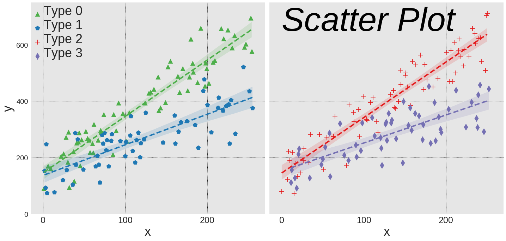

## Gallery (Under Construction)
Below is a collection of data visualizations. Each final image below links to the markdown output of a Jupyter notebook with the code required to make that image as well as exploration of other adjustable parameters for that type of plot. Each notebook is designed to explore mainly the parameters that are specific to that type of plot in the corresponding library in order to avoid repetition (e.g. adjusting labels or titles is usually the same for all types of plots within a library), and at the very end extra modifications are made to make the final result look nice.

### Table of contents 
- [**Seaborn**](#seaborn)  
&nbsp;&nbsp;&nbsp;&nbsp; - [Scatter/Line plot](#seaborn-lmplot)  
&nbsp;&nbsp;&nbsp;&nbsp; - [Bar plot](#seaborn-barplot)   
&nbsp;&nbsp;&nbsp;&nbsp; - [Strip plot](#seaborn-stripplot)   
&nbsp;&nbsp;&nbsp;&nbsp; - [Count plot](#seaborn-countplot)   
&nbsp;&nbsp;&nbsp;&nbsp; - [Box plot](#seaborn-boxplot)   
&nbsp;&nbsp;&nbsp;&nbsp; - [Violin plot](#seaborn-violinplot)   
&nbsp;&nbsp;&nbsp;&nbsp; - [Joint plot](#seaborn-jointplot)   
&nbsp;&nbsp;&nbsp;&nbsp; - [Heat map](#seaborn-heatmap)  
- [**Plotly**](#plotly)  
&nbsp;&nbsp;&nbsp;&nbsp; - [Line plot](#plotly-line)  
- [**Bokeh**](#bokeh)  
&nbsp;&nbsp; - [Glyphs](#bokeh-glyphs)  
&nbsp;&nbsp;&nbsp;&nbsp; - [Annular Wedge](#bokeh-glyphs-annular-wedge) 
&nbsp;&nbsp;&nbsp;&nbsp; - [Annulus](#bokeh-glyphs-annulus) 
&nbsp;&nbsp;&nbsp;&nbsp; - [Arc](#bokeh-glyphs-arc) 
&nbsp;&nbsp;&nbsp;&nbsp; - [Circle](#bokeh-glyphs-circle)  
&nbsp;&nbsp;&nbsp;&nbsp; - [Square](#bokeh-glyphs-square)  
&nbsp;&nbsp;&nbsp;&nbsp; - [Triangle](#bokeh-glyphs-triangle)  

## Seaborn

## Plotly

## Bokeh

#### Glyphs
Glyphs are the fundamental building block of plots in `Bokeh`.

#### Circle [(code)](../visualizations/bokeh/glyphs/annular-wedge/annular_wedge)

<html lang="en">
    <head>
        <meta charset="utf-8">
        <title>Bokeh Plot</title>
        
<link rel="stylesheet" href="https://cdn.pydata.org/bokeh/release/bokeh-0.12.7.min.css" type="text/css" />
        

        
    </head>
    <body>
        
        

            

        

        
        <script type="text/javascript">
            (function() {
          var fn = function() {
            Bokeh.safely(function() {
              var docs_json = {"18a949d3-474e-4158-9274-19447a206a38":{"roots":{"references":[{"attributes":{},"id":"009b69ad-470b-4cbb-ae60-2e79e3b6dd8e","type":"BasicTicker"},{"attributes":{"bounds":[-1,2],"callback":null,"end":1.5,"start":-0.5},"id":"21bc5755-a9dc-4c44-849e-459aeaf9bae4","type":"Range1d"},{"attributes":{"plot":{"id":"60e68047-3aec-4b28-94e5-3fd1319be028","subtype":"Figure","type":"Plot"},"ticker":{"id":"2e0b1a8f-012f-476d-b05e-8802b8c87814","type":"BasicTicker"}},"id":"4792fb78-d83e-4292-adad-21a0fa49784e","type":"Grid"},{"attributes":{},"id":"fff13b72-227c-439c-8f3e-1ff4a76c345c","type":"BasicTickFormatter"},{"attributes":{"formatter":{"id":"77210ac0-7d08-4200-a2c8-a43b99f09cb3","type":"BasicTickFormatter"},"plot":{"id":"1f9bcd32-e1d6-4b6f-97d2-5c8af63d1e0d","subtype":"Figure","type":"Plot"},"ticker":{"id":"9aabcc3f-09bf-43f3-aa6b-512793b10008","type":"BasicTicker"}},"id":"0ada3b43-3625-4107-a212-89c18ec9580a","type":"LinearAxis"},{"attributes":{"bottom_units":"screen","fill_alpha":{"value":0.5},"fill_color":{"value":"lightgrey"},"left_units":"screen","level":"overlay","line_alpha":{"value":1.0},"line_color":{"value":"black"},"line_dash":[4,4],"line_width":{"value":2},"plot":null,"render_mode":"css","right_units":"screen","top_units":"screen"},"id":"5904d012-8135-4820-95f1-274f46d74cb9","type":"BoxAnnotation"},{"attributes":{"bounds":[-1,2],"callback":null,"end":1.5,"start":-0.5},"id":"3d524f19-1f4e-4ca9-9895-ab36b94e82e7","type":"Range1d"},{"attributes":{},"id":"f8371669-14a2-4e82-93f3-e5c3724f32f0","type":"LinearScale"},{"attributes":{},"id":"a97a6322-a8d7-417c-bab1-a78db28edfdf","type":"BasicTicker"},{"attributes":{},"id":"ee75ae49-a525-4045-a354-dd04247e8473","type":"ResetTool"},{"attributes":{"bounds":[-1,2],"callback":null,"end":1.5,"start":-0.5},"id":"8086939e-173b-491d-a3a2-76beec04d291","type":"Range1d"},{"attributes":{},"id":"ba164dd8-cd01-4e05-94fd-db84bdde1c4d","type":"BasicTickFormatter"},{"attributes":{"below":[{"id":"c5f5dd68-ade4-4267-b6a9-1db947717559","type":"LinearAxis"}],"left":[{"id":"808c2046-1cc9-41cb-a47c-ab4f1f6e1d9f","type":"LinearAxis"}],"plot_height":400,"plot_width":400,"renderers":[{"id":"c5f5dd68-ade4-4267-b6a9-1db947717559","type":"LinearAxis"},{"id":"1df0b902-1cfc-4244-8c05-53fd9021ce89","type":"Grid"},{"id":"808c2046-1cc9-41cb-a47c-ab4f1f6e1d9f","type":"LinearAxis"},{"id":"f4b24fbe-ce8c-425a-9362-0485984ded1f","type":"Grid"},{"id":"5904d012-8135-4820-95f1-274f46d74cb9","type":"BoxAnnotation"},{"id":"ba24a9ae-9d31-463d-9940-1ad8bb65b417","type":"GlyphRenderer"},{"id":"a236d846-174a-4910-be3f-9392c73ae85c","type":"GlyphRenderer"},{"id":"c87c7a25-30f2-48a0-80a8-f636f3115878","type":"GlyphRenderer"},{"id":"26ea4023-f4da-442e-8336-9df9b520d825","type":"GlyphRenderer"}],"title":{"id":"84ef180e-863b-4956-af9a-e9846d0983f0","type":"Title"},"toolbar":{"id":"ddecc1b2-7a4c-462b-8462-f7292d569c42","type":"Toolbar"},"x_range":{"id":"4e8e26e2-e65e-4e15-bff8-653ec5af4e4d","type":"Range1d"},"x_scale":{"id":"07ab18c9-3126-4e26-bde9-d58f78b5cc98","type":"LinearScale"},"y_range":{"id":"819955f3-5dfe-45be-9278-c60f707c4a0e","type":"Range1d"},"y_scale":{"id":"f1a3c39c-95be-4b80-b443-14409cc87c46","type":"LinearScale"}},"id":"ef2ac89a-12d5-4865-bbe7-fc46233b3286","subtype":"Figure","type":"Plot"},{"attributes":{"callback":null,"data":{}},"id":"ef073e00-0cf4-43a4-ba22-3eb3900e4e1a","type":"ColumnDataSource"},{"attributes":{"end_angle":{"units":"rad","value":4.71238898038469},"fill_color":{"value":"#af8dc3"},"inner_radius":{"units":"data","value":0.35},"line_color":{"value":"#7fbf7b"},"line_width":{"value":5},"outer_radius":{"units":"data","value":0.4},"start_angle":{"units":"rad","value":0},"x":{"value":1},"y":{"value":1}},"id":"6dfcfac8-69f4-4a34-9386-28c9e35935d2","type":"AnnularWedge"},{"attributes":{"bounds":[-1,2],"callback":null,"end":1.5,"start":-0.5},"id":"eb4d453f-a9fe-463b-8c17-78db67687843","type":"Range1d"},{"attributes":{"data_source":{"id":"b6ee91fd-6e7b-49aa-9c16-47c1eaf57e83","type":"ColumnDataSource"},"glyph":{"id":"857a3a61-147d-42be-b515-e205fc644954","type":"AnnularWedge"},"hover_glyph":null,"muted_glyph":null,"nonselection_glyph":{"id":"1ab242ac-ed55-43b0-92c2-9dc856243b14","type":"AnnularWedge"},"selection_glyph":null,"view":{"id":"88ca7f9b-731c-455a-b44a-85529390b85a","type":"CDSView"}},"id":"a5d230ab-e275-4989-bd22-b25674a71bd7","type":"GlyphRenderer"},{"attributes":{},"id":"44aa7e9c-6120-4876-bdd6-74522886d9e2","type":"HelpTool"},{"attributes":{"direction":"clock","end_angle":{"units":"rad","value":4.71238898038469},"fill_alpha":{"value":0.1},"fill_color":{"value":"#1f77b4"},"inner_radius":{"units":"data","value":0.2},"line_alpha":{"value":0.1},"line_color":{"value":"#1f77b4"},"line_dash":[2,4,6,4],"line_width":{"value":5},"outer_radius":{"units":"data","value":0.5},"start_angle":{"units":"rad","value":0},"x":{"value":0},"y":{"value":1}},"id":"a6b853b8-1669-4658-8d5e-64ec6a5e3e4f","type":"AnnularWedge"},{"attributes":{"callback":null,"data":{}},"id":"9b1c2229-6667-4d42-a374-c4258fbac308","type":"ColumnDataSource"},{"attributes":{},"id":"e95f4b05-5ef9-48de-92e2-44eafca0db74","type":"PanTool"},{"attributes":{"end_angle":{"units":"rad","value":6.283185307179586},"fill_color":{"value":"#af8dc3"},"inner_radius":{"units":"data","value":0.1},"line_color":{"value":"#7fbf7b"},"line_dash":[6],"line_width":{"value":5},"outer_radius":{"units":"data","value":0.2},"start_angle":{"units":"rad","value":0},"x":{"value":0},"y":{"value":0}},"id":"06d15298-db89-4584-a60e-d344539325b3","type":"AnnularWedge"},{"attributes":{"end_angle":{"units":"rad","value":6.283185307179586},"fill_alpha":{"value":0.1},"fill_color":{"value":"#1f77b4"},"inner_radius":{"units":"data","value":0.1},"line_alpha":{"value":0.1},"line_color":{"value":"#1f77b4"},"line_width":{"value":5},"outer_radius":{"units":"data","value":0.2},"start_angle":{"units":"rad","value":0},"x":{"value":1},"y":{"value":1}},"id":"9157468c-0e59-4dfc-9964-f2242e918b07","type":"AnnularWedge"},{"attributes":{"data_source":{"id":"c526a078-994b-4af4-855e-27b4c1ba7953","type":"ColumnDataSource"},"glyph":{"id":"c685883b-441f-445e-8ed7-41302a91b1dc","type":"AnnularWedge"},"hover_glyph":null,"muted_glyph":null,"nonselection_glyph":{"id":"cd489dae-3b64-4d52-8b43-aad83b8e62d6","type":"AnnularWedge"},"selection_glyph":null,"view":{"id":"9ba75d3f-9eb4-401e-8e58-430dba42212f","type":"CDSView"}},"id":"89a922c6-892d-4036-9c4e-b41ecd4f5ba4","type":"GlyphRenderer"},{"attributes":{},"id":"085c15af-e390-4f25-aa90-0be10c1ac79a","type":"ResetTool"},{"attributes":{"active_drag":"auto","active_inspect":"auto","active_scroll":"auto","active_tap":"auto","tools":[{"id":"b164029e-4073-4946-87be-40907a4ccf5c","type":"PanTool"},{"id":"f99cb30b-9be6-423d-ac77-f2618a52055d","type":"WheelZoomTool"},{"id":"bab085c8-fd7e-443b-8ea4-269e4f421709","type":"BoxZoomTool"},{"id":"7a942eca-d67b-4241-9127-199dd23a5b08","type":"SaveTool"},{"id":"48f1a95e-195a-47d0-ba8d-61aed7722fa6","type":"ResetTool"},{"id":"2c017323-df16-4380-8ff4-c98e07dddc1b","type":"HelpTool"}]},"id":"97716cd3-ca52-4c0a-a5dc-caff3656f5fa","type":"Toolbar"},{"attributes":{"source":{"id":"9787c24b-8deb-4c1f-a7c0-86dd53242671","type":"ColumnDataSource"}},"id":"ce77235d-9f27-4f8e-ae4d-5c476207f273","type":"CDSView"},{"attributes":{"data_source":{"id":"4568bcd1-2c4e-4492-b132-ee9d0f0f9753","type":"ColumnDataSource"},"glyph":{"id":"756c880a-f769-4d71-91d5-9f9d57d27b3b","type":"AnnularWedge"},"hover_glyph":null,"muted_glyph":null,"nonselection_glyph":{"id":"9157468c-0e59-4dfc-9964-f2242e918b07","type":"AnnularWedge"},"selection_glyph":null,"view":{"id":"0f340fe8-d6b7-4553-bd04-b57693e26207","type":"CDSView"}},"id":"0e81c059-65e9-4a5d-a4f8-de1c3ac4de1f","type":"GlyphRenderer"},{"attributes":{"source":{"id":"29785809-fe76-40c6-8b9b-8a0d486be1e8","type":"ColumnDataSource"}},"id":"57453658-e708-43f2-900a-17644eca591e","type":"CDSView"},{"attributes":{"end_angle":{"units":"rad","value":6.283185307179586},"fill_color":{"value":"#af8dc3"},"inner_radius":{"units":"data","value":0.1},"line_color":{"value":"#7fbf7b"},"line_dash":[6],"line_width":{"value":5},"outer_radius":{"units":"data","value":0.2},"start_angle":{"units":"rad","value":0},"x":{"value":1},"y":{"value":1}},"id":"84bcc895-b495-4427-a774-2be641038d44","type":"AnnularWedge"},{"attributes":{"source":{"id":"390d3684-15d5-44a8-af2e-23a1b83d9594","type":"ColumnDataSource"}},"id":"ceaf60b7-a2d9-4631-b66f-ec4d5bb9cdd0","type":"CDSView"},{"attributes":{"formatter":{"id":"8da1d9ca-a3f9-49e8-b47e-f879d5508bec","type":"BasicTickFormatter"},"plot":{"id":"4e3f3c37-42f5-4970-af38-edf34e077ed0","subtype":"Figure","type":"Plot"},"ticker":{"id":"d4b63fb1-e023-4c83-8355-367d743f519b","type":"BasicTicker"}},"id":"8e425098-d06c-4363-bbd3-c168cb365b6e","type":"LinearAxis"},{"attributes":{"dimension":1,"plot":{"id":"b87c1797-4d61-4f4b-85e5-354080d1dcf1","subtype":"Figure","type":"Plot"},"ticker":{"id":"9f24f8ba-72f1-478b-8b76-62cc9fccde51","type":"BasicTicker"}},"id":"d5f5f854-ab4b-4c5b-a412-6edd3460dbb2","type":"Grid"},{"attributes":{},"id":"9b790ead-aedd-4218-812c-66dd55824569","type":"LinearScale"},{"attributes":{"data_source":{"id":"52b487e4-cd51-410a-98ed-6fffc148378c","type":"ColumnDataSource"},"glyph":{"id":"9f406384-4475-438b-a469-7174515dd42d","type":"AnnularWedge"},"hover_glyph":null,"muted_glyph":null,"nonselection_glyph":{"id":"1be6c916-dad7-4648-888b-5afb0e6b6866","type":"AnnularWedge"},"selection_glyph":null,"view":{"id":"285b5a62-38b8-4804-9d10-37c68e763814","type":"CDSView"}},"id":"4bd238e8-7b8f-4a07-8134-8841942aedbb","type":"GlyphRenderer"},{"attributes":{"callback":null,"data":{}},"id":"a7153430-520a-447e-9908-12b78bcd718b","type":"ColumnDataSource"},{"attributes":{"formatter":{"id":"e8879bb7-47e2-4f7f-b018-cecf5ef4c208","type":"BasicTickFormatter"},"plot":{"id":"b1f6f62e-7bdb-4d0b-9ea4-e032604f559b","subtype":"Figure","type":"Plot"},"ticker":{"id":"f55df743-04ea-44f5-abbb-edb293c1b2c2","type":"BasicTicker"}},"id":"9d7564b2-d4fa-4f85-a5e9-9bdd6b982bf4","type":"LinearAxis"},{"attributes":{},"id":"75fbb919-b89f-4c8a-a03b-9a8e21726bd1","type":"BasicTicker"},{"attributes":{"bottom_units":"screen","fill_alpha":{"value":0.5},"fill_color":{"value":"lightgrey"},"left_units":"screen","level":"overlay","line_alpha":{"value":1.0},"line_color":{"value":"black"},"line_dash":[4,4],"line_width":{"value":2},"plot":null,"render_mode":"css","right_units":"screen","top_units":"screen"},"id":"148ac7f7-4086-40c4-bae1-ba61990f8d1f","type":"BoxAnnotation"},{"attributes":{},"id":"ccdce54e-fc16-45d6-a71f-0d3bb341498f","type":"BasicTickFormatter"},{"attributes":{"plot":null,"text":""},"id":"163ed918-7aaa-47a8-af11-0bb3e32350f0","type":"Title"},{"attributes":{"data_source":{"id":"6e2a24c1-126c-4cee-86fc-f7df10d874e9","type":"ColumnDataSource"},"glyph":{"id":"16ca6269-d3b5-4cfb-911e-539b9170a7ce","type":"AnnularWedge"},"hover_glyph":null,"muted_glyph":null,"nonselection_glyph":{"id":"43333273-35dd-42cc-8eab-bd3daef44667","type":"AnnularWedge"},"selection_glyph":null,"view":{"id":"c0c6b1aa-8a4c-4a53-a9fc-c828ee0b93d8","type":"CDSView"}},"id":"ba24a9ae-9d31-463d-9940-1ad8bb65b417","type":"GlyphRenderer"},{"attributes":{"direction":"clock","end_angle":{"units":"rad","value":4.71238898038469},"fill_alpha":{"value":0.1},"fill_color":{"value":"#1f77b4"},"inner_radius":{"units":"data","value":0.2},"line_alpha":{"value":0.1},"line_color":{"value":"#1f77b4"},"line_dash":[2,4,6,4],"line_width":{"value":5},"outer_radius":{"units":"data","value":0.4},"start_angle":{"units":"rad","value":0},"x":{"value":0},"y":{"value":1}},"id":"8ba8e953-82b2-4434-b054-0af15f2a70d7","type":"AnnularWedge"},{"attributes":{},"id":"5160f1c1-c775-4645-b079-c5d88f0dc7d7","type":"BasicTickFormatter"},{"attributes":{"dimension":1,"plot":{"id":"ef2ac89a-12d5-4865-bbe7-fc46233b3286","subtype":"Figure","type":"Plot"},"ticker":{"id":"c1af3e3c-536f-42e7-8a23-d57b938fc687","type":"BasicTicker"}},"id":"f4b24fbe-ce8c-425a-9362-0485984ded1f","type":"Grid"},{"attributes":{"dimension":1,"plot":{"id":"fc428595-130a-4e71-8901-733ad39b61e3","subtype":"Figure","type":"Plot"},"ticker":{"id":"8f763348-7815-432c-8e71-19fae219df1b","type":"BasicTicker"}},"id":"0245dded-04bd-42a6-ad94-b44b7b74649c","type":"Grid"},{"attributes":{},"id":"8f763348-7815-432c-8e71-19fae219df1b","type":"BasicTicker"},{"attributes":{},"id":"73860732-85d2-4e2c-b020-52eceb2945bc","type":"SaveTool"},{"attributes":{"end_angle":{"units":"rad","value":6.283185307179586},"fill_alpha":{"value":0.1},"fill_color":{"value":"#1f77b4"},"inner_radius":{"units":"data","value":0.1},"line_alpha":{"value":0.1},"line_color":{"value":"#1f77b4"},"line_dash":[2,4,6,4],"line_width":{"value":5},"outer_radius":{"units":"data","value":0.2},"start_angle":{"units":"rad","value":0},"x":{"value":0},"y":{"value":1}},"id":"ed2c0f05-10f5-4d65-80ad-c83d8492c8fd","type":"AnnularWedge"},{"attributes":{"source":{"id":"9b1c2229-6667-4d42-a374-c4258fbac308","type":"ColumnDataSource"}},"id":"659921ac-6c32-4330-ad3f-4f0d8c0a574c","type":"CDSView"},{"attributes":{},"id":"13fbaa61-befe-4ce7-9231-ff9aeb7487b8","type":"SaveTool"},{"attributes":{},"id":"5fcc6b53-5f91-4d4a-823d-e602e009a7c9","type":"BasicTickFormatter"},{"attributes":{},"id":"f66dce97-abec-4dcb-988d-971ac79646f5","type":"HelpTool"},{"attributes":{"callback":null,"data":{}},"id":"8bbc4319-fa9e-4d91-9a00-79e64a75af2c","type":"ColumnDataSource"},{"attributes":{"callback":null,"data":{}},"id":"52b487e4-cd51-410a-98ed-6fffc148378c","type":"ColumnDataSource"},{"attributes":{"plot":null,"text":""},"id":"ad56d2c3-2440-4bef-af3e-03ce1fa5db2f","type":"Title"},{"attributes":{"end_angle":{"units":"rad","value":6.283185307179586},"fill_color":{"value":"#66bd63"},"inner_radius":{"units":"data","value":0.1},"line_color":{"value":"#d73027"},"line_dash":[2,4],"line_width":{"value":5},"outer_radius":{"units":"data","value":0.4},"start_angle":{"units":"rad","value":0},"x":{"value":1},"y":{"value":0}},"id":"9d404c31-68b8-4f0a-a734-866c5ceb3599","type":"AnnularWedge"},{"attributes":{"bounds":[-1,2],"callback":null,"end":1.5,"start":-0.5},"id":"3cf5e0d4-b830-43ed-a3e8-156cdce7ce93","type":"Range1d"},{"attributes":{"formatter":{"id":"6977ab4e-1361-48a0-b80d-5f032526d138","type":"BasicTickFormatter"},"plot":{"id":"60e68047-3aec-4b28-94e5-3fd1319be028","subtype":"Figure","type":"Plot"},"ticker":{"id":"009b69ad-470b-4cbb-ae60-2e79e3b6dd8e","type":"BasicTicker"}},"id":"066277ba-71d0-40ba-9c18-7fab03146ee9","type":"LinearAxis"},{"attributes":{"direction":"clock","end_angle":{"units":"rad","value":4.71238898038469},"fill_color":{"value":"#af8dc3"},"inner_radius":{"units":"data","value":0.2},"line_color":{"value":"#7fbf7b"},"line_dash":[2,4,6,4],"line_width":{"value":5},"outer_radius":{"units":"data","value":0.4},"start_angle":{"units":"rad","value":0},"x":{"value":0},"y":{"value":1}},"id":"30c045cd-01dd-46dd-9d10-9ba93648baf4","type":"AnnularWedge"},{"attributes":{"callback":null,"data":{}},"id":"9787c24b-8deb-4c1f-a7c0-86dd53242671","type":"ColumnDataSource"},{"attributes":{},"id":"329ae744-9efb-4fab-b7f5-0256f827fe0f","type":"BasicTickFormatter"},{"attributes":{"end_angle":{"units":"rad","value":4.71238898038469},"fill_alpha":{"value":0.1},"fill_color":{"value":"#1f77b4"},"inner_radius":{"units":"data","value":0.35},"line_alpha":{"value":0.1},"line_color":{"value":"#1f77b4"},"line_width":{"value":5},"outer_radius":{"units":"data","value":0.4},"start_angle":{"units":"rad","value":0},"x":{"value":1},"y":{"value":1}},"id":"85e3e15c-a3bb-4250-8fbc-60cac6073749","type":"AnnularWedge"},{"attributes":{},"id":"0aacdcac-5087-4036-94d8-b84352337bd9","type":"PanTool"},{"attributes":{"data_source":{"id":"a7153430-520a-447e-9908-12b78bcd718b","type":"ColumnDataSource"},"glyph":{"id":"812d6ee9-4d40-40e6-8e7e-a2f8f65e80f0","type":"AnnularWedge"},"hover_glyph":null,"muted_glyph":null,"nonselection_glyph":{"id":"4dee3a79-4bf2-44da-86fa-8b61f0763de5","type":"AnnularWedge"},"selection_glyph":null,"view":{"id":"fdbe5024-230c-4f02-a2bf-85b1a5141ec4","type":"CDSView"}},"id":"f0071e78-ec6a-4d0f-8ed5-ea2488d96264","type":"GlyphRenderer"},{"attributes":{"direction":"clock","end_angle":{"units":"rad","value":6.283185307179586},"fill_color":{"value":"#66bd63"},"inner_radius":{"units":"data","value":0.1},"line_color":{"value":"#d73027"},"line_dash":[6],"line_width":{"value":5},"outer_radius":{"units":"data","value":0.2},"start_angle":{"units":"rad","value":0},"x":{"value":0},"y":{"value":0}},"id":"812d6ee9-4d40-40e6-8e7e-a2f8f65e80f0","type":"AnnularWedge"},{"attributes":{},"id":"f508267d-e591-4004-ae0a-ed020342f630","type":"HelpTool"},{"attributes":{},"id":"ab676f42-35c3-46d8-9fa2-f8454e42c16d","type":"BasicTickFormatter"},{"attributes":{},"id":"a8078252-f315-43a6-9b12-182777a8a629","type":"LinearScale"},{"attributes":{"end_angle":{"units":"rad","value":6.283185307179586},"fill_color":{"value":"#af8dc3"},"inner_radius":{"units":"data","value":0.1},"line_color":{"value":"#7fbf7b"},"line_dash":[2,4],"line_width":{"value":5},"outer_radius":{"units":"data","value":0.2},"start_angle":{"units":"rad","value":0},"x":{"value":1},"y":{"value":0}},"id":"acc52f1c-f067-48ba-8a9b-470167a29098","type":"AnnularWedge"},{"attributes":{"direction":"clock","end_angle":{"units":"rad","value":6.283185307179586},"fill_alpha":{"value":0.1},"fill_color":{"value":"#1f77b4"},"inner_radius":{"units":"data","value":0.1},"line_alpha":{"value":0.1},"line_color":{"value":"#1f77b4"},"line_dash":[6],"line_width":{"value":5},"outer_radius":{"units":"data","value":0.2},"start_angle":{"units":"rad","value":0},"x":{"value":0},"y":{"value":0}},"id":"1be6c916-dad7-4648-888b-5afb0e6b6866","type":"AnnularWedge"},{"attributes":{},"id":"14cfcb22-d8fb-4129-9b26-f0a7e289fce3","type":"BasicTickFormatter"},{"attributes":{"plot":{"id":"4e3f3c37-42f5-4970-af38-edf34e077ed0","subtype":"Figure","type":"Plot"},"ticker":{"id":"0f3fd7f6-fa8b-4697-9a77-c704cd08057c","type":"BasicTicker"}},"id":"f67055bb-6598-4e2b-92e3-20276265a057","type":"Grid"},{"attributes":{},"id":"e2ae7268-aadb-4619-8d86-ec593d09975d","type":"WheelZoomTool"},{"attributes":{},"id":"1a8210e1-7eb8-4073-9b8a-81ca71152eb4","type":"LinearScale"},{"attributes":{"active_drag":"auto","active_inspect":"auto","active_scroll":"auto","active_tap":"auto","tools":[{"id":"023f9208-3f3a-409b-b073-4c0f210cbbb6","type":"PanTool"},{"id":"6aacac8e-2142-4efe-ae17-401e754ef518","type":"WheelZoomTool"},{"id":"d043f530-752d-4dac-84fd-96f9e45ab01d","type":"BoxZoomTool"},{"id":"3ffc25a1-646c-4f13-94e6-8f9ed9a46623","type":"SaveTool"},{"id":"f1e3b26b-03b4-45f1-bd15-577e5b2e7f39","type":"ResetTool"},{"id":"9e965f08-36fe-4994-adbe-a7fe2ca1ccdd","type":"HelpTool"}]},"id":"d1d99cbe-852a-4632-b8a0-19b626884ca0","type":"Toolbar"},{"attributes":{},"id":"b8098dcf-5505-4ff3-9275-c0cb32d2aae6","type":"HelpTool"},{"attributes":{},"id":"e7d47f89-a45a-48d5-b706-1af11cec10e7","type":"BasicTicker"},{"attributes":{"source":{"id":"19ca3551-7779-42e4-9ea1-1d527c99de10","type":"ColumnDataSource"}},"id":"6d26ef1e-3899-4c88-a9a4-2f7ad2666ae1","type":"CDSView"},{"attributes":{"source":{"id":"d568690b-4eeb-4831-9438-580b4da2f4e1","type":"ColumnDataSource"}},"id":"280f9812-7dba-4c39-bead-98a9be07a1b4","type":"CDSView"},{"attributes":{"callback":null,"data":{}},"id":"7714d91a-45bc-4262-a00a-6a57daae3868","type":"ColumnDataSource"},{"attributes":{},"id":"6c56547e-ac4b-400c-b9fa-d49f1a5f2dfb","type":"ResetTool"},{"attributes":{},"id":"4e9e7e5a-8d31-4058-a484-8fe7660b5845","type":"BasicTickFormatter"},{"attributes":{"direction":"clock","end_angle":{"units":"rad","value":4.71238898038469},"fill_color":{"value":"#af8dc3"},"inner_radius":{"units":"data","value":0.2},"line_color":{"value":"#7fbf7b"},"line_dash":[2,4,6,4],"line_width":{"value":5},"outer_radius":{"units":"data","value":0.4},"start_angle":{"units":"rad","value":0},"x":{"value":0},"y":{"value":1}},"id":"ae38bfd4-8b71-4664-ba31-b313472b4593","type":"AnnularWedge"},{"attributes":{},"id":"6977ab4e-1361-48a0-b80d-5f032526d138","type":"BasicTickFormatter"},{"attributes":{"plot":{"id":"0301e44f-988a-477c-8406-aefedfb088ee","subtype":"Figure","type":"Plot"},"ticker":{"id":"92a2de44-be1a-4403-afa3-bbd0ce1f42c3","type":"BasicTicker"}},"id":"dbd362bb-9fd5-40ab-896c-68bbbcf1dcfe","type":"Grid"},{"attributes":{},"id":"9ceefccb-3cae-4691-a61d-e2739488d327","type":"BasicTicker"},{"attributes":{"direction":"clock","end_angle":{"units":"rad","value":6.283185307179586},"fill_color":{"value":"#af8dc3"},"inner_radius":{"units":"data","value":0.1},"line_color":{"value":"#7fbf7b"},"line_dash":[6],"line_width":{"value":5},"outer_radius":{"units":"data","value":0.2},"start_angle":{"units":"rad","value":0},"x":{"value":0},"y":{"value":0}},"id":"fc7a759d-d28e-467d-b37b-10b4def361ce","type":"AnnularWedge"},{"attributes":{"bounds":[-1,2],"callback":null,"end":1.5,"start":-0.5},"id":"4d196505-b2ea-42d0-a317-0f703372ff4e","type":"Range1d"},{"attributes":{"end_angle":{"units":"rad","value":6.283185307179586},"fill_alpha":{"value":0.1},"fill_color":{"value":"#1f77b4"},"inner_radius":{"units":"data","value":0.2},"line_alpha":{"value":0.1},"line_color":{"value":"#1f77b4"},"line_dash":[6],"line_width":{"value":5},"outer_radius":{"units":"data","value":1},"start_angle":{"units":"rad","value":0},"x":{"value":0},"y":{"value":0}},"id":"10002349-e31a-48da-a3cf-cd6e98819e5c","type":"AnnularWedge"},{"attributes":{"data_source":{"id":"b3c09760-8d17-4012-8cb6-e2ae44749427","type":"ColumnDataSource"},"glyph":{"id":"200d2a33-d2e7-44e1-915a-eea58571e831","type":"AnnularWedge"},"hover_glyph":null,"muted_glyph":null,"nonselection_glyph":{"id":"4b80edd8-d679-4493-a85b-25ea1882afc0","type":"AnnularWedge"},"selection_glyph":null,"view":{"id":"25a2e2dc-5155-42a8-b8cd-d23f49f8edb6","type":"CDSView"}},"id":"650ccbc2-edde-4b10-8efb-96327403f268","type":"GlyphRenderer"},{"attributes":{"data_source":{"id":"390d3684-15d5-44a8-af2e-23a1b83d9594","type":"ColumnDataSource"},"glyph":{"id":"e390d83d-805d-470d-b0c2-53879ac5d8c2","type":"AnnularWedge"},"hover_glyph":null,"muted_glyph":null,"nonselection_glyph":{"id":"03ef8ba1-f3d5-45cc-b80a-d766d1e96486","type":"AnnularWedge"},"selection_glyph":null,"view":{"id":"ceaf60b7-a2d9-4631-b66f-ec4d5bb9cdd0","type":"CDSView"}},"id":"e97c9bfb-75d7-4818-8c43-3ca9c75fca68","type":"GlyphRenderer"},{"attributes":{"below":[{"id":"8b281480-9d6c-466e-8f62-f46ebe3ad4dc","type":"LinearAxis"}],"left":[{"id":"f5574f52-3894-4385-997c-8357a7df0d96","type":"LinearAxis"}],"plot_height":400,"plot_width":400,"renderers":[{"id":"8b281480-9d6c-466e-8f62-f46ebe3ad4dc","type":"LinearAxis"},{"id":"6c84ceee-2817-4a8e-ac8a-72960db95d97","type":"Grid"},{"id":"f5574f52-3894-4385-997c-8357a7df0d96","type":"LinearAxis"},{"id":"6ebdad64-e409-45c6-b877-f60b16452733","type":"Grid"},{"id":"2c19abe8-2884-414d-9426-2467fd6c35c1","type":"BoxAnnotation"},{"id":"f0192b3d-d089-4ee8-b442-64ede0b3fd2a","type":"GlyphRenderer"},{"id":"e97c9bfb-75d7-4818-8c43-3ca9c75fca68","type":"GlyphRenderer"},{"id":"a844b666-0093-4b2b-bfbb-57bf05d55b1e","type":"GlyphRenderer"},{"id":"650ccbc2-edde-4b10-8efb-96327403f268","type":"GlyphRenderer"}],"title":{"id":"893aa7ec-8d78-45c1-83a2-550dc30a7615","type":"Title"},"toolbar":{"id":"d1d99cbe-852a-4632-b8a0-19b626884ca0","type":"Toolbar"},"x_range":{"id":"3d524f19-1f4e-4ca9-9895-ab36b94e82e7","type":"Range1d"},"x_scale":{"id":"634b77c0-3d2c-498e-bcee-89e3761b4663","type":"LinearScale"},"y_range":{"id":"21bc5755-a9dc-4c44-849e-459aeaf9bae4","type":"Range1d"},"y_scale":{"id":"ef71e4c6-292e-4c84-bfa3-3f6fa611f826","type":"LinearScale"}},"id":"cf545656-e2a7-4a29-b660-a00254bb313f","subtype":"Figure","type":"Plot"},{"attributes":{"bounds":[-1,2],"callback":null,"end":1.5,"start":-0.5},"id":"a7ab1400-7b52-4f90-9ba1-f7a36f03803b","type":"Range1d"},{"attributes":{"end_angle":{"units":"rad","value":4.71238898038469},"fill_color":{"value":"#af8dc3"},"inner_radius":{"units":"data","value":0.1},"line_color":{"value":"#7fbf7b"},"line_width":{"value":5},"outer_radius":{"units":"data","value":0.2},"start_angle":{"units":"rad","value":0},"x":{"value":1},"y":{"value":1}},"id":"200d2a33-d2e7-44e1-915a-eea58571e831","type":"AnnularWedge"},{"attributes":{},"id":"986c2d5a-5acb-4016-804b-353d515ba928","type":"LinearScale"},{"attributes":{"callback":null,"data":{}},"id":"debf573e-e335-46e8-8c4f-f8ec3e91e8bb","type":"ColumnDataSource"},{"attributes":{"end_angle":{"units":"rad","value":6.283185307179586},"fill_color":{"value":"#66bd63"},"inner_radius":{"units":"data","value":0.1},"line_color":{"value":"#d73027"},"line_dash":[2,4],"line_width":{"value":5},"outer_radius":{"units":"data","value":0.4},"start_angle":{"units":"rad","value":0},"x":{"value":1},"y":{"value":0}},"id":"17dddb58-2497-4cfc-b5ab-ee5fb52811ca","type":"AnnularWedge"},{"attributes":{},"id":"f55df743-04ea-44f5-abbb-edb293c1b2c2","type":"BasicTicker"},{"attributes":{},"id":"b79c8d2f-bb33-4d9f-9eac-7705c8464160","type":"BasicTickFormatter"},{"attributes":{"below":[{"id":"9d7564b2-d4fa-4f85-a5e9-9bdd6b982bf4","type":"LinearAxis"}],"left":[{"id":"7acd8f29-76a1-476e-ad9a-0f6f30a8d37d","type":"LinearAxis"}],"plot_height":400,"plot_width":400,"renderers":[{"id":"9d7564b2-d4fa-4f85-a5e9-9bdd6b982bf4","type":"LinearAxis"},{"id":"203a00ec-ed21-460f-ba31-4ff817db3bb3","type":"Grid"},{"id":"7acd8f29-76a1-476e-ad9a-0f6f30a8d37d","type":"LinearAxis"},{"id":"0d806d45-af36-4d3f-894e-43a3c95b7081","type":"Grid"},{"id":"be521cfe-db09-4165-8595-4828ccd6fcec","type":"BoxAnnotation"},{"id":"a5d230ab-e275-4989-bd22-b25674a71bd7","type":"GlyphRenderer"},{"id":"daec13d0-c30e-4bbd-9d8c-6f8460b157d1","type":"GlyphRenderer"},{"id":"1204441c-b5b1-4622-bf6d-a39e26198c4d","type":"GlyphRenderer"},{"id":"0e81c059-65e9-4a5d-a4f8-de1c3ac4de1f","type":"GlyphRenderer"}],"title":{"id":"b973895c-b68d-4da6-8f2d-2689438fe55d","type":"Title"},"toolbar":{"id":"97716cd3-ca52-4c0a-a5dc-caff3656f5fa","type":"Toolbar"},"x_range":{"id":"3cf5e574-d5ba-4459-bd34-923f5af7ac6d","type":"Range1d"},"x_scale":{"id":"fbdc0028-b99d-4443-9b77-542a76cff401","type":"LinearScale"},"y_range":{"id":"cddd52e9-6d2f-49fa-8482-a92edc7ceb5d","type":"Range1d"},"y_scale":{"id":"3a79629a-8485-4442-9694-13c3d247c21c","type":"LinearScale"}},"id":"b1f6f62e-7bdb-4d0b-9ea4-e032604f559b","subtype":"Figure","type":"Plot"},{"attributes":{"active_drag":"auto","active_inspect":"auto","active_scroll":"auto","active_tap":"auto","tools":[{"id":"bdf8b2b8-e811-49a2-93f6-b6976cfb623d","type":"PanTool"},{"id":"13644824-74f1-45a1-b6a9-735757d18388","type":"WheelZoomTool"},{"id":"ea6c532e-875f-4f80-96c8-6752c04ee754","type":"BoxZoomTool"},{"id":"55201caa-d28f-404e-9bad-464c9036bd1a","type":"SaveTool"},{"id":"6c56547e-ac4b-400c-b9fa-d49f1a5f2dfb","type":"ResetTool"},{"id":"4b6a32ef-8e82-4aa2-82b0-e6414de38a73","type":"HelpTool"}]},"id":"cf396381-c9ce-4b1f-8e20-c43a62372ca1","type":"Toolbar"},{"attributes":{},"id":"d4b63fb1-e023-4c83-8355-367d743f519b","type":"BasicTicker"},{"attributes":{"direction":"clock","end_angle":{"units":"rad","value":6.283185307179586},"fill_alpha":{"value":0.1},"fill_color":{"value":"#1f77b4"},"inner_radius":{"units":"data","value":0.1},"line_alpha":{"value":0.1},"line_color":{"value":"#1f77b4"},"line_dash":[6],"line_width":{"value":5},"outer_radius":{"units":"data","value":0.2},"start_angle":{"units":"rad","value":0},"x":{"value":0},"y":{"value":0}},"id":"4dee3a79-4bf2-44da-86fa-8b61f0763de5","type":"AnnularWedge"},{"attributes":{"callback":null,"data":{}},"id":"b3c09760-8d17-4012-8cb6-e2ae44749427","type":"ColumnDataSource"},{"attributes":{"end_angle":{"units":"rad","value":4.71238898038469},"fill_color":{"value":"#af8dc3"},"inner_radius":{"units":"data","value":0.35},"line_color":{"value":"#7fbf7b"},"line_width":{"value":5},"outer_radius":{"units":"data","value":0.4},"start_angle":{"units":"rad","value":0},"x":{"value":1},"y":{"value":1}},"id":"a696b704-f723-47e8-8450-4c96c01f3bc8","type":"AnnularWedge"},{"attributes":{"bounds":[-1,2],"callback":null,"end":1.5,"start":-0.5},"id":"632ee449-5838-470a-9c07-b61603d8b074","type":"Range1d"},{"attributes":{"dimension":1,"plot":{"id":"cf545656-e2a7-4a29-b660-a00254bb313f","subtype":"Figure","type":"Plot"},"ticker":{"id":"7c4bd8be-6c06-4310-97e3-1a6814dc9c91","type":"BasicTicker"}},"id":"6ebdad64-e409-45c6-b877-f60b16452733","type":"Grid"},{"attributes":{},"id":"270b4b32-740b-4079-9038-9fdb382442a0","type":"LinearScale"},{"attributes":{"data_source":{"id":"7714d91a-45bc-4262-a00a-6a57daae3868","type":"ColumnDataSource"},"glyph":{"id":"84bcc895-b495-4427-a774-2be641038d44","type":"AnnularWedge"},"hover_glyph":null,"muted_glyph":null,"nonselection_glyph":{"id":"4dfc378d-e8ef-4dde-abac-299e0e24a052","type":"AnnularWedge"},"selection_glyph":null,"view":{"id":"85f7007b-ce8c-444a-90c7-218eb78f65a9","type":"CDSView"}},"id":"049bdfe7-1fc6-405a-aa4c-0c029d7d5315","type":"GlyphRenderer"},{"attributes":{"end_angle":{"units":"rad","value":6.283185307179586},"fill_color":{"value":"#af8dc3"},"inner_radius":{"units":"data","value":0.2},"line_color":{"value":"#7fbf7b"},"line_dash":[6],"line_width":{"value":5},"outer_radius":{"units":"data","value":1},"start_angle":{"units":"rad","value":0},"x":{"value":0},"y":{"value":0}},"id":"506a0808-23f5-42c2-97a2-6162b2046671","type":"AnnularWedge"},{"attributes":{},"id":"7a942eca-d67b-4241-9127-199dd23a5b08","type":"SaveTool"},{"attributes":{"data_source":{"id":"2bf3b273-1f61-4afb-b18d-509f86877968","type":"ColumnDataSource"},"glyph":{"id":"1540d071-33f0-4998-803b-f5de8feeaee5","type":"AnnularWedge"},"hover_glyph":null,"muted_glyph":null,"nonselection_glyph":{"id":"a745cfa4-faca-49d7-b5ad-c6f0de860968","type":"AnnularWedge"},"selection_glyph":null,"view":{"id":"9fcb0347-5e6d-4735-bf1d-bf52eae1f5d4","type":"CDSView"}},"id":"63bf66c0-6e10-45f2-a37c-c6f9f3570a7b","type":"GlyphRenderer"},{"attributes":{"source":{"id":"1a8fcd11-3e90-4a8f-906e-1b5f86bb6a0a","type":"ColumnDataSource"}},"id":"99ec2048-1a0c-4ff1-a6fa-98ed9d7ef44d","type":"CDSView"},{"attributes":{"callback":null,"data":{}},"id":"7a7a51b4-c0e1-4abd-b9db-5054f34cd547","type":"ColumnDataSource"},{"attributes":{},"id":"f628d59a-82cd-48b0-a6da-960c032d6402","type":"SaveTool"},{"attributes":{},"id":"f1a3c39c-95be-4b80-b443-14409cc87c46","type":"LinearScale"},{"attributes":{},"id":"7b95b584-43f9-44b4-95dc-9f0efdd170bc","type":"SaveTool"},{"attributes":{"end_angle":{"units":"rad","value":6.283185307179586},"fill_alpha":{"value":0.1},"fill_color":{"value":"#1f77b4"},"inner_radius":{"units":"data","value":5},"line_alpha":{"value":0.1},"line_color":{"value":"#1f77b4"},"line_dash":[6],"line_width":{"value":5},"outer_radius":{"units":"data","value":10},"start_angle":{"units":"rad","value":0},"x":{"value":0},"y":{"value":0}},"id":"05abfc63-11e6-48a4-9b57-02c96897c7bb","type":"AnnularWedge"},{"attributes":{},"id":"eddffc08-3003-486a-afab-4f1accdcdba3","type":"LinearScale"},{"attributes":{"source":{"id":"05d0e1f7-f43e-408d-96b7-fe9700587bdf","type":"ColumnDataSource"}},"id":"c3279e6a-af06-4276-9194-7844fa45a741","type":"CDSView"},{"attributes":{"dimension":1,"plot":{"id":"3c0749e9-4c01-49ee-8456-46d4ba423727","subtype":"Figure","type":"Plot"},"ticker":{"id":"ee4e70f8-9bfb-4e17-a1d4-294871fc2bc1","type":"BasicTicker"}},"id":"1aa8520e-9747-4127-b502-9a110d5d9d62","type":"Grid"},{"attributes":{"callback":null,"data":{}},"id":"2bf3b273-1f61-4afb-b18d-509f86877968","type":"ColumnDataSource"},{"attributes":{"callback":null,"data":{}},"id":"c1980ecf-9afe-4ac0-8a4b-252333a59df1","type":"ColumnDataSource"},{"attributes":{"formatter":{"id":"ab676f42-35c3-46d8-9fa2-f8454e42c16d","type":"BasicTickFormatter"},"plot":{"id":"b57dc130-0b4c-4c0a-8818-d295b724a01e","subtype":"Figure","type":"Plot"},"ticker":{"id":"52339c2b-31b1-4848-88ce-4e09aabdfd4f","type":"BasicTicker"}},"id":"4ea29116-b7fc-4d79-8158-963b2d324792","type":"LinearAxis"},{"attributes":{},"id":"3ffc25a1-646c-4f13-94e6-8f9ed9a46623","type":"SaveTool"},{"attributes":{},"id":"3facf0b8-85b2-4556-9ee9-623174017da7","type":"LinearScale"},{"attributes":{},"id":"2f0b17b2-df50-44ca-9fcf-b781926f50f8","type":"BasicTickFormatter"},{"attributes":{"bounds":[-1,2],"callback":null,"end":1.5,"start":-0.5},"id":"432edb74-a1ae-4448-8d38-27b6c70d5d74","type":"Range1d"},{"attributes":{"callback":null,"data":{}},"id":"c5740dab-3ea3-40fa-a85f-f6bfc8261563","type":"ColumnDataSource"},{"attributes":{"end_angle":{"units":"rad","value":6.283185307179586},"fill_color":{"value":"#af8dc3"},"inner_radius":{"units":"data","value":0.1},"line_color":{"value":"#7fbf7b"},"line_dash":[2,4],"line_width":{"value":5},"outer_radius":{"units":"data","value":0.4},"start_angle":{"units":"rad","value":0},"x":{"value":1},"y":{"value":0}},"id":"b215e9c9-aec9-4f59-b8c3-77057efb5d94","type":"AnnularWedge"},{"attributes":{"plot":{"id":"fc428595-130a-4e71-8901-733ad39b61e3","subtype":"Figure","type":"Plot"},"ticker":{"id":"4dd7648e-b9ab-4d82-8ffe-8f83c8e405db","type":"BasicTicker"}},"id":"71f195cb-93ce-4b34-8ffc-212eabe69714","type":"Grid"},{"attributes":{"formatter":{"id":"2f0b17b2-df50-44ca-9fcf-b781926f50f8","type":"BasicTickFormatter"},"plot":{"id":"ef2ac89a-12d5-4865-bbe7-fc46233b3286","subtype":"Figure","type":"Plot"},"ticker":{"id":"c1af3e3c-536f-42e7-8a23-d57b938fc687","type":"BasicTicker"}},"id":"808c2046-1cc9-41cb-a47c-ab4f1f6e1d9f","type":"LinearAxis"},{"attributes":{},"id":"70fa1e82-d0c1-4c83-8c7a-4c34d461f3bb","type":"BasicTicker"},{"attributes":{"data_source":{"id":"6ac84caf-5dcb-4c73-acb4-adcd338bca7b","type":"ColumnDataSource"},"glyph":{"id":"578f741b-e696-4695-8fb3-842707f16397","type":"AnnularWedge"},"hover_glyph":null,"muted_glyph":null,"nonselection_glyph":{"id":"00df1717-0fde-4da0-95c7-b251aaa1c847","type":"AnnularWedge"},"selection_glyph":null,"view":{"id":"e92a73b9-a527-4aa0-a311-bd482ed50f53","type":"CDSView"}},"id":"594e96fd-c025-432e-b9f5-f0901eb57ee3","type":"GlyphRenderer"},{"attributes":{"direction":"clock","end_angle":{"units":"rad","value":6.283185307179586},"fill_color":{"value":"#af8dc3"},"inner_radius":{"units":"data","value":0.1},"line_color":{"value":"#7fbf7b"},"line_dash":[6],"line_width":{"value":5},"outer_radius":{"units":"data","value":0.2},"start_angle":{"units":"rad","value":0},"x":{"value":0},"y":{"value":0}},"id":"16ca6269-d3b5-4cfb-911e-539b9170a7ce","type":"AnnularWedge"},{"attributes":{},"id":"fbdc0028-b99d-4443-9b77-542a76cff401","type":"LinearScale"},{"attributes":{"formatter":{"id":"329ae744-9efb-4fab-b7f5-0256f827fe0f","type":"BasicTickFormatter"},"plot":{"id":"b87c1797-4d61-4f4b-85e5-354080d1dcf1","subtype":"Figure","type":"Plot"},"ticker":{"id":"1b8fdf31-83cf-43af-a398-a773809e4f44","type":"BasicTicker"}},"id":"ddee8956-bde0-4d82-9e84-f07b58e0dba0","type":"LinearAxis"},{"attributes":{"source":{"id":"d02b9f5c-79fb-4975-8152-045e09f431cb","type":"ColumnDataSource"}},"id":"ff02dfc6-e1cc-4e76-aebc-9e2934e02ed0","type":"CDSView"},{"attributes":{"source":{"id":"b6ee91fd-6e7b-49aa-9c16-47c1eaf57e83","type":"ColumnDataSource"}},"id":"88ca7f9b-731c-455a-b44a-85529390b85a","type":"CDSView"},{"attributes":{"data_source":{"id":"9b1c2229-6667-4d42-a374-c4258fbac308","type":"ColumnDataSource"},"glyph":{"id":"9f02bf7b-9933-4b83-856c-e191ff6abe6b","type":"AnnularWedge"},"hover_glyph":null,"muted_glyph":null,"nonselection_glyph":{"id":"05abfc63-11e6-48a4-9b57-02c96897c7bb","type":"AnnularWedge"},"selection_glyph":null,"view":{"id":"659921ac-6c32-4330-ad3f-4f0d8c0a574c","type":"CDSView"}},"id":"38ff5ad1-c640-424c-9f82-3e76942bc8bf","type":"GlyphRenderer"},{"attributes":{"direction":"clock","end_angle":{"units":"rad","value":6.283185307179586},"fill_alpha":{"value":0.1},"fill_color":{"value":"#1f77b4"},"inner_radius":{"units":"data","value":0.1},"line_alpha":{"value":0.1},"line_color":{"value":"#1f77b4"},"line_dash":[6],"line_width":{"value":5},"outer_radius":{"units":"data","value":0.2},"start_angle":{"units":"rad","value":0},"x":{"value":0},"y":{"value":0}},"id":"43333273-35dd-42cc-8eab-bd3daef44667","type":"AnnularWedge"},{"attributes":{"end_angle":{"units":"rad","value":6.283185307179586},"fill_alpha":{"value":0.1},"fill_color":{"value":"#1f77b4"},"inner_radius":{"units":"data","value":0.1},"line_alpha":{"value":0.1},"line_color":{"value":"#1f77b4"},"line_dash":[2,4],"line_width":{"value":5},"outer_radius":{"units":"data","value":0.2},"start_angle":{"units":"rad","value":0},"x":{"value":1},"y":{"value":0}},"id":"2c42a451-7703-489d-bd27-82fe5cecb645","type":"AnnularWedge"},{"attributes":{"source":{"id":"6e2a24c1-126c-4cee-86fc-f7df10d874e9","type":"ColumnDataSource"}},"id":"c0c6b1aa-8a4c-4a53-a9fc-c828ee0b93d8","type":"CDSView"},{"attributes":{},"id":"4f2f262e-380d-4120-8452-d7302c3315bb","type":"SaveTool"},{"attributes":{"source":{"id":"faf1461e-d900-4f79-8165-a53d057ab69d","type":"ColumnDataSource"}},"id":"f5cd9d29-f6ea-46eb-908b-e1392641c872","type":"CDSView"},{"attributes":{"dimension":1,"plot":{"id":"b1f6f62e-7bdb-4d0b-9ea4-e032604f559b","subtype":"Figure","type":"Plot"},"ticker":{"id":"e7d47f89-a45a-48d5-b706-1af11cec10e7","type":"BasicTicker"}},"id":"0d806d45-af36-4d3f-894e-43a3c95b7081","type":"Grid"},{"attributes":{"active_drag":"auto","active_inspect":"auto","active_scroll":"auto","active_tap":"auto","tools":[{"id":"e95f4b05-5ef9-48de-92e2-44eafca0db74","type":"PanTool"},{"id":"e2ae7268-aadb-4619-8d86-ec593d09975d","type":"WheelZoomTool"},{"id":"7f6e95d4-7345-4a75-b38e-687c9f7358f3","type":"BoxZoomTool"},{"id":"7b95b584-43f9-44b4-95dc-9f0efdd170bc","type":"SaveTool"},{"id":"77781f04-b03d-4bbf-ac66-f4973e8d4699","type":"ResetTool"},{"id":"b8098dcf-5505-4ff3-9275-c0cb32d2aae6","type":"HelpTool"}]},"id":"68bb216d-fd2f-460a-acff-10b7c9ecdebf","type":"Toolbar"},{"attributes":{"plot":{"id":"ef2ac89a-12d5-4865-bbe7-fc46233b3286","subtype":"Figure","type":"Plot"},"ticker":{"id":"a97a6322-a8d7-417c-bab1-a78db28edfdf","type":"BasicTicker"}},"id":"1df0b902-1cfc-4244-8c05-53fd9021ce89","type":"Grid"},{"attributes":{"callback":null,"data":{}},"id":"b6ee91fd-6e7b-49aa-9c16-47c1eaf57e83","type":"ColumnDataSource"},{"attributes":{},"id":"4728ccf3-e5dd-43ed-a3ba-f85bf27339a5","type":"BasicTickFormatter"},{"attributes":{"dimension":1,"plot":{"id":"1f9bcd32-e1d6-4b6f-97d2-5c8af63d1e0d","subtype":"Figure","type":"Plot"},"ticker":{"id":"9aabcc3f-09bf-43f3-aa6b-512793b10008","type":"BasicTicker"}},"id":"f9db8e85-29b2-47f3-8ccf-5d52b3143479","type":"Grid"},{"attributes":{"end_angle":{"units":"rad","value":6.283185307179586},"fill_alpha":{"value":0.1},"fill_color":{"value":"#1f77b4"},"inner_radius":{"units":"data","value":0.1},"line_alpha":{"value":0.1},"line_color":{"value":"#1f77b4"},"line_dash":[6],"line_width":{"value":5},"outer_radius":{"units":"data","value":0.2},"start_angle":{"units":"rad","value":0},"x":{"value":1},"y":{"value":1}},"id":"4dfc378d-e8ef-4dde-abac-299e0e24a052","type":"AnnularWedge"},{"attributes":{"source":{"id":"f615bdf3-4ff4-440e-83e3-0933cf4532b3","type":"ColumnDataSource"}},"id":"4e7822bd-d5c1-495d-9958-9bc7b1bf5396","type":"CDSView"},{"attributes":{"callback":null,"data":{}},"id":"390d3684-15d5-44a8-af2e-23a1b83d9594","type":"ColumnDataSource"},{"attributes":{"callback":null,"data":{}},"id":"4568bcd1-2c4e-4492-b132-ee9d0f0f9753","type":"ColumnDataSource"},{"attributes":{"callback":null,"data":{}},"id":"19ca3551-7779-42e4-9ea1-1d527c99de10","type":"ColumnDataSource"},{"attributes":{"source":{"id":"b3c09760-8d17-4012-8cb6-e2ae44749427","type":"ColumnDataSource"}},"id":"25a2e2dc-5155-42a8-b8cd-d23f49f8edb6","type":"CDSView"},{"attributes":{},"id":"b4943ec3-cee0-4aa2-9d9d-eeec0f571b15","type":"ResetTool"},{"attributes":{"data_source":{"id":"c1980ecf-9afe-4ac0-8a4b-252333a59df1","type":"ColumnDataSource"},"glyph":{"id":"fc7a759d-d28e-467d-b37b-10b4def361ce","type":"AnnularWedge"},"hover_glyph":null,"muted_glyph":null,"nonselection_glyph":{"id":"e46b0e7c-8999-4062-ade5-49b831feafee","type":"AnnularWedge"},"selection_glyph":null,"view":{"id":"198f74c5-2440-441d-a063-aebe87630e10","type":"CDSView"}},"id":"f0192b3d-d089-4ee8-b442-64ede0b3fd2a","type":"GlyphRenderer"},{"attributes":{"overlay":{"id":"be521cfe-db09-4165-8595-4828ccd6fcec","type":"BoxAnnotation"}},"id":"bab085c8-fd7e-443b-8ea4-269e4f421709","type":"BoxZoomTool"},{"attributes":{},"id":"13644824-74f1-45a1-b6a9-735757d18388","type":"WheelZoomTool"},{"attributes":{"formatter":{"id":"14cfcb22-d8fb-4129-9b26-f0a7e289fce3","type":"BasicTickFormatter"},"plot":{"id":"b57dc130-0b4c-4c0a-8818-d295b724a01e","subtype":"Figure","type":"Plot"},"ticker":{"id":"70fa1e82-d0c1-4c83-8c7a-4c34d461f3bb","type":"BasicTicker"}},"id":"5024ef3f-2573-4fd5-9d9e-7b72e73cd570","type":"LinearAxis"},{"attributes":{"bounds":[-1,2],"callback":null,"end":1.5,"start":-0.5},"id":"c0cf3a28-3a4a-4689-84f8-fba664b52797","type":"Range1d"},{"attributes":{},"id":"52339c2b-31b1-4848-88ce-4e09aabdfd4f","type":"BasicTicker"},{"attributes":{},"id":"77781f04-b03d-4bbf-ac66-f4973e8d4699","type":"ResetTool"},{"attributes":{"direction":"clock","end_angle":{"units":"rad","value":4.71238898038469},"fill_alpha":{"value":0.1},"fill_color":{"value":"#1f77b4"},"inner_radius":{"units":"data","value":0.2},"line_alpha":{"value":0.1},"line_color":{"value":"#1f77b4"},"line_dash":[2,4,6,4],"line_width":{"value":5},"outer_radius":{"units":"data","value":0.4},"start_angle":{"units":"rad","value":0},"x":{"value":0},"y":{"value":1}},"id":"2e47e18d-805a-4d63-ba1d-d11ba79566a1","type":"AnnularWedge"},{"attributes":{"end_angle":{"units":"rad","value":6.283185307179586},"fill_color":{"value":"#af8dc3"},"inner_radius":{"units":"data","value":5},"line_color":{"value":"#7fbf7b"},"line_dash":[6],"line_width":{"value":5},"outer_radius":{"units":"data","value":10},"start_angle":{"units":"rad","value":0},"x":{"value":0},"y":{"value":0}},"id":"9f02bf7b-9933-4b83-856c-e191ff6abe6b","type":"AnnularWedge"},{"attributes":{"dimension":1,"plot":{"id":"b57dc130-0b4c-4c0a-8818-d295b724a01e","subtype":"Figure","type":"Plot"},"ticker":{"id":"52339c2b-31b1-4848-88ce-4e09aabdfd4f","type":"BasicTicker"}},"id":"949aa041-23f3-4477-ab95-7265c8e7bfba","type":"Grid"},{"attributes":{"end_angle":{"units":"rad","value":6.283185307179586},"fill_alpha":{"value":0.1},"fill_color":{"value":"#1f77b4"},"inner_radius":{"units":"data","value":0.1},"line_alpha":{"value":0.1},"line_color":{"value":"#1f77b4"},"line_dash":[6],"line_width":{"value":5},"outer_radius":{"units":"data","value":0.2},"start_angle":{"units":"rad","value":0},"x":{"value":0},"y":{"value":0}},"id":"e2937efa-f05e-4ffd-88aa-c8cdf7e86f16","type":"AnnularWedge"},{"attributes":{"dimension":1,"plot":{"id":"0301e44f-988a-477c-8406-aefedfb088ee","subtype":"Figure","type":"Plot"},"ticker":{"id":"75fbb919-b89f-4c8a-a03b-9a8e21726bd1","type":"BasicTicker"}},"id":"e9b56d91-5c43-4a56-8e96-2f10ba6b62e0","type":"Grid"},{"attributes":{"below":[{"id":"5024ef3f-2573-4fd5-9d9e-7b72e73cd570","type":"LinearAxis"}],"left":[{"id":"4ea29116-b7fc-4d79-8158-963b2d324792","type":"LinearAxis"}],"plot_height":400,"plot_width":400,"renderers":[{"id":"5024ef3f-2573-4fd5-9d9e-7b72e73cd570","type":"LinearAxis"},{"id":"4736ce4b-dd21-43bc-af35-45683d0a669d","type":"Grid"},{"id":"4ea29116-b7fc-4d79-8158-963b2d324792","type":"LinearAxis"},{"id":"949aa041-23f3-4477-ab95-7265c8e7bfba","type":"Grid"},{"id":"daca9207-e198-4086-bf70-f70d59973685","type":"BoxAnnotation"},{"id":"4bd238e8-7b8f-4a07-8134-8841942aedbb","type":"GlyphRenderer"},{"id":"a4102bb1-33a9-4673-97c1-c91813f7b524","type":"GlyphRenderer"},{"id":"2cc32c8e-474b-440c-8848-1a110468e26c","type":"GlyphRenderer"},{"id":"594e96fd-c025-432e-b9f5-f0901eb57ee3","type":"GlyphRenderer"}],"title":{"id":"163ed918-7aaa-47a8-af11-0bb3e32350f0","type":"Title"},"toolbar":{"id":"36bf9894-2ded-4c88-b7fb-8524594c7f4e","type":"Toolbar"},"x_range":{"id":"b35d6202-81c5-4b40-9aa8-bd6eff6ae87c","type":"Range1d"},"x_scale":{"id":"1dc56105-a43e-4a00-86be-b8afdaf7b230","type":"LinearScale"},"y_range":{"id":"48dd24e3-f3cf-45b9-9b44-c03517467eb2","type":"Range1d"},"y_scale":{"id":"3facf0b8-85b2-4556-9ee9-623174017da7","type":"LinearScale"}},"id":"b57dc130-0b4c-4c0a-8818-d295b724a01e","subtype":"Figure","type":"Plot"},{"attributes":{"plot":{"id":"b87c1797-4d61-4f4b-85e5-354080d1dcf1","subtype":"Figure","type":"Plot"},"ticker":{"id":"1b8fdf31-83cf-43af-a398-a773809e4f44","type":"BasicTicker"}},"id":"9a7eede9-efe2-42d6-ba02-c0b3d8f39fd2","type":"Grid"},{"attributes":{},"id":"1975f1e9-28e1-40db-b2bb-76f0ce7ee74d","type":"WheelZoomTool"},{"attributes":{"formatter":{"id":"73e4de2d-9d8f-4044-881e-ed36e5900b32","type":"BasicTickFormatter"},"plot":{"id":"0301e44f-988a-477c-8406-aefedfb088ee","subtype":"Figure","type":"Plot"},"ticker":{"id":"75fbb919-b89f-4c8a-a03b-9a8e21726bd1","type":"BasicTicker"}},"id":"b55baae1-82a5-4d82-962a-b6d27c5001c2","type":"LinearAxis"},{"attributes":{"formatter":{"id":"da4bb112-75d1-49b9-bf92-0261c1aca2b1","type":"BasicTickFormatter"},"plot":{"id":"4e3f3c37-42f5-4970-af38-edf34e077ed0","subtype":"Figure","type":"Plot"},"ticker":{"id":"0f3fd7f6-fa8b-4697-9a77-c704cd08057c","type":"BasicTicker"}},"id":"846b0c5d-927a-4743-9e50-8f96b6fabe9a","type":"LinearAxis"},{"attributes":{},"id":"f1e3b26b-03b4-45f1-bd15-577e5b2e7f39","type":"ResetTool"},{"attributes":{"formatter":{"id":"4e9e7e5a-8d31-4058-a484-8fe7660b5845","type":"BasicTickFormatter"},"plot":{"id":"1f9bcd32-e1d6-4b6f-97d2-5c8af63d1e0d","subtype":"Figure","type":"Plot"},"ticker":{"id":"0b1e3d9f-5e46-4646-bcfc-00bd4d5d81f6","type":"BasicTicker"}},"id":"5c77b3b3-5980-4a09-97f4-d1acfd76d2b2","type":"LinearAxis"},{"attributes":{"data_source":{"id":"74913ae9-9bf5-4e26-a5a0-de1b2e65cb9d","type":"ColumnDataSource"},"glyph":{"id":"30c045cd-01dd-46dd-9d10-9ba93648baf4","type":"AnnularWedge"},"hover_glyph":null,"muted_glyph":null,"nonselection_glyph":{"id":"2e47e18d-805a-4d63-ba1d-d11ba79566a1","type":"AnnularWedge"},"selection_glyph":null,"view":{"id":"fe121bf2-6272-40a2-b1a8-bd075c330fe8","type":"CDSView"}},"id":"be1167c3-3d1b-4455-a1f9-b9b4787d12d7","type":"GlyphRenderer"},{"attributes":{"callback":null,"data":{}},"id":"6ac84caf-5dcb-4c73-acb4-adcd338bca7b","type":"ColumnDataSource"},{"attributes":{"data_source":{"id":"c5740dab-3ea3-40fa-a85f-f6bfc8261563","type":"ColumnDataSource"},"glyph":{"id":"17dddb58-2497-4cfc-b5ab-ee5fb52811ca","type":"AnnularWedge"},"hover_glyph":null,"muted_glyph":null,"nonselection_glyph":{"id":"62d1af8d-ef47-4f78-858c-740be55596b7","type":"AnnularWedge"},"selection_glyph":null,"view":{"id":"a7cde735-10eb-4186-9a6f-a5f1c8644343","type":"CDSView"}},"id":"01734946-72c7-4d58-ab0b-e247ba5d3447","type":"GlyphRenderer"},{"attributes":{},"id":"1dc56105-a43e-4a00-86be-b8afdaf7b230","type":"LinearScale"},{"attributes":{"dimension":1,"plot":{"id":"60e68047-3aec-4b28-94e5-3fd1319be028","subtype":"Figure","type":"Plot"},"ticker":{"id":"009b69ad-470b-4cbb-ae60-2e79e3b6dd8e","type":"BasicTicker"}},"id":"2c72d9e4-b5eb-4dec-b30a-d08e60475002","type":"Grid"},{"attributes":{},"id":"6aacac8e-2142-4efe-ae17-401e754ef518","type":"WheelZoomTool"},{"attributes":{},"id":"0f3fd7f6-fa8b-4697-9a77-c704cd08057c","type":"BasicTicker"},{"attributes":{"end_angle":{"units":"rad","value":6.283185307179586},"fill_color":{"value":"#af8dc3"},"inner_radius":{"units":"data","value":0.1},"line_color":{"value":"#7fbf7b"},"line_dash":[2,4,6,4],"line_width":{"value":5},"outer_radius":{"units":"data","value":0.2},"start_angle":{"units":"rad","value":0},"x":{"value":0},"y":{"value":1}},"id":"822d0981-d86f-4e51-b9c9-9ee723909d98","type":"AnnularWedge"},{"attributes":{"direction":"clock","end_angle":{"units":"rad","value":6.283185307179586},"fill_alpha":{"value":0.1},"fill_color":{"value":"#1f77b4"},"inner_radius":{"units":"data","value":0.1},"line_alpha":{"value":0.1},"line_color":{"value":"#1f77b4"},"line_dash":[6],"line_width":{"value":5},"outer_radius":{"units":"data","value":0.2},"start_angle":{"units":"rad","value":0},"x":{"value":0},"y":{"value":0}},"id":"cd489dae-3b64-4d52-8b43-aad83b8e62d6","type":"AnnularWedge"},{"attributes":{},"id":"60bb22d8-4dc8-4656-b4ba-cf23be516bf5","type":"WheelZoomTool"},{"attributes":{"active_drag":"auto","active_inspect":"auto","active_scroll":"auto","active_tap":"auto","tools":[{"id":"39df8513-fc6d-4e7b-9409-09856c3dc9e3","type":"PanTool"},{"id":"e539c85d-0769-4b90-8fbe-ab726443acc3","type":"WheelZoomTool"},{"id":"6c647481-8c1b-4bf5-9896-3d55df74ac64","type":"BoxZoomTool"},{"id":"13fbaa61-befe-4ce7-9231-ff9aeb7487b8","type":"SaveTool"},{"id":"ee75ae49-a525-4045-a354-dd04247e8473","type":"ResetTool"},{"id":"f66dce97-abec-4dcb-988d-971ac79646f5","type":"HelpTool"}]},"id":"f897d56c-8df3-4578-93f6-982728b220ac","type":"Toolbar"},{"attributes":{"callback":null,"data":{}},"id":"1a8fcd11-3e90-4a8f-906e-1b5f86bb6a0a","type":"ColumnDataSource"},{"attributes":{"end_angle":{"units":"rad","value":6.283185307179586},"fill_alpha":{"value":0.1},"fill_color":{"value":"#1f77b4"},"inner_radius":{"units":"data","value":0.1},"line_alpha":{"value":0.1},"line_color":{"value":"#1f77b4"},"line_dash":[6],"line_width":{"value":5},"outer_radius":{"units":"data","value":0.2},"start_angle":{"units":"rad","value":0},"x":{"value":0},"y":{"value":0}},"id":"5053bef5-c1eb-4a47-b2f6-443708005c4b","type":"AnnularWedge"},{"attributes":{"callback":null,"data":{}},"id":"32cfe84c-c344-46c6-bffd-9682806e204b","type":"ColumnDataSource"},{"attributes":{"source":{"id":"c1980ecf-9afe-4ac0-8a4b-252333a59df1","type":"ColumnDataSource"}},"id":"198f74c5-2440-441d-a063-aebe87630e10","type":"CDSView"},{"attributes":{"active_drag":"auto","active_inspect":"auto","active_scroll":"auto","active_tap":"auto","tools":[{"id":"1f6dd277-28b4-41cb-b0c5-e946b4530656","type":"PanTool"},{"id":"1975f1e9-28e1-40db-b2bb-76f0ce7ee74d","type":"WheelZoomTool"},{"id":"dc39e422-94d4-48d1-a21d-d910f3fecd1c","type":"BoxZoomTool"},{"id":"b7f6c150-d440-4638-b90c-5be0973a047f","type":"SaveTool"},{"id":"f5f4a194-b07d-4c3d-b6fa-57caedcca3bc","type":"ResetTool"},{"id":"be5ac6f3-1439-4536-be5d-600f4fc3965b","type":"HelpTool"}]},"id":"c262f63c-7eef-4a72-96b5-4b48ebd4477a","type":"Toolbar"},{"attributes":{},"id":"fb585dd6-e98a-4d68-b11f-33d8d15e33a2","type":"LinearScale"},{"attributes":{"callback":null,"data":{}},"id":"d02b9f5c-79fb-4975-8152-045e09f431cb","type":"ColumnDataSource"},{"attributes":{"active_drag":"auto","active_inspect":"auto","active_scroll":"auto","active_tap":"auto","tools":[{"id":"5a2c603a-4de8-423f-aaa2-2506d934b5cb","type":"PanTool"},{"id":"71caeea4-a2c1-4c6a-a6da-f6495455d467","type":"WheelZoomTool"},{"id":"72a0d83d-e539-483b-8aaf-5520b9a54fff","type":"BoxZoomTool"},{"id":"f628d59a-82cd-48b0-a6da-960c032d6402","type":"SaveTool"},{"id":"c61f369e-208c-49d6-81f0-d449c458cfb1","type":"ResetTool"},{"id":"ef952948-8c28-4317-a95c-e7f72d63b209","type":"HelpTool"}]},"id":"6ecb873e-e1f0-47f0-b008-1367c37e2512","type":"Toolbar"},{"attributes":{},"id":"8512ac42-b167-4426-bfff-8afba81a170d","type":"PanTool"},{"attributes":{"direction":"clock","end_angle":{"units":"rad","value":4.71238898038469},"fill_color":{"value":"#af8dc3"},"inner_radius":{"units":"data","value":0.2},"line_color":{"value":"#7fbf7b"},"line_dash":[2,4,6,4],"line_width":{"value":5},"outer_radius":{"units":"data","value":0.5},"start_angle":{"units":"rad","value":0},"x":{"value":0},"y":{"value":1}},"id":"a12f0ff8-1ad0-45ab-953a-8f2f7a669301","type":"AnnularWedge"},{"attributes":{"data_source":{"id":"9787c24b-8deb-4c1f-a7c0-86dd53242671","type":"ColumnDataSource"},"glyph":{"id":"c1b01483-52a2-49cb-9ec9-7a3a084e25a5","type":"AnnularWedge"},"hover_glyph":null,"muted_glyph":null,"nonselection_glyph":{"id":"8ba8e953-82b2-4434-b054-0af15f2a70d7","type":"AnnularWedge"},"selection_glyph":null,"view":{"id":"ce77235d-9f27-4f8e-ae4d-5c476207f273","type":"CDSView"}},"id":"a4102bb1-33a9-4673-97c1-c91813f7b524","type":"GlyphRenderer"},{"attributes":{"end_angle":{"units":"rad","value":6.283185307179586},"fill_color":{"value":"#af8dc3"},"inner_radius":{"units":"data","value":0.1},"line_color":{"value":"#7fbf7b"},"line_dash":[6],"line_width":{"value":5},"outer_radius":{"units":"data","value":0.2},"start_angle":{"units":"rad","value":0},"x":{"value":0},"y":{"value":0}},"id":"857a3a61-147d-42be-b515-e205fc644954","type":"AnnularWedge"},{"attributes":{"callback":null,"data":{}},"id":"880420fa-20b6-4688-bade-7e9b68d9897d","type":"ColumnDataSource"},{"attributes":{"source":{"id":"2bf3b273-1f61-4afb-b18d-509f86877968","type":"ColumnDataSource"}},"id":"9fcb0347-5e6d-4735-bf1d-bf52eae1f5d4","type":"CDSView"},{"attributes":{},"id":"55201caa-d28f-404e-9bad-464c9036bd1a","type":"SaveTool"},{"attributes":{},"id":"4747011a-488e-42f4-84cd-cff3dda5a8f5","type":"ResetTool"},{"attributes":{"bottom_units":"screen","fill_alpha":{"value":0.5},"fill_color":{"value":"lightgrey"},"left_units":"screen","level":"overlay","line_alpha":{"value":1.0},"line_color":{"value":"black"},"line_dash":[4,4],"line_width":{"value":2},"plot":null,"render_mode":"css","right_units":"screen","top_units":"screen"},"id":"f87fd188-8cca-4715-a6c4-345b5da34938","type":"BoxAnnotation"},{"attributes":{"data_source":{"id":"7df6c28f-9b88-43c0-a860-d15f0aa7c7eb","type":"ColumnDataSource"},"glyph":{"id":"ddeb93b6-6626-4875-b233-d84d1ddb4318","type":"AnnularWedge"},"hover_glyph":null,"muted_glyph":null,"nonselection_glyph":{"id":"3308aa37-29c0-44aa-bd7e-b56ed115b3a6","type":"AnnularWedge"},"selection_glyph":null,"view":{"id":"ea00a8a8-4fd0-491d-9c63-6e4e44bdd2da","type":"CDSView"}},"id":"c87c7a25-30f2-48a0-80a8-f636f3115878","type":"GlyphRenderer"},{"attributes":{},"id":"f2f51a17-16e6-4063-aad1-cb4226345b3d","type":"SaveTool"},{"attributes":{"active_drag":"auto","active_inspect":"auto","active_scroll":"auto","active_tap":"auto","tools":[{"id":"0aacdcac-5087-4036-94d8-b84352337bd9","type":"PanTool"},{"id":"e44e3413-fd30-43db-a444-0edb436a666e","type":"WheelZoomTool"},{"id":"294f1ab9-c2bc-4237-98ec-65f868ebde01","type":"BoxZoomTool"},{"id":"4f2f262e-380d-4120-8452-d7302c3315bb","type":"SaveTool"},{"id":"57fa150a-2c02-4567-8cf0-64b13a8a52ec","type":"ResetTool"},{"id":"44aa7e9c-6120-4876-bdd6-74522886d9e2","type":"HelpTool"}]},"id":"e0e429d0-c973-4b62-80c4-56da5435d0f2","type":"Toolbar"},{"attributes":{},"id":"49cd2e74-2e45-40c3-9412-d8524fdbd349","type":"BasicTickFormatter"},{"attributes":{"source":{"id":"74913ae9-9bf5-4e26-a5a0-de1b2e65cb9d","type":"ColumnDataSource"}},"id":"fe121bf2-6272-40a2-b1a8-bd075c330fe8","type":"CDSView"},{"attributes":{"formatter":{"id":"49cd2e74-2e45-40c3-9412-d8524fdbd349","type":"BasicTickFormatter"},"plot":{"id":"cf545656-e2a7-4a29-b660-a00254bb313f","subtype":"Figure","type":"Plot"},"ticker":{"id":"0764d7a8-efb5-454b-8876-77f6b6ea524c","type":"BasicTicker"}},"id":"8b281480-9d6c-466e-8f62-f46ebe3ad4dc","type":"LinearAxis"},{"attributes":{"formatter":{"id":"4728ccf3-e5dd-43ed-a3ba-f85bf27339a5","type":"BasicTickFormatter"},"plot":{"id":"b87c1797-4d61-4f4b-85e5-354080d1dcf1","subtype":"Figure","type":"Plot"},"ticker":{"id":"9f24f8ba-72f1-478b-8b76-62cc9fccde51","type":"BasicTicker"}},"id":"d1e2ebfc-a6d3-43eb-a42b-7bce6f310e91","type":"LinearAxis"},{"attributes":{},"id":"e539c85d-0769-4b90-8fbe-ab726443acc3","type":"WheelZoomTool"},{"attributes":{},"id":"4dd7648e-b9ab-4d82-8ffe-8f83c8e405db","type":"BasicTicker"},{"attributes":{"source":{"id":"32cfe84c-c344-46c6-bffd-9682806e204b","type":"ColumnDataSource"}},"id":"e6d4608d-af12-446c-845c-966383b7d321","type":"CDSView"},{"attributes":{},"id":"f5f4a194-b07d-4c3d-b6fa-57caedcca3bc","type":"ResetTool"},{"attributes":{"formatter":{"id":"ba164dd8-cd01-4e05-94fd-db84bdde1c4d","type":"BasicTickFormatter"},"plot":{"id":"fc428595-130a-4e71-8901-733ad39b61e3","subtype":"Figure","type":"Plot"},"ticker":{"id":"4dd7648e-b9ab-4d82-8ffe-8f83c8e405db","type":"BasicTicker"}},"id":"de972ede-1ebc-43a6-b345-1b1da24796d0","type":"LinearAxis"},{"attributes":{"source":{"id":"7df6c28f-9b88-43c0-a860-d15f0aa7c7eb","type":"ColumnDataSource"}},"id":"ea00a8a8-4fd0-491d-9c63-6e4e44bdd2da","type":"CDSView"},{"attributes":{},"id":"0b1e3d9f-5e46-4646-bcfc-00bd4d5d81f6","type":"BasicTicker"},{"attributes":{"data_source":{"id":"0764490b-b151-4064-96bc-3636c881da44","type":"ColumnDataSource"},"glyph":{"id":"9d404c31-68b8-4f0a-a734-866c5ceb3599","type":"AnnularWedge"},"hover_glyph":null,"muted_glyph":null,"nonselection_glyph":{"id":"611b0d47-392b-42c1-82fc-42952b397e9d","type":"AnnularWedge"},"selection_glyph":null,"view":{"id":"072ba35d-185b-4dbf-9bda-fc389651b255","type":"CDSView"}},"id":"2cc32c8e-474b-440c-8848-1a110468e26c","type":"GlyphRenderer"},{"attributes":{},"id":"cb5d1056-f0d1-4fef-9633-d553cdba845e","type":"LinearScale"},{"attributes":{},"id":"48f1a95e-195a-47d0-ba8d-61aed7722fa6","type":"ResetTool"},{"attributes":{},"id":"0764d7a8-efb5-454b-8876-77f6b6ea524c","type":"BasicTicker"},{"attributes":{"source":{"id":"4568bcd1-2c4e-4492-b132-ee9d0f0f9753","type":"ColumnDataSource"}},"id":"0f340fe8-d6b7-4553-bd04-b57693e26207","type":"CDSView"},{"attributes":{},"id":"bdf8b2b8-e811-49a2-93f6-b6976cfb623d","type":"PanTool"},{"attributes":{"plot":null,"text":""},"id":"41270dfd-61f0-4e16-9600-fef807c707dc","type":"Title"},{"attributes":{},"id":"10c42f6c-3d08-41be-8121-cca4899001bb","type":"SaveTool"},{"attributes":{"plot":{"id":"3c0749e9-4c01-49ee-8456-46d4ba423727","subtype":"Figure","type":"Plot"},"ticker":{"id":"9ceefccb-3cae-4691-a61d-e2739488d327","type":"BasicTicker"}},"id":"51a8db30-3e96-496a-89ec-fcbcee62e30f","type":"Grid"},{"attributes":{"end_angle":{"units":"rad","value":4.71238898038469},"fill_alpha":{"value":0.1},"fill_color":{"value":"#1f77b4"},"inner_radius":{"units":"data","value":0.35},"line_alpha":{"value":0.1},"line_color":{"value":"#1f77b4"},"line_width":{"value":5},"outer_radius":{"units":"data","value":0.4},"start_angle":{"units":"rad","value":0},"x":{"value":1},"y":{"value":1}},"id":"2c3fdba9-839b-4c37-bca7-9067ab829890","type":"AnnularWedge"},{"attributes":{},"id":"634b77c0-3d2c-498e-bcee-89e3761b4663","type":"LinearScale"},{"attributes":{"end_angle":{"units":"rad","value":6.283185307179586},"fill_alpha":{"value":0.1},"fill_color":{"value":"#1f77b4"},"inner_radius":{"units":"data","value":0.1},"line_alpha":{"value":0.1},"line_color":{"value":"#1f77b4"},"line_dash":[2,4],"line_width":{"value":5},"outer_radius":{"units":"data","value":0.4},"start_angle":{"units":"rad","value":0},"x":{"value":1},"y":{"value":0}},"id":"3308aa37-29c0-44aa-bd7e-b56ed115b3a6","type":"AnnularWedge"},{"attributes":{"source":{"id":"a7153430-520a-447e-9908-12b78bcd718b","type":"ColumnDataSource"}},"id":"fdbe5024-230c-4f02-a2bf-85b1a5141ec4","type":"CDSView"},{"attributes":{"formatter":{"id":"5fcc6b53-5f91-4d4a-823d-e602e009a7c9","type":"BasicTickFormatter"},"plot":{"id":"fc428595-130a-4e71-8901-733ad39b61e3","subtype":"Figure","type":"Plot"},"ticker":{"id":"8f763348-7815-432c-8e71-19fae219df1b","type":"BasicTicker"}},"id":"0a6cb60e-8953-411f-b06b-809a8e74b433","type":"LinearAxis"},{"attributes":{"plot":null,"text":""},"id":"84ef180e-863b-4956-af9a-e9846d0983f0","type":"Title"},{"attributes":{"bounds":[-1,2],"callback":null,"end":1.5,"start":-0.5},"id":"1cbbaed3-d9bc-4667-8228-c781934139ce","type":"Range1d"},{"attributes":{"data_source":{"id":"faf1461e-d900-4f79-8165-a53d057ab69d","type":"ColumnDataSource"},"glyph":{"id":"f551ea85-32d8-47f1-a656-5368fc92d2a2","type":"AnnularWedge"},"hover_glyph":null,"muted_glyph":null,"nonselection_glyph":{"id":"8801c7f8-6e4c-4ce3-bc55-30370220ffcd","type":"AnnularWedge"},"selection_glyph":null,"view":{"id":"f5cd9d29-f6ea-46eb-908b-e1392641c872","type":"CDSView"}},"id":"1f142e3f-ac22-4de3-a486-e3e58bd3c271","type":"GlyphRenderer"},{"attributes":{"bounds":[-1,2],"callback":null,"end":1.5,"start":-0.5},"id":"51d183f2-0698-42e2-a631-9ed8b3bf1c70","type":"Range1d"},{"attributes":{"plot":{"id":"b57dc130-0b4c-4c0a-8818-d295b724a01e","subtype":"Figure","type":"Plot"},"ticker":{"id":"70fa1e82-d0c1-4c83-8c7a-4c34d461f3bb","type":"BasicTicker"}},"id":"4736ce4b-dd21-43bc-af35-45683d0a669d","type":"Grid"},{"attributes":{},"id":"71caeea4-a2c1-4c6a-a6da-f6495455d467","type":"WheelZoomTool"},{"attributes":{"bottom_units":"screen","fill_alpha":{"value":0.5},"fill_color":{"value":"lightgrey"},"left_units":"screen","level":"overlay","line_alpha":{"value":1.0},"line_color":{"value":"black"},"line_dash":[4,4],"line_width":{"value":2},"plot":null,"render_mode":"css","right_units":"screen","top_units":"screen"},"id":"daca9207-e198-4086-bf70-f70d59973685","type":"BoxAnnotation"},{"attributes":{"end_angle":{"units":"rad","value":6.283185307179586},"fill_alpha":{"value":0.1},"fill_color":{"value":"#1f77b4"},"inner_radius":{"units":"data","value":0.1},"line_alpha":{"value":0.1},"line_color":{"value":"#1f77b4"},"line_dash":[2,4],"line_width":{"value":5},"outer_radius":{"units":"data","value":0.4},"start_angle":{"units":"rad","value":0},"x":{"value":1},"y":{"value":0}},"id":"6f463cec-19c2-41da-ba7c-4375b3a59a00","type":"AnnularWedge"},{"attributes":{},"id":"e8879bb7-47e2-4f7f-b018-cecf5ef4c208","type":"BasicTickFormatter"},{"attributes":{"bottom_units":"screen","fill_alpha":{"value":0.5},"fill_color":{"value":"lightgrey"},"left_units":"screen","level":"overlay","line_alpha":{"value":1.0},"line_color":{"value":"black"},"line_dash":[4,4],"line_width":{"value":2},"plot":null,"render_mode":"css","right_units":"screen","top_units":"screen"},"id":"2c19abe8-2884-414d-9426-2467fd6c35c1","type":"BoxAnnotation"},{"attributes":{},"id":"1b8fdf31-83cf-43af-a398-a773809e4f44","type":"BasicTicker"},{"attributes":{"bounds":[-1,2],"callback":null,"end":1.5,"start":-0.5},"id":"f7e0b110-fee5-4ca7-bad5-e5700b0c9946","type":"Range1d"},{"attributes":{"source":{"id":"8bbc4319-fa9e-4d91-9a00-79e64a75af2c","type":"ColumnDataSource"}},"id":"4295ccd8-946d-4805-8d5e-fc2c30ee4676","type":"CDSView"},{"attributes":{"end_angle":{"units":"rad","value":6.283185307179586},"fill_alpha":{"value":0.1},"fill_color":{"value":"#1f77b4"},"inner_radius":{"units":"data","value":0.1},"line_alpha":{"value":0.1},"line_color":{"value":"#1f77b4"},"line_dash":[6],"line_width":{"value":5},"outer_radius":{"units":"data","value":0.2},"start_angle":{"units":"rad","value":0},"x":{"value":0},"y":{"value":0}},"id":"1ab242ac-ed55-43b0-92c2-9dc856243b14","type":"AnnularWedge"},{"attributes":{"end_angle":{"units":"rad","value":4.71238898038469},"fill_color":{"value":"#af8dc3"},"inner_radius":{"units":"data","value":0.4},"line_color":{"value":"#7fbf7b"},"line_width":{"value":5},"outer_radius":{"units":"data","value":0.8},"start_angle":{"units":"rad","value":0},"x":{"value":1},"y":{"value":1}},"id":"3890fc54-e1a8-43be-9ee0-0e525a608baf","type":"AnnularWedge"},{"attributes":{"bounds":[-1,2],"callback":null,"end":1.5,"start":-0.5},"id":"819955f3-5dfe-45be-9278-c60f707c4a0e","type":"Range1d"},{"attributes":{"bounds":[-1,2],"callback":null,"end":1.5,"start":-0.5},"id":"3cf5e574-d5ba-4459-bd34-923f5af7ac6d","type":"Range1d"},{"attributes":{"data_source":{"id":"c8e4b0a7-c88a-4a60-93c0-bc70b8978a13","type":"ColumnDataSource"},"glyph":{"id":"3890fc54-e1a8-43be-9ee0-0e525a608baf","type":"AnnularWedge"},"hover_glyph":null,"muted_glyph":null,"nonselection_glyph":{"id":"40d1a07d-f480-4db3-b1f0-8cd59bb1ea09","type":"AnnularWedge"},"selection_glyph":null,"view":{"id":"8fb2617f-be80-4eaf-b88b-6539a56ecd11","type":"CDSView"}},"id":"885539cc-b8bc-43cd-b50b-4441c26f4ae6","type":"GlyphRenderer"},{"attributes":{"end_angle":{"units":"rad","value":4.71238898038469},"fill_color":{"value":"#66bd63"},"inner_radius":{"units":"data","value":0.35},"line_color":{"value":"#d73027"},"line_width":{"value":5},"outer_radius":{"units":"data","value":0.4},"start_angle":{"units":"rad","value":0},"x":{"value":1},"y":{"value":1}},"id":"578f741b-e696-4695-8fb3-842707f16397","type":"AnnularWedge"},{"attributes":{"source":{"id":"6ac84caf-5dcb-4c73-acb4-adcd338bca7b","type":"ColumnDataSource"}},"id":"e92a73b9-a527-4aa0-a311-bd482ed50f53","type":"CDSView"},{"attributes":{},"id":"9f24f8ba-72f1-478b-8b76-62cc9fccde51","type":"BasicTicker"},{"attributes":{"formatter":{"id":"ccdce54e-fc16-45d6-a71f-0d3bb341498f","type":"BasicTickFormatter"},"plot":{"id":"0301e44f-988a-477c-8406-aefedfb088ee","subtype":"Figure","type":"Plot"},"ticker":{"id":"92a2de44-be1a-4403-afa3-bbd0ce1f42c3","type":"BasicTicker"}},"id":"44f3f928-93e4-41ff-8aef-58a3d9aaf0ef","type":"LinearAxis"},{"attributes":{"plot":null,"text":""},"id":"5bf31581-5352-4a74-927c-9bc36be05e93","type":"Title"},{"attributes":{"callback":null,"data":{}},"id":"74913ae9-9bf5-4e26-a5a0-de1b2e65cb9d","type":"ColumnDataSource"},{"attributes":{"active_drag":"auto","active_inspect":"auto","active_scroll":"auto","active_tap":"auto","tools":[{"id":"8ccf1789-31bb-41b9-ad39-fd3570fc417f","type":"PanTool"},{"id":"60bb22d8-4dc8-4656-b4ba-cf23be516bf5","type":"WheelZoomTool"},{"id":"414dee0d-f82a-4f7f-af37-03c0e78dd546","type":"BoxZoomTool"},{"id":"10c42f6c-3d08-41be-8121-cca4899001bb","type":"SaveTool"},{"id":"085c15af-e390-4f25-aa90-0be10c1ac79a","type":"ResetTool"},{"id":"aa03f766-5808-4f86-baa5-c819fe39e9a0","type":"HelpTool"}]},"id":"36bf9894-2ded-4c88-b7fb-8524594c7f4e","type":"Toolbar"},{"attributes":{"data_source":{"id":"8bbc4319-fa9e-4d91-9a00-79e64a75af2c","type":"ColumnDataSource"},"glyph":{"id":"b6a4e756-73b3-4a1b-85f5-8f23bc3a056f","type":"AnnularWedge"},"hover_glyph":null,"muted_glyph":null,"nonselection_glyph":{"id":"5053bef5-c1eb-4a47-b2f6-443708005c4b","type":"AnnularWedge"},"selection_glyph":null,"view":{"id":"4295ccd8-946d-4805-8d5e-fc2c30ee4676","type":"CDSView"}},"id":"6a30e193-925c-4ea0-9d55-c1effec686b4","type":"GlyphRenderer"},{"attributes":{"data_source":{"id":"1a8fcd11-3e90-4a8f-906e-1b5f86bb6a0a","type":"ColumnDataSource"},"glyph":{"id":"822d0981-d86f-4e51-b9c9-9ee723909d98","type":"AnnularWedge"},"hover_glyph":null,"muted_glyph":null,"nonselection_glyph":{"id":"ed2c0f05-10f5-4d65-80ad-c83d8492c8fd","type":"AnnularWedge"},"selection_glyph":null,"view":{"id":"99ec2048-1a0c-4ff1-a6fa-98ed9d7ef44d","type":"CDSView"}},"id":"daec13d0-c30e-4bbd-9d8c-6f8460b157d1","type":"GlyphRenderer"},{"attributes":{"data_source":{"id":"32cfe84c-c344-46c6-bffd-9682806e204b","type":"ColumnDataSource"},"glyph":{"id":"506a0808-23f5-42c2-97a2-6162b2046671","type":"AnnularWedge"},"hover_glyph":null,"muted_glyph":null,"nonselection_glyph":{"id":"10002349-e31a-48da-a3cf-cd6e98819e5c","type":"AnnularWedge"},"selection_glyph":null,"view":{"id":"e6d4608d-af12-446c-845c-966383b7d321","type":"CDSView"}},"id":"af5cd08c-a002-485d-a5fc-cd2d19247dd8","type":"GlyphRenderer"},{"attributes":{"end_angle":{"units":"rad","value":6.283185307179586},"fill_alpha":{"value":0.1},"fill_color":{"value":"#1f77b4"},"inner_radius":{"units":"data","value":0.1},"line_alpha":{"value":0.1},"line_color":{"value":"#1f77b4"},"line_dash":[2,4],"line_width":{"value":5},"outer_radius":{"units":"data","value":0.4},"start_angle":{"units":"rad","value":0},"x":{"value":1},"y":{"value":0}},"id":"611b0d47-392b-42c1-82fc-42952b397e9d","type":"AnnularWedge"},{"attributes":{"overlay":{"id":"7608519d-0886-453b-8af6-97ab8b1734e8","type":"BoxAnnotation"}},"id":"6c647481-8c1b-4bf5-9896-3d55df74ac64","type":"BoxZoomTool"},{"attributes":{"end_angle":{"units":"rad","value":4.71238898038469},"fill_alpha":{"value":0.1},"fill_color":{"value":"#1f77b4"},"inner_radius":{"units":"data","value":0.35},"line_alpha":{"value":0.1},"line_color":{"value":"#1f77b4"},"line_width":{"value":5},"outer_radius":{"units":"data","value":0.4},"start_angle":{"units":"rad","value":0},"x":{"value":1},"y":{"value":1}},"id":"00df1717-0fde-4da0-95c7-b251aaa1c847","type":"AnnularWedge"},{"attributes":{"direction":"clock","end_angle":{"units":"rad","value":4.71238898038469},"fill_color":{"value":"#66bd63"},"inner_radius":{"units":"data","value":0.2},"line_color":{"value":"#d73027"},"line_dash":[2,4,6,4],"line_width":{"value":5},"outer_radius":{"units":"data","value":0.4},"start_angle":{"units":"rad","value":0},"x":{"value":0},"y":{"value":1}},"id":"f551ea85-32d8-47f1-a656-5368fc92d2a2","type":"AnnularWedge"},{"attributes":{},"id":"b164029e-4073-4946-87be-40907a4ccf5c","type":"PanTool"},{"attributes":{"end_angle":{"units":"rad","value":4.71238898038469},"fill_color":{"value":"#66bd63"},"inner_radius":{"units":"data","value":0.35},"line_color":{"value":"#d73027"},"line_width":{"value":5},"outer_radius":{"units":"data","value":0.4},"start_angle":{"units":"rad","value":0},"x":{"value":1},"y":{"value":1}},"id":"de89e0c0-ab64-4370-b0b3-68b0b54c6a6c","type":"AnnularWedge"},{"attributes":{"direction":"clock","end_angle":{"units":"rad","value":6.283185307179586},"fill_alpha":{"value":0.1},"fill_color":{"value":"#1f77b4"},"inner_radius":{"units":"data","value":0.1},"line_alpha":{"value":0.1},"line_color":{"value":"#1f77b4"},"line_dash":[6],"line_width":{"value":5},"outer_radius":{"units":"data","value":0.2},"start_angle":{"units":"rad","value":0},"x":{"value":0},"y":{"value":0}},"id":"e46b0e7c-8999-4062-ade5-49b831feafee","type":"AnnularWedge"},{"attributes":{"callback":null,"data":{}},"id":"6e2a24c1-126c-4cee-86fc-f7df10d874e9","type":"ColumnDataSource"},{"attributes":{},"id":"5fa623b1-07f3-4631-8649-ea1debf59c3e","type":"BasicTickFormatter"},{"attributes":{"end_angle":{"units":"rad","value":6.283185307179586},"fill_color":{"value":"#af8dc3"},"inner_radius":{"units":"data","value":0.1},"line_color":{"value":"#7fbf7b"},"line_dash":[6],"line_width":{"value":5},"outer_radius":{"units":"data","value":0.2},"start_angle":{"units":"rad","value":0},"x":{"value":0},"y":{"value":1}},"id":"1540d071-33f0-4998-803b-f5de8feeaee5","type":"AnnularWedge"},{"attributes":{"source":{"id":"7714d91a-45bc-4262-a00a-6a57daae3868","type":"ColumnDataSource"}},"id":"85f7007b-ce8c-444a-90c7-218eb78f65a9","type":"CDSView"},{"attributes":{"bounds":[-1,2],"callback":null,"end":1.5,"start":-0.5},"id":"cddd52e9-6d2f-49fa-8482-a92edc7ceb5d","type":"Range1d"},{"attributes":{"plot":null,"text":""},"id":"6663d015-8612-4aea-88f2-cba935279725","type":"Title"},{"attributes":{},"id":"e44e3413-fd30-43db-a444-0edb436a666e","type":"WheelZoomTool"},{"attributes":{"end_angle":{"units":"rad","value":6.283185307179586},"fill_color":{"value":"#af8dc3"},"inner_radius":{"units":"data","value":0.1},"line_color":{"value":"#7fbf7b"},"line_width":{"value":5},"outer_radius":{"units":"data","value":0.2},"start_angle":{"units":"rad","value":0},"x":{"value":1},"y":{"value":1}},"id":"756c880a-f769-4d71-91d5-9f9d57d27b3b","type":"AnnularWedge"},{"attributes":{"callback":null,"data":{}},"id":"faf1461e-d900-4f79-8165-a53d057ab69d","type":"ColumnDataSource"},{"attributes":{},"id":"37ff0a40-4933-4d36-ba6a-e3428fc42daf","type":"LinearScale"},{"attributes":{"plot":{"id":"cf545656-e2a7-4a29-b660-a00254bb313f","subtype":"Figure","type":"Plot"},"ticker":{"id":"0764d7a8-efb5-454b-8876-77f6b6ea524c","type":"BasicTicker"}},"id":"6c84ceee-2817-4a8e-ac8a-72960db95d97","type":"Grid"},{"attributes":{"end_angle":{"units":"rad","value":6.283185307179586},"fill_alpha":{"value":0.1},"fill_color":{"value":"#1f77b4"},"inner_radius":{"units":"data","value":0.1},"line_alpha":{"value":0.1},"line_color":{"value":"#1f77b4"},"line_dash":[2,4],"line_width":{"value":5},"outer_radius":{"units":"data","value":0.5},"start_angle":{"units":"rad","value":0},"x":{"value":1},"y":{"value":0}},"id":"274c3d09-3f0e-4ce6-8ef4-3fdb43b2e25d","type":"AnnularWedge"},{"attributes":{"plot":null,"text":""},"id":"939d82c9-8101-4eb3-8bd8-7ab867257e31","type":"Title"},{"attributes":{},"id":"c9a2d1be-f548-438d-8f9e-ec832e515714","type":"BasicTickFormatter"},{"attributes":{"bounds":[-1,2],"callback":null,"end":1.5,"start":-0.5},"id":"b35d6202-81c5-4b40-9aa8-bd6eff6ae87c","type":"Range1d"},{"attributes":{"bottom_units":"screen","fill_alpha":{"value":0.5},"fill_color":{"value":"lightgrey"},"left_units":"screen","level":"overlay","line_alpha":{"value":1.0},"line_color":{"value":"black"},"line_dash":[4,4],"line_width":{"value":2},"plot":null,"render_mode":"css","right_units":"screen","top_units":"screen"},"id":"9c535ed2-dd0b-4628-9844-f97a44cac441","type":"BoxAnnotation"},{"attributes":{"plot":null,"text":""},"id":"b973895c-b68d-4da6-8f2d-2689438fe55d","type":"Title"},{"attributes":{"data_source":{"id":"47f9cee6-911e-4ac6-8c29-c6d726b5bfbb","type":"ColumnDataSource"},"glyph":{"id":"acc52f1c-f067-48ba-8a9b-470167a29098","type":"AnnularWedge"},"hover_glyph":null,"muted_glyph":null,"nonselection_glyph":{"id":"2c42a451-7703-489d-bd27-82fe5cecb645","type":"AnnularWedge"},"selection_glyph":null,"view":{"id":"4adde9da-1373-468b-b079-6d1116b443bc","type":"CDSView"}},"id":"a844b666-0093-4b2b-bfbb-57bf05d55b1e","type":"GlyphRenderer"},{"attributes":{"overlay":{"id":"5904d012-8135-4820-95f1-274f46d74cb9","type":"BoxAnnotation"}},"id":"16923050-b258-4479-be5b-3e7dc330447f","type":"BoxZoomTool"},{"attributes":{"formatter":{"id":"5160f1c1-c775-4645-b079-c5d88f0dc7d7","type":"BasicTickFormatter"},"plot":{"id":"60e68047-3aec-4b28-94e5-3fd1319be028","subtype":"Figure","type":"Plot"},"ticker":{"id":"2e0b1a8f-012f-476d-b05e-8802b8c87814","type":"BasicTicker"}},"id":"cf91da22-1cbf-41b9-a96c-5189210fb351","type":"LinearAxis"},{"attributes":{"bounds":[-1,2],"callback":null,"end":1.5,"start":-0.5},"id":"f73d584e-f553-4cd5-9f04-e1e68cea8126","type":"Range1d"},{"attributes":{"bounds":[-1,2],"callback":null,"end":1.5,"start":-0.5},"id":"4e8e26e2-e65e-4e15-bff8-653ec5af4e4d","type":"Range1d"},{"attributes":{"bottom_units":"screen","fill_alpha":{"value":0.5},"fill_color":{"value":"lightgrey"},"left_units":"screen","level":"overlay","line_alpha":{"value":1.0},"line_color":{"value":"black"},"line_dash":[4,4],"line_width":{"value":2},"plot":null,"render_mode":"css","right_units":"screen","top_units":"screen"},"id":"be521cfe-db09-4165-8595-4828ccd6fcec","type":"BoxAnnotation"},{"attributes":{"plot":{"id":"b1f6f62e-7bdb-4d0b-9ea4-e032604f559b","subtype":"Figure","type":"Plot"},"ticker":{"id":"f55df743-04ea-44f5-abbb-edb293c1b2c2","type":"BasicTicker"}},"id":"203a00ec-ed21-460f-ba31-4ff817db3bb3","type":"Grid"},{"attributes":{},"id":"9e965f08-36fe-4994-adbe-a7fe2ca1ccdd","type":"HelpTool"},{"attributes":{"data_source":{"id":"d568690b-4eeb-4831-9438-580b4da2f4e1","type":"ColumnDataSource"},"glyph":{"id":"06d15298-db89-4584-a60e-d344539325b3","type":"AnnularWedge"},"hover_glyph":null,"muted_glyph":null,"nonselection_glyph":{"id":"e2937efa-f05e-4ffd-88aa-c8cdf7e86f16","type":"AnnularWedge"},"selection_glyph":null,"view":{"id":"280f9812-7dba-4c39-bead-98a9be07a1b4","type":"CDSView"}},"id":"a82212f4-be66-4328-a55a-9fa652f2f7d5","type":"GlyphRenderer"},{"attributes":{"source":{"id":"47f9cee6-911e-4ac6-8c29-c6d726b5bfbb","type":"ColumnDataSource"}},"id":"4adde9da-1373-468b-b079-6d1116b443bc","type":"CDSView"},{"attributes":{"overlay":{"id":"f87fd188-8cca-4715-a6c4-345b5da34938","type":"BoxAnnotation"}},"id":"7f6e95d4-7345-4a75-b38e-687c9f7358f3","type":"BoxZoomTool"},{"attributes":{"bottom_units":"screen","fill_alpha":{"value":0.5},"fill_color":{"value":"lightgrey"},"left_units":"screen","level":"overlay","line_alpha":{"value":1.0},"line_color":{"value":"black"},"line_dash":[4,4],"line_width":{"value":2},"plot":null,"render_mode":"css","right_units":"screen","top_units":"screen"},"id":"1a53fdec-5a55-4810-b198-8b099f128837","type":"BoxAnnotation"},{"attributes":{},"id":"ef71e4c6-292e-4c84-bfa3-3f6fa611f826","type":"LinearScale"},{"attributes":{"direction":"clock","end_angle":{"units":"rad","value":6.283185307179586},"fill_color":{"value":"#af8dc3"},"inner_radius":{"units":"data","value":0.1},"line_color":{"value":"#7fbf7b"},"line_dash":[6],"line_width":{"value":5},"outer_radius":{"units":"data","value":0.2},"start_angle":{"units":"rad","value":0},"x":{"value":0},"y":{"value":0}},"id":"27ef6c32-ba3e-4550-8e9c-dc6bae9faf6b","type":"AnnularWedge"},{"attributes":{},"id":"be5ac6f3-1439-4536-be5d-600f4fc3965b","type":"HelpTool"},{"attributes":{},"id":"77210ac0-7d08-4200-a2c8-a43b99f09cb3","type":"BasicTickFormatter"},{"attributes":{"end_angle":{"units":"rad","value":4.71238898038469},"fill_alpha":{"value":0.1},"fill_color":{"value":"#1f77b4"},"inner_radius":{"units":"data","value":0.35},"line_alpha":{"value":0.1},"line_color":{"value":"#1f77b4"},"line_width":{"value":5},"outer_radius":{"units":"data","value":0.4},"start_angle":{"units":"rad","value":0},"x":{"value":1},"y":{"value":1}},"id":"491afdfb-8b52-492e-ac17-267de2601ecf","type":"AnnularWedge"},{"attributes":{"callback":null,"data":{}},"id":"7df6c28f-9b88-43c0-a860-d15f0aa7c7eb","type":"ColumnDataSource"},{"attributes":{"formatter":{"id":"c9a2d1be-f548-438d-8f9e-ec832e515714","type":"BasicTickFormatter"},"plot":{"id":"b1f6f62e-7bdb-4d0b-9ea4-e032604f559b","subtype":"Figure","type":"Plot"},"ticker":{"id":"e7d47f89-a45a-48d5-b706-1af11cec10e7","type":"BasicTicker"}},"id":"7acd8f29-76a1-476e-ad9a-0f6f30a8d37d","type":"LinearAxis"},{"attributes":{"source":{"id":"debf573e-e335-46e8-8c4f-f8ec3e91e8bb","type":"ColumnDataSource"}},"id":"b587e8f5-edac-47e9-9a2c-ee255e9feece","type":"CDSView"},{"attributes":{"direction":"clock","end_angle":{"units":"rad","value":6.283185307179586},"fill_color":{"value":"#66bd63"},"inner_radius":{"units":"data","value":0.1},"line_color":{"value":"#d73027"},"line_dash":[6],"line_width":{"value":5},"outer_radius":{"units":"data","value":0.2},"start_angle":{"units":"rad","value":0},"x":{"value":0},"y":{"value":0}},"id":"9f406384-4475-438b-a469-7174515dd42d","type":"AnnularWedge"},{"attributes":{"direction":"clock","end_angle":{"units":"rad","value":4.71238898038469},"fill_color":{"value":"#66bd63"},"inner_radius":{"units":"data","value":0.2},"line_color":{"value":"#d73027"},"line_dash":[2,4,6,4],"line_width":{"value":5},"outer_radius":{"units":"data","value":0.4},"start_angle":{"units":"rad","value":0},"x":{"value":0},"y":{"value":1}},"id":"c1b01483-52a2-49cb-9ec9-7a3a084e25a5","type":"AnnularWedge"},{"attributes":{"end_angle":{"units":"rad","value":6.283185307179586},"fill_color":{"value":"#af8dc3"},"inner_radius":{"units":"data","value":0.1},"line_color":{"value":"#7fbf7b"},"line_dash":[2,4],"line_width":{"value":5},"outer_radius":{"units":"data","value":0.4},"start_angle":{"units":"rad","value":0},"x":{"value":1},"y":{"value":0}},"id":"ddeb93b6-6626-4875-b233-d84d1ddb4318","type":"AnnularWedge"},{"attributes":{},"id":"2e0b1a8f-012f-476d-b05e-8802b8c87814","type":"BasicTicker"},{"attributes":{"below":[{"id":"de972ede-1ebc-43a6-b345-1b1da24796d0","type":"LinearAxis"}],"left":[{"id":"0a6cb60e-8953-411f-b06b-809a8e74b433","type":"LinearAxis"}],"plot_height":400,"plot_width":400,"renderers":[{"id":"de972ede-1ebc-43a6-b345-1b1da24796d0","type":"LinearAxis"},{"id":"71f195cb-93ce-4b34-8ffc-212eabe69714","type":"Grid"},{"id":"0a6cb60e-8953-411f-b06b-809a8e74b433","type":"LinearAxis"},{"id":"0245dded-04bd-42a6-ad94-b44b7b74649c","type":"Grid"},{"id":"1a53fdec-5a55-4810-b198-8b099f128837","type":"BoxAnnotation"},{"id":"89a922c6-892d-4036-9c4e-b41ecd4f5ba4","type":"GlyphRenderer"},{"id":"87d246b1-90cd-4037-ac65-3c43b5431280","type":"GlyphRenderer"},{"id":"dd52c9b3-0723-4c71-b7cd-8b2186358f6b","type":"GlyphRenderer"},{"id":"885539cc-b8bc-43cd-b50b-4441c26f4ae6","type":"GlyphRenderer"}],"title":{"id":"6663d015-8612-4aea-88f2-cba935279725","type":"Title"},"toolbar":{"id":"c262f63c-7eef-4a72-96b5-4b48ebd4477a","type":"Toolbar"},"x_range":{"id":"3cf5e0d4-b830-43ed-a3e8-156cdce7ce93","type":"Range1d"},"x_scale":{"id":"f8371669-14a2-4e82-93f3-e5c3724f32f0","type":"LinearScale"},"y_range":{"id":"f73d584e-f553-4cd5-9f04-e1e68cea8126","type":"Range1d"},"y_scale":{"id":"a7815b27-aca7-4c07-962a-7d90ea8cce35","type":"LinearScale"}},"id":"fc428595-130a-4e71-8901-733ad39b61e3","subtype":"Figure","type":"Plot"},{"attributes":{"data_source":{"id":"d02b9f5c-79fb-4975-8152-045e09f431cb","type":"ColumnDataSource"},"glyph":{"id":"6dfcfac8-69f4-4a34-9386-28c9e35935d2","type":"AnnularWedge"},"hover_glyph":null,"muted_glyph":null,"nonselection_glyph":{"id":"491afdfb-8b52-492e-ac17-267de2601ecf","type":"AnnularWedge"},"selection_glyph":null,"view":{"id":"ff02dfc6-e1cc-4e76-aebc-9e2934e02ed0","type":"CDSView"}},"id":"26ea4023-f4da-442e-8336-9df9b520d825","type":"GlyphRenderer"},{"attributes":{"direction":"clock","end_angle":{"units":"rad","value":4.71238898038469},"fill_alpha":{"value":0.1},"fill_color":{"value":"#1f77b4"},"inner_radius":{"units":"data","value":0.1},"line_alpha":{"value":0.1},"line_color":{"value":"#1f77b4"},"line_dash":[2,4,6,4],"line_width":{"value":5},"outer_radius":{"units":"data","value":0.2},"start_angle":{"units":"rad","value":0},"x":{"value":0},"y":{"value":1}},"id":"03ef8ba1-f3d5-45cc-b80a-d766d1e96486","type":"AnnularWedge"},{"attributes":{"bounds":[-1,2],"callback":null,"end":1.5,"start":-0.5},"id":"48dd24e3-f3cf-45b9-9b44-c03517467eb2","type":"Range1d"},{"attributes":{},"id":"b7f6c150-d440-4638-b90c-5be0973a047f","type":"SaveTool"},{"attributes":{"formatter":{"id":"5fa623b1-07f3-4631-8649-ea1debf59c3e","type":"BasicTickFormatter"},"plot":{"id":"cf545656-e2a7-4a29-b660-a00254bb313f","subtype":"Figure","type":"Plot"},"ticker":{"id":"7c4bd8be-6c06-4310-97e3-1a6814dc9c91","type":"BasicTicker"}},"id":"f5574f52-3894-4385-997c-8357a7df0d96","type":"LinearAxis"},{"attributes":{"end_angle":{"units":"rad","value":6.283185307179586},"fill_alpha":{"value":0.1},"fill_color":{"value":"#1f77b4"},"inner_radius":{"units":"data","value":0.1},"line_alpha":{"value":0.1},"line_color":{"value":"#1f77b4"},"line_dash":[2,4],"line_width":{"value":5},"outer_radius":{"units":"data","value":0.4},"start_angle":{"units":"rad","value":0},"x":{"value":1},"y":{"value":0}},"id":"62d1af8d-ef47-4f78-858c-740be55596b7","type":"AnnularWedge"},{"attributes":{"data_source":{"id":"debf573e-e335-46e8-8c4f-f8ec3e91e8bb","type":"ColumnDataSource"},"glyph":{"id":"de89e0c0-ab64-4370-b0b3-68b0b54c6a6c","type":"AnnularWedge"},"hover_glyph":null,"muted_glyph":null,"nonselection_glyph":{"id":"85e3e15c-a3bb-4250-8fbc-60cac6073749","type":"AnnularWedge"},"selection_glyph":null,"view":{"id":"b587e8f5-edac-47e9-9a2c-ee255e9feece","type":"CDSView"}},"id":"2a374c6c-857b-4286-aaa2-e34fb74ba078","type":"GlyphRenderer"},{"attributes":{"source":{"id":"52b487e4-cd51-410a-98ed-6fffc148378c","type":"ColumnDataSource"}},"id":"285b5a62-38b8-4804-9d10-37c68e763814","type":"CDSView"},{"attributes":{"direction":"clock","end_angle":{"units":"rad","value":4.71238898038469},"fill_alpha":{"value":0.1},"fill_color":{"value":"#1f77b4"},"inner_radius":{"units":"data","value":0.2},"line_alpha":{"value":0.1},"line_color":{"value":"#1f77b4"},"line_dash":[2,4,6,4],"line_width":{"value":5},"outer_radius":{"units":"data","value":0.4},"start_angle":{"units":"rad","value":0},"x":{"value":0},"y":{"value":1}},"id":"f94a1e37-63f7-4216-a0fb-94286370c500","type":"AnnularWedge"},{"attributes":{"data_source":{"id":"f615bdf3-4ff4-440e-83e3-0933cf4532b3","type":"ColumnDataSource"},"glyph":{"id":"b215e9c9-aec9-4f59-b8c3-77057efb5d94","type":"AnnularWedge"},"hover_glyph":null,"muted_glyph":null,"nonselection_glyph":{"id":"6f463cec-19c2-41da-ba7c-4375b3a59a00","type":"AnnularWedge"},"selection_glyph":null,"view":{"id":"4e7822bd-d5c1-495d-9958-9bc7b1bf5396","type":"CDSView"}},"id":"fcc49513-dd6e-4574-9ae3-cca6c1557454","type":"GlyphRenderer"},{"attributes":{"active_drag":"auto","active_inspect":"auto","active_scroll":"auto","active_tap":"auto","tools":[{"id":"8512ac42-b167-4426-bfff-8afba81a170d","type":"PanTool"},{"id":"e1ede332-9812-4698-a1a2-035caaec34d4","type":"WheelZoomTool"},{"id":"48797975-81c5-4de5-a3bb-96e556f09795","type":"BoxZoomTool"},{"id":"f2f51a17-16e6-4063-aad1-cb4226345b3d","type":"SaveTool"},{"id":"4747011a-488e-42f4-84cd-cff3dda5a8f5","type":"ResetTool"},{"id":"f508267d-e591-4004-ae0a-ed020342f630","type":"HelpTool"}]},"id":"9185ad64-52c4-448c-a89e-9d8da019a48d","type":"Toolbar"},{"attributes":{},"id":"57fa150a-2c02-4567-8cf0-64b13a8a52ec","type":"ResetTool"},{"attributes":{"direction":"clock","end_angle":{"units":"rad","value":4.71238898038469},"fill_alpha":{"value":0.1},"fill_color":{"value":"#1f77b4"},"inner_radius":{"units":"data","value":0.2},"line_alpha":{"value":0.1},"line_color":{"value":"#1f77b4"},"line_dash":[2,4,6,4],"line_width":{"value":5},"outer_radius":{"units":"data","value":0.4},"start_angle":{"units":"rad","value":0},"x":{"value":0},"y":{"value":1}},"id":"8801c7f8-6e4c-4ce3-bc55-30370220ffcd","type":"AnnularWedge"},{"attributes":{},"id":"ef952948-8c28-4317-a95c-e7f72d63b209","type":"HelpTool"},{"attributes":{"below":[{"id":"44f3f928-93e4-41ff-8aef-58a3d9aaf0ef","type":"LinearAxis"}],"left":[{"id":"b55baae1-82a5-4d82-962a-b6d27c5001c2","type":"LinearAxis"}],"plot_height":400,"plot_width":400,"renderers":[{"id":"44f3f928-93e4-41ff-8aef-58a3d9aaf0ef","type":"LinearAxis"},{"id":"dbd362bb-9fd5-40ab-896c-68bbbcf1dcfe","type":"Grid"},{"id":"b55baae1-82a5-4d82-962a-b6d27c5001c2","type":"LinearAxis"},{"id":"e9b56d91-5c43-4a56-8e96-2f10ba6b62e0","type":"Grid"},{"id":"148ac7f7-4086-40c4-bae1-ba61990f8d1f","type":"BoxAnnotation"},{"id":"38ff5ad1-c640-424c-9f82-3e76942bc8bf","type":"GlyphRenderer"}],"title":{"id":"41270dfd-61f0-4e16-9600-fef807c707dc","type":"Title"},"toolbar":{"id":"cf396381-c9ce-4b1f-8e20-c43a62372ca1","type":"Toolbar"},"x_range":{"id":"c0cf3a28-3a4a-4689-84f8-fba664b52797","type":"Range1d"},"x_scale":{"id":"270b4b32-740b-4079-9038-9fdb382442a0","type":"LinearScale"},"y_range":{"id":"a7ab1400-7b52-4f90-9ba1-f7a36f03803b","type":"Range1d"},"y_scale":{"id":"1a8210e1-7eb8-4073-9b8a-81ca71152eb4","type":"LinearScale"}},"id":"0301e44f-988a-477c-8406-aefedfb088ee","subtype":"Figure","type":"Plot"},{"attributes":{"end_angle":{"units":"rad","value":6.283185307179586},"fill_alpha":{"value":0.1},"fill_color":{"value":"#1f77b4"},"inner_radius":{"units":"data","value":0.1},"line_alpha":{"value":0.1},"line_color":{"value":"#1f77b4"},"line_dash":[6],"line_width":{"value":5},"outer_radius":{"units":"data","value":0.2},"start_angle":{"units":"rad","value":0},"x":{"value":0},"y":{"value":1}},"id":"a745cfa4-faca-49d7-b5ad-c6f0de860968","type":"AnnularWedge"},{"attributes":{"callback":null,"data":{}},"id":"f615bdf3-4ff4-440e-83e3-0933cf4532b3","type":"ColumnDataSource"},{"attributes":{"callback":null,"data":{}},"id":"29785809-fe76-40c6-8b9b-8a0d486be1e8","type":"ColumnDataSource"},{"attributes":{"below":[{"id":"cf91da22-1cbf-41b9-a96c-5189210fb351","type":"LinearAxis"}],"left":[{"id":"066277ba-71d0-40ba-9c18-7fab03146ee9","type":"LinearAxis"}],"plot_height":400,"plot_width":400,"renderers":[{"id":"cf91da22-1cbf-41b9-a96c-5189210fb351","type":"LinearAxis"},{"id":"4792fb78-d83e-4292-adad-21a0fa49784e","type":"Grid"},{"id":"066277ba-71d0-40ba-9c18-7fab03146ee9","type":"LinearAxis"},{"id":"2c72d9e4-b5eb-4dec-b30a-d08e60475002","type":"Grid"},{"id":"1c9e7263-bebb-46cd-8fb9-e868e7246ed7","type":"BoxAnnotation"},{"id":"a82212f4-be66-4328-a55a-9fa652f2f7d5","type":"GlyphRenderer"}],"title":{"id":"ad56d2c3-2440-4bef-af3e-03ce1fa5db2f","type":"Title"},"toolbar":{"id":"6ecb873e-e1f0-47f0-b008-1367c37e2512","type":"Toolbar"},"x_range":{"id":"f7e0b110-fee5-4ca7-bad5-e5700b0c9946","type":"Range1d"},"x_scale":{"id":"17d71bc5-1fb8-4551-86d5-9be600cc92d3","type":"LinearScale"},"y_range":{"id":"51d183f2-0698-42e2-a631-9ed8b3bf1c70","type":"Range1d"},"y_scale":{"id":"eddffc08-3003-486a-afab-4f1accdcdba3","type":"LinearScale"}},"id":"60e68047-3aec-4b28-94e5-3fd1319be028","subtype":"Figure","type":"Plot"},{"attributes":{},"id":"f33cca81-4d81-436d-b3c2-e71c308ae4a3","type":"HelpTool"},{"attributes":{"overlay":{"id":"1a53fdec-5a55-4810-b198-8b099f128837","type":"BoxAnnotation"}},"id":"dc39e422-94d4-48d1-a21d-d910f3fecd1c","type":"BoxZoomTool"},{"attributes":{"bottom_units":"screen","fill_alpha":{"value":0.5},"fill_color":{"value":"lightgrey"},"left_units":"screen","level":"overlay","line_alpha":{"value":1.0},"line_color":{"value":"black"},"line_dash":[4,4],"line_width":{"value":2},"plot":null,"render_mode":"css","right_units":"screen","top_units":"screen"},"id":"1c9e7263-bebb-46cd-8fb9-e868e7246ed7","type":"BoxAnnotation"},{"attributes":{"callback":null,"data":{}},"id":"1a3f3746-0ddf-4119-a8fd-c5ae5a45604d","type":"ColumnDataSource"},{"attributes":{},"id":"aa03f766-5808-4f86-baa5-c819fe39e9a0","type":"HelpTool"},{"attributes":{"source":{"id":"c8e4b0a7-c88a-4a60-93c0-bc70b8978a13","type":"ColumnDataSource"}},"id":"8fb2617f-be80-4eaf-b88b-6539a56ecd11","type":"CDSView"},{"attributes":{"end_angle":{"units":"rad","value":4.71238898038469},"fill_alpha":{"value":0.1},"fill_color":{"value":"#1f77b4"},"inner_radius":{"units":"data","value":0.1},"line_alpha":{"value":0.1},"line_color":{"value":"#1f77b4"},"line_width":{"value":5},"outer_radius":{"units":"data","value":0.2},"start_angle":{"units":"rad","value":0},"x":{"value":1},"y":{"value":1}},"id":"4b80edd8-d679-4493-a85b-25ea1882afc0","type":"AnnularWedge"},{"attributes":{"below":[{"id":"ddee8956-bde0-4d82-9e84-f07b58e0dba0","type":"LinearAxis"}],"left":[{"id":"d1e2ebfc-a6d3-43eb-a42b-7bce6f310e91","type":"LinearAxis"}],"plot_height":400,"plot_width":400,"renderers":[{"id":"ddee8956-bde0-4d82-9e84-f07b58e0dba0","type":"LinearAxis"},{"id":"9a7eede9-efe2-42d6-ba02-c0b3d8f39fd2","type":"Grid"},{"id":"d1e2ebfc-a6d3-43eb-a42b-7bce6f310e91","type":"LinearAxis"},{"id":"d5f5f854-ab4b-4c5b-a412-6edd3460dbb2","type":"Grid"},{"id":"f87fd188-8cca-4715-a6c4-345b5da34938","type":"BoxAnnotation"},{"id":"af5cd08c-a002-485d-a5fc-cd2d19247dd8","type":"GlyphRenderer"}],"title":{"id":"92fad25b-58cd-4002-a961-8870cde92c22","type":"Title"},"toolbar":{"id":"68bb216d-fd2f-460a-acff-10b7c9ecdebf","type":"Toolbar"},"x_range":{"id":"eb4d453f-a9fe-463b-8c17-78db67687843","type":"Range1d"},"x_scale":{"id":"37ff0a40-4933-4d36-ba6a-e3428fc42daf","type":"LinearScale"},"y_range":{"id":"432edb74-a1ae-4448-8d38-27b6c70d5d74","type":"Range1d"},"y_scale":{"id":"438b8b93-8438-4c6a-9d42-7b4843c5276f","type":"LinearScale"}},"id":"b87c1797-4d61-4f4b-85e5-354080d1dcf1","subtype":"Figure","type":"Plot"},{"attributes":{"bounds":[-1,2],"callback":null,"end":1.5,"start":-0.5},"id":"a758a598-1ce8-4e3c-8348-f8524638edaf","type":"Range1d"},{"attributes":{},"id":"2c017323-df16-4380-8ff4-c98e07dddc1b","type":"HelpTool"},{"attributes":{},"id":"9aabcc3f-09bf-43f3-aa6b-512793b10008","type":"BasicTicker"},{"attributes":{},"id":"7c4bd8be-6c06-4310-97e3-1a6814dc9c91","type":"BasicTicker"},{"attributes":{"data_source":{"id":"ef073e00-0cf4-43a4-ba22-3eb3900e4e1a","type":"ColumnDataSource"},"glyph":{"id":"27ef6c32-ba3e-4550-8e9c-dc6bae9faf6b","type":"AnnularWedge"},"hover_glyph":null,"muted_glyph":null,"nonselection_glyph":{"id":"7cfc0f1d-16e6-45fa-ab45-072521573d4f","type":"AnnularWedge"},"selection_glyph":null,"view":{"id":"c86e8e4f-19bb-48a7-865d-b2bb6153f7f9","type":"CDSView"}},"id":"dc9219a9-f5d1-47bd-84d6-c3095a410d43","type":"GlyphRenderer"},{"attributes":{},"id":"e1ede332-9812-4698-a1a2-035caaec34d4","type":"WheelZoomTool"},{"attributes":{"callback":null,"data":{}},"id":"c8e4b0a7-c88a-4a60-93c0-bc70b8978a13","type":"ColumnDataSource"},{"attributes":{"source":{"id":"ef073e00-0cf4-43a4-ba22-3eb3900e4e1a","type":"ColumnDataSource"}},"id":"c86e8e4f-19bb-48a7-865d-b2bb6153f7f9","type":"CDSView"},{"attributes":{},"id":"17d71bc5-1fb8-4551-86d5-9be600cc92d3","type":"LinearScale"},{"attributes":{"overlay":{"id":"daca9207-e198-4086-bf70-f70d59973685","type":"BoxAnnotation"}},"id":"414dee0d-f82a-4f7f-af37-03c0e78dd546","type":"BoxZoomTool"},{"attributes":{"overlay":{"id":"d7037902-58e2-4f6f-af53-26a266e5ca77","type":"BoxAnnotation"}},"id":"294f1ab9-c2bc-4237-98ec-65f868ebde01","type":"BoxZoomTool"},{"attributes":{"source":{"id":"c526a078-994b-4af4-855e-27b4c1ba7953","type":"ColumnDataSource"}},"id":"9ba75d3f-9eb4-401e-8e58-430dba42212f","type":"CDSView"},{"attributes":{"data_source":{"id":"29785809-fe76-40c6-8b9b-8a0d486be1e8","type":"ColumnDataSource"},"glyph":{"id":"aea84750-0c8f-451e-9b59-79831ea817c3","type":"AnnularWedge"},"hover_glyph":null,"muted_glyph":null,"nonselection_glyph":{"id":"274c3d09-3f0e-4ce6-8ef4-3fdb43b2e25d","type":"AnnularWedge"},"selection_glyph":null,"view":{"id":"57453658-e708-43f2-900a-17644eca591e","type":"CDSView"}},"id":"dd52c9b3-0723-4c71-b7cd-8b2186358f6b","type":"GlyphRenderer"},{"attributes":{},"id":"3a79629a-8485-4442-9694-13c3d247c21c","type":"LinearScale"},{"attributes":{"plot":null,"text":""},"id":"92fad25b-58cd-4002-a961-8870cde92c22","type":"Title"},{"attributes":{},"id":"19132495-3f07-49a5-ad68-e42c843fc2dd","type":"PanTool"},{"attributes":{"source":{"id":"0764490b-b151-4064-96bc-3636c881da44","type":"ColumnDataSource"}},"id":"072ba35d-185b-4dbf-9bda-fc389651b255","type":"CDSView"},{"attributes":{"source":{"id":"880420fa-20b6-4688-bade-7e9b68d9897d","type":"ColumnDataSource"}},"id":"eccaa3d1-88aa-4e65-b554-392d5d040150","type":"CDSView"},{"attributes":{},"id":"4b6a32ef-8e82-4aa2-82b0-e6414de38a73","type":"HelpTool"},{"attributes":{"source":{"id":"7a7a51b4-c0e1-4abd-b9db-5054f34cd547","type":"ColumnDataSource"}},"id":"3adfac7a-cb35-4ce3-a0c3-a0f4db6fc1f3","type":"CDSView"},{"attributes":{"below":[{"id":"5c77b3b3-5980-4a09-97f4-d1acfd76d2b2","type":"LinearAxis"}],"left":[{"id":"0ada3b43-3625-4107-a212-89c18ec9580a","type":"LinearAxis"}],"plot_height":400,"plot_width":400,"renderers":[{"id":"5c77b3b3-5980-4a09-97f4-d1acfd76d2b2","type":"LinearAxis"},{"id":"3e42e4dc-db8f-4b76-af46-ce99a8b318a6","type":"Grid"},{"id":"0ada3b43-3625-4107-a212-89c18ec9580a","type":"LinearAxis"},{"id":"f9db8e85-29b2-47f3-8ccf-5d52b3143479","type":"Grid"},{"id":"9c535ed2-dd0b-4628-9844-f97a44cac441","type":"BoxAnnotation"},{"id":"6a30e193-925c-4ea0-9d55-c1effec686b4","type":"GlyphRenderer"},{"id":"63bf66c0-6e10-45f2-a37c-c6f9f3570a7b","type":"GlyphRenderer"},{"id":"b5c71577-355d-49f9-9812-cb64973c2dd2","type":"GlyphRenderer"},{"id":"049bdfe7-1fc6-405a-aa4c-0c029d7d5315","type":"GlyphRenderer"}],"title":{"id":"c633f4e3-b643-49d4-aaaf-18e1e88bca7a","type":"Title"},"toolbar":{"id":"9185ad64-52c4-448c-a89e-9d8da019a48d","type":"Toolbar"},"x_range":{"id":"4e8c735f-5f30-4f06-8efe-ddf4215b9f98","type":"Range1d"},"x_scale":{"id":"9b790ead-aedd-4218-812c-66dd55824569","type":"LinearScale"},"y_range":{"id":"a758a598-1ce8-4e3c-8348-f8524638edaf","type":"Range1d"},"y_scale":{"id":"fb585dd6-e98a-4d68-b11f-33d8d15e33a2","type":"LinearScale"}},"id":"1f9bcd32-e1d6-4b6f-97d2-5c8af63d1e0d","subtype":"Figure","type":"Plot"},{"attributes":{"overlay":{"id":"9c535ed2-dd0b-4628-9844-f97a44cac441","type":"BoxAnnotation"}},"id":"48797975-81c5-4de5-a3bb-96e556f09795","type":"BoxZoomTool"},{"attributes":{"direction":"clock","end_angle":{"units":"rad","value":4.71238898038469},"fill_color":{"value":"#af8dc3"},"inner_radius":{"units":"data","value":0.1},"line_color":{"value":"#7fbf7b"},"line_dash":[2,4,6,4],"line_width":{"value":5},"outer_radius":{"units":"data","value":0.2},"start_angle":{"units":"rad","value":0},"x":{"value":0},"y":{"value":1}},"id":"e390d83d-805d-470d-b0c2-53879ac5d8c2","type":"AnnularWedge"},{"attributes":{},"id":"438b8b93-8438-4c6a-9d42-7b4843c5276f","type":"LinearScale"},{"attributes":{"data_source":{"id":"880420fa-20b6-4688-bade-7e9b68d9897d","type":"ColumnDataSource"},"glyph":{"id":"85fcbf84-877a-4fe3-a40a-b13c93568579","type":"AnnularWedge"},"hover_glyph":null,"muted_glyph":null,"nonselection_glyph":{"id":"6f79586e-b358-4228-8bc3-dd695c4e0a9b","type":"AnnularWedge"},"selection_glyph":null,"view":{"id":"eccaa3d1-88aa-4e65-b554-392d5d040150","type":"CDSView"}},"id":"1204441c-b5b1-4622-bf6d-a39e26198c4d","type":"GlyphRenderer"},{"attributes":{"bounds":[-1,2],"callback":null,"end":1.5,"start":-0.5},"id":"4e8c735f-5f30-4f06-8efe-ddf4215b9f98","type":"Range1d"},{"attributes":{"source":{"id":"1a3f3746-0ddf-4119-a8fd-c5ae5a45604d","type":"ColumnDataSource"}},"id":"9053f785-92a5-488e-b94b-99ea20b60bbe","type":"CDSView"},{"attributes":{"data_source":{"id":"05d0e1f7-f43e-408d-96b7-fe9700587bdf","type":"ColumnDataSource"},"glyph":{"id":"cbce3d8c-72b2-4584-b410-65beadad88e9","type":"AnnularWedge"},"hover_glyph":null,"muted_glyph":null,"nonselection_glyph":{"id":"5957ddeb-18f6-4987-b9ed-5cfcfa4b2eac","type":"AnnularWedge"},"selection_glyph":null,"view":{"id":"c3279e6a-af06-4276-9194-7844fa45a741","type":"CDSView"}},"id":"b5c71577-355d-49f9-9812-cb64973c2dd2","type":"GlyphRenderer"},{"attributes":{},"id":"023f9208-3f3a-409b-b073-4c0f210cbbb6","type":"PanTool"},{"attributes":{},"id":"39df8513-fc6d-4e7b-9409-09856c3dc9e3","type":"PanTool"},{"attributes":{"data_source":{"id":"1a3f3746-0ddf-4119-a8fd-c5ae5a45604d","type":"ColumnDataSource"},"glyph":{"id":"a696b704-f723-47e8-8450-4c96c01f3bc8","type":"AnnularWedge"},"hover_glyph":null,"muted_glyph":null,"nonselection_glyph":{"id":"2c3fdba9-839b-4c37-bca7-9067ab829890","type":"AnnularWedge"},"selection_glyph":null,"view":{"id":"9053f785-92a5-488e-b94b-99ea20b60bbe","type":"CDSView"}},"id":"662e32e0-f9c9-4fcc-a310-c25c616b5b83","type":"GlyphRenderer"},{"attributes":{"callback":null,"data":{}},"id":"d568690b-4eeb-4831-9438-580b4da2f4e1","type":"ColumnDataSource"},{"attributes":{"data_source":{"id":"19ca3551-7779-42e4-9ea1-1d527c99de10","type":"ColumnDataSource"},"glyph":{"id":"a12f0ff8-1ad0-45ab-953a-8f2f7a669301","type":"AnnularWedge"},"hover_glyph":null,"muted_glyph":null,"nonselection_glyph":{"id":"a6b853b8-1669-4658-8d5e-64ec6a5e3e4f","type":"AnnularWedge"},"selection_glyph":null,"view":{"id":"6d26ef1e-3899-4c88-a9a4-2f7ad2666ae1","type":"CDSView"}},"id":"87d246b1-90cd-4037-ac65-3c43b5431280","type":"GlyphRenderer"},{"attributes":{"direction":"clock","end_angle":{"units":"rad","value":6.283185307179586},"fill_alpha":{"value":0.1},"fill_color":{"value":"#1f77b4"},"inner_radius":{"units":"data","value":0.1},"line_alpha":{"value":0.1},"line_color":{"value":"#1f77b4"},"line_dash":[6],"line_width":{"value":5},"outer_radius":{"units":"data","value":0.2},"start_angle":{"units":"rad","value":0},"x":{"value":0},"y":{"value":0}},"id":"7cfc0f1d-16e6-45fa-ab45-072521573d4f","type":"AnnularWedge"},{"attributes":{"end_angle":{"units":"rad","value":6.283185307179586},"fill_color":{"value":"#af8dc3"},"inner_radius":{"units":"data","value":0.1},"line_color":{"value":"#7fbf7b"},"line_dash":[6],"line_width":{"value":5},"outer_radius":{"units":"data","value":0.2},"start_angle":{"units":"rad","value":0},"x":{"value":1},"y":{"value":0}},"id":"cbce3d8c-72b2-4584-b410-65beadad88e9","type":"AnnularWedge"},{"attributes":{"end_angle":{"units":"rad","value":6.283185307179586},"fill_color":{"value":"#af8dc3"},"inner_radius":{"units":"data","value":0.1},"line_color":{"value":"#7fbf7b"},"line_dash":[6],"line_width":{"value":5},"outer_radius":{"units":"data","value":0.2},"start_angle":{"units":"rad","value":0},"x":{"value":0},"y":{"value":0}},"id":"b6a4e756-73b3-4a1b-85f5-8f23bc3a056f","type":"AnnularWedge"},{"attributes":{},"id":"07ab18c9-3126-4e26-bde9-d58f78b5cc98","type":"LinearScale"},{"attributes":{"callback":null,"data":{}},"id":"47f9cee6-911e-4ac6-8c29-c6d726b5bfbb","type":"ColumnDataSource"},{"attributes":{},"id":"5a2c603a-4de8-423f-aaa2-2506d934b5cb","type":"PanTool"},{"attributes":{"formatter":{"id":"fff13b72-227c-439c-8f3e-1ff4a76c345c","type":"BasicTickFormatter"},"plot":{"id":"ef2ac89a-12d5-4865-bbe7-fc46233b3286","subtype":"Figure","type":"Plot"},"ticker":{"id":"a97a6322-a8d7-417c-bab1-a78db28edfdf","type":"BasicTicker"}},"id":"c5f5dd68-ade4-4267-b6a9-1db947717559","type":"LinearAxis"},{"attributes":{"formatter":{"id":"b79c8d2f-bb33-4d9f-9eac-7705c8464160","type":"BasicTickFormatter"},"plot":{"id":"3c0749e9-4c01-49ee-8456-46d4ba423727","subtype":"Figure","type":"Plot"},"ticker":{"id":"9ceefccb-3cae-4691-a61d-e2739488d327","type":"BasicTicker"}},"id":"e5b38652-5ecb-4de4-bd8c-352c1e2ee956","type":"LinearAxis"},{"attributes":{"end_angle":{"units":"rad","value":4.71238898038469},"fill_alpha":{"value":0.1},"fill_color":{"value":"#1f77b4"},"inner_radius":{"units":"data","value":0.4},"line_alpha":{"value":0.1},"line_color":{"value":"#1f77b4"},"line_width":{"value":5},"outer_radius":{"units":"data","value":0.8},"start_angle":{"units":"rad","value":0},"x":{"value":1},"y":{"value":1}},"id":"40d1a07d-f480-4db3-b1f0-8cd59bb1ea09","type":"AnnularWedge"},{"attributes":{},"id":"73e4de2d-9d8f-4044-881e-ed36e5900b32","type":"BasicTickFormatter"},{"attributes":{"overlay":{"id":"2c19abe8-2884-414d-9426-2467fd6c35c1","type":"BoxAnnotation"}},"id":"d043f530-752d-4dac-84fd-96f9e45ab01d","type":"BoxZoomTool"},{"attributes":{"data_source":{"id":"7a7a51b4-c0e1-4abd-b9db-5054f34cd547","type":"ColumnDataSource"},"glyph":{"id":"ae38bfd4-8b71-4664-ba31-b313472b4593","type":"AnnularWedge"},"hover_glyph":null,"muted_glyph":null,"nonselection_glyph":{"id":"f94a1e37-63f7-4216-a0fb-94286370c500","type":"AnnularWedge"},"selection_glyph":null,"view":{"id":"3adfac7a-cb35-4ce3-a0c3-a0f4db6fc1f3","type":"CDSView"}},"id":"a236d846-174a-4910-be3f-9392c73ae85c","type":"GlyphRenderer"},{"attributes":{"below":[{"id":"e5b38652-5ecb-4de4-bd8c-352c1e2ee956","type":"LinearAxis"}],"left":[{"id":"abc970b7-b71c-46fd-be58-b4cf950f67c0","type":"LinearAxis"}],"plot_height":400,"plot_width":400,"renderers":[{"id":"e5b38652-5ecb-4de4-bd8c-352c1e2ee956","type":"LinearAxis"},{"id":"51a8db30-3e96-496a-89ec-fcbcee62e30f","type":"Grid"},{"id":"abc970b7-b71c-46fd-be58-b4cf950f67c0","type":"LinearAxis"},{"id":"1aa8520e-9747-4127-b502-9a110d5d9d62","type":"Grid"},{"id":"d7037902-58e2-4f6f-af53-26a266e5ca77","type":"BoxAnnotation"},{"id":"dc9219a9-f5d1-47bd-84d6-c3095a410d43","type":"GlyphRenderer"},{"id":"be1167c3-3d1b-4455-a1f9-b9b4787d12d7","type":"GlyphRenderer"},{"id":"fcc49513-dd6e-4574-9ae3-cca6c1557454","type":"GlyphRenderer"},{"id":"662e32e0-f9c9-4fcc-a310-c25c616b5b83","type":"GlyphRenderer"}],"title":{"id":"5bf31581-5352-4a74-927c-9bc36be05e93","type":"Title"},"toolbar":{"id":"e0e429d0-c973-4b62-80c4-56da5435d0f2","type":"Toolbar"},"x_range":{"id":"1cbbaed3-d9bc-4667-8228-c781934139ce","type":"Range1d"},"x_scale":{"id":"986c2d5a-5acb-4016-804b-353d515ba928","type":"LinearScale"},"y_range":{"id":"632ee449-5838-470a-9c07-b61603d8b074","type":"Range1d"},"y_scale":{"id":"cb5d1056-f0d1-4fef-9633-d553cdba845e","type":"LinearScale"}},"id":"3c0749e9-4c01-49ee-8456-46d4ba423727","subtype":"Figure","type":"Plot"},{"attributes":{"source":{"id":"c5740dab-3ea3-40fa-a85f-f6bfc8261563","type":"ColumnDataSource"}},"id":"a7cde735-10eb-4186-9a6f-a5f1c8644343","type":"CDSView"},{"attributes":{"end_angle":{"units":"rad","value":6.283185307179586},"fill_alpha":{"value":0.1},"fill_color":{"value":"#1f77b4"},"inner_radius":{"units":"data","value":0.1},"line_alpha":{"value":0.1},"line_color":{"value":"#1f77b4"},"line_dash":[6],"line_width":{"value":5},"outer_radius":{"units":"data","value":0.2},"start_angle":{"units":"rad","value":0},"x":{"value":1},"y":{"value":0}},"id":"5957ddeb-18f6-4987-b9ed-5cfcfa4b2eac","type":"AnnularWedge"},{"attributes":{"callback":null,"data":{}},"id":"c526a078-994b-4af4-855e-27b4c1ba7953","type":"ColumnDataSource"},{"attributes":{},"id":"c61f369e-208c-49d6-81f0-d449c458cfb1","type":"ResetTool"},{"attributes":{},"id":"8da1d9ca-a3f9-49e8-b47e-f879d5508bec","type":"BasicTickFormatter"},{"attributes":{"active_drag":"auto","active_inspect":"auto","active_scroll":"auto","active_tap":"auto","tools":[{"id":"19132495-3f07-49a5-ad68-e42c843fc2dd","type":"PanTool"},{"id":"7ced3978-7c27-4562-93a1-d00b1829537c","type":"WheelZoomTool"},{"id":"16923050-b258-4479-be5b-3e7dc330447f","type":"BoxZoomTool"},{"id":"73860732-85d2-4e2c-b020-52eceb2945bc","type":"SaveTool"},{"id":"b4943ec3-cee0-4aa2-9d9d-eeec0f571b15","type":"ResetTool"},{"id":"f33cca81-4d81-436d-b3c2-e71c308ae4a3","type":"HelpTool"}]},"id":"ddecc1b2-7a4c-462b-8462-f7292d569c42","type":"Toolbar"},{"attributes":{"end_angle":{"units":"rad","value":6.283185307179586},"fill_alpha":{"value":0.1},"fill_color":{"value":"#1f77b4"},"inner_radius":{"units":"data","value":0.1},"line_alpha":{"value":0.1},"line_color":{"value":"#1f77b4"},"line_dash":[2,4],"line_width":{"value":5},"outer_radius":{"units":"data","value":0.2},"start_angle":{"units":"rad","value":0},"x":{"value":1},"y":{"value":0}},"id":"6f79586e-b358-4228-8bc3-dd695c4e0a9b","type":"AnnularWedge"},{"attributes":{"bottom_units":"screen","fill_alpha":{"value":0.5},"fill_color":{"value":"lightgrey"},"left_units":"screen","level":"overlay","line_alpha":{"value":1.0},"line_color":{"value":"black"},"line_dash":[4,4],"line_width":{"value":2},"plot":null,"render_mode":"css","right_units":"screen","top_units":"screen"},"id":"7608519d-0886-453b-8af6-97ab8b1734e8","type":"BoxAnnotation"},{"attributes":{},"id":"92a2de44-be1a-4403-afa3-bbd0ce1f42c3","type":"BasicTicker"},{"attributes":{"plot":{"id":"1f9bcd32-e1d6-4b6f-97d2-5c8af63d1e0d","subtype":"Figure","type":"Plot"},"ticker":{"id":"0b1e3d9f-5e46-4646-bcfc-00bd4d5d81f6","type":"BasicTicker"}},"id":"3e42e4dc-db8f-4b76-af46-ce99a8b318a6","type":"Grid"},{"attributes":{},"id":"ccc85919-2eeb-42ca-b155-7218bffc9540","type":"BasicTickFormatter"},{"attributes":{"end_angle":{"units":"rad","value":6.283185307179586},"fill_color":{"value":"#af8dc3"},"inner_radius":{"units":"data","value":0.1},"line_color":{"value":"#7fbf7b"},"line_dash":[2,4],"line_width":{"value":5},"outer_radius":{"units":"data","value":0.2},"start_angle":{"units":"rad","value":0},"x":{"value":1},"y":{"value":0}},"id":"85fcbf84-877a-4fe3-a40a-b13c93568579","type":"AnnularWedge"},{"attributes":{"callback":null,"data":{}},"id":"05d0e1f7-f43e-408d-96b7-fe9700587bdf","type":"ColumnDataSource"},{"attributes":{},"id":"1f6dd277-28b4-41cb-b0c5-e946b4530656","type":"PanTool"},{"attributes":{"callback":null,"data":{}},"id":"0764490b-b151-4064-96bc-3636c881da44","type":"ColumnDataSource"},{"attributes":{"bottom_units":"screen","fill_alpha":{"value":0.5},"fill_color":{"value":"lightgrey"},"left_units":"screen","level":"overlay","line_alpha":{"value":1.0},"line_color":{"value":"black"},"line_dash":[4,4],"line_width":{"value":2},"plot":null,"render_mode":"css","right_units":"screen","top_units":"screen"},"id":"d7037902-58e2-4f6f-af53-26a266e5ca77","type":"BoxAnnotation"},{"attributes":{"plot":null,"text":""},"id":"c633f4e3-b643-49d4-aaaf-18e1e88bca7a","type":"Title"},{"attributes":{"overlay":{"id":"148ac7f7-4086-40c4-bae1-ba61990f8d1f","type":"BoxAnnotation"}},"id":"ea6c532e-875f-4f80-96c8-6752c04ee754","type":"BoxZoomTool"},{"attributes":{},"id":"f99cb30b-9be6-423d-ac77-f2618a52055d","type":"WheelZoomTool"},{"attributes":{"direction":"clock","end_angle":{"units":"rad","value":6.283185307179586},"fill_color":{"value":"#af8dc3"},"inner_radius":{"units":"data","value":0.1},"line_color":{"value":"#7fbf7b"},"line_dash":[6],"line_width":{"value":5},"outer_radius":{"units":"data","value":0.2},"start_angle":{"units":"rad","value":0},"x":{"value":0},"y":{"value":0}},"id":"c685883b-441f-445e-8ed7-41302a91b1dc","type":"AnnularWedge"},{"attributes":{},"id":"a7815b27-aca7-4c07-962a-7d90ea8cce35","type":"LinearScale"},{"attributes":{},"id":"ee4e70f8-9bfb-4e17-a1d4-294871fc2bc1","type":"BasicTicker"},{"attributes":{},"id":"7ced3978-7c27-4562-93a1-d00b1829537c","type":"WheelZoomTool"},{"attributes":{"end_angle":{"units":"rad","value":6.283185307179586},"fill_color":{"value":"#af8dc3"},"inner_radius":{"units":"data","value":0.1},"line_color":{"value":"#7fbf7b"},"line_dash":[2,4],"line_width":{"value":5},"outer_radius":{"units":"data","value":0.5},"start_angle":{"units":"rad","value":0},"x":{"value":1},"y":{"value":0}},"id":"aea84750-0c8f-451e-9b59-79831ea817c3","type":"AnnularWedge"},{"attributes":{},"id":"ec15acc4-ccb7-467f-9274-796079f27b3b","type":"LinearScale"},{"attributes":{},"id":"da4bb112-75d1-49b9-bf92-0261c1aca2b1","type":"BasicTickFormatter"},{"attributes":{},"id":"c1af3e3c-536f-42e7-8a23-d57b938fc687","type":"BasicTicker"},{"attributes":{"below":[{"id":"846b0c5d-927a-4743-9e50-8f96b6fabe9a","type":"LinearAxis"}],"left":[{"id":"8e425098-d06c-4363-bbd3-c168cb365b6e","type":"LinearAxis"}],"plot_height":400,"plot_width":400,"renderers":[{"id":"846b0c5d-927a-4743-9e50-8f96b6fabe9a","type":"LinearAxis"},{"id":"f67055bb-6598-4e2b-92e3-20276265a057","type":"Grid"},{"id":"8e425098-d06c-4363-bbd3-c168cb365b6e","type":"LinearAxis"},{"id":"beb0d343-550e-478b-8aab-e0f952ac72e8","type":"Grid"},{"id":"7608519d-0886-453b-8af6-97ab8b1734e8","type":"BoxAnnotation"},{"id":"f0071e78-ec6a-4d0f-8ed5-ea2488d96264","type":"GlyphRenderer"},{"id":"1f142e3f-ac22-4de3-a486-e3e58bd3c271","type":"GlyphRenderer"},{"id":"01734946-72c7-4d58-ab0b-e247ba5d3447","type":"GlyphRenderer"},{"id":"2a374c6c-857b-4286-aaa2-e34fb74ba078","type":"GlyphRenderer"}],"title":{"id":"939d82c9-8101-4eb3-8bd8-7ab867257e31","type":"Title"},"toolbar":{"id":"f897d56c-8df3-4578-93f6-982728b220ac","type":"Toolbar"},"x_range":{"id":"8086939e-173b-491d-a3a2-76beec04d291","type":"Range1d"},"x_scale":{"id":"a8078252-f315-43a6-9b12-182777a8a629","type":"LinearScale"},"y_range":{"id":"4d196505-b2ea-42d0-a317-0f703372ff4e","type":"Range1d"},"y_scale":{"id":"ec15acc4-ccb7-467f-9274-796079f27b3b","type":"LinearScale"}},"id":"4e3f3c37-42f5-4970-af38-edf34e077ed0","subtype":"Figure","type":"Plot"},{"attributes":{"overlay":{"id":"1c9e7263-bebb-46cd-8fb9-e868e7246ed7","type":"BoxAnnotation"}},"id":"72a0d83d-e539-483b-8aaf-5520b9a54fff","type":"BoxZoomTool"},{"attributes":{},"id":"8ccf1789-31bb-41b9-ad39-fd3570fc417f","type":"PanTool"},{"attributes":{"plot":null,"text":""},"id":"893aa7ec-8d78-45c1-83a2-550dc30a7615","type":"Title"},{"attributes":{"formatter":{"id":"ccc85919-2eeb-42ca-b155-7218bffc9540","type":"BasicTickFormatter"},"plot":{"id":"3c0749e9-4c01-49ee-8456-46d4ba423727","subtype":"Figure","type":"Plot"},"ticker":{"id":"ee4e70f8-9bfb-4e17-a1d4-294871fc2bc1","type":"BasicTicker"}},"id":"abc970b7-b71c-46fd-be58-b4cf950f67c0","type":"LinearAxis"},{"attributes":{"dimension":1,"plot":{"id":"4e3f3c37-42f5-4970-af38-edf34e077ed0","subtype":"Figure","type":"Plot"},"ticker":{"id":"d4b63fb1-e023-4c83-8355-367d743f519b","type":"BasicTicker"}},"id":"beb0d343-550e-478b-8aab-e0f952ac72e8","type":"Grid"}],"root_ids":["0301e44f-988a-477c-8406-aefedfb088ee","b87c1797-4d61-4f4b-85e5-354080d1dcf1","60e68047-3aec-4b28-94e5-3fd1319be028","1f9bcd32-e1d6-4b6f-97d2-5c8af63d1e0d","b1f6f62e-7bdb-4d0b-9ea4-e032604f559b","cf545656-e2a7-4a29-b660-a00254bb313f","fc428595-130a-4e71-8901-733ad39b61e3","ef2ac89a-12d5-4865-bbe7-fc46233b3286","3c0749e9-4c01-49ee-8456-46d4ba423727","b57dc130-0b4c-4c0a-8818-d295b724a01e","4e3f3c37-42f5-4970-af38-edf34e077ed0"]},"title":"Bokeh Application","version":"0.12.7"}};
              var render_items = [{"docid":"18a949d3-474e-4158-9274-19447a206a38","elementid":"e9496654-1874-495e-ace2-ab6f4a00224e","modelid":"4e3f3c37-42f5-4970-af38-edf34e077ed0"}];
              
              Bokeh.embed.embed_items(docs_json, render_items);
            });
          };
          if (document.readyState != "loading") fn();
          else document.addEventListener("DOMContentLoaded", fn);
        })();
        
        </script>
    </body>
</html>

#### Circle [(code)](../visualizations/bokeh/glyphs/annulus/annulus)

<html lang="en">
    <head>
        <meta charset="utf-8">
        <title>Bokeh Plot</title>
        
<link rel="stylesheet" href="https://cdn.pydata.org/bokeh/release/bokeh-0.12.7.min.css" type="text/css" />
        

        
    </head>
    <body>
        
        

            

        

        
        
    </body>
</html>

#### Circle [(code)](../visualizations/bokeh/glyphs/arc/arc)

<html lang="en">
    <head>
        <meta charset="utf-8">
        <title>Bokeh Plot</title>
        
<link rel="stylesheet" href="https://cdn.pydata.org/bokeh/release/bokeh-0.12.7.min.css" type="text/css" />
        

        
    </head>
    <body>
        
        

            

        

        
        
    </body>
</html>

#### Circle [(code)](../visualizations/bokeh/glyphs/circle/circle)

<html lang="en">
    <head>
        <meta charset="utf-8">
        <title>Bokeh Plot</title>
        
<link rel="stylesheet" href="https://cdn.pydata.org/bokeh/release/bokeh-0.12.7.min.css" type="text/css" />
        

        
    </head>
    <body>
        
        

            

        

        
        <script type="text/javascript">
            (function() {
          var fn = function() {
            Bokeh.safely(function() {
              var docs_json = {"fef37e8e-a3a1-4ee5-814a-057249dc4513":{"roots":{"references":[{"attributes":{"formatter":{"id":"4ea65455-6c6c-42ca-a8b4-3fae45adfdfe","type":"BasicTickFormatter"},"plot":{"id":"fbf96ee1-d1ec-41cd-a97a-a5cbee0ced12","subtype":"Figure","type":"Plot"},"ticker":{"id":"a97e0891-d9f6-46a1-a80a-845258d5b1eb","type":"BasicTicker"}},"id":"d0122df5-92e7-490d-a2a8-7d2c30916038","type":"LinearAxis"},{"attributes":{"below":[{"id":"ad208ba2-cfa2-4c07-9f37-abc631843fd2","type":"LinearAxis"}],"left":[{"id":"453052a8-fa02-4e1f-8f2f-f09811b3b805","type":"LinearAxis"}],"renderers":[{"id":"ad208ba2-cfa2-4c07-9f37-abc631843fd2","type":"LinearAxis"},{"id":"ba029152-a43d-40fb-acbb-ea07fc569f26","type":"Grid"},{"id":"453052a8-fa02-4e1f-8f2f-f09811b3b805","type":"LinearAxis"},{"id":"61117125-3d55-4c48-a0d4-91b326b00d87","type":"Grid"},{"id":"38174dee-4486-414d-b54f-e08d2ce16cdb","type":"BoxAnnotation"},{"id":"499ac305-3c3f-4f63-8cb2-71011fe2f8ab","type":"GlyphRenderer"},{"id":"33a37774-20f3-4007-882b-3fb519186f90","type":"GlyphRenderer"},{"id":"8d51e69d-c5ab-4e1b-b22f-723f9417896d","type":"GlyphRenderer"},{"id":"280439f9-0f11-4e44-a8f5-d95f4d4e1add","type":"GlyphRenderer"}],"title":{"id":"3df42125-62ca-4ec9-95ac-c1e034833801","type":"Title"},"toolbar":{"id":"49222bb5-e535-467b-abd7-ed03a178614c","type":"Toolbar"},"x_range":{"id":"5d3a4a48-c129-4193-92dd-246be67f1b0c","type":"Range1d"},"x_scale":{"id":"f4b3e608-af15-4fdc-93dd-91c806a4743d","type":"LinearScale"},"y_range":{"id":"69b05b10-6599-4967-bdd2-a83328fe9587","type":"Range1d"},"y_scale":{"id":"e2c9ce67-b671-4e83-9b7a-367989099a16","type":"LinearScale"}},"id":"a69120d2-fa40-4503-8867-8796b49f6d59","subtype":"Figure","type":"Plot"},{"attributes":{"formatter":{"id":"cd063c5f-1150-41dd-ab70-7bc1debb9ea8","type":"BasicTickFormatter"},"plot":{"id":"90b83af3-c8d4-4526-a195-ff86e514b2e5","subtype":"Figure","type":"Plot"},"ticker":{"id":"b7828590-db1f-46cd-804b-9334dc9e4999","type":"BasicTicker"}},"id":"f296068f-6aa6-4235-8503-cf5085dbe99d","type":"LinearAxis"},{"attributes":{},"id":"2ac26ae3-202d-4200-8e24-714118a97461","type":"WheelZoomTool"},{"attributes":{"source":{"id":"c027d30b-946a-45b5-9e12-02718ddc7d6a","type":"ColumnDataSource"}},"id":"6c44f4c5-18c7-46aa-baa6-6c7b0db99edd","type":"CDSView"},{"attributes":{"callback":null,"data":{}},"id":"d95ad2ba-53d6-4f97-8122-1f9834ff7908","type":"ColumnDataSource"},{"attributes":{},"id":"5325be3b-d266-471b-b3e3-a2134d350912","type":"ResetTool"},{"attributes":{"data_source":{"id":"36828136-67f1-4f73-be08-697760b5e2e0","type":"ColumnDataSource"},"glyph":{"id":"befa4064-3997-4a8a-9d7f-9dff61ff548c","type":"Circle"},"hover_glyph":null,"muted_glyph":null,"nonselection_glyph":{"id":"c2bac7ec-172f-4915-845c-854c5df18d47","type":"Circle"},"selection_glyph":null,"view":{"id":"89a2aa40-c471-4714-a83a-ec1b11b70556","type":"CDSView"}},"id":"8d51e69d-c5ab-4e1b-b22f-723f9417896d","type":"GlyphRenderer"},{"attributes":{"fill_alpha":{"value":0.4},"fill_color":{"value":"#fc8d59"},"line_color":{"value":"#91bfdb"},"line_width":{"value":17},"size":{"units":"screen","value":100},"x":{"value":1},"y":{"value":1}},"id":"5550bc8b-5cd4-47fc-a529-bd93bf9c953c","type":"Circle"},{"attributes":{"formatter":{"id":"75663d91-be53-4ee9-b7af-02daf22e96a7","type":"BasicTickFormatter"},"plot":{"id":"cbd6a2c6-5f15-40bc-a26c-7307bce9f963","subtype":"Figure","type":"Plot"},"ticker":{"id":"b31f6a22-1124-4558-96ee-dcf746512e51","type":"BasicTicker"}},"id":"2ae1360d-3315-4387-a62a-733cfde827c0","type":"LinearAxis"},{"attributes":{"data_source":{"id":"221e72a7-22d2-49bd-ab49-a40a381b0021","type":"ColumnDataSource"},"glyph":{"id":"e5018248-78df-4306-9e2b-7b3bb5003138","type":"Circle"},"hover_glyph":null,"muted_glyph":null,"nonselection_glyph":{"id":"8f696f0f-f927-4e15-b124-36e5a56723fd","type":"Circle"},"selection_glyph":null,"view":{"id":"ac244a5b-626b-4d30-ac74-bf56f70f7584","type":"CDSView"}},"id":"e26a69c6-3a28-4bca-a56b-c10ac7f8d2f8","type":"GlyphRenderer"},{"attributes":{"callback":null,"data":{}},"id":"7921cc8f-66c7-4581-8ec9-1532faba4546","type":"ColumnDataSource"},{"attributes":{"fill_alpha":{"value":0.6},"fill_color":{"value":"#fc8d59"},"line_alpha":{"value":0.8},"line_color":{"value":"#91bfdb"},"line_dash":[2,4],"line_width":{"value":15},"size":{"units":"screen","value":100},"x":{"value":1},"y":{"value":0}},"id":"48a2d1ec-6223-4f48-b18c-aa50d725cccb","type":"Circle"},{"attributes":{"fill_alpha":{"value":0.8},"fill_color":{"value":"#fc8d59"},"line_color":{"value":"#91bfdb"},"line_dash":[2,4,6,4],"line_width":{"value":8},"size":{"units":"screen","value":100},"x":{"value":0},"y":{"value":1}},"id":"635eddb3-ca70-4e55-859b-c0f54c774287","type":"Circle"},{"attributes":{"fill_alpha":{"value":0.8},"fill_color":{"value":"#fc8d59"},"line_color":{"value":"#91bfdb"},"line_dash":[2,4,6,4],"line_width":{"value":14},"size":{"units":"screen","value":100},"x":{"value":0},"y":{"value":1}},"id":"b6b3acfa-f5e7-43a1-b389-30ec9f9d4cdc","type":"Circle"},{"attributes":{"fill_alpha":{"value":0.1},"fill_color":{"value":"#1f77b4"},"line_alpha":{"value":0.1},"line_color":{"value":"#1f77b4"},"line_dash":[2,4],"line_width":{"value":15},"size":{"units":"screen","value":100},"x":{"value":1},"y":{"value":0}},"id":"08a3d085-e601-4922-966c-b9949a9c5335","type":"Circle"},{"attributes":{"formatter":{"id":"8b54c4f6-0d00-4e25-bd4c-4120ac434b4f","type":"BasicTickFormatter"},"plot":{"id":"fbf96ee1-d1ec-41cd-a97a-a5cbee0ced12","subtype":"Figure","type":"Plot"},"ticker":{"id":"a830c7e1-0711-499a-b425-1bc0da374123","type":"BasicTicker"}},"id":"22e8382c-efc8-46d7-87d7-0dea2e41eabb","type":"LinearAxis"},{"attributes":{"callback":null,"data":{}},"id":"bab2c250-e50c-4abd-819e-5bb98a75adc6","type":"ColumnDataSource"},{"attributes":{"formatter":{"id":"e79b5140-2c9f-4352-81a2-1bcf29083725","type":"BasicTickFormatter"},"plot":{"id":"4ca406ac-9975-47be-a177-b5dd1bcb8eb6","subtype":"Figure","type":"Plot"},"ticker":{"id":"ed67c382-ca59-48ed-8807-1ae2d50b5257","type":"BasicTicker"}},"id":"12a82be0-5839-4351-b6eb-2085d984a96f","type":"LinearAxis"},{"attributes":{},"id":"4ea65455-6c6c-42ca-a8b4-3fae45adfdfe","type":"BasicTickFormatter"},{"attributes":{"fill_color":{"value":"#fc8d59"},"line_color":{"value":"#91bfdb"},"line_dash":[6],"line_width":{"value":5},"size":{"units":"screen","value":100},"x":{"value":0},"y":{"value":0}},"id":"6a587a29-a1e5-421c-9890-c59cea2f7ef4","type":"Circle"},{"attributes":{},"id":"af3f326c-4621-49ea-9272-9eb550c16879","type":"ResetTool"},{"attributes":{"callback":null,"end":1.5,"start":-0.5},"id":"0258f611-b71e-4535-b7ce-e539a356320f","type":"Range1d"},{"attributes":{},"id":"7f138e89-9e78-4f85-a0a5-c5bedeeecd3f","type":"BasicTicker"},{"attributes":{"formatter":{"id":"fea8fcc0-09d6-4342-8bb3-da13f0966942","type":"BasicTickFormatter"},"plot":{"id":"2ad8b1fe-9bb0-4538-8028-6b46509ebaa6","subtype":"Figure","type":"Plot"},"ticker":{"id":"8ae4455e-0026-4bed-8d4a-7c444e935188","type":"BasicTicker"}},"id":"7a2cc31c-004b-4585-983a-4dbb4c8c1477","type":"LinearAxis"},{"attributes":{"source":{"id":"d95ad2ba-53d6-4f97-8122-1f9834ff7908","type":"ColumnDataSource"}},"id":"fc0f0415-357f-4cc4-8885-b5d7ed87a2fd","type":"CDSView"},{"attributes":{},"id":"7a4dccf3-2f68-4d26-b2f7-a8ee6826d390","type":"ResetTool"},{"attributes":{},"id":"953ae731-450e-40d1-9764-4f79fcf84716","type":"BasicTickFormatter"},{"attributes":{"fill_alpha":{"value":0.4},"fill_color":{"value":"#fc8d59"},"line_color":{"value":"#91bfdb"},"line_width":{"value":6},"size":{"units":"screen","value":100},"x":{"value":1},"y":{"value":1}},"id":"255664f6-02c9-4032-a668-f70412a53f63","type":"Circle"},{"attributes":{"fill_alpha":{"value":0.8},"fill_color":{"value":"#fc8d59"},"line_alpha":{"value":0.6},"line_color":{"value":"#91bfdb"},"line_dash":[2,4,6,4],"line_width":{"value":4},"size":{"units":"screen","value":100},"x":{"value":0},"y":{"value":1}},"id":"a83a46ca-09a8-4ebd-8138-4febab53910e","type":"Circle"},{"attributes":{},"id":"4b5d6187-cc1d-4450-ae2b-813f8825a6ab","type":"LinearScale"},{"attributes":{},"id":"f443730a-2903-4337-be07-7a138478168a","type":"LinearScale"},{"attributes":{},"id":"047e5bc7-1797-48ab-9e89-6989b2249ca0","type":"WheelZoomTool"},{"attributes":{},"id":"f6059822-3fdc-4a2e-b889-40748739af4c","type":"SaveTool"},{"attributes":{"plot":null,"text":""},"id":"a4becc18-447f-46f6-b54d-b9783ec31f4c","type":"Title"},{"attributes":{"source":{"id":"86e255ae-f7f3-418c-b403-958982673824","type":"ColumnDataSource"}},"id":"62f1eb1c-4022-496d-b7e2-0ae461306716","type":"CDSView"},{"attributes":{"fill_color":{"value":"#fc8d59"},"line_color":{"value":"#91bfdb"},"line_dash":[6],"line_width":{"value":13.5},"size":{"units":"screen","value":100},"x":{"value":0},"y":{"value":0}},"id":"d36d79c2-6655-4599-bcdf-84fa1c9df6f9","type":"Circle"},{"attributes":{"formatter":{"id":"ceae0926-40b7-4f78-b0e6-a643f5845278","type":"BasicTickFormatter"},"plot":{"id":"2ad8b1fe-9bb0-4538-8028-6b46509ebaa6","subtype":"Figure","type":"Plot"},"ticker":{"id":"e7e8ade5-cfc5-4d34-83ea-97984512d4e2","type":"BasicTicker"}},"id":"9654f307-8234-4a76-8512-a25dfcb7a5dc","type":"LinearAxis"},{"attributes":{"callback":null,"data":{}},"id":"1eb086cb-0947-48fb-80ee-92c226805cb5","type":"ColumnDataSource"},{"attributes":{"fill_alpha":{"value":0.4},"fill_color":{"value":"#fc8d59"},"line_color":{"value":"#91bfdb"},"line_width":{"value":16},"size":{"units":"screen","value":100},"x":{"value":1},"y":{"value":1}},"id":"37145974-db3e-4d98-b20f-0e2bc443306d","type":"Circle"},{"attributes":{},"id":"e2120ed2-b5ac-480c-9ffa-46f339bbaf2a","type":"LinearScale"},{"attributes":{},"id":"5fdc6ac0-0c3f-437a-9c4c-2a06e2097d55","type":"WheelZoomTool"},{"attributes":{},"id":"e79b5140-2c9f-4352-81a2-1bcf29083725","type":"BasicTickFormatter"},{"attributes":{"below":[{"id":"39fb6ca6-e493-43db-85d4-bb2aa5625286","type":"LinearAxis"}],"left":[{"id":"90a157e5-e0d9-4dd4-b49f-c83fe8788f73","type":"LinearAxis"}],"plot_height":400,"plot_width":400,"renderers":[{"id":"39fb6ca6-e493-43db-85d4-bb2aa5625286","type":"LinearAxis"},{"id":"b0bcb2f6-248b-4c8b-8e67-e232fde37c12","type":"Grid"},{"id":"90a157e5-e0d9-4dd4-b49f-c83fe8788f73","type":"LinearAxis"},{"id":"71ca40b3-d138-4222-9119-7d56097d4cb2","type":"Grid"},{"id":"96e07256-ed3f-4783-81ed-1546bca9bc06","type":"BoxAnnotation"},{"id":"715c8b25-cf3e-4b44-a4d8-9b508dc4986c","type":"GlyphRenderer"},{"id":"f6def78e-6017-4a31-aa13-294af940af91","type":"GlyphRenderer"},{"id":"ff09090d-ab76-4abb-a3c0-6947194c7547","type":"GlyphRenderer"},{"id":"4c4e9d5c-e2cd-4c8d-9535-79ff4e8a60b4","type":"GlyphRenderer"}],"title":{"id":"054b4340-3ec3-4162-8173-7886a72130f1","type":"Title"},"toolbar":{"id":"758b4033-41ef-46d8-99df-b9208b5e5870","type":"Toolbar"},"x_range":{"id":"aa09ad7a-d154-4121-8035-21a514a732d7","type":"Range1d"},"x_scale":{"id":"73bd0872-5d97-41c0-8803-d611d70a1239","type":"LinearScale"},"y_range":{"id":"da8cff6c-ed8b-41bd-af80-25d50cee19b4","type":"Range1d"},"y_scale":{"id":"485e452e-dccc-4bf0-a366-c5585653a5fc","type":"LinearScale"}},"id":"43cb9f88-604a-4987-975d-121af92e84b3","subtype":"Figure","type":"Plot"},{"attributes":{},"id":"c2eda26c-c018-49a9-89bb-a415c04cf8f1","type":"BasicTicker"},{"attributes":{},"id":"28e9320f-932f-4d60-b273-35a255bc4455","type":"PanTool"},{"attributes":{"active_drag":"auto","active_inspect":"auto","active_scroll":"auto","active_tap":"auto","tools":[{"id":"3e52399f-cd2c-4b45-b9bf-a6f42a0e5e95","type":"PanTool"},{"id":"62deec0d-87ef-41c4-8928-ccbcf305db1f","type":"WheelZoomTool"},{"id":"2c5625aa-1f9d-4401-b991-f2b235c6a64c","type":"BoxZoomTool"},{"id":"f6059822-3fdc-4a2e-b889-40748739af4c","type":"SaveTool"},{"id":"5325be3b-d266-471b-b3e3-a2134d350912","type":"ResetTool"},{"id":"91ee10a1-5ef7-4925-a6cb-f655f070164f","type":"HelpTool"}]},"id":"2f7ce9a4-516f-46cb-ba3d-d371b55c4309","type":"Toolbar"},{"attributes":{"callback":null,"end":1.5,"start":-0.5},"id":"ef8fc3a1-bd44-4037-bffc-517f81b9907e","type":"Range1d"},{"attributes":{},"id":"865744f7-f52d-4943-85c7-5692dde22e6e","type":"ResetTool"},{"attributes":{"callback":null,"data":{}},"id":"d4400c72-2a78-44ff-b1ea-b59cf0a89894","type":"ColumnDataSource"},{"attributes":{"callback":null,"end":1.5,"start":-0.5},"id":"c8f30f5f-55b7-467b-88e8-68ed3df82525","type":"Range1d"},{"attributes":{"source":{"id":"237c02d5-d30a-41c0-b46b-7bd171d1f309","type":"ColumnDataSource"}},"id":"51331608-6238-42e6-b2b0-d2c5705ba4b9","type":"CDSView"},{"attributes":{"data_source":{"id":"ebe11a05-c2ec-4cd7-9f0e-227265f216ae","type":"ColumnDataSource"},"glyph":{"id":"a83a46ca-09a8-4ebd-8138-4febab53910e","type":"Circle"},"hover_glyph":null,"muted_glyph":null,"nonselection_glyph":{"id":"062d51ed-e1d9-409a-aa34-0b6542ec2955","type":"Circle"},"selection_glyph":null,"view":{"id":"b4c77ee9-8b48-4ec1-968d-81c7b09fed71","type":"CDSView"}},"id":"e4c3cb55-0b54-49d3-9b30-cf2b3388be3d","type":"GlyphRenderer"},{"attributes":{"fill_color":{"value":"#fc8d59"},"line_color":{"value":"#91bfdb"},"line_dash":[6],"line_width":{"value":13.5},"size":{"units":"screen","value":100},"x":{"value":0},"y":{"value":0}},"id":"6aef99a6-ca36-4ec4-9039-a8ddf1afb8af","type":"Circle"},{"attributes":{},"id":"4cdf844f-d5cc-4d47-abd9-4d03e5256840","type":"BasicTickFormatter"},{"attributes":{},"id":"aadb7fb3-c213-40c3-8c37-ac50e4d59e0f","type":"LinearScale"},{"attributes":{"fill_alpha":{"value":0.1},"fill_color":{"value":"#1f77b4"},"line_alpha":{"value":0.1},"line_color":{"value":"#1f77b4"},"line_dash":[2,4,6,4],"line_width":{"value":14},"size":{"units":"screen","value":100},"x":{"value":0},"y":{"value":1}},"id":"4e7b412c-8565-41ed-a4e4-34e6c92b6978","type":"Circle"},{"attributes":{"source":{"id":"ebe11a05-c2ec-4cd7-9f0e-227265f216ae","type":"ColumnDataSource"}},"id":"b4c77ee9-8b48-4ec1-968d-81c7b09fed71","type":"CDSView"},{"attributes":{"data_source":{"id":"118bcba4-5d18-4b21-b211-d97d7fa86a54","type":"ColumnDataSource"},"glyph":{"id":"926ad70f-66eb-41f2-acc8-b2c85533978d","type":"Circle"},"hover_glyph":null,"muted_glyph":null,"nonselection_glyph":{"id":"b40616aa-cde0-496e-8d14-3041ea1bfc8a","type":"Circle"},"selection_glyph":null,"view":{"id":"d1e735c7-a23f-4e9c-a47c-55695dbd6123","type":"CDSView"}},"id":"c24cf1ca-9d77-4f9e-a5d8-1946ea779060","type":"GlyphRenderer"},{"attributes":{"fill_alpha":{"value":0.4},"fill_color":{"value":"#fc8d59"},"line_color":{"value":"#91bfdb"},"line_width":{"value":16},"size":{"units":"screen","value":100},"x":{"value":1},"y":{"value":1}},"id":"4615c784-8ef9-4e17-b5e5-ae896393e05d","type":"Circle"},{"attributes":{"fill_alpha":{"value":0.1},"fill_color":{"value":"#1f77b4"},"line_alpha":{"value":0.1},"line_color":{"value":"#1f77b4"},"line_dash":[6],"line_width":{"value":5},"size":{"units":"screen","value":100},"x":{"value":0},"y":{"value":0}},"id":"63b36125-009b-4723-a4c3-cb3a61469e00","type":"Circle"},{"attributes":{"bounds":[-1,2],"callback":null,"end":1.5,"start":-0.5},"id":"039aa787-90f3-4142-b17e-678b95a55897","type":"Range1d"},{"attributes":{},"id":"dcb7fdf9-c770-48fd-a6c4-3f0caadc7269","type":"LinearScale"},{"attributes":{"source":{"id":"2d912729-e747-45f3-8975-fcad2d52626e","type":"ColumnDataSource"}},"id":"a492398b-0334-4272-9090-211d2c49418c","type":"CDSView"},{"attributes":{"plot":null,"text":""},"id":"3df42125-62ca-4ec9-95ac-c1e034833801","type":"Title"},{"attributes":{"source":{"id":"118bcba4-5d18-4b21-b211-d97d7fa86a54","type":"ColumnDataSource"}},"id":"d1e735c7-a23f-4e9c-a47c-55695dbd6123","type":"CDSView"},{"attributes":{"overlay":{"id":"38174dee-4486-414d-b54f-e08d2ce16cdb","type":"BoxAnnotation"}},"id":"54296553-6610-489c-8c1b-3a3d357980cb","type":"BoxZoomTool"},{"attributes":{"plot":null,"text":""},"id":"07551ee4-f850-48ed-ac9b-750332b956b4","type":"Title"},{"attributes":{"fill_alpha":{"value":0.1},"fill_color":{"value":"#1f77b4"},"line_alpha":{"value":0.1},"line_color":{"value":"#1f77b4"},"line_dash":[2,4,6,4],"line_width":{"value":8},"size":{"units":"screen","value":100},"x":{"value":0},"y":{"value":1}},"id":"26bd010e-4892-41b8-9135-b81a165bf48d","type":"Circle"},{"attributes":{"callback":null,"data":{}},"id":"770cfd89-4430-4231-8515-8b95ecba4c8a","type":"ColumnDataSource"},{"attributes":{"data_source":{"id":"c19c61de-fc8c-4e5c-bd9d-c7c07558d7ba","type":"ColumnDataSource"},"glyph":{"id":"faf57d39-9409-4b51-83be-f2fa41f36ada","type":"Circle"},"hover_glyph":null,"muted_glyph":null,"nonselection_glyph":{"id":"8fbb852b-11fa-4d5b-9ed8-fcc2fe974367","type":"Circle"},"selection_glyph":null,"view":{"id":"6f71fefb-608b-4cf2-bfd4-36cb3a237fde","type":"CDSView"}},"id":"ecf327b7-8c43-4425-ad9b-f3c0ced84638","type":"GlyphRenderer"},{"attributes":{},"id":"bafc7db2-747f-47b5-b4eb-2e42eef52e81","type":"HelpTool"},{"attributes":{"dimension":1,"plot":{"id":"1e2a4788-b2ba-40a6-a281-9c7ae203258e","subtype":"Figure","type":"Plot"},"ticker":{"id":"7a96b03a-b8ed-46c7-a0b2-c7e2cf5cbaf4","type":"BasicTicker"}},"id":"999132e4-a9b1-4022-9ec8-b2b9df9a939a","type":"Grid"},{"attributes":{},"id":"4722988b-afc0-458d-b759-c1010241155c","type":"LinearScale"},{"attributes":{"fill_alpha":{"value":0.1},"fill_color":{"value":"#1f77b4"},"line_alpha":{"value":0.1},"line_color":{"value":"#1f77b4"},"line_width":{"value":16},"size":{"units":"screen","value":100},"x":{"value":1},"y":{"value":1}},"id":"87ce1519-d208-4ed3-9bcf-911ef135a61c","type":"Circle"},{"attributes":{"fill_alpha":{"value":0.8},"fill_color":{"value":"#fc8d59"},"line_color":{"value":"#91bfdb"},"line_dash":[2,4,6,4],"line_width":{"value":14},"size":{"units":"screen","value":100},"x":{"value":0},"y":{"value":1}},"id":"17c20577-e00a-44d5-9fa1-400c02ccebf7","type":"Circle"},{"attributes":{"data_source":{"id":"987baa75-090f-4ef5-b59e-ce62916174bc","type":"ColumnDataSource"},"glyph":{"id":"3785eb2f-1f64-4282-bb04-b8917e18895e","type":"Circle"},"hover_glyph":null,"muted_glyph":null,"nonselection_glyph":{"id":"7375cc10-7638-489c-9334-37862f20cdcd","type":"Circle"},"selection_glyph":null,"view":{"id":"e933515e-8289-4067-a8f9-55e1fc8cb388","type":"CDSView"}},"id":"3da847b4-59fa-4bb3-9b76-4bb38388b12b","type":"GlyphRenderer"},{"attributes":{},"id":"b1f42804-6674-428c-9995-281a75768deb","type":"ResetTool"},{"attributes":{},"id":"ede359fa-000e-4a30-beb4-9f100b978129","type":"HelpTool"},{"attributes":{"callback":null,"end":1.5,"start":-0.5},"id":"54aa38e0-29e7-496e-999d-84469a229425","type":"Range1d"},{"attributes":{"plot":{"id":"2fbd51b6-3b4d-47df-8f12-20db449c2dac","subtype":"Figure","type":"Plot"},"ticker":{"id":"b73ef66a-31bb-42c6-a7cf-c4346db54f89","type":"BasicTicker"}},"id":"3e2839e0-46e4-4a91-93ee-c80853df20ec","type":"Grid"},{"attributes":{"callback":null,"data":{}},"id":"b94e5350-b46b-456a-a5ea-ffcd306631e5","type":"ColumnDataSource"},{"attributes":{"callback":null,"data":{}},"id":"ebe11a05-c2ec-4cd7-9f0e-227265f216ae","type":"ColumnDataSource"},{"attributes":{"fill_alpha":{"value":0.4},"fill_color":{"value":"#fc8d59"},"line_color":{"value":"#91bfdb"},"line_width":{"value":16},"size":{"units":"screen","value":100},"x":{"value":1},"y":{"value":1}},"id":"2fcd987f-b4ac-4238-a112-03a99a7e0f34","type":"Circle"},{"attributes":{},"id":"8f92ca86-478c-4e96-9a2c-cfb225750c13","type":"SaveTool"},{"attributes":{"plot":{"id":"4ca406ac-9975-47be-a177-b5dd1bcb8eb6","subtype":"Figure","type":"Plot"},"ticker":{"id":"ed67c382-ca59-48ed-8807-1ae2d50b5257","type":"BasicTicker"}},"id":"c5c2dbbf-89b3-4482-962d-cf04ac27f97a","type":"Grid"},{"attributes":{},"id":"1af4518f-3afc-4aa5-904b-c074a91bc9c9","type":"HelpTool"},{"attributes":{"callback":null,"data":{}},"id":"6a8af444-8b84-42c3-aaaf-23d9964dbb8f","type":"ColumnDataSource"},{"attributes":{},"id":"30237af5-9d9b-42e3-8d52-db2c59e48af0","type":"BasicTickFormatter"},{"attributes":{},"id":"364526cd-0059-480b-976a-477d72550ecf","type":"SaveTool"},{"attributes":{"callback":null,"data":{}},"id":"c027d30b-946a-45b5-9e12-02718ddc7d6a","type":"ColumnDataSource"},{"attributes":{"plot":{"id":"cbd6a2c6-5f15-40bc-a26c-7307bce9f963","subtype":"Figure","type":"Plot"},"ticker":{"id":"cad81db0-9cf6-4e8a-ba7f-0ada266487ad","type":"BasicTicker"}},"id":"77fdb202-0442-448e-ad8b-0b6106c9130f","type":"Grid"},{"attributes":{"fill_alpha":{"value":0.6},"fill_color":{"value":"#fc8d59"},"line_color":{"value":"#91bfdb"},"line_dash":[2,4],"line_width":{"value":15},"size":{"units":"screen","value":100},"x":{"value":1},"y":{"value":0}},"id":"c53aa447-66c8-4fb2-8b5d-06cd1c12a53c","type":"Circle"},{"attributes":{},"id":"e47c6cce-4706-4d14-969b-230a1d319afc","type":"LinearScale"},{"attributes":{"callback":null,"end":1.5,"start":-0.5},"id":"f9519c7a-6910-4a0b-b197-2a64ec73f034","type":"Range1d"},{"attributes":{"data_source":{"id":"6a8af444-8b84-42c3-aaaf-23d9964dbb8f","type":"ColumnDataSource"},"glyph":{"id":"12a10138-f741-4376-b67c-aaee01b9211f","type":"Circle"},"hover_glyph":null,"muted_glyph":null,"nonselection_glyph":{"id":"b89db575-7ee2-4247-b4b6-294dcc036097","type":"Circle"},"selection_glyph":null,"view":{"id":"5aa9ac7d-f99f-46ae-8b7e-11dacb4300cc","type":"CDSView"}},"id":"1e99007e-a1af-483a-a7dd-e110270131e8","type":"GlyphRenderer"},{"attributes":{"fill_alpha":{"value":0.1},"fill_color":{"value":"#1f77b4"},"line_alpha":{"value":0.1},"line_color":{"value":"#1f77b4"},"line_dash":[2,4,6,4],"line_width":{"value":14},"size":{"units":"screen","value":100},"x":{"value":0},"y":{"value":1}},"id":"3f821250-8b1b-4319-9eeb-383b1770c72c","type":"Circle"},{"attributes":{"fill_alpha":{"value":0.1},"fill_color":{"value":"#1f77b4"},"line_alpha":{"value":0.1},"line_color":{"value":"#1f77b4"},"line_dash":[2,4,6,4],"line_width":{"value":14},"size":{"units":"screen","value":100},"x":{"value":0},"y":{"value":1}},"id":"dac2241e-13bc-41a6-8caa-991aebb3f850","type":"Circle"},{"attributes":{"data_source":{"id":"c027d30b-946a-45b5-9e12-02718ddc7d6a","type":"ColumnDataSource"},"glyph":{"id":"522b1c58-a2d1-46d8-9312-1a84ab710883","type":"Circle"},"hover_glyph":null,"muted_glyph":null,"nonselection_glyph":{"id":"5ccc0c65-4336-47b0-877e-5f98995d1484","type":"Circle"},"selection_glyph":null,"view":{"id":"6c44f4c5-18c7-46aa-baa6-6c7b0db99edd","type":"CDSView"}},"id":"ff09090d-ab76-4abb-a3c0-6947194c7547","type":"GlyphRenderer"},{"attributes":{"formatter":{"id":"a83a83f7-7218-457d-a650-cc9c958a63ca","type":"BasicTickFormatter"},"plot":{"id":"4ca406ac-9975-47be-a177-b5dd1bcb8eb6","subtype":"Figure","type":"Plot"},"ticker":{"id":"8bf83180-79a3-49a4-adff-cd4fb8e6eed7","type":"BasicTicker"}},"id":"d28833d7-d1a3-47b1-851b-518d5e9aa599","type":"LinearAxis"},{"attributes":{"callback":null,"end":1.5,"start":-0.5},"id":"69b05b10-6599-4967-bdd2-a83328fe9587","type":"Range1d"},{"attributes":{"fill_alpha":{"value":0.1},"fill_color":{"value":"#1f77b4"},"line_alpha":{"value":0.1},"line_color":{"value":"#1f77b4"},"line_width":{"value":16},"size":{"units":"screen","value":100},"x":{"value":1},"y":{"value":1}},"id":"7375cc10-7638-489c-9334-37862f20cdcd","type":"Circle"},{"attributes":{},"id":"c8cd28de-c83f-4ddd-99d7-166c8753a132","type":"LinearScale"},{"attributes":{"fill_color":{"value":"#fc8d59"},"line_color":{"value":"#91bfdb"},"line_dash":[6],"line_width":{"value":13.5},"size":{"units":"screen","value":100},"x":{"value":0},"y":{"value":0}},"id":"f79b1c30-4b27-4027-8b3d-f52a3c9dc06a","type":"Circle"},{"attributes":{"active_drag":"auto","active_inspect":"auto","active_scroll":"auto","active_tap":"auto","tools":[{"id":"3c1b22db-b96b-4f80-bfb1-dcdd33f317b4","type":"PanTool"},{"id":"d52361a2-1d5d-4fce-9884-76aed3d6fbc9","type":"WheelZoomTool"},{"id":"4f3f5e9a-61a5-48a5-a4ac-6227e4879428","type":"BoxZoomTool"},{"id":"1b9cb0c4-3d0a-4d28-8459-9a3b78592a09","type":"SaveTool"},{"id":"5bf973c2-153b-4c15-833f-0f020d134216","type":"ResetTool"},{"id":"9aa8b79e-7dfb-4fd5-9a19-fd4228ac908f","type":"HelpTool"}]},"id":"9a792733-500e-4c8e-ac35-82386afacc07","type":"Toolbar"},{"attributes":{"fill_alpha":{"value":0.1},"fill_color":{"value":"#1f77b4"},"line_alpha":{"value":0.1},"line_color":{"value":"#1f77b4"},"line_width":{"value":16},"size":{"units":"screen","value":100},"x":{"value":1},"y":{"value":1}},"id":"3a86ee89-e9c5-4cb3-b8d4-846f69c46d12","type":"Circle"},{"attributes":{"plot":{"id":"1e2a4788-b2ba-40a6-a281-9c7ae203258e","subtype":"Figure","type":"Plot"},"ticker":{"id":"b67c446a-f3ef-44f5-b76c-5d131517619a","type":"BasicTicker"}},"id":"80d0c7fe-8364-4d85-b615-aee901366497","type":"Grid"},{"attributes":{"dimension":1,"plot":{"id":"fbf96ee1-d1ec-41cd-a97a-a5cbee0ced12","subtype":"Figure","type":"Plot"},"ticker":{"id":"a830c7e1-0711-499a-b425-1bc0da374123","type":"BasicTicker"}},"id":"1652de52-8e47-422d-888a-b19455d1b2f7","type":"Grid"},{"attributes":{"fill_alpha":{"value":0.6},"fill_color":{"value":"#fc8d59"},"line_color":{"value":"#91bfdb"},"line_dash":[2,4],"line_width":{"value":15},"size":{"units":"screen","value":100},"x":{"value":1},"y":{"value":0}},"id":"985355a6-2f24-43f9-ad31-8348a9fe9f3f","type":"Circle"},{"attributes":{"fill_alpha":{"value":0.4},"fill_color":{"value":"#fc8d59"},"line_color":{"value":"#91bfdb"},"line_width":{"value":16},"size":{"units":"screen","value":100},"x":{"value":1},"y":{"value":1}},"id":"708a16ef-0a26-4663-9aaa-b2856df26a30","type":"Circle"},{"attributes":{"callback":null,"data":{}},"id":"987baa75-090f-4ef5-b59e-ce62916174bc","type":"ColumnDataSource"},{"attributes":{"plot":{"id":"43cb9f88-604a-4987-975d-121af92e84b3","subtype":"Figure","type":"Plot"},"ticker":{"id":"8f0f1ef3-16ca-4a88-a726-34a4877ddf00","type":"BasicTicker"}},"id":"b0bcb2f6-248b-4c8b-8e67-e232fde37c12","type":"Grid"},{"attributes":{},"id":"d5b4f44f-57da-4651-bdbb-04faa685a5d0","type":"HelpTool"},{"attributes":{"fill_alpha":{"value":0.6},"fill_color":{"value":"#fc8d59"},"line_color":{"value":"#91bfdb"},"line_dash":[2,4],"line_width":{"value":15},"size":{"units":"screen","value":100},"x":{"value":1},"y":{"value":0}},"id":"befa4064-3997-4a8a-9d7f-9dff61ff548c","type":"Circle"},{"attributes":{"fill_color":{"value":"#fc8d59"},"line_alpha":{"value":0.4},"line_color":{"value":"#91bfdb"},"line_dash":[6],"line_width":{"value":13.5},"size":{"units":"screen","value":100},"x":{"value":0},"y":{"value":0}},"id":"e1547caf-164e-4a48-a9e5-df50b2430f5e","type":"Circle"},{"attributes":{"fill_alpha":{"value":0.1},"fill_color":{"value":"#1f77b4"},"line_alpha":{"value":0.1},"line_color":{"value":"#1f77b4"},"line_dash":[6],"line_width":{"value":13.5},"size":{"units":"screen","value":100},"x":{"value":0},"y":{"value":0}},"id":"2f011df0-fb28-4e66-b72f-6bfb58869c80","type":"Circle"},{"attributes":{},"id":"8bf83180-79a3-49a4-adff-cd4fb8e6eed7","type":"BasicTicker"},{"attributes":{"callback":null,"data":{}},"id":"19673fb4-8e04-47c1-a341-85913ff3b7ae","type":"ColumnDataSource"},{"attributes":{"callback":null,"data":{}},"id":"2d912729-e747-45f3-8975-fcad2d52626e","type":"ColumnDataSource"},{"attributes":{"formatter":{"id":"953ae731-450e-40d1-9764-4f79fcf84716","type":"BasicTickFormatter"},"plot":{"id":"49f3dea9-0676-4286-b703-4ff9f75ce69a","subtype":"Figure","type":"Plot"},"ticker":{"id":"4733c5c2-1829-484e-b6f7-3a6dd1b6d163","type":"BasicTicker"}},"id":"488a5a1a-a778-4836-baad-e70ad3563527","type":"LinearAxis"},{"attributes":{},"id":"eb1fe72a-9a34-4cc2-ab2f-2f165e2d441f","type":"BasicTicker"},{"attributes":{},"id":"cad81db0-9cf6-4e8a-ba7f-0ada266487ad","type":"BasicTicker"},{"attributes":{"data_source":{"id":"2d912729-e747-45f3-8975-fcad2d52626e","type":"ColumnDataSource"},"glyph":{"id":"f79b1c30-4b27-4027-8b3d-f52a3c9dc06a","type":"Circle"},"hover_glyph":null,"muted_glyph":null,"nonselection_glyph":{"id":"0549a936-7a97-4f92-9c90-b34887679dce","type":"Circle"},"selection_glyph":null,"view":{"id":"a492398b-0334-4272-9090-211d2c49418c","type":"CDSView"}},"id":"e7f75f59-156c-4633-a866-7be98651fab1","type":"GlyphRenderer"},{"attributes":{"callback":null,"end":1.5,"start":-0.5},"id":"df3d5a9f-4d93-4183-a872-b547754cdb50","type":"Range1d"},{"attributes":{"data_source":{"id":"6be381e0-6bbf-44d6-8bec-0096bcbe0ce8","type":"ColumnDataSource"},"glyph":{"id":"2fcd987f-b4ac-4238-a112-03a99a7e0f34","type":"Circle"},"hover_glyph":null,"muted_glyph":null,"nonselection_glyph":{"id":"7f63a464-676f-4998-a56d-f1ae4ce8dc6a","type":"Circle"},"selection_glyph":null,"view":{"id":"07b46b26-6318-4dc5-90d3-8247727b58a7","type":"CDSView"}},"id":"4c4e9d5c-e2cd-4c8d-9535-79ff4e8a60b4","type":"GlyphRenderer"},{"attributes":{"source":{"id":"c35dcd7f-ffda-4f3c-ad32-6f68d3a8a561","type":"ColumnDataSource"}},"id":"561df4c9-59a1-4a8e-ac68-c40f8202637e","type":"CDSView"},{"attributes":{"bounds":[-1,2],"callback":null,"end":1.5,"start":-0.5},"id":"752c32e3-03a1-4b03-9bb2-316552ce42bf","type":"Range1d"},{"attributes":{"data_source":{"id":"1eb086cb-0947-48fb-80ee-92c226805cb5","type":"ColumnDataSource"},"glyph":{"id":"fc65c3a6-87db-4150-80d4-851ea13bfd92","type":"Circle"},"hover_glyph":null,"muted_glyph":null,"nonselection_glyph":{"id":"47c0f5cf-ae2e-4dd7-b592-991d64bdb8cf","type":"Circle"},"selection_glyph":null,"view":{"id":"f3ab12a1-fc33-4105-b9b4-f1f064456421","type":"CDSView"}},"id":"499ac305-3c3f-4f63-8cb2-71011fe2f8ab","type":"GlyphRenderer"},{"attributes":{},"id":"14d07f82-db05-407d-881e-112bdbf57943","type":"PanTool"},{"attributes":{"data_source":{"id":"c35dcd7f-ffda-4f3c-ad32-6f68d3a8a561","type":"ColumnDataSource"},"glyph":{"id":"5550bc8b-5cd4-47fc-a529-bd93bf9c953c","type":"Circle"},"hover_glyph":null,"muted_glyph":null,"nonselection_glyph":{"id":"56cda409-25a8-4ed8-85c2-e73a3e8bbd55","type":"Circle"},"selection_glyph":null,"view":{"id":"561df4c9-59a1-4a8e-ac68-c40f8202637e","type":"CDSView"}},"id":"369cdccf-40da-46ce-b09f-46ab377e43d6","type":"GlyphRenderer"},{"attributes":{"data_source":{"id":"027d2977-abd1-4829-9763-84eb539ec3a3","type":"ColumnDataSource"},"glyph":{"id":"4615c784-8ef9-4e17-b5e5-ae896393e05d","type":"Circle"},"hover_glyph":null,"muted_glyph":null,"nonselection_glyph":{"id":"0acaba38-fe80-4ce9-8833-98dd3fcb2391","type":"Circle"},"selection_glyph":null,"view":{"id":"30a0e697-bc1e-4bdb-bf00-e7041774ddf2","type":"CDSView"}},"id":"9d421c1d-4b8a-49e5-8c0a-d259769e526e","type":"GlyphRenderer"},{"attributes":{},"id":"311a1b13-9928-4978-afa5-74360febca5c","type":"LinearScale"},{"attributes":{"fill_alpha":{"value":0.8},"fill_color":{"value":"#fc8d59"},"line_color":{"value":"#91bfdb"},"line_dash":[2,4,6,4],"line_width":{"value":8},"size":{"units":"screen","value":100},"x":{"value":0},"y":{"value":1}},"id":"411e632b-9206-41b6-9cfa-8937d94cdf12","type":"Circle"},{"attributes":{},"id":"8ae4455e-0026-4bed-8d4a-7c444e935188","type":"BasicTicker"},{"attributes":{"fill_alpha":{"value":0.1},"fill_color":{"value":"#1f77b4"},"line_alpha":{"value":0.1},"line_color":{"value":"#1f77b4"},"line_width":{"value":16},"size":{"units":"screen","value":100},"x":{"value":1},"y":{"value":1}},"id":"a216b7f8-0165-4a9b-a7a1-0e31e79835ae","type":"Circle"},{"attributes":{},"id":"0611bfa1-cb10-406a-a8f7-ed24c38e7042","type":"HelpTool"},{"attributes":{"formatter":{"id":"4cdf844f-d5cc-4d47-abd9-4d03e5256840","type":"BasicTickFormatter"},"plot":{"id":"2fbd51b6-3b4d-47df-8f12-20db449c2dac","subtype":"Figure","type":"Plot"},"ticker":{"id":"7f138e89-9e78-4f85-a0a5-c5bedeeecd3f","type":"BasicTicker"}},"id":"f3f96b5e-4b28-4487-8bb6-e2f830016467","type":"LinearAxis"},{"attributes":{},"id":"1b9cb0c4-3d0a-4d28-8459-9a3b78592a09","type":"SaveTool"},{"attributes":{},"id":"122337ad-153f-4f8f-90bc-450d6a138dd2","type":"BasicTickFormatter"},{"attributes":{"bottom_units":"screen","fill_alpha":{"value":0.5},"fill_color":{"value":"lightgrey"},"left_units":"screen","level":"overlay","line_alpha":{"value":1.0},"line_color":{"value":"black"},"line_dash":[4,4],"line_width":{"value":2},"plot":null,"render_mode":"css","right_units":"screen","top_units":"screen"},"id":"c712d48e-4f79-4e01-9cb4-6b8c9de64efd","type":"BoxAnnotation"},{"attributes":{"callback":null,"data":{}},"id":"f5d4b85b-e847-4fc8-b3b1-938878fc3a5a","type":"ColumnDataSource"},{"attributes":{"callback":null,"end":1.5,"start":-0.5},"id":"61ef74f6-a58d-4caa-81e9-a49b67534a44","type":"Range1d"},{"attributes":{"fill_alpha":{"value":0.8},"fill_color":{"value":"#fc8d59"},"line_color":{"value":"#91bfdb"},"line_dash":[2,4,6,4],"line_width":{"value":14},"size":{"units":"screen","value":100},"x":{"value":0},"y":{"value":1}},"id":"79b07ff9-3b83-4000-b2fd-5db30721da12","type":"Circle"},{"attributes":{"callback":null,"data":{}},"id":"0e33bd7b-0011-48dd-b08f-4d46bcf88181","type":"ColumnDataSource"},{"attributes":{"source":{"id":"e4bdd3b7-e80e-4995-b192-c02699f152ad","type":"ColumnDataSource"}},"id":"f42d86ff-8c3e-4571-bc9e-6f7fe81abccc","type":"CDSView"},{"attributes":{},"id":"64f1a3a4-90e3-46b4-82ce-298486a22a82","type":"BasicTickFormatter"},{"attributes":{},"id":"3a22c86d-9c0b-4fdc-85d6-c24c7c982989","type":"SaveTool"},{"attributes":{"below":[{"id":"d0122df5-92e7-490d-a2a8-7d2c30916038","type":"LinearAxis"}],"left":[{"id":"22e8382c-efc8-46d7-87d7-0dea2e41eabb","type":"LinearAxis"}],"plot_height":400,"plot_width":400,"renderers":[{"id":"d0122df5-92e7-490d-a2a8-7d2c30916038","type":"LinearAxis"},{"id":"bf93510c-ad69-456f-83f8-7f9a3a0dab75","type":"Grid"},{"id":"22e8382c-efc8-46d7-87d7-0dea2e41eabb","type":"LinearAxis"},{"id":"1652de52-8e47-422d-888a-b19455d1b2f7","type":"Grid"},{"id":"c712d48e-4f79-4e01-9cb4-6b8c9de64efd","type":"BoxAnnotation"},{"id":"e7f75f59-156c-4633-a866-7be98651fab1","type":"GlyphRenderer"},{"id":"7a75e67f-f0be-467b-809b-f1c5f7ef12ae","type":"GlyphRenderer"},{"id":"cd793a8a-98b6-4da7-ad66-14d9a20b9745","type":"GlyphRenderer"},{"id":"e5354eaf-b466-484a-9b35-5853b36fc2dd","type":"GlyphRenderer"}],"title":{"id":"a4becc18-447f-46f6-b54d-b9783ec31f4c","type":"Title"},"toolbar":{"id":"2f7ce9a4-516f-46cb-ba3d-d371b55c4309","type":"Toolbar"},"x_range":{"id":"54aa38e0-29e7-496e-999d-84469a229425","type":"Range1d"},"x_scale":{"id":"221e21ee-f682-48eb-9f45-5b265c1809ab","type":"LinearScale"},"y_range":{"id":"f9519c7a-6910-4a0b-b197-2a64ec73f034","type":"Range1d"},"y_scale":{"id":"f3f17cc9-3b8d-47a3-96a8-dc13c1de53e0","type":"LinearScale"}},"id":"fbf96ee1-d1ec-41cd-a97a-a5cbee0ced12","subtype":"Figure","type":"Plot"},{"attributes":{"plot":null,"text":""},"id":"74a70383-cfaa-43a4-9266-bf01b6ef525e","type":"Title"},{"attributes":{"data_source":{"id":"bab2c250-e50c-4abd-819e-5bb98a75adc6","type":"ColumnDataSource"},"glyph":{"id":"0c7d19d5-1237-4501-9df2-5b22772f18c8","type":"Circle"},"hover_glyph":null,"muted_glyph":null,"nonselection_glyph":{"id":"d4ae4c7f-1478-47d8-be27-1d8d6bd807d9","type":"Circle"},"selection_glyph":null,"view":{"id":"bd83d667-f832-4c2a-b5bc-41302eccc5e8","type":"CDSView"}},"id":"2c3f1086-debc-4b78-9d5c-2c8dac79f854","type":"GlyphRenderer"},{"attributes":{},"id":"e71bca4d-de11-41e8-b30a-59c827f7971c","type":"LinearScale"},{"attributes":{"overlay":{"id":"c712d48e-4f79-4e01-9cb4-6b8c9de64efd","type":"BoxAnnotation"}},"id":"2c5625aa-1f9d-4401-b991-f2b235c6a64c","type":"BoxZoomTool"},{"attributes":{"overlay":{"id":"afa3262b-1422-48fd-8b32-aa323cea04eb","type":"BoxAnnotation"}},"id":"dde3e7cf-d91e-4216-8ced-8f71214e328d","type":"BoxZoomTool"},{"attributes":{"fill_alpha":{"value":0.1},"fill_color":{"value":"#1f77b4"},"line_alpha":{"value":0.1},"line_color":{"value":"#1f77b4"},"line_dash":[6],"line_width":{"value":13.5},"size":{"units":"screen","value":100},"x":{"value":0},"y":{"value":0}},"id":"0549a936-7a97-4f92-9c90-b34887679dce","type":"Circle"},{"attributes":{"callback":null,"data":{}},"id":"dbde73de-ec17-4cda-8e08-8ad2725825fe","type":"ColumnDataSource"},{"attributes":{"data_source":{"id":"dbde73de-ec17-4cda-8e08-8ad2725825fe","type":"ColumnDataSource"},"glyph":{"id":"48a2d1ec-6223-4f48-b18c-aa50d725cccb","type":"Circle"},"hover_glyph":null,"muted_glyph":null,"nonselection_glyph":{"id":"b520967b-2a69-4adb-98b7-383791567849","type":"Circle"},"selection_glyph":null,"view":{"id":"c31e11a4-a62b-4a95-8e69-7c622b9d6939","type":"CDSView"}},"id":"2948563c-a142-46fc-98d1-a11a80e82d11","type":"GlyphRenderer"},{"attributes":{"bottom_units":"screen","fill_alpha":{"value":0.5},"fill_color":{"value":"lightgrey"},"left_units":"screen","level":"overlay","line_alpha":{"value":1.0},"line_color":{"value":"black"},"line_dash":[4,4],"line_width":{"value":2},"plot":null,"render_mode":"css","right_units":"screen","top_units":"screen"},"id":"245063f2-de40-4b64-a22e-757b3a193992","type":"BoxAnnotation"},{"attributes":{},"id":"a035813b-5e86-4a44-8467-18aebc610d1f","type":"LinearScale"},{"attributes":{},"id":"221e21ee-f682-48eb-9f45-5b265c1809ab","type":"LinearScale"},{"attributes":{"formatter":{"id":"122337ad-153f-4f8f-90bc-450d6a138dd2","type":"BasicTickFormatter"},"plot":{"id":"a69120d2-fa40-4503-8867-8796b49f6d59","subtype":"Figure","type":"Plot"},"ticker":{"id":"39cca212-d0da-4e5e-9656-c452d2216716","type":"BasicTicker"}},"id":"ad208ba2-cfa2-4c07-9f37-abc631843fd2","type":"LinearAxis"},{"attributes":{"data_source":{"id":"d4400c72-2a78-44ff-b1ea-b59cf0a89894","type":"ColumnDataSource"},"glyph":{"id":"abdee028-05a9-41b8-9513-1a8ef726a8c3","type":"Circle"},"hover_glyph":null,"muted_glyph":null,"nonselection_glyph":{"id":"3f821250-8b1b-4319-9eeb-383b1770c72c","type":"Circle"},"selection_glyph":null,"view":{"id":"c4b31b16-8b35-47ea-95fe-0c39d5a3f47b","type":"CDSView"}},"id":"f6def78e-6017-4a31-aa13-294af940af91","type":"GlyphRenderer"},{"attributes":{},"id":"89d680bc-2ae8-48f1-9c35-1e3afd129783","type":"PanTool"},{"attributes":{"formatter":{"id":"f8e04d45-7a18-4cca-ab30-ad016e8cc8ab","type":"BasicTickFormatter"},"plot":{"id":"1e2a4788-b2ba-40a6-a281-9c7ae203258e","subtype":"Figure","type":"Plot"},"ticker":{"id":"b67c446a-f3ef-44f5-b76c-5d131517619a","type":"BasicTicker"}},"id":"dbd95811-5e9d-4f60-8a72-94d49f6ebf0a","type":"LinearAxis"},{"attributes":{},"id":"f8e04d45-7a18-4cca-ab30-ad016e8cc8ab","type":"BasicTickFormatter"},{"attributes":{"formatter":{"id":"4cb882c3-2529-4715-bd94-03615d90b6bb","type":"BasicTickFormatter"},"plot":{"id":"c7e0c50b-7485-4c3b-8ede-b9456b7429c1","subtype":"Figure","type":"Plot"},"ticker":{"id":"a03d1fd4-2ac1-456f-a965-f2585471bab2","type":"BasicTicker"}},"id":"5b7a7772-a9a3-4994-b28a-f91168c78547","type":"LinearAxis"},{"attributes":{},"id":"c10a783e-95aa-4ec0-bc4a-be340536ff1b","type":"BasicTicker"},{"attributes":{},"id":"3e52399f-cd2c-4b45-b9bf-a6f42a0e5e95","type":"PanTool"},{"attributes":{"formatter":{"id":"4981321e-a16a-43fb-9331-ada560ae8951","type":"BasicTickFormatter"},"plot":{"id":"cbd6a2c6-5f15-40bc-a26c-7307bce9f963","subtype":"Figure","type":"Plot"},"ticker":{"id":"cad81db0-9cf6-4e8a-ba7f-0ada266487ad","type":"BasicTicker"}},"id":"6a035ffd-4271-49ce-8cca-77bfacfd2917","type":"LinearAxis"},{"attributes":{"callback":null,"data":{}},"id":"702b73e1-d483-4e00-855e-25991d5add27","type":"ColumnDataSource"},{"attributes":{"fill_alpha":{"value":0.1},"fill_color":{"value":"#1f77b4"},"line_alpha":{"value":0.1},"line_color":{"value":"#1f77b4"},"line_dash":[6],"line_width":{"value":13.5},"size":{"units":"screen","value":100},"x":{"value":0},"y":{"value":0}},"id":"7880bbfb-aa95-48de-8751-307c4234998e","type":"Circle"},{"attributes":{"bottom_units":"screen","fill_alpha":{"value":0.5},"fill_color":{"value":"lightgrey"},"left_units":"screen","level":"overlay","line_alpha":{"value":1.0},"line_color":{"value":"black"},"line_dash":[4,4],"line_width":{"value":2},"plot":null,"render_mode":"css","right_units":"screen","top_units":"screen"},"id":"b7545269-55d8-4df9-b2fd-f289838acc5e","type":"BoxAnnotation"},{"attributes":{"fill_color":{"value":"#fc8d59"},"line_alpha":{"value":0.4},"line_color":{"value":"#91bfdb"},"line_dash":[6],"line_width":{"value":3.5},"size":{"units":"screen","value":100},"x":{"value":0},"y":{"value":0}},"id":"352551e6-9a7b-4ed6-bd01-9b10d5da76c4","type":"Circle"},{"attributes":{},"id":"92a74ac1-688a-4ca1-9c55-19a6da9217d4","type":"SaveTool"},{"attributes":{"below":[{"id":"9654f307-8234-4a76-8512-a25dfcb7a5dc","type":"LinearAxis"}],"left":[{"id":"7a2cc31c-004b-4585-983a-4dbb4c8c1477","type":"LinearAxis"}],"plot_height":400,"plot_width":400,"renderers":[{"id":"9654f307-8234-4a76-8512-a25dfcb7a5dc","type":"LinearAxis"},{"id":"2e90ab77-eb63-4392-8fe7-618e16de95b6","type":"Grid"},{"id":"7a2cc31c-004b-4585-983a-4dbb4c8c1477","type":"LinearAxis"},{"id":"0c8a9eaa-797d-4926-ab8a-fed6160a2571","type":"Grid"},{"id":"d683a446-cbaf-4ad4-baa2-1b1603bbf1b2","type":"BoxAnnotation"},{"id":"74bb5b3a-9a28-4587-8237-b51103fa0cb7","type":"GlyphRenderer"},{"id":"c24cf1ca-9d77-4f9e-a5d8-1946ea779060","type":"GlyphRenderer"},{"id":"18a3ae11-caba-4b02-b993-7d675f28061f","type":"GlyphRenderer"},{"id":"3da847b4-59fa-4bb3-9b76-4bb38388b12b","type":"GlyphRenderer"}],"title":{"id":"07551ee4-f850-48ed-ac9b-750332b956b4","type":"Title"},"toolbar":{"id":"2ca1875b-b3b4-4ce5-b5c7-529baa7e53fa","type":"Toolbar"},"x_range":{"id":"a7c89550-dd3e-4a12-a385-45f5075ec8c8","type":"Range1d"},"x_scale":{"id":"c8cd28de-c83f-4ddd-99d7-166c8753a132","type":"LinearScale"},"y_range":{"id":"0569874b-adce-4794-8f86-b14a87ebe6b3","type":"Range1d"},"y_scale":{"id":"e2120ed2-b5ac-480c-9ffa-46f339bbaf2a","type":"LinearScale"}},"id":"2ad8b1fe-9bb0-4538-8028-6b46509ebaa6","subtype":"Figure","type":"Plot"},{"attributes":{},"id":"47fcc912-dfc9-4421-9d26-d7cb8d1aa189","type":"PanTool"},{"attributes":{},"id":"ed67c382-ca59-48ed-8807-1ae2d50b5257","type":"BasicTicker"},{"attributes":{"data_source":{"id":"19673fb4-8e04-47c1-a341-85913ff3b7ae","type":"ColumnDataSource"},"glyph":{"id":"c53aa447-66c8-4fb2-8b5d-06cd1c12a53c","type":"Circle"},"hover_glyph":null,"muted_glyph":null,"nonselection_glyph":{"id":"a065cc4d-03f1-4507-abf1-88366a20a531","type":"Circle"},"selection_glyph":null,"view":{"id":"c33d387d-5627-4d16-b659-439cb8569d88","type":"CDSView"}},"id":"cd793a8a-98b6-4da7-ad66-14d9a20b9745","type":"GlyphRenderer"},{"attributes":{"data_source":{"id":"8be70f8b-4e60-47b3-9a8e-ba11833fe5a4","type":"ColumnDataSource"},"glyph":{"id":"e1547caf-164e-4a48-a9e5-df50b2430f5e","type":"Circle"},"hover_glyph":null,"muted_glyph":null,"nonselection_glyph":{"id":"2f011df0-fb28-4e66-b72f-6bfb58869c80","type":"Circle"},"selection_glyph":null,"view":{"id":"4269e2c7-a67c-40ad-9f07-dfb609d28cfa","type":"CDSView"}},"id":"6d270fe1-981c-4d0e-a5e0-2b2dfe39656c","type":"GlyphRenderer"},{"attributes":{},"id":"b73ef66a-31bb-42c6-a7cf-c4346db54f89","type":"BasicTicker"},{"attributes":{"callback":null,"data":{}},"id":"237c02d5-d30a-41c0-b46b-7bd171d1f309","type":"ColumnDataSource"},{"attributes":{"fill_alpha":{"value":0.1},"fill_color":{"value":"#1f77b4"},"line_alpha":{"value":0.1},"line_color":{"value":"#1f77b4"},"line_width":{"value":16},"size":{"units":"screen","value":100},"x":{"value":1},"y":{"value":1}},"id":"0acaba38-fe80-4ce9-8833-98dd3fcb2391","type":"Circle"},{"attributes":{},"id":"91ee10a1-5ef7-4925-a6cb-f655f070164f","type":"HelpTool"},{"attributes":{"fill_color":{"value":"#fc8d59"},"line_color":{"value":"#91bfdb"},"line_dash":[6],"line_width":{"value":13.5},"size":{"units":"screen","value":100},"x":{"value":0},"y":{"value":0}},"id":"e7b273f8-f097-47a0-8d15-50921f515ff7","type":"Circle"},{"attributes":{"callback":null,"data":{}},"id":"86e255ae-f7f3-418c-b403-958982673824","type":"ColumnDataSource"},{"attributes":{"data_source":{"id":"34274090-0ca4-422f-a537-b47fb2a7a989","type":"ColumnDataSource"},"glyph":{"id":"d36d79c2-6655-4599-bcdf-84fa1c9df6f9","type":"Circle"},"hover_glyph":null,"muted_glyph":null,"nonselection_glyph":{"id":"7880bbfb-aa95-48de-8751-307c4234998e","type":"Circle"},"selection_glyph":null,"view":{"id":"0258597b-311a-4c16-8827-bd4c21cb836d","type":"CDSView"}},"id":"715c8b25-cf3e-4b44-a4d8-9b508dc4986c","type":"GlyphRenderer"},{"attributes":{"dimension":1,"plot":{"id":"2ad8b1fe-9bb0-4538-8028-6b46509ebaa6","subtype":"Figure","type":"Plot"},"ticker":{"id":"8ae4455e-0026-4bed-8d4a-7c444e935188","type":"BasicTicker"}},"id":"0c8a9eaa-797d-4926-ab8a-fed6160a2571","type":"Grid"},{"attributes":{"fill_alpha":{"value":0.8},"fill_color":{"value":"#fc8d59"},"line_alpha":{"value":0.6},"line_color":{"value":"#91bfdb"},"line_dash":[2,4,6,4],"line_width":{"value":14},"size":{"units":"screen","value":100},"x":{"value":0},"y":{"value":1}},"id":"d350a57e-c127-4b5f-87b1-7e146596aa02","type":"Circle"},{"attributes":{"below":[{"id":"994ee554-6e11-4546-bd13-70e917732f42","type":"LinearAxis"}],"left":[{"id":"f3f96b5e-4b28-4487-8bb6-e2f830016467","type":"LinearAxis"}],"renderers":[{"id":"994ee554-6e11-4546-bd13-70e917732f42","type":"LinearAxis"},{"id":"3e2839e0-46e4-4a91-93ee-c80853df20ec","type":"Grid"},{"id":"f3f96b5e-4b28-4487-8bb6-e2f830016467","type":"LinearAxis"},{"id":"58e7dd21-f0db-4297-b8cc-8cb840ba6b3d","type":"Grid"},{"id":"245063f2-de40-4b64-a22e-757b3a193992","type":"BoxAnnotation"},{"id":"6d270fe1-981c-4d0e-a5e0-2b2dfe39656c","type":"GlyphRenderer"},{"id":"3dadbb62-6085-463f-a087-a23ce8f37f55","type":"GlyphRenderer"},{"id":"2948563c-a142-46fc-98d1-a11a80e82d11","type":"GlyphRenderer"},{"id":"b4c3b7e8-93ce-416b-bc1f-b2be31a817cc","type":"GlyphRenderer"}],"title":{"id":"40797013-b1ba-4360-a906-a7c7098652be","type":"Title"},"toolbar":{"id":"4faae9ea-9d88-4889-a8e1-264bbfdfc5eb","type":"Toolbar"},"x_range":{"id":"02abf50c-f948-4180-a2fb-1037940a8c11","type":"Range1d"},"x_scale":{"id":"e47c6cce-4706-4d14-969b-230a1d319afc","type":"LinearScale"},"y_range":{"id":"ef8fc3a1-bd44-4037-bffc-517f81b9907e","type":"Range1d"},"y_scale":{"id":"f1782a28-1060-44ba-9a17-6dc983c9f079","type":"LinearScale"}},"id":"2fbd51b6-3b4d-47df-8f12-20db449c2dac","subtype":"Figure","type":"Plot"},{"attributes":{},"id":"73bd0872-5d97-41c0-8803-d611d70a1239","type":"LinearScale"},{"attributes":{"source":{"id":"8be70f8b-4e60-47b3-9a8e-ba11833fe5a4","type":"ColumnDataSource"}},"id":"4269e2c7-a67c-40ad-9f07-dfb609d28cfa","type":"CDSView"},{"attributes":{"fill_alpha":{"value":0.1},"fill_color":{"value":"#1f77b4"},"line_alpha":{"value":0.1},"line_color":{"value":"#1f77b4"},"line_dash":[2,4],"line_width":{"value":13},"size":{"units":"screen","value":100},"x":{"value":1},"y":{"value":0}},"id":"b89a9ed6-223a-4c84-b9da-dac0550dbbc9","type":"Circle"},{"attributes":{"source":{"id":"105ed7eb-893f-4985-9d79-83f9a79775af","type":"ColumnDataSource"}},"id":"92935de5-4592-43ba-bfd3-af5efd029e9e","type":"CDSView"},{"attributes":{"callback":null,"data":{}},"id":"2fd8f012-19b7-499c-8320-e2c6017f39b6","type":"ColumnDataSource"},{"attributes":{"formatter":{"id":"30237af5-9d9b-42e3-8d52-db2c59e48af0","type":"BasicTickFormatter"},"plot":{"id":"a69120d2-fa40-4503-8867-8796b49f6d59","subtype":"Figure","type":"Plot"},"ticker":{"id":"eb1fe72a-9a34-4cc2-ab2f-2f165e2d441f","type":"BasicTicker"}},"id":"453052a8-fa02-4e1f-8f2f-f09811b3b805","type":"LinearAxis"},{"attributes":{},"id":"4ddf9ca7-b542-47ec-b304-4945ea13d13f","type":"BasicTickFormatter"},{"attributes":{"data_source":{"id":"7921cc8f-66c7-4581-8ec9-1532faba4546","type":"ColumnDataSource"},"glyph":{"id":"b6b3acfa-f5e7-43a1-b389-30ec9f9d4cdc","type":"Circle"},"hover_glyph":null,"muted_glyph":null,"nonselection_glyph":{"id":"97e13d0c-ee30-462b-8a5e-a1028b936357","type":"Circle"},"selection_glyph":null,"view":{"id":"efb67452-e349-4292-bbaf-61cd32069016","type":"CDSView"}},"id":"48a437c7-0d55-4df6-aa3d-639d5f5754c8","type":"GlyphRenderer"},{"attributes":{"source":{"id":"f5d4b85b-e847-4fc8-b3b1-938878fc3a5a","type":"ColumnDataSource"}},"id":"6e127a97-f4dd-467b-a02a-68803c0ff9bb","type":"CDSView"},{"attributes":{"below":[{"id":"dbd95811-5e9d-4f60-8a72-94d49f6ebf0a","type":"LinearAxis"}],"left":[{"id":"ee8501b3-4185-4e0d-bb20-1f0fc4ddf91e","type":"LinearAxis"}],"plot_height":200,"plot_width":200,"renderers":[{"id":"dbd95811-5e9d-4f60-8a72-94d49f6ebf0a","type":"LinearAxis"},{"id":"80d0c7fe-8364-4d85-b615-aee901366497","type":"Grid"},{"id":"ee8501b3-4185-4e0d-bb20-1f0fc4ddf91e","type":"LinearAxis"},{"id":"999132e4-a9b1-4022-9ec8-b2b9df9a939a","type":"Grid"},{"id":"5e87c827-6ca6-4933-acf2-8ca71c081049","type":"BoxAnnotation"},{"id":"5469824d-9e3f-4991-9e65-b9fa0e2ad4ab","type":"GlyphRenderer"},{"id":"ddab7fc5-91f0-40f9-a1d6-5ddd144591cc","type":"GlyphRenderer"},{"id":"2c3f1086-debc-4b78-9d5c-2c8dac79f854","type":"GlyphRenderer"},{"id":"205dcb43-db6a-409d-bb47-0dd6941e9b19","type":"GlyphRenderer"}],"title":{"id":"07531f17-2f6c-48e4-8401-f6b794c20d92","type":"Title"},"toolbar":{"id":"9a792733-500e-4c8e-ac35-82386afacc07","type":"Toolbar"},"x_range":{"id":"3711bfe1-9a22-42ed-bf4e-a34df4c8c5cd","type":"Range1d"},"x_scale":{"id":"a035813b-5e86-4a44-8467-18aebc610d1f","type":"LinearScale"},"y_range":{"id":"40ae0148-0122-47da-b1c6-4d729f903ce2","type":"Range1d"},"y_scale":{"id":"311a1b13-9928-4978-afa5-74360febca5c","type":"LinearScale"}},"id":"1e2a4788-b2ba-40a6-a281-9c7ae203258e","subtype":"Figure","type":"Plot"},{"attributes":{"overlay":{"id":"96e07256-ed3f-4783-81ed-1546bca9bc06","type":"BoxAnnotation"}},"id":"7feea29a-6fcd-49ca-b563-858a303990e3","type":"BoxZoomTool"},{"attributes":{},"id":"1320ea27-4f5a-4dd8-aa26-917b9f6d393c","type":"LinearScale"},{"attributes":{"data_source":{"id":"03f70941-5f7b-4acf-9be2-1762c92c487e","type":"ColumnDataSource"},"glyph":{"id":"255664f6-02c9-4032-a668-f70412a53f63","type":"Circle"},"hover_glyph":null,"muted_glyph":null,"nonselection_glyph":{"id":"b3853e04-385e-4086-a8aa-eb778881d18e","type":"Circle"},"selection_glyph":null,"view":{"id":"9d2048e1-9980-48a6-8178-2ab8f03fd0bb","type":"CDSView"}},"id":"5e1b9930-1a7e-4d0f-8b13-8e6e162067a5","type":"GlyphRenderer"},{"attributes":{"plot":null,"text":""},"id":"5c95b5eb-eae3-4f81-84ab-a97f5bca5c10","type":"Title"},{"attributes":{"overlay":{"id":"5e87c827-6ca6-4933-acf2-8ca71c081049","type":"BoxAnnotation"}},"id":"4f3f5e9a-61a5-48a5-a4ac-6227e4879428","type":"BoxZoomTool"},{"attributes":{"data_source":{"id":"93972f2c-08d3-4483-99c4-3903f5efa7d3","type":"ColumnDataSource"},"glyph":{"id":"ee485942-ee0f-4959-b2e3-b6292fddd506","type":"Circle"},"hover_glyph":null,"muted_glyph":null,"nonselection_glyph":{"id":"a216b7f8-0165-4a9b-a7a1-0e31e79835ae","type":"Circle"},"selection_glyph":null,"view":{"id":"5467a47a-0139-4aee-a6d1-35e33c13d1ad","type":"CDSView"}},"id":"e5354eaf-b466-484a-9b35-5853b36fc2dd","type":"GlyphRenderer"},{"attributes":{"active_drag":"auto","active_inspect":"auto","active_scroll":"auto","active_tap":"auto","tools":[{"id":"14d07f82-db05-407d-881e-112bdbf57943","type":"PanTool"},{"id":"f02e5787-2b64-47eb-9e1d-af9c440cafe1","type":"WheelZoomTool"},{"id":"87864c8b-59b9-4048-8f18-787aec04d40d","type":"BoxZoomTool"},{"id":"8d3fa6e4-aa78-4515-9f59-650917a794ea","type":"SaveTool"},{"id":"9ed47e0c-34b2-459b-a9cf-415103aaf3d2","type":"ResetTool"},{"id":"1af4518f-3afc-4aa5-904b-c074a91bc9c9","type":"HelpTool"}]},"id":"4faae9ea-9d88-4889-a8e1-264bbfdfc5eb","type":"Toolbar"},{"attributes":{"source":{"id":"987baa75-090f-4ef5-b59e-ce62916174bc","type":"ColumnDataSource"}},"id":"e933515e-8289-4067-a8f9-55e1fc8cb388","type":"CDSView"},{"attributes":{"fill_alpha":{"value":0.1},"fill_color":{"value":"#1f77b4"},"line_alpha":{"value":0.1},"line_color":{"value":"#1f77b4"},"line_dash":[2,4],"line_width":{"value":15},"size":{"units":"screen","value":100},"x":{"value":1},"y":{"value":0}},"id":"8f696f0f-f927-4e15-b124-36e5a56723fd","type":"Circle"},{"attributes":{},"id":"3c1b22db-b96b-4f80-bfb1-dcdd33f317b4","type":"PanTool"},{"attributes":{"data_source":{"id":"0e09675f-ef1e-4b59-a694-7b532b29d1f2","type":"ColumnDataSource"},"glyph":{"id":"6aef99a6-ca36-4ec4-9039-a8ddf1afb8af","type":"Circle"},"hover_glyph":null,"muted_glyph":null,"nonselection_glyph":{"id":"acb079b0-28bc-4081-95cc-5bf2f20f90f3","type":"Circle"},"selection_glyph":null,"view":{"id":"6b867d65-fdf7-41cb-b161-1847e6e2aeab","type":"CDSView"}},"id":"74bb5b3a-9a28-4587-8237-b51103fa0cb7","type":"GlyphRenderer"},{"attributes":{},"id":"bc311a3f-bfa7-49e8-aa70-9fa29979b883","type":"PanTool"},{"attributes":{"overlay":{"id":"f35e355e-aadc-4c30-8e96-a730389a5de0","type":"BoxAnnotation"}},"id":"7c043bbc-a591-424f-b650-adac22d3aba1","type":"BoxZoomTool"},{"attributes":{"callback":null,"data":{}},"id":"8be70f8b-4e60-47b3-9a8e-ba11833fe5a4","type":"ColumnDataSource"},{"attributes":{"fill_alpha":{"value":0.8},"fill_color":{"value":"#fc8d59"},"line_color":{"value":"#91bfdb"},"line_dash":[2,4,6,4],"line_width":{"value":14},"size":{"units":"screen","value":100},"x":{"value":0},"y":{"value":1}},"id":"0a749189-50b3-4843-b4c8-64fe2d61d9d9","type":"Circle"},{"attributes":{},"id":"0036d01f-7030-4cf7-8a0e-4377a289fb86","type":"HelpTool"},{"attributes":{"fill_alpha":{"value":0.1},"fill_color":{"value":"#1f77b4"},"line_alpha":{"value":0.1},"line_color":{"value":"#1f77b4"},"line_width":{"value":17},"size":{"units":"screen","value":100},"x":{"value":1},"y":{"value":1}},"id":"56cda409-25a8-4ed8-85c2-e73a3e8bbd55","type":"Circle"},{"attributes":{"source":{"id":"0b496691-d1d9-4b85-a2c4-9aaebbd33df2","type":"ColumnDataSource"}},"id":"6e313804-93bd-4b53-b538-d554a176f9dc","type":"CDSView"},{"attributes":{"source":{"id":"6be381e0-6bbf-44d6-8bec-0096bcbe0ce8","type":"ColumnDataSource"}},"id":"07b46b26-6318-4dc5-90d3-8247727b58a7","type":"CDSView"},{"attributes":{},"id":"4733c5c2-1829-484e-b6f7-3a6dd1b6d163","type":"BasicTicker"},{"attributes":{"fill_alpha":{"value":0.1},"fill_color":{"value":"#1f77b4"},"line_alpha":{"value":0.1},"line_color":{"value":"#1f77b4"},"line_dash":[2,4,6,4],"line_width":{"value":14},"size":{"units":"screen","value":100},"x":{"value":0},"y":{"value":1}},"id":"97e13d0c-ee30-462b-8a5e-a1028b936357","type":"Circle"},{"attributes":{"callback":null,"data":{}},"id":"2df95f1f-6798-4a7b-a7c9-da2121c84275","type":"ColumnDataSource"},{"attributes":{"fill_color":{"value":"#fc8d59"},"line_color":{"value":"#91bfdb"},"line_dash":[6],"line_width":{"value":13.5},"size":{"units":"screen","value":100},"x":{"value":0},"y":{"value":0}},"id":"69a47cd4-23df-4c5f-b713-110275e1145c","type":"Circle"},{"attributes":{"active_drag":"auto","active_inspect":"auto","active_scroll":"auto","active_tap":"auto","tools":[{"id":"ceeaacf0-b760-4941-a64b-5143b0d7bb60","type":"PanTool"},{"id":"2ac26ae3-202d-4200-8e24-714118a97461","type":"WheelZoomTool"},{"id":"7c043bbc-a591-424f-b650-adac22d3aba1","type":"BoxZoomTool"},{"id":"3a22c86d-9c0b-4fdc-85d6-c24c7c982989","type":"SaveTool"},{"id":"b1f42804-6674-428c-9995-281a75768deb","type":"ResetTool"},{"id":"bafc7db2-747f-47b5-b4eb-2e42eef52e81","type":"HelpTool"}]},"id":"db0711db-8675-44ea-b9f9-a3585e5f4b8d","type":"Toolbar"},{"attributes":{},"id":"ae59dcd7-4cef-4e37-9613-b0ec4cbecaba","type":"WheelZoomTool"},{"attributes":{},"id":"485e452e-dccc-4bf0-a366-c5585653a5fc","type":"LinearScale"},{"attributes":{"data_source":{"id":"237c02d5-d30a-41c0-b46b-7bd171d1f309","type":"ColumnDataSource"},"glyph":{"id":"6251de13-95c9-4d2f-a222-6ed59afa1be1","type":"Circle"},"hover_glyph":null,"muted_glyph":null,"nonselection_glyph":{"id":"1e6b44d0-328c-471b-8881-d95a10a23dd3","type":"Circle"},"selection_glyph":null,"view":{"id":"51331608-6238-42e6-b2b0-d2c5705ba4b9","type":"CDSView"}},"id":"232e313b-e452-4132-a2e0-96ab300b19ac","type":"GlyphRenderer"},{"attributes":{"fill_color":{"value":"#fc8d59"},"line_color":{"value":"#91bfdb"},"line_dash":[6],"line_width":{"value":13.5},"size":{"units":"screen","value":100},"x":{"value":0},"y":{"value":0}},"id":"fc65c3a6-87db-4150-80d4-851ea13bfd92","type":"Circle"},{"attributes":{},"id":"88781adc-fea5-4295-91f8-57d5a5566f44","type":"BasicTickFormatter"},{"attributes":{"data_source":{"id":"fa970561-0b89-4b97-b77f-cbc535b8e202","type":"ColumnDataSource"},"glyph":{"id":"17c20577-e00a-44d5-9fa1-400c02ccebf7","type":"Circle"},"hover_glyph":null,"muted_glyph":null,"nonselection_glyph":{"id":"cdc8e5e7-f43c-4197-8f25-7192fbc86030","type":"Circle"},"selection_glyph":null,"view":{"id":"b5c1de1f-bf89-4d58-8fee-2f6171720459","type":"CDSView"}},"id":"7a75e67f-f0be-467b-809b-f1c5f7ef12ae","type":"GlyphRenderer"},{"attributes":{},"id":"fea8fcc0-09d6-4342-8bb3-da13f0966942","type":"BasicTickFormatter"},{"attributes":{},"id":"cd063c5f-1150-41dd-ab70-7bc1debb9ea8","type":"BasicTickFormatter"},{"attributes":{},"id":"75663d91-be53-4ee9-b7af-02daf22e96a7","type":"BasicTickFormatter"},{"attributes":{"source":{"id":"1eb086cb-0947-48fb-80ee-92c226805cb5","type":"ColumnDataSource"}},"id":"f3ab12a1-fc33-4105-b9b4-f1f064456421","type":"CDSView"},{"attributes":{},"id":"132d2d91-778e-4874-9159-cbd936ddbf41","type":"SaveTool"},{"attributes":{},"id":"f3f17cc9-3b8d-47a3-96a8-dc13c1de53e0","type":"LinearScale"},{"attributes":{"source":{"id":"34274090-0ca4-422f-a537-b47fb2a7a989","type":"ColumnDataSource"}},"id":"0258597b-311a-4c16-8827-bd4c21cb836d","type":"CDSView"},{"attributes":{"callback":null,"data":{}},"id":"03f70941-5f7b-4acf-9be2-1762c92c487e","type":"ColumnDataSource"},{"attributes":{"overlay":{"id":"d683a446-cbaf-4ad4-baa2-1b1603bbf1b2","type":"BoxAnnotation"}},"id":"0f0b909b-846a-4091-bb5b-e53cd475b8c3","type":"BoxZoomTool"},{"attributes":{"source":{"id":"027d2977-abd1-4829-9763-84eb539ec3a3","type":"ColumnDataSource"}},"id":"30a0e697-bc1e-4bdb-bf00-e7041774ddf2","type":"CDSView"},{"attributes":{},"id":"a97e0891-d9f6-46a1-a80a-845258d5b1eb","type":"BasicTicker"},{"attributes":{"callback":null,"data":{}},"id":"36828136-67f1-4f73-be08-697760b5e2e0","type":"ColumnDataSource"},{"attributes":{"dimension":1,"plot":{"id":"90b83af3-c8d4-4526-a195-ff86e514b2e5","subtype":"Figure","type":"Plot"},"ticker":{"id":"397769ea-8c31-419c-b1dd-56d340e6d1ac","type":"BasicTicker"}},"id":"eb3ccb86-89ff-4ef9-b0cd-3ad46f82b049","type":"Grid"},{"attributes":{"below":[{"id":"f296068f-6aa6-4235-8503-cf5085dbe99d","type":"LinearAxis"}],"left":[{"id":"ea30bea1-80b3-4e80-adcb-b370e6c89acf","type":"LinearAxis"}],"plot_height":300,"plot_width":800,"renderers":[{"id":"f296068f-6aa6-4235-8503-cf5085dbe99d","type":"LinearAxis"},{"id":"5c55f23d-f084-4de2-812e-8afaab2c4ba4","type":"Grid"},{"id":"ea30bea1-80b3-4e80-adcb-b370e6c89acf","type":"LinearAxis"},{"id":"eb3ccb86-89ff-4ef9-b0cd-3ad46f82b049","type":"Grid"},{"id":"f35e355e-aadc-4c30-8e96-a730389a5de0","type":"BoxAnnotation"},{"id":"69d8e996-656d-4e96-8823-04d89ab9318d","type":"GlyphRenderer"},{"id":"1e99007e-a1af-483a-a7dd-e110270131e8","type":"GlyphRenderer"},{"id":"fc8adb99-3f9b-45b0-9de8-3720be919419","type":"GlyphRenderer"},{"id":"705e933b-4957-46fb-aa5b-dddcf4c2bf5c","type":"GlyphRenderer"}],"title":{"id":"74a70383-cfaa-43a4-9266-bf01b6ef525e","type":"Title"},"toolbar":{"id":"db0711db-8675-44ea-b9f9-a3585e5f4b8d","type":"Toolbar"},"x_range":{"id":"c8f30f5f-55b7-467b-88e8-68ed3df82525","type":"Range1d"},"x_scale":{"id":"4b5d6187-cc1d-4450-ae2b-813f8825a6ab","type":"LinearScale"},"y_range":{"id":"61ef74f6-a58d-4caa-81e9-a49b67534a44","type":"Range1d"},"y_scale":{"id":"4722988b-afc0-458d-b759-c1010241155c","type":"LinearScale"}},"id":"90b83af3-c8d4-4526-a195-ff86e514b2e5","subtype":"Figure","type":"Plot"},{"attributes":{},"id":"a03d1fd4-2ac1-456f-a965-f2585471bab2","type":"BasicTicker"},{"attributes":{"fill_alpha":{"value":0.1},"fill_color":{"value":"#1f77b4"},"line_alpha":{"value":0.1},"line_color":{"value":"#1f77b4"},"line_dash":[6],"line_width":{"value":13.5},"size":{"units":"screen","value":100},"x":{"value":0},"y":{"value":0}},"id":"47c0f5cf-ae2e-4dd7-b592-991d64bdb8cf","type":"Circle"},{"attributes":{"overlay":{"id":"d08278ba-744e-4e6a-a9a9-9917bcc91b4a","type":"BoxAnnotation"}},"id":"76cd350d-1dae-4d41-9417-bc74020592fd","type":"BoxZoomTool"},{"attributes":{"callback":null,"data":{}},"id":"93972f2c-08d3-4483-99c4-3903f5efa7d3","type":"ColumnDataSource"},{"attributes":{"formatter":{"id":"88781adc-fea5-4295-91f8-57d5a5566f44","type":"BasicTickFormatter"},"plot":{"id":"2fbd51b6-3b4d-47df-8f12-20db449c2dac","subtype":"Figure","type":"Plot"},"ticker":{"id":"b73ef66a-31bb-42c6-a7cf-c4346db54f89","type":"BasicTicker"}},"id":"994ee554-6e11-4546-bd13-70e917732f42","type":"LinearAxis"},{"attributes":{"callback":null,"end":1.5,"start":-0.5},"id":"87e3741c-e062-466f-822c-acfd5cd189e7","type":"Range1d"},{"attributes":{"callback":null,"data":{}},"id":"0e09675f-ef1e-4b59-a694-7b532b29d1f2","type":"ColumnDataSource"},{"attributes":{"below":[{"id":"e89f403c-96bf-4b3e-9374-e8a57f61a3ea","type":"LinearAxis"}],"left":[{"id":"5b7a7772-a9a3-4994-b28a-f91168c78547","type":"LinearAxis"}],"plot_height":400,"plot_width":400,"renderers":[{"id":"e89f403c-96bf-4b3e-9374-e8a57f61a3ea","type":"LinearAxis"},{"id":"c4c44007-fdcb-4824-b0a3-1e48c8316469","type":"Grid"},{"id":"5b7a7772-a9a3-4994-b28a-f91168c78547","type":"LinearAxis"},{"id":"84c51427-fed5-49e8-9ced-d21c3e071dfb","type":"Grid"},{"id":"9f5a8c4e-1514-4bc8-8c56-cfd9c229472d","type":"BoxAnnotation"},{"id":"424b7f08-6578-4cbb-b4f3-0a867743734d","type":"GlyphRenderer"},{"id":"11b1319d-edd6-4860-bf89-45a09e6f9a3d","type":"GlyphRenderer"},{"id":"f9d2ba2b-8ebf-4b5b-893b-a61c3f49a186","type":"GlyphRenderer"},{"id":"232e313b-e452-4132-a2e0-96ab300b19ac","type":"GlyphRenderer"}],"title":{"id":"27f98f3d-fcef-46d0-ad46-c4c373b0d86c","type":"Title"},"toolbar":{"id":"003a0a67-55b4-428b-adc0-58ac83a01950","type":"Toolbar"},"x_range":{"id":"039aa787-90f3-4142-b17e-678b95a55897","type":"Range1d"},"x_scale":{"id":"9dbc7e39-f99c-4a39-9a0b-f48f3da1b156","type":"LinearScale"},"y_range":{"id":"5d20d50c-af1e-4104-8059-c62fb326fef4","type":"Range1d"},"y_scale":{"id":"dcb7fdf9-c770-48fd-a6c4-3f0caadc7269","type":"LinearScale"}},"id":"c7e0c50b-7485-4c3b-8ede-b9456b7429c1","subtype":"Figure","type":"Plot"},{"attributes":{"dimension":1,"plot":{"id":"43cb9f88-604a-4987-975d-121af92e84b3","subtype":"Figure","type":"Plot"},"ticker":{"id":"c10a783e-95aa-4ec0-bc4a-be340536ff1b","type":"BasicTicker"}},"id":"71ca40b3-d138-4222-9119-7d56097d4cb2","type":"Grid"},{"attributes":{"plot":null,"text":""},"id":"27f98f3d-fcef-46d0-ad46-c4c373b0d86c","type":"Title"},{"attributes":{"data_source":{"id":"eef56073-0ee5-49bd-a765-007f24172847","type":"ColumnDataSource"},"glyph":{"id":"0a749189-50b3-4843-b4c8-64fe2d61d9d9","type":"Circle"},"hover_glyph":null,"muted_glyph":null,"nonselection_glyph":{"id":"dac2241e-13bc-41a6-8caa-991aebb3f850","type":"Circle"},"selection_glyph":null,"view":{"id":"016f9088-415a-4973-ab83-118373079c0e","type":"CDSView"}},"id":"33a37774-20f3-4007-882b-3fb519186f90","type":"GlyphRenderer"},{"attributes":{"fill_alpha":{"value":0.1},"fill_color":{"value":"#1f77b4"},"line_alpha":{"value":0.1},"line_color":{"value":"#1f77b4"},"line_dash":[2,4,6,4],"line_width":{"value":14},"size":{"units":"screen","value":100},"x":{"value":0},"y":{"value":1}},"id":"cdc8e5e7-f43c-4197-8f25-7192fbc86030","type":"Circle"},{"attributes":{"fill_alpha":{"value":0.6},"fill_color":{"value":"#fc8d59"},"line_color":{"value":"#91bfdb"},"line_dash":[2,4],"line_width":{"value":15},"size":{"units":"screen","value":100},"x":{"value":1},"y":{"value":0}},"id":"e5018248-78df-4306-9e2b-7b3bb5003138","type":"Circle"},{"attributes":{"data_source":{"id":"3b003b19-edb4-4584-983f-08a2fc8e142b","type":"ColumnDataSource"},"glyph":{"id":"37145974-db3e-4d98-b20f-0e2bc443306d","type":"Circle"},"hover_glyph":null,"muted_glyph":null,"nonselection_glyph":{"id":"f30baf8b-2fff-4c30-a644-8f0986065741","type":"Circle"},"selection_glyph":null,"view":{"id":"f9a648ab-db4d-4238-a210-56b716fa7e5a","type":"CDSView"}},"id":"b4c3b7e8-93ce-416b-bc1f-b2be31a817cc","type":"GlyphRenderer"},{"attributes":{},"id":"04ef4eb8-81f6-4110-b754-7bb8f5615f4c","type":"WheelZoomTool"},{"attributes":{},"id":"ceeaacf0-b760-4941-a64b-5143b0d7bb60","type":"PanTool"},{"attributes":{"data_source":{"id":"0e33bd7b-0011-48dd-b08f-4d46bcf88181","type":"ColumnDataSource"},"glyph":{"id":"635eddb3-ca70-4e55-859b-c0f54c774287","type":"Circle"},"hover_glyph":null,"muted_glyph":null,"nonselection_glyph":{"id":"16fd0ca8-6f2d-4e5f-bfb8-1cff7d3b9fd0","type":"Circle"},"selection_glyph":null,"view":{"id":"9e6c8c61-cc75-409b-aeeb-d24460729178","type":"CDSView"}},"id":"11b1319d-edd6-4860-bf89-45a09e6f9a3d","type":"GlyphRenderer"},{"attributes":{"active_drag":"auto","active_inspect":"auto","active_scroll":"auto","active_tap":"auto","tools":[{"id":"47fcc912-dfc9-4421-9d26-d7cb8d1aa189","type":"PanTool"},{"id":"256dd40b-4f88-41f8-9615-895c47c37b54","type":"WheelZoomTool"},{"id":"54296553-6610-489c-8c1b-3a3d357980cb","type":"BoxZoomTool"},{"id":"929ce100-30fd-4f92-9a4b-782a9f7e4db6","type":"SaveTool"},{"id":"d2faff32-4681-4cde-b1de-a899e5d23c89","type":"ResetTool"},{"id":"ede359fa-000e-4a30-beb4-9f100b978129","type":"HelpTool"}]},"id":"49222bb5-e535-467b-abd7-ed03a178614c","type":"Toolbar"},{"attributes":{"source":{"id":"bab2c250-e50c-4abd-819e-5bb98a75adc6","type":"ColumnDataSource"}},"id":"bd83d667-f832-4c2a-b5bc-41302eccc5e8","type":"CDSView"},{"attributes":{},"id":"dc2ca867-0ae5-4b68-aa95-2f4119705c66","type":"BasicTicker"},{"attributes":{"fill_alpha":{"value":0.1},"fill_color":{"value":"#1f77b4"},"line_alpha":{"value":0.1},"line_color":{"value":"#1f77b4"},"line_dash":[2,4],"line_width":{"value":15},"size":{"units":"screen","value":100},"x":{"value":1},"y":{"value":0}},"id":"b520967b-2a69-4adb-98b7-383791567849","type":"Circle"},{"attributes":{},"id":"e2c9ce67-b671-4e83-9b7a-367989099a16","type":"LinearScale"},{"attributes":{"fill_alpha":{"value":0.6},"fill_color":{"value":"#fc8d59"},"line_color":{"value":"#91bfdb"},"line_dash":[2,4],"line_width":{"value":15},"size":{"units":"screen","value":100},"x":{"value":1},"y":{"value":0}},"id":"0c7d19d5-1237-4501-9df2-5b22772f18c8","type":"Circle"},{"attributes":{"fill_color":{"value":"#fc8d59"},"line_color":{"value":"#91bfdb"},"line_width":{"value":16},"size":{"units":"screen","value":100},"x":{"value":1},"y":{"value":1}},"id":"33b3ec80-7bab-46fe-9e33-330d7c753e60","type":"Circle"},{"attributes":{"fill_alpha":{"value":0.1},"fill_color":{"value":"#1f77b4"},"line_alpha":{"value":0.1},"line_color":{"value":"#1f77b4"},"line_dash":[6],"line_width":{"value":3.5},"size":{"units":"screen","value":100},"x":{"value":0},"y":{"value":0}},"id":"5ab2e979-b980-40d2-94df-5c14dd635e27","type":"Circle"},{"attributes":{"callback":null,"data":{}},"id":"5bdee728-1e2d-430c-b605-c3eb5ae859e9","type":"ColumnDataSource"},{"attributes":{},"id":"ff95ad28-db89-4477-b0d6-4080a7ff2f29","type":"ResetTool"},{"attributes":{},"id":"fd4f419c-c746-4a93-8959-d36063ff7e63","type":"BasicTickFormatter"},{"attributes":{"dimension":1,"plot":{"id":"2fbd51b6-3b4d-47df-8f12-20db449c2dac","subtype":"Figure","type":"Plot"},"ticker":{"id":"7f138e89-9e78-4f85-a0a5-c5bedeeecd3f","type":"BasicTicker"}},"id":"58e7dd21-f0db-4297-b8cc-8cb840ba6b3d","type":"Grid"},{"attributes":{"dimension":1,"plot":{"id":"c7e0c50b-7485-4c3b-8ede-b9456b7429c1","subtype":"Figure","type":"Plot"},"ticker":{"id":"a03d1fd4-2ac1-456f-a965-f2585471bab2","type":"BasicTicker"}},"id":"84c51427-fed5-49e8-9ced-d21c3e071dfb","type":"Grid"},{"attributes":{"source":{"id":"0e09675f-ef1e-4b59-a694-7b532b29d1f2","type":"ColumnDataSource"}},"id":"6b867d65-fdf7-41cb-b161-1847e6e2aeab","type":"CDSView"},{"attributes":{"active_drag":"auto","active_inspect":"auto","active_scroll":"auto","active_tap":"auto","tools":[{"id":"bf9f6289-a889-430b-a180-5bf02061b52b","type":"PanTool"},{"id":"5fdc6ac0-0c3f-437a-9c4c-2a06e2097d55","type":"WheelZoomTool"},{"id":"7feea29a-6fcd-49ca-b563-858a303990e3","type":"BoxZoomTool"},{"id":"8f92ca86-478c-4e96-9a2c-cfb225750c13","type":"SaveTool"},{"id":"865744f7-f52d-4943-85c7-5692dde22e6e","type":"ResetTool"},{"id":"d71f6ff1-f928-46e1-afff-a120ee81fb0e","type":"HelpTool"}]},"id":"758b4033-41ef-46d8-99df-b9208b5e5870","type":"Toolbar"},{"attributes":{"fill_alpha":{"value":0.1},"fill_color":{"value":"#1f77b4"},"line_alpha":{"value":0.1},"line_color":{"value":"#1f77b4"},"line_width":{"value":17},"size":{"units":"screen","value":100},"x":{"value":1},"y":{"value":1}},"id":"1e6b44d0-328c-471b-8881-d95a10a23dd3","type":"Circle"},{"attributes":{"bottom_units":"screen","fill_alpha":{"value":0.5},"fill_color":{"value":"lightgrey"},"left_units":"screen","level":"overlay","line_alpha":{"value":1.0},"line_color":{"value":"black"},"line_dash":[4,4],"line_width":{"value":2},"plot":null,"render_mode":"css","right_units":"screen","top_units":"screen"},"id":"f35e355e-aadc-4c30-8e96-a730389a5de0","type":"BoxAnnotation"},{"attributes":{"fill_alpha":{"value":0.1},"fill_color":{"value":"#1f77b4"},"line_alpha":{"value":0.1},"line_color":{"value":"#1f77b4"},"line_dash":[2,4],"line_width":{"value":15},"size":{"units":"screen","value":100},"x":{"value":1},"y":{"value":0}},"id":"d4ae4c7f-1478-47d8-be27-1d8d6bd807d9","type":"Circle"},{"attributes":{"fill_alpha":{"value":0.8},"fill_color":{"value":"#fc8d59"},"line_color":{"value":"#91bfdb"},"line_dash":[2,4,6,4],"line_width":{"value":14},"size":{"units":"screen","value":100},"x":{"value":0},"y":{"value":1}},"id":"926ad70f-66eb-41f2-acc8-b2c85533978d","type":"Circle"},{"attributes":{"callback":null,"data":{}},"id":"221e72a7-22d2-49bd-ab49-a40a381b0021","type":"ColumnDataSource"},{"attributes":{},"id":"4981321e-a16a-43fb-9331-ada560ae8951","type":"BasicTickFormatter"},{"attributes":{"callback":null,"data":{}},"id":"118bcba4-5d18-4b21-b211-d97d7fa86a54","type":"ColumnDataSource"},{"attributes":{"fill_alpha":{"value":0.6},"fill_color":{"value":"#fc8d59"},"line_color":{"value":"#91bfdb"},"line_dash":[2,4],"line_width":{"value":15},"size":{"units":"screen","value":100},"x":{"value":1},"y":{"value":0}},"id":"d9feb38c-185b-4179-8133-eb1cf489d22b","type":"Circle"},{"attributes":{"plot":null,"text":""},"id":"9874a6e8-8428-42bf-82de-5e8a4f492682","type":"Title"},{"attributes":{"fill_alpha":{"value":0.6},"fill_color":{"value":"#fc8d59"},"line_color":{"value":"#91bfdb"},"line_dash":[2,4],"line_width":{"value":13},"size":{"units":"screen","value":100},"x":{"value":1},"y":{"value":0}},"id":"148d36e5-3711-4a8e-b89b-dcda2286c83c","type":"Circle"},{"attributes":{"bounds":[-2,2],"callback":null,"end":1.5,"start":-0.5},"id":"da8cff6c-ed8b-41bd-af80-25d50cee19b4","type":"Range1d"},{"attributes":{"callback":null,"end":1.5,"start":-0.5},"id":"40ae0148-0122-47da-b1c6-4d729f903ce2","type":"Range1d"},{"attributes":{"plot":null,"text":""},"id":"054b4340-3ec3-4162-8173-7886a72130f1","type":"Title"},{"attributes":{"fill_alpha":{"value":0.1},"fill_color":{"value":"#1f77b4"},"line_alpha":{"value":0.1},"line_color":{"value":"#1f77b4"},"line_dash":[2,4],"line_width":{"value":15},"size":{"units":"screen","value":100},"x":{"value":1},"y":{"value":0}},"id":"a065cc4d-03f1-4507-abf1-88366a20a531","type":"Circle"},{"attributes":{},"id":"c329b0ea-1cad-46c7-9c89-17856d4fb3df","type":"BasicTickFormatter"},{"attributes":{"overlay":{"id":"b7545269-55d8-4df9-b2fd-f289838acc5e","type":"BoxAnnotation"}},"id":"9dc4688f-7118-4f8e-8dcb-0194d69020fe","type":"BoxZoomTool"},{"attributes":{"overlay":{"id":"9f5a8c4e-1514-4bc8-8c56-cfd9c229472d","type":"BoxAnnotation"}},"id":"b05dfae4-0859-4d2f-aece-7bbd8f02c817","type":"BoxZoomTool"},{"attributes":{"data_source":{"id":"0b496691-d1d9-4b85-a2c4-9aaebbd33df2","type":"ColumnDataSource"},"glyph":{"id":"708a16ef-0a26-4663-9aaa-b2856df26a30","type":"Circle"},"hover_glyph":null,"muted_glyph":null,"nonselection_glyph":{"id":"3a86ee89-e9c5-4cb3-b8d4-846f69c46d12","type":"Circle"},"selection_glyph":null,"view":{"id":"6e313804-93bd-4b53-b538-d554a176f9dc","type":"CDSView"}},"id":"205dcb43-db6a-409d-bb47-0dd6941e9b19","type":"GlyphRenderer"},{"attributes":{"active_drag":"auto","active_inspect":"auto","active_scroll":"auto","active_tap":"auto","tools":[{"id":"2f4fe931-6b99-463a-88d5-dc006c502fb3","type":"PanTool"},{"id":"047e5bc7-1797-48ab-9e89-6989b2249ca0","type":"WheelZoomTool"},{"id":"b05dfae4-0859-4d2f-aece-7bbd8f02c817","type":"BoxZoomTool"},{"id":"364526cd-0059-480b-976a-477d72550ecf","type":"SaveTool"},{"id":"70fb61d6-eda3-49bb-9425-7de2bb9a6a61","type":"ResetTool"},{"id":"a79317c3-69f5-49e0-8a20-3529c35f3f27","type":"HelpTool"}]},"id":"003a0a67-55b4-428b-adc0-58ac83a01950","type":"Toolbar"},{"attributes":{"callback":null,"data":{}},"id":"3b003b19-edb4-4584-983f-08a2fc8e142b","type":"ColumnDataSource"},{"attributes":{"source":{"id":"ddbeb828-1bd5-4a8d-8df4-fe5d83df542f","type":"ColumnDataSource"}},"id":"24d53c62-fa15-41a7-926d-20b19e892668","type":"CDSView"},{"attributes":{"bottom_units":"screen","fill_alpha":{"value":0.5},"fill_color":{"value":"lightgrey"},"left_units":"screen","level":"overlay","line_alpha":{"value":1.0},"line_color":{"value":"black"},"line_dash":[4,4],"line_width":{"value":2},"plot":null,"render_mode":"css","right_units":"screen","top_units":"screen"},"id":"5e87c827-6ca6-4933-acf2-8ca71c081049","type":"BoxAnnotation"},{"attributes":{},"id":"595ba633-4204-4b5f-8800-1c672714f6c2","type":"SaveTool"},{"attributes":{"fill_alpha":{"value":0.1},"fill_color":{"value":"#1f77b4"},"line_alpha":{"value":0.1},"line_color":{"value":"#1f77b4"},"line_dash":[2,4,6,4],"line_width":{"value":8},"size":{"units":"screen","value":100},"x":{"value":0},"y":{"value":1}},"id":"16fd0ca8-6f2d-4e5f-bfb8-1cff7d3b9fd0","type":"Circle"},{"attributes":{"active_drag":"auto","active_inspect":"auto","active_scroll":"auto","active_tap":"auto","tools":[{"id":"88a9786e-0c3f-4601-9443-1bfc20a55644","type":"PanTool"},{"id":"492a92f9-87ac-4b07-9852-7679ffdbd87a","type":"WheelZoomTool"},{"id":"dde3e7cf-d91e-4216-8ced-8f71214e328d","type":"BoxZoomTool"},{"id":"92a74ac1-688a-4ca1-9c55-19a6da9217d4","type":"SaveTool"},{"id":"af3f326c-4621-49ea-9272-9eb550c16879","type":"ResetTool"},{"id":"d5b4f44f-57da-4651-bdbb-04faa685a5d0","type":"HelpTool"}]},"id":"97865a38-14d5-49cd-8a80-95f1d9567cfe","type":"Toolbar"},{"attributes":{"source":{"id":"b94e5350-b46b-456a-a5ea-ffcd306631e5","type":"ColumnDataSource"}},"id":"527340fc-507e-4a49-b745-e72a066ce304","type":"CDSView"},{"attributes":{"overlay":{"id":"245063f2-de40-4b64-a22e-757b3a193992","type":"BoxAnnotation"}},"id":"87864c8b-59b9-4048-8f18-787aec04d40d","type":"BoxZoomTool"},{"attributes":{},"id":"a830c7e1-0711-499a-b425-1bc0da374123","type":"BasicTicker"},{"attributes":{"fill_alpha":{"value":0.4},"fill_color":{"value":"#fc8d59"},"line_color":{"value":"#91bfdb"},"line_width":{"value":16},"size":{"units":"screen","value":100},"x":{"value":1},"y":{"value":1}},"id":"4dddcab5-6686-4607-837b-40219c845f08","type":"Circle"},{"attributes":{"fill_alpha":{"value":0.1},"fill_color":{"value":"#1f77b4"},"line_alpha":{"value":0.1},"line_color":{"value":"#1f77b4"},"line_width":{"value":6},"size":{"units":"screen","value":100},"x":{"value":1},"y":{"value":1}},"id":"b3853e04-385e-4086-a8aa-eb778881d18e","type":"Circle"},{"attributes":{"data_source":{"id":"2fd8f012-19b7-499c-8320-e2c6017f39b6","type":"ColumnDataSource"},"glyph":{"id":"91e744ee-e8f1-4637-9eff-3989c12044f5","type":"Circle"},"hover_glyph":null,"muted_glyph":null,"nonselection_glyph":{"id":"99015329-1021-488d-8e6f-426c29ef7283","type":"Circle"},"selection_glyph":null,"view":{"id":"4aabbc46-b5bb-43be-9980-ef9c491984d2","type":"CDSView"}},"id":"f9d2ba2b-8ebf-4b5b-893b-a61c3f49a186","type":"GlyphRenderer"},{"attributes":{},"id":"b7828590-db1f-46cd-804b-9334dc9e4999","type":"BasicTicker"},{"attributes":{"dimension":1,"plot":{"id":"a69120d2-fa40-4503-8867-8796b49f6d59","subtype":"Figure","type":"Plot"},"ticker":{"id":"eb1fe72a-9a34-4cc2-ab2f-2f165e2d441f","type":"BasicTicker"}},"id":"61117125-3d55-4c48-a0d4-91b326b00d87","type":"Grid"},{"attributes":{"source":{"id":"93972f2c-08d3-4483-99c4-3903f5efa7d3","type":"ColumnDataSource"}},"id":"5467a47a-0139-4aee-a6d1-35e33c13d1ad","type":"CDSView"},{"attributes":{},"id":"bf9f6289-a889-430b-a180-5bf02061b52b","type":"PanTool"},{"attributes":{"data_source":{"id":"702b73e1-d483-4e00-855e-25991d5add27","type":"ColumnDataSource"},"glyph":{"id":"e7b273f8-f097-47a0-8d15-50921f515ff7","type":"Circle"},"hover_glyph":null,"muted_glyph":null,"nonselection_glyph":{"id":"ca2abb81-9b03-4ac2-9179-2ef54f1f6add","type":"Circle"},"selection_glyph":null,"view":{"id":"739bf60e-ea86-4439-b9d8-abb09cbac790","type":"CDSView"}},"id":"7309a2ba-0d47-4aa2-b8e2-2088c1ed8584","type":"GlyphRenderer"},{"attributes":{"fill_alpha":{"value":0.6},"fill_color":{"value":"#fc8d59"},"line_alpha":{"value":0.8},"line_color":{"value":"#91bfdb"},"line_dash":[2,4],"line_width":{"value":5},"size":{"units":"screen","value":100},"x":{"value":1},"y":{"value":0}},"id":"faf57d39-9409-4b51-83be-f2fa41f36ada","type":"Circle"},{"attributes":{"plot":{"id":"fbf96ee1-d1ec-41cd-a97a-a5cbee0ced12","subtype":"Figure","type":"Plot"},"ticker":{"id":"a97e0891-d9f6-46a1-a80a-845258d5b1eb","type":"BasicTicker"}},"id":"bf93510c-ad69-456f-83f8-7f9a3a0dab75","type":"Grid"},{"attributes":{},"id":"fe70cfef-e53e-49c6-84c4-50aa6ee870e8","type":"BasicTickFormatter"},{"attributes":{},"id":"62deec0d-87ef-41c4-8928-ccbcf305db1f","type":"WheelZoomTool"},{"attributes":{"fill_alpha":{"value":0.1},"fill_color":{"value":"#1f77b4"},"line_alpha":{"value":0.1},"line_color":{"value":"#1f77b4"},"line_dash":[2,4,6,4],"line_width":{"value":14},"size":{"units":"screen","value":100},"x":{"value":0},"y":{"value":1}},"id":"b40616aa-cde0-496e-8d14-3041ea1bfc8a","type":"Circle"},{"attributes":{"formatter":{"id":"fd4f419c-c746-4a93-8959-d36063ff7e63","type":"BasicTickFormatter"},"plot":{"id":"1e2a4788-b2ba-40a6-a281-9c7ae203258e","subtype":"Figure","type":"Plot"},"ticker":{"id":"7a96b03a-b8ed-46c7-a0b2-c7e2cf5cbaf4","type":"BasicTicker"}},"id":"ee8501b3-4185-4e0d-bb20-1f0fc4ddf91e","type":"LinearAxis"},{"attributes":{"source":{"id":"0e33bd7b-0011-48dd-b08f-4d46bcf88181","type":"ColumnDataSource"}},"id":"9e6c8c61-cc75-409b-aeeb-d24460729178","type":"CDSView"},{"attributes":{"active_drag":"auto","active_inspect":"auto","active_scroll":"auto","active_tap":"auto","tools":[{"id":"89d680bc-2ae8-48f1-9c35-1e3afd129783","type":"PanTool"},{"id":"04ef4eb8-81f6-4110-b754-7bb8f5615f4c","type":"WheelZoomTool"},{"id":"0f0b909b-846a-4091-bb5b-e53cd475b8c3","type":"BoxZoomTool"},{"id":"132d2d91-778e-4874-9159-cbd936ddbf41","type":"SaveTool"},{"id":"9141dea9-26d5-4a41-8c2f-03db155ea1af","type":"ResetTool"},{"id":"41d5ffdc-b9c2-48dd-9bb5-0aeb83ad3e74","type":"HelpTool"}]},"id":"2ca1875b-b3b4-4ce5-b5c7-529baa7e53fa","type":"Toolbar"},{"attributes":{},"id":"929ce100-30fd-4f92-9a4b-782a9f7e4db6","type":"SaveTool"},{"attributes":{},"id":"256dd40b-4f88-41f8-9615-895c47c37b54","type":"WheelZoomTool"},{"attributes":{"fill_alpha":{"value":0.1},"fill_color":{"value":"#1f77b4"},"line_alpha":{"value":0.1},"line_color":{"value":"#1f77b4"},"line_dash":[2,4],"line_width":{"value":15},"size":{"units":"screen","value":100},"x":{"value":1},"y":{"value":0}},"id":"5ccc0c65-4336-47b0-877e-5f98995d1484","type":"Circle"},{"attributes":{"fill_alpha":{"value":0.1},"fill_color":{"value":"#1f77b4"},"line_alpha":{"value":0.1},"line_color":{"value":"#1f77b4"},"line_width":{"value":16},"size":{"units":"screen","value":100},"x":{"value":1},"y":{"value":1}},"id":"7f63a464-676f-4998-a56d-f1ae4ce8dc6a","type":"Circle"},{"attributes":{"plot":{"id":"90b83af3-c8d4-4526-a195-ff86e514b2e5","subtype":"Figure","type":"Plot"},"ticker":{"id":"b7828590-db1f-46cd-804b-9334dc9e4999","type":"BasicTicker"}},"id":"5c55f23d-f084-4de2-812e-8afaab2c4ba4","type":"Grid"},{"attributes":{"dimension":1,"plot":{"id":"4ca406ac-9975-47be-a177-b5dd1bcb8eb6","subtype":"Figure","type":"Plot"},"ticker":{"id":"8bf83180-79a3-49a4-adff-cd4fb8e6eed7","type":"BasicTicker"}},"id":"8fa21305-8e49-4bf3-ba9e-3761e66798b3","type":"Grid"},{"attributes":{"source":{"id":"36828136-67f1-4f73-be08-697760b5e2e0","type":"ColumnDataSource"}},"id":"89a2aa40-c471-4714-a83a-ec1b11b70556","type":"CDSView"},{"attributes":{"fill_alpha":{"value":0.1},"fill_color":{"value":"#1f77b4"},"line_alpha":{"value":0.1},"line_color":{"value":"#1f77b4"},"line_dash":[2,4,6,4],"line_width":{"value":14},"size":{"units":"screen","value":100},"x":{"value":0},"y":{"value":1}},"id":"b89db575-7ee2-4247-b4b6-294dcc036097","type":"Circle"},{"attributes":{"fill_alpha":{"value":0.1},"fill_color":{"value":"#1f77b4"},"line_alpha":{"value":0.1},"line_color":{"value":"#1f77b4"},"line_dash":[6],"line_width":{"value":13.5},"size":{"units":"screen","value":100},"x":{"value":0},"y":{"value":0}},"id":"acb079b0-28bc-4081-95cc-5bf2f20f90f3","type":"Circle"},{"attributes":{"data_source":{"id":"770cfd89-4430-4231-8515-8b95ecba4c8a","type":"ColumnDataSource"},"glyph":{"id":"69a47cd4-23df-4c5f-b713-110275e1145c","type":"Circle"},"hover_glyph":null,"muted_glyph":null,"nonselection_glyph":{"id":"5378af24-311f-4cd5-86c8-13a47a5fe1c2","type":"Circle"},"selection_glyph":null,"view":{"id":"37d39723-9e4a-4bc3-a57b-2fd7224301b6","type":"CDSView"}},"id":"69d8e996-656d-4e96-8823-04d89ab9318d","type":"GlyphRenderer"},{"attributes":{"bounds":[-1,2],"callback":null,"end":1.5,"start":-0.5},"id":"dcd7ff25-8719-4b55-a551-deede31ddf4d","type":"Range1d"},{"attributes":{"source":{"id":"2fd8f012-19b7-499c-8320-e2c6017f39b6","type":"ColumnDataSource"}},"id":"4aabbc46-b5bb-43be-9980-ef9c491984d2","type":"CDSView"},{"attributes":{},"id":"397769ea-8c31-419c-b1dd-56d340e6d1ac","type":"BasicTicker"},{"attributes":{"bottom_units":"screen","fill_alpha":{"value":0.5},"fill_color":{"value":"lightgrey"},"left_units":"screen","level":"overlay","line_alpha":{"value":1.0},"line_color":{"value":"black"},"line_dash":[4,4],"line_width":{"value":2},"plot":null,"render_mode":"css","right_units":"screen","top_units":"screen"},"id":"d683a446-cbaf-4ad4-baa2-1b1603bbf1b2","type":"BoxAnnotation"},{"attributes":{},"id":"9ed47e0c-34b2-459b-a9cf-415103aaf3d2","type":"ResetTool"},{"attributes":{"source":{"id":"221e72a7-22d2-49bd-ab49-a40a381b0021","type":"ColumnDataSource"}},"id":"ac244a5b-626b-4d30-ac74-bf56f70f7584","type":"CDSView"},{"attributes":{},"id":"8b54c4f6-0d00-4e25-bd4c-4120ac434b4f","type":"BasicTickFormatter"},{"attributes":{"source":{"id":"702b73e1-d483-4e00-855e-25991d5add27","type":"ColumnDataSource"}},"id":"739bf60e-ea86-4439-b9d8-abb09cbac790","type":"CDSView"},{"attributes":{"plot":{"id":"49f3dea9-0676-4286-b703-4ff9f75ce69a","subtype":"Figure","type":"Plot"},"ticker":{"id":"4733c5c2-1829-484e-b6f7-3a6dd1b6d163","type":"BasicTicker"}},"id":"92c9de27-abaf-42e8-a763-b821188fd38c","type":"Grid"},{"attributes":{},"id":"88a9786e-0c3f-4601-9443-1bfc20a55644","type":"PanTool"},{"attributes":{},"id":"d71f6ff1-f928-46e1-afff-a120ee81fb0e","type":"HelpTool"},{"attributes":{"fill_alpha":{"value":0.8},"fill_color":{"value":"#fc8d59"},"line_color":{"value":"#91bfdb"},"line_dash":[2,4,6,4],"line_width":{"value":14},"size":{"units":"screen","value":100},"x":{"value":0},"y":{"value":1}},"id":"12a10138-f741-4376-b67c-aaee01b9211f","type":"Circle"},{"attributes":{"plot":{"id":"2ad8b1fe-9bb0-4538-8028-6b46509ebaa6","subtype":"Figure","type":"Plot"},"ticker":{"id":"e7e8ade5-cfc5-4d34-83ea-97984512d4e2","type":"BasicTicker"}},"id":"2e90ab77-eb63-4392-8fe7-618e16de95b6","type":"Grid"},{"attributes":{"bounds":[-1,2],"callback":null,"end":1.5,"start":-0.5},"id":"a7c89550-dd3e-4a12-a385-45f5075ec8c8","type":"Range1d"},{"attributes":{},"id":"f02e5787-2b64-47eb-9e1d-af9c440cafe1","type":"WheelZoomTool"},{"attributes":{},"id":"9aa8b79e-7dfb-4fd5-9a19-fd4228ac908f","type":"HelpTool"},{"attributes":{"source":{"id":"19673fb4-8e04-47c1-a341-85913ff3b7ae","type":"ColumnDataSource"}},"id":"c33d387d-5627-4d16-b659-439cb8569d88","type":"CDSView"},{"attributes":{"bounds":[-1,2],"callback":null,"end":1.5,"start":-0.5},"id":"0569874b-adce-4794-8f86-b14a87ebe6b3","type":"Range1d"},{"attributes":{"callback":null,"data":{}},"id":"a587cebd-e1cc-4b36-8fa2-2a3a75c2bc9e","type":"ColumnDataSource"},{"attributes":{},"id":"b31f6a22-1124-4558-96ee-dcf746512e51","type":"BasicTicker"},{"attributes":{"data_source":{"id":"86e255ae-f7f3-418c-b403-958982673824","type":"ColumnDataSource"},"glyph":{"id":"6a587a29-a1e5-421c-9890-c59cea2f7ef4","type":"Circle"},"hover_glyph":null,"muted_glyph":null,"nonselection_glyph":{"id":"5a28a904-e155-4f60-8391-c8f2427122fc","type":"Circle"},"selection_glyph":null,"view":{"id":"62f1eb1c-4022-496d-b7e2-0ae461306716","type":"CDSView"}},"id":"42f2b20e-aa29-41d7-930b-77a81bf6ff0c","type":"GlyphRenderer"},{"attributes":{"callback":null,"data":{}},"id":"027d2977-abd1-4829-9763-84eb539ec3a3","type":"ColumnDataSource"},{"attributes":{"bounds":[-2,2],"callback":null,"end":1.5,"start":-0.5},"id":"aa09ad7a-d154-4121-8035-21a514a732d7","type":"Range1d"},{"attributes":{"below":[{"id":"488a5a1a-a778-4836-baad-e70ad3563527","type":"LinearAxis"}],"left":[{"id":"c60a9bbc-f48c-424f-b7a9-a1ed34228907","type":"LinearAxis"}],"renderers":[{"id":"488a5a1a-a778-4836-baad-e70ad3563527","type":"LinearAxis"},{"id":"92c9de27-abaf-42e8-a763-b821188fd38c","type":"Grid"},{"id":"c60a9bbc-f48c-424f-b7a9-a1ed34228907","type":"LinearAxis"},{"id":"bd85bf7d-3a75-4055-b53d-15c785a7a3a6","type":"Grid"},{"id":"afa3262b-1422-48fd-8b32-aa323cea04eb","type":"BoxAnnotation"},{"id":"7309a2ba-0d47-4aa2-b8e2-2088c1ed8584","type":"GlyphRenderer"},{"id":"48a437c7-0d55-4df6-aa3d-639d5f5754c8","type":"GlyphRenderer"},{"id":"e26a69c6-3a28-4bca-a56b-c10ac7f8d2f8","type":"GlyphRenderer"},{"id":"9d421c1d-4b8a-49e5-8c0a-d259769e526e","type":"GlyphRenderer"}],"title":{"id":"9874a6e8-8428-42bf-82de-5e8a4f492682","type":"Title"},"toolbar":{"id":"97865a38-14d5-49cd-8a80-95f1d9567cfe","type":"Toolbar"},"x_range":{"id":"4177b953-afe8-492c-87fa-47c89db0e969","type":"Range1d"},"x_scale":{"id":"f443730a-2903-4337-be07-7a138478168a","type":"LinearScale"},"y_range":{"id":"0258f611-b71e-4535-b7ce-e539a356320f","type":"Range1d"},"y_scale":{"id":"1320ea27-4f5a-4dd8-aa26-917b9f6d393c","type":"LinearScale"}},"id":"49f3dea9-0676-4286-b703-4ff9f75ce69a","subtype":"Figure","type":"Plot"},{"attributes":{"data_source":{"id":"105ed7eb-893f-4985-9d79-83f9a79775af","type":"ColumnDataSource"},"glyph":{"id":"67959f3c-7aa7-4818-87ec-99f99d7b8251","type":"Circle"},"hover_glyph":null,"muted_glyph":null,"nonselection_glyph":{"id":"63b36125-009b-4723-a4c3-cb3a61469e00","type":"Circle"},"selection_glyph":null,"view":{"id":"92935de5-4592-43ba-bfd3-af5efd029e9e","type":"CDSView"}},"id":"424b7f08-6578-4cbb-b4f3-0a867743734d","type":"GlyphRenderer"},{"attributes":{"callback":null,"end":1.5,"start":-0.5},"id":"3711bfe1-9a22-42ed-bf4e-a34df4c8c5cd","type":"Range1d"},{"attributes":{"fill_alpha":{"value":0.1},"fill_color":{"value":"#1f77b4"},"line_alpha":{"value":0.1},"line_color":{"value":"#1f77b4"},"line_dash":[2,4,6,4],"line_width":{"value":4},"size":{"units":"screen","value":100},"x":{"value":0},"y":{"value":1}},"id":"062d51ed-e1d9-409a-aa34-0b6542ec2955","type":"Circle"},{"attributes":{"source":{"id":"dbde73de-ec17-4cda-8e08-8ad2725825fe","type":"ColumnDataSource"}},"id":"c31e11a4-a62b-4a95-8e69-7c622b9d6939","type":"CDSView"},{"attributes":{},"id":"e6af4a69-c3b1-4730-890f-5f572c5755dc","type":"WheelZoomTool"},{"attributes":{"source":{"id":"a34cf310-befa-4601-9ba8-1cdf0e85bb13","type":"ColumnDataSource"}},"id":"716cb1b1-876a-4e10-be30-d1b7b27674ef","type":"CDSView"},{"attributes":{"fill_alpha":{"value":0.1},"fill_color":{"value":"#1f77b4"},"line_alpha":{"value":0.1},"line_color":{"value":"#1f77b4"},"line_dash":[2,4],"line_width":{"value":15},"size":{"units":"screen","value":100},"x":{"value":1},"y":{"value":0}},"id":"29fbf764-2b02-47a7-8943-e25a8b236d19","type":"Circle"},{"attributes":{"dimension":1,"plot":{"id":"cbd6a2c6-5f15-40bc-a26c-7307bce9f963","subtype":"Figure","type":"Plot"},"ticker":{"id":"b31f6a22-1124-4558-96ee-dcf746512e51","type":"BasicTicker"}},"id":"b53408b9-5b05-4e9b-b465-a5a58e6c02c2","type":"Grid"},{"attributes":{"source":{"id":"96fc4711-e7f4-4c42-bbbd-7555daa6e938","type":"ColumnDataSource"}},"id":"a41bdcc9-87a3-4252-a341-4b322896232c","type":"CDSView"},{"attributes":{"fill_alpha":{"value":0.1},"fill_color":{"value":"#1f77b4"},"line_alpha":{"value":0.1},"line_color":{"value":"#1f77b4"},"line_width":{"value":16},"size":{"units":"screen","value":100},"x":{"value":1},"y":{"value":1}},"id":"bf83f483-359c-42da-a816-b2c6a0161f94","type":"Circle"},{"attributes":{"source":{"id":"03f70941-5f7b-4acf-9be2-1762c92c487e","type":"ColumnDataSource"}},"id":"9d2048e1-9980-48a6-8178-2ab8f03fd0bb","type":"CDSView"},{"attributes":{"fill_alpha":{"value":0.1},"fill_color":{"value":"#1f77b4"},"line_alpha":{"value":0.1},"line_color":{"value":"#1f77b4"},"line_dash":[2,4,6,4],"line_width":{"value":14},"size":{"units":"screen","value":100},"x":{"value":0},"y":{"value":1}},"id":"5fdae1b1-e41f-4e46-b221-b326d636d4a2","type":"Circle"},{"attributes":{"data_source":{"id":"e4bdd3b7-e80e-4995-b192-c02699f152ad","type":"ColumnDataSource"},"glyph":{"id":"d350a57e-c127-4b5f-87b1-7e146596aa02","type":"Circle"},"hover_glyph":null,"muted_glyph":null,"nonselection_glyph":{"id":"5fdae1b1-e41f-4e46-b221-b326d636d4a2","type":"Circle"},"selection_glyph":null,"view":{"id":"f42d86ff-8c3e-4571-bc9e-6f7fe81abccc","type":"CDSView"}},"id":"3dadbb62-6085-463f-a087-a23ce8f37f55","type":"GlyphRenderer"},{"attributes":{},"id":"d52361a2-1d5d-4fce-9884-76aed3d6fbc9","type":"WheelZoomTool"},{"attributes":{"callback":null,"data":{}},"id":"fa970561-0b89-4b97-b77f-cbc535b8e202","type":"ColumnDataSource"},{"attributes":{},"id":"e7e8ade5-cfc5-4d34-83ea-97984512d4e2","type":"BasicTicker"},{"attributes":{"source":{"id":"770cfd89-4430-4231-8515-8b95ecba4c8a","type":"ColumnDataSource"}},"id":"37d39723-9e4a-4bc3-a57b-2fd7224301b6","type":"CDSView"},{"attributes":{"fill_alpha":{"value":0.1},"fill_color":{"value":"#1f77b4"},"line_alpha":{"value":0.1},"line_color":{"value":"#1f77b4"},"line_dash":[6],"line_width":{"value":13.5},"size":{"units":"screen","value":100},"x":{"value":0},"y":{"value":0}},"id":"6f1b788a-9712-4202-831f-8eac44f668ae","type":"Circle"},{"attributes":{"fill_alpha":{"value":0.1},"fill_color":{"value":"#1f77b4"},"line_alpha":{"value":0.1},"line_color":{"value":"#1f77b4"},"line_dash":[6],"line_width":{"value":13.5},"size":{"units":"screen","value":100},"x":{"value":0},"y":{"value":0}},"id":"ca2abb81-9b03-4ac2-9179-2ef54f1f6add","type":"Circle"},{"attributes":{"plot":{"id":"c7e0c50b-7485-4c3b-8ede-b9456b7429c1","subtype":"Figure","type":"Plot"},"ticker":{"id":"dc2ca867-0ae5-4b68-aa95-2f4119705c66","type":"BasicTicker"}},"id":"c4c44007-fdcb-4824-b0a3-1e48c8316469","type":"Grid"},{"attributes":{"callback":null,"data":{}},"id":"c35dcd7f-ffda-4f3c-ad32-6f68d3a8a561","type":"ColumnDataSource"},{"attributes":{"source":{"id":"2df95f1f-6798-4a7b-a7c9-da2121c84275","type":"ColumnDataSource"}},"id":"f8f1980e-b0a6-4d8c-b765-513037c6a826","type":"CDSView"},{"attributes":{"data_source":{"id":"b94e5350-b46b-456a-a5ea-ffcd306631e5","type":"ColumnDataSource"},"glyph":{"id":"79b07ff9-3b83-4000-b2fd-5db30721da12","type":"Circle"},"hover_glyph":null,"muted_glyph":null,"nonselection_glyph":{"id":"4e7b412c-8565-41ed-a4e4-34e6c92b6978","type":"Circle"},"selection_glyph":null,"view":{"id":"527340fc-507e-4a49-b745-e72a066ce304","type":"CDSView"}},"id":"ddab7fc5-91f0-40f9-a1d6-5ddd144591cc","type":"GlyphRenderer"},{"attributes":{"callback":null,"data":{}},"id":"105ed7eb-893f-4985-9d79-83f9a79775af","type":"ColumnDataSource"},{"attributes":{},"id":"b67c446a-f3ef-44f5-b76c-5d131517619a","type":"BasicTicker"},{"attributes":{"callback":null,"data":{}},"id":"e4bdd3b7-e80e-4995-b192-c02699f152ad","type":"ColumnDataSource"},{"attributes":{"fill_alpha":{"value":0.1},"fill_color":{"value":"#1f77b4"},"line_alpha":{"value":0.1},"line_color":{"value":"#1f77b4"},"line_dash":[2,4],"line_width":{"value":15},"size":{"units":"screen","value":100},"x":{"value":1},"y":{"value":0}},"id":"c2bac7ec-172f-4915-845c-854c5df18d47","type":"Circle"},{"attributes":{"formatter":{"id":"fe70cfef-e53e-49c6-84c4-50aa6ee870e8","type":"BasicTickFormatter"},"plot":{"id":"43cb9f88-604a-4987-975d-121af92e84b3","subtype":"Figure","type":"Plot"},"ticker":{"id":"8f0f1ef3-16ca-4a88-a726-34a4877ddf00","type":"BasicTicker"}},"id":"39fb6ca6-e493-43db-85d4-bb2aa5625286","type":"LinearAxis"},{"attributes":{"source":{"id":"d4400c72-2a78-44ff-b1ea-b59cf0a89894","type":"ColumnDataSource"}},"id":"c4b31b16-8b35-47ea-95fe-0c39d5a3f47b","type":"CDSView"},{"attributes":{},"id":"17319748-2a7a-4792-a261-94bf69035c69","type":"LinearScale"},{"attributes":{},"id":"5bf973c2-153b-4c15-833f-0f020d134216","type":"ResetTool"},{"attributes":{},"id":"f1782a28-1060-44ba-9a17-6dc983c9f079","type":"LinearScale"},{"attributes":{"data_source":{"id":"f5d4b85b-e847-4fc8-b3b1-938878fc3a5a","type":"ColumnDataSource"},"glyph":{"id":"148d36e5-3711-4a8e-b89b-dcda2286c83c","type":"Circle"},"hover_glyph":null,"muted_glyph":null,"nonselection_glyph":{"id":"b89a9ed6-223a-4c84-b9da-dac0550dbbc9","type":"Circle"},"selection_glyph":null,"view":{"id":"6e127a97-f4dd-467b-a02a-68803c0ff9bb","type":"CDSView"}},"id":"f4c1c4d5-3c61-44fd-9235-2e1ca05e8918","type":"GlyphRenderer"},{"attributes":{"fill_alpha":{"value":0.1},"fill_color":{"value":"#1f77b4"},"line_alpha":{"value":0.1},"line_color":{"value":"#1f77b4"},"line_dash":[6],"line_width":{"value":13.5},"size":{"units":"screen","value":100},"x":{"value":0},"y":{"value":0}},"id":"5378af24-311f-4cd5-86c8-13a47a5fe1c2","type":"Circle"},{"attributes":{"formatter":{"id":"64f1a3a4-90e3-46b4-82ce-298486a22a82","type":"BasicTickFormatter"},"plot":{"id":"90b83af3-c8d4-4526-a195-ff86e514b2e5","subtype":"Figure","type":"Plot"},"ticker":{"id":"397769ea-8c31-419c-b1dd-56d340e6d1ac","type":"BasicTicker"}},"id":"ea30bea1-80b3-4e80-adcb-b370e6c89acf","type":"LinearAxis"},{"attributes":{"data_source":{"id":"a587cebd-e1cc-4b36-8fa2-2a3a75c2bc9e","type":"ColumnDataSource"},"glyph":{"id":"5e04cf9e-8a11-450d-aa3d-ec6fe315d2d0","type":"Circle"},"hover_glyph":null,"muted_glyph":null,"nonselection_glyph":{"id":"6f1b788a-9712-4202-831f-8eac44f668ae","type":"Circle"},"selection_glyph":null,"view":{"id":"e5f1ecbe-3f64-4fdc-9e32-c9e6d26b01ea","type":"CDSView"}},"id":"5469824d-9e3f-4991-9e65-b9fa0e2ad4ab","type":"GlyphRenderer"},{"attributes":{"callback":null,"data":{}},"id":"34274090-0ca4-422f-a537-b47fb2a7a989","type":"ColumnDataSource"},{"attributes":{"formatter":{"id":"a2028ad6-1ecb-41eb-9ca2-ab055053de51","type":"BasicTickFormatter"},"plot":{"id":"49f3dea9-0676-4286-b703-4ff9f75ce69a","subtype":"Figure","type":"Plot"},"ticker":{"id":"c2eda26c-c018-49a9-89bb-a415c04cf8f1","type":"BasicTicker"}},"id":"c60a9bbc-f48c-424f-b7a9-a1ed34228907","type":"LinearAxis"},{"attributes":{"formatter":{"id":"4ddf9ca7-b542-47ec-b304-4945ea13d13f","type":"BasicTickFormatter"},"plot":{"id":"c7e0c50b-7485-4c3b-8ede-b9456b7429c1","subtype":"Figure","type":"Plot"},"ticker":{"id":"dc2ca867-0ae5-4b68-aa95-2f4119705c66","type":"BasicTicker"}},"id":"e89f403c-96bf-4b3e-9374-e8a57f61a3ea","type":"LinearAxis"},{"attributes":{"source":{"id":"7921cc8f-66c7-4581-8ec9-1532faba4546","type":"ColumnDataSource"}},"id":"efb67452-e349-4292-bbaf-61cd32069016","type":"CDSView"},{"attributes":{"fill_color":{"value":"#fc8d59"},"line_color":{"value":"#91bfdb"},"line_dash":[6],"line_width":{"value":5},"size":{"units":"screen","value":100},"x":{"value":0},"y":{"value":0}},"id":"67959f3c-7aa7-4818-87ec-99f99d7b8251","type":"Circle"},{"attributes":{"callback":null,"data":{}},"id":"eef56073-0ee5-49bd-a765-007f24172847","type":"ColumnDataSource"},{"attributes":{},"id":"4cb882c3-2529-4715-bd94-03615d90b6bb","type":"BasicTickFormatter"},{"attributes":{},"id":"d2faff32-4681-4cde-b1de-a899e5d23c89","type":"ResetTool"},{"attributes":{"fill_alpha":{"value":0.6},"fill_color":{"value":"#fc8d59"},"line_color":{"value":"#91bfdb"},"line_dash":[2,4],"line_width":{"value":15},"size":{"units":"screen","value":100},"x":{"value":1},"y":{"value":0}},"id":"522b1c58-a2d1-46d8-9312-1a84ab710883","type":"Circle"},{"attributes":{"bounds":[-1,2],"callback":null,"end":1.5,"start":-0.5},"id":"5d20d50c-af1e-4104-8059-c62fb326fef4","type":"Range1d"},{"attributes":{"source":{"id":"eef56073-0ee5-49bd-a765-007f24172847","type":"ColumnDataSource"}},"id":"016f9088-415a-4973-ab83-118373079c0e","type":"CDSView"},{"attributes":{"below":[{"id":"6a035ffd-4271-49ce-8cca-77bfacfd2917","type":"LinearAxis"}],"left":[{"id":"2ae1360d-3315-4387-a62a-733cfde827c0","type":"LinearAxis"}],"renderers":[{"id":"6a035ffd-4271-49ce-8cca-77bfacfd2917","type":"LinearAxis"},{"id":"77fdb202-0442-448e-ad8b-0b6106c9130f","type":"Grid"},{"id":"2ae1360d-3315-4387-a62a-733cfde827c0","type":"LinearAxis"},{"id":"b53408b9-5b05-4e9b-b465-a5a58e6c02c2","type":"Grid"},{"id":"b7545269-55d8-4df9-b2fd-f289838acc5e","type":"BoxAnnotation"},{"id":"f5b80b5b-86f6-4f01-bd8d-0d474ad1e1c9","type":"GlyphRenderer"},{"id":"e4c3cb55-0b54-49d3-9b30-cf2b3388be3d","type":"GlyphRenderer"},{"id":"ecf327b7-8c43-4425-ad9b-f3c0ced84638","type":"GlyphRenderer"},{"id":"5e1b9930-1a7e-4d0f-8b13-8e6e162067a5","type":"GlyphRenderer"}],"title":{"id":"249685af-0c96-4037-8516-76324bcb9eb0","type":"Title"},"toolbar":{"id":"e1f087d1-84da-4931-b363-74219506536a","type":"Toolbar"},"x_range":{"id":"df3d5a9f-4d93-4183-a872-b547754cdb50","type":"Range1d"},"x_scale":{"id":"aadb7fb3-c213-40c3-8c37-ac50e4d59e0f","type":"LinearScale"},"y_range":{"id":"87e3741c-e062-466f-822c-acfd5cd189e7","type":"Range1d"},"y_scale":{"id":"e71bca4d-de11-41e8-b30a-59c827f7971c","type":"LinearScale"}},"id":"cbd6a2c6-5f15-40bc-a26c-7307bce9f963","subtype":"Figure","type":"Plot"},{"attributes":{"fill_alpha":{"value":0.4},"fill_color":{"value":"#fc8d59"},"line_color":{"value":"#91bfdb"},"line_width":{"value":16},"size":{"units":"screen","value":100},"x":{"value":1},"y":{"value":1}},"id":"3785eb2f-1f64-4282-bb04-b8917e18895e","type":"Circle"},{"attributes":{"callback":null,"end":1.5,"start":-0.5},"id":"5d3a4a48-c129-4193-92dd-246be67f1b0c","type":"Range1d"},{"attributes":{"callback":null,"end":1.5,"start":-0.5},"id":"02abf50c-f948-4180-a2fb-1037940a8c11","type":"Range1d"},{"attributes":{"plot":null,"text":""},"id":"40797013-b1ba-4360-a906-a7c7098652be","type":"Title"},{"attributes":{"fill_color":{"value":"#fc8d59"},"line_color":{"value":"#91bfdb"},"line_dash":[6],"line_width":{"value":13.5},"size":{"units":"screen","value":100},"x":{"value":0},"y":{"value":0}},"id":"5e04cf9e-8a11-450d-aa3d-ec6fe315d2d0","type":"Circle"},{"attributes":{},"id":"a79317c3-69f5-49e0-8a20-3529c35f3f27","type":"HelpTool"},{"attributes":{},"id":"ceae0926-40b7-4f78-b0e6-a643f5845278","type":"BasicTickFormatter"},{"attributes":{"fill_alpha":{"value":0.1},"fill_color":{"value":"#1f77b4"},"line_alpha":{"value":0.1},"line_color":{"value":"#1f77b4"},"line_dash":[2,4],"line_width":{"value":5},"size":{"units":"screen","value":100},"x":{"value":1},"y":{"value":0}},"id":"8fbb852b-11fa-4d5b-9ed8-fcc2fe974367","type":"Circle"},{"attributes":{},"id":"a2028ad6-1ecb-41eb-9ca2-ab055053de51","type":"BasicTickFormatter"},{"attributes":{},"id":"492a92f9-87ac-4b07-9852-7679ffdbd87a","type":"WheelZoomTool"},{"attributes":{"callback":null,"data":{}},"id":"a34cf310-befa-4601-9ba8-1cdf0e85bb13","type":"ColumnDataSource"},{"attributes":{"fill_alpha":{"value":0.4},"fill_color":{"value":"#fc8d59"},"line_color":{"value":"#91bfdb"},"line_width":{"value":16},"size":{"units":"screen","value":100},"x":{"value":1},"y":{"value":1}},"id":"ee485942-ee0f-4959-b2e3-b6292fddd506","type":"Circle"},{"attributes":{"active_drag":"auto","active_inspect":"auto","active_scroll":"auto","active_tap":"auto","tools":[{"id":"28e9320f-932f-4d60-b273-35a255bc4455","type":"PanTool"},{"id":"ae59dcd7-4cef-4e37-9613-b0ec4cbecaba","type":"WheelZoomTool"},{"id":"76cd350d-1dae-4d41-9417-bc74020592fd","type":"BoxZoomTool"},{"id":"595ba633-4204-4b5f-8800-1c672714f6c2","type":"SaveTool"},{"id":"ff95ad28-db89-4477-b0d6-4080a7ff2f29","type":"ResetTool"},{"id":"0036d01f-7030-4cf7-8a0e-4377a289fb86","type":"HelpTool"}]},"id":"76b1e9c5-b758-4c55-a0d4-d367194ea192","type":"Toolbar"},{"attributes":{"data_source":{"id":"d95ad2ba-53d6-4f97-8122-1f9834ff7908","type":"ColumnDataSource"},"glyph":{"id":"411e632b-9206-41b6-9cfa-8937d94cdf12","type":"Circle"},"hover_glyph":null,"muted_glyph":null,"nonselection_glyph":{"id":"26bd010e-4892-41b8-9135-b81a165bf48d","type":"Circle"},"selection_glyph":null,"view":{"id":"fc0f0415-357f-4cc4-8885-b5d7ed87a2fd","type":"CDSView"}},"id":"ffd4729b-65ec-415c-909e-2dbc1d170e54","type":"GlyphRenderer"},{"attributes":{},"id":"85d7579f-ed15-4a47-a462-3bf9c0f1cc43","type":"LinearScale"},{"attributes":{"below":[{"id":"12a82be0-5839-4351-b6eb-2085d984a96f","type":"LinearAxis"}],"left":[{"id":"d28833d7-d1a3-47b1-851b-518d5e9aa599","type":"LinearAxis"}],"plot_height":400,"plot_width":400,"renderers":[{"id":"12a82be0-5839-4351-b6eb-2085d984a96f","type":"LinearAxis"},{"id":"c5c2dbbf-89b3-4482-962d-cf04ac27f97a","type":"Grid"},{"id":"d28833d7-d1a3-47b1-851b-518d5e9aa599","type":"LinearAxis"},{"id":"8fa21305-8e49-4bf3-ba9e-3761e66798b3","type":"Grid"},{"id":"d08278ba-744e-4e6a-a9a9-9917bcc91b4a","type":"BoxAnnotation"},{"id":"42f2b20e-aa29-41d7-930b-77a81bf6ff0c","type":"GlyphRenderer"},{"id":"ffd4729b-65ec-415c-909e-2dbc1d170e54","type":"GlyphRenderer"},{"id":"f4c1c4d5-3c61-44fd-9235-2e1ca05e8918","type":"GlyphRenderer"},{"id":"369cdccf-40da-46ce-b09f-46ab377e43d6","type":"GlyphRenderer"}],"title":{"id":"5c95b5eb-eae3-4f81-84ab-a97f5bca5c10","type":"Title"},"toolbar":{"id":"76b1e9c5-b758-4c55-a0d4-d367194ea192","type":"Toolbar"},"x_range":{"id":"752c32e3-03a1-4b03-9bb2-316552ce42bf","type":"Range1d"},"x_scale":{"id":"85d7579f-ed15-4a47-a462-3bf9c0f1cc43","type":"LinearScale"},"y_range":{"id":"dcd7ff25-8719-4b55-a551-deede31ddf4d","type":"Range1d"},"y_scale":{"id":"17319748-2a7a-4792-a261-94bf69035c69","type":"LinearScale"}},"id":"4ca406ac-9975-47be-a177-b5dd1bcb8eb6","subtype":"Figure","type":"Plot"},{"attributes":{"fill_alpha":{"value":0.1},"fill_color":{"value":"#1f77b4"},"line_alpha":{"value":0.1},"line_color":{"value":"#1f77b4"},"line_width":{"value":16},"size":{"units":"screen","value":100},"x":{"value":1},"y":{"value":1}},"id":"f30baf8b-2fff-4c30-a644-8f0986065741","type":"Circle"},{"attributes":{"source":{"id":"5bdee728-1e2d-430c-b605-c3eb5ae859e9","type":"ColumnDataSource"}},"id":"0a6f3ce4-4b6e-40ad-8c19-de8a46ad9811","type":"CDSView"},{"attributes":{"fill_alpha":{"value":0.4},"fill_color":{"value":"#fc8d59"},"line_color":{"value":"#91bfdb"},"line_width":{"value":17},"size":{"units":"screen","value":100},"x":{"value":1},"y":{"value":1}},"id":"6251de13-95c9-4d2f-a222-6ed59afa1be1","type":"Circle"},{"attributes":{"source":{"id":"a587cebd-e1cc-4b36-8fa2-2a3a75c2bc9e","type":"ColumnDataSource"}},"id":"e5f1ecbe-3f64-4fdc-9e32-c9e6d26b01ea","type":"CDSView"},{"attributes":{"formatter":{"id":"c329b0ea-1cad-46c7-9c89-17856d4fb3df","type":"BasicTickFormatter"},"plot":{"id":"43cb9f88-604a-4987-975d-121af92e84b3","subtype":"Figure","type":"Plot"},"ticker":{"id":"c10a783e-95aa-4ec0-bc4a-be340536ff1b","type":"BasicTicker"}},"id":"90a157e5-e0d9-4dd4-b49f-c83fe8788f73","type":"LinearAxis"},{"attributes":{},"id":"a127d8fd-78e0-4450-96c1-05e5f642e76d","type":"SaveTool"},{"attributes":{"data_source":{"id":"2df95f1f-6798-4a7b-a7c9-da2121c84275","type":"ColumnDataSource"},"glyph":{"id":"985355a6-2f24-43f9-ad31-8348a9fe9f3f","type":"Circle"},"hover_glyph":null,"muted_glyph":null,"nonselection_glyph":{"id":"08a3d085-e601-4922-966c-b9949a9c5335","type":"Circle"},"selection_glyph":null,"view":{"id":"f8f1980e-b0a6-4d8c-b765-513037c6a826","type":"CDSView"}},"id":"fc8adb99-3f9b-45b0-9de8-3720be919419","type":"GlyphRenderer"},{"attributes":{},"id":"f4b3e608-af15-4fdc-93dd-91c806a4743d","type":"LinearScale"},{"attributes":{},"id":"70fb61d6-eda3-49bb-9425-7de2bb9a6a61","type":"ResetTool"},{"attributes":{"data_source":{"id":"a34cf310-befa-4601-9ba8-1cdf0e85bb13","type":"ColumnDataSource"},"glyph":{"id":"4dddcab5-6686-4607-837b-40219c845f08","type":"Circle"},"hover_glyph":null,"muted_glyph":null,"nonselection_glyph":{"id":"87ce1519-d208-4ed3-9bcf-911ef135a61c","type":"Circle"},"selection_glyph":null,"view":{"id":"716cb1b1-876a-4e10-be30-d1b7b27674ef","type":"CDSView"}},"id":"705e933b-4957-46fb-aa5b-dddcf4c2bf5c","type":"GlyphRenderer"},{"attributes":{"data_source":{"id":"5bdee728-1e2d-430c-b605-c3eb5ae859e9","type":"ColumnDataSource"},"glyph":{"id":"33b3ec80-7bab-46fe-9e33-330d7c753e60","type":"Circle"},"hover_glyph":null,"muted_glyph":null,"nonselection_glyph":{"id":"bf83f483-359c-42da-a816-b2c6a0161f94","type":"Circle"},"selection_glyph":null,"view":{"id":"0a6f3ce4-4b6e-40ad-8c19-de8a46ad9811","type":"CDSView"}},"id":"280439f9-0f11-4e44-a8f5-d95f4d4e1add","type":"GlyphRenderer"},{"attributes":{},"id":"9141dea9-26d5-4a41-8c2f-03db155ea1af","type":"ResetTool"},{"attributes":{},"id":"41d5ffdc-b9c2-48dd-9bb5-0aeb83ad3e74","type":"HelpTool"},{"attributes":{"callback":null,"data":{}},"id":"0b496691-d1d9-4b85-a2c4-9aaebbd33df2","type":"ColumnDataSource"},{"attributes":{"source":{"id":"3b003b19-edb4-4584-983f-08a2fc8e142b","type":"ColumnDataSource"}},"id":"f9a648ab-db4d-4238-a210-56b716fa7e5a","type":"CDSView"},{"attributes":{"dimension":1,"plot":{"id":"49f3dea9-0676-4286-b703-4ff9f75ce69a","subtype":"Figure","type":"Plot"},"ticker":{"id":"c2eda26c-c018-49a9-89bb-a415c04cf8f1","type":"BasicTicker"}},"id":"bd85bf7d-3a75-4055-b53d-15c785a7a3a6","type":"Grid"},{"attributes":{"plot":null,"text":""},"id":"07531f17-2f6c-48e4-8401-f6b794c20d92","type":"Title"},{"attributes":{"callback":null,"data":{}},"id":"6be381e0-6bbf-44d6-8bec-0096bcbe0ce8","type":"ColumnDataSource"},{"attributes":{},"id":"8d3fa6e4-aa78-4515-9f59-650917a794ea","type":"SaveTool"},{"attributes":{"callback":null,"data":{}},"id":"ddbeb828-1bd5-4a8d-8df4-fe5d83df542f","type":"ColumnDataSource"},{"attributes":{"active_drag":"auto","active_inspect":"auto","active_scroll":"auto","active_tap":"auto","tools":[{"id":"bc311a3f-bfa7-49e8-aa70-9fa29979b883","type":"PanTool"},{"id":"e6af4a69-c3b1-4730-890f-5f572c5755dc","type":"WheelZoomTool"},{"id":"9dc4688f-7118-4f8e-8dcb-0194d69020fe","type":"BoxZoomTool"},{"id":"a127d8fd-78e0-4450-96c1-05e5f642e76d","type":"SaveTool"},{"id":"7a4dccf3-2f68-4d26-b2f7-a8ee6826d390","type":"ResetTool"},{"id":"0611bfa1-cb10-406a-a8f7-ed24c38e7042","type":"HelpTool"}]},"id":"e1f087d1-84da-4931-b363-74219506536a","type":"Toolbar"},{"attributes":{"callback":null,"data":{}},"id":"96fc4711-e7f4-4c42-bbbd-7555daa6e938","type":"ColumnDataSource"},{"attributes":{"callback":null,"end":1.5,"start":-0.5},"id":"4177b953-afe8-492c-87fa-47c89db0e969","type":"Range1d"},{"attributes":{"bottom_units":"screen","fill_alpha":{"value":0.5},"fill_color":{"value":"lightgrey"},"left_units":"screen","level":"overlay","line_alpha":{"value":1.0},"line_color":{"value":"black"},"line_dash":[4,4],"line_width":{"value":2},"plot":null,"render_mode":"css","right_units":"screen","top_units":"screen"},"id":"38174dee-4486-414d-b54f-e08d2ce16cdb","type":"BoxAnnotation"},{"attributes":{"bottom_units":"screen","fill_alpha":{"value":0.5},"fill_color":{"value":"lightgrey"},"left_units":"screen","level":"overlay","line_alpha":{"value":1.0},"line_color":{"value":"black"},"line_dash":[4,4],"line_width":{"value":2},"plot":null,"render_mode":"css","right_units":"screen","top_units":"screen"},"id":"96e07256-ed3f-4783-81ed-1546bca9bc06","type":"BoxAnnotation"},{"attributes":{"bottom_units":"screen","fill_alpha":{"value":0.5},"fill_color":{"value":"lightgrey"},"left_units":"screen","level":"overlay","line_alpha":{"value":1.0},"line_color":{"value":"black"},"line_dash":[4,4],"line_width":{"value":2},"plot":null,"render_mode":"css","right_units":"screen","top_units":"screen"},"id":"afa3262b-1422-48fd-8b32-aa323cea04eb","type":"BoxAnnotation"},{"attributes":{"source":{"id":"6a8af444-8b84-42c3-aaaf-23d9964dbb8f","type":"ColumnDataSource"}},"id":"5aa9ac7d-f99f-46ae-8b7e-11dacb4300cc","type":"CDSView"},{"attributes":{"source":{"id":"fa970561-0b89-4b97-b77f-cbc535b8e202","type":"ColumnDataSource"}},"id":"b5c1de1f-bf89-4d58-8fee-2f6171720459","type":"CDSView"},{"attributes":{},"id":"7a96b03a-b8ed-46c7-a0b2-c7e2cf5cbaf4","type":"BasicTicker"},{"attributes":{},"id":"2f4fe931-6b99-463a-88d5-dc006c502fb3","type":"PanTool"},{"attributes":{},"id":"8f0f1ef3-16ca-4a88-a726-34a4877ddf00","type":"BasicTicker"},{"attributes":{"plot":{"id":"a69120d2-fa40-4503-8867-8796b49f6d59","subtype":"Figure","type":"Plot"},"ticker":{"id":"39cca212-d0da-4e5e-9656-c452d2216716","type":"BasicTicker"}},"id":"ba029152-a43d-40fb-acbb-ea07fc569f26","type":"Grid"},{"attributes":{"bottom_units":"screen","fill_alpha":{"value":0.5},"fill_color":{"value":"lightgrey"},"left_units":"screen","level":"overlay","line_alpha":{"value":1.0},"line_color":{"value":"black"},"line_dash":[4,4],"line_width":{"value":2},"plot":null,"render_mode":"css","right_units":"screen","top_units":"screen"},"id":"9f5a8c4e-1514-4bc8-8c56-cfd9c229472d","type":"BoxAnnotation"},{"attributes":{"fill_alpha":{"value":0.1},"fill_color":{"value":"#1f77b4"},"line_alpha":{"value":0.1},"line_color":{"value":"#1f77b4"},"line_dash":[6],"line_width":{"value":5},"size":{"units":"screen","value":100},"x":{"value":0},"y":{"value":0}},"id":"5a28a904-e155-4f60-8391-c8f2427122fc","type":"Circle"},{"attributes":{"data_source":{"id":"96fc4711-e7f4-4c42-bbbd-7555daa6e938","type":"ColumnDataSource"},"glyph":{"id":"352551e6-9a7b-4ed6-bd01-9b10d5da76c4","type":"Circle"},"hover_glyph":null,"muted_glyph":null,"nonselection_glyph":{"id":"5ab2e979-b980-40d2-94df-5c14dd635e27","type":"Circle"},"selection_glyph":null,"view":{"id":"a41bdcc9-87a3-4252-a341-4b322896232c","type":"CDSView"}},"id":"f5b80b5b-86f6-4f01-bd8d-0d474ad1e1c9","type":"GlyphRenderer"},{"attributes":{"callback":null,"data":{}},"id":"c19c61de-fc8c-4e5c-bd9d-c7c07558d7ba","type":"ColumnDataSource"},{"attributes":{"source":{"id":"c19c61de-fc8c-4e5c-bd9d-c7c07558d7ba","type":"ColumnDataSource"}},"id":"6f71fefb-608b-4cf2-bfd4-36cb3a237fde","type":"CDSView"},{"attributes":{},"id":"9dbc7e39-f99c-4a39-9a0b-f48f3da1b156","type":"LinearScale"},{"attributes":{"data_source":{"id":"ddbeb828-1bd5-4a8d-8df4-fe5d83df542f","type":"ColumnDataSource"},"glyph":{"id":"d9feb38c-185b-4179-8133-eb1cf489d22b","type":"Circle"},"hover_glyph":null,"muted_glyph":null,"nonselection_glyph":{"id":"29fbf764-2b02-47a7-8943-e25a8b236d19","type":"Circle"},"selection_glyph":null,"view":{"id":"24d53c62-fa15-41a7-926d-20b19e892668","type":"CDSView"}},"id":"18a3ae11-caba-4b02-b993-7d675f28061f","type":"GlyphRenderer"},{"attributes":{},"id":"39cca212-d0da-4e5e-9656-c452d2216716","type":"BasicTicker"},{"attributes":{"fill_alpha":{"value":0.8},"fill_color":{"value":"#fc8d59"},"line_color":{"value":"#91bfdb"},"line_dash":[2,4,6,4],"line_width":{"value":14},"size":{"units":"screen","value":100},"x":{"value":0},"y":{"value":1}},"id":"abdee028-05a9-41b8-9513-1a8ef726a8c3","type":"Circle"},{"attributes":{"plot":null,"text":""},"id":"249685af-0c96-4037-8516-76324bcb9eb0","type":"Title"},{"attributes":{"fill_alpha":{"value":0.6},"fill_color":{"value":"#fc8d59"},"line_color":{"value":"#91bfdb"},"line_dash":[2,4],"line_width":{"value":13},"size":{"units":"screen","value":100},"x":{"value":1},"y":{"value":0}},"id":"91e744ee-e8f1-4637-9eff-3989c12044f5","type":"Circle"},{"attributes":{},"id":"a83a83f7-7218-457d-a650-cc9c958a63ca","type":"BasicTickFormatter"},{"attributes":{"bottom_units":"screen","fill_alpha":{"value":0.5},"fill_color":{"value":"lightgrey"},"left_units":"screen","level":"overlay","line_alpha":{"value":1.0},"line_color":{"value":"black"},"line_dash":[4,4],"line_width":{"value":2},"plot":null,"render_mode":"css","right_units":"screen","top_units":"screen"},"id":"d08278ba-744e-4e6a-a9a9-9917bcc91b4a","type":"BoxAnnotation"},{"attributes":{"fill_alpha":{"value":0.1},"fill_color":{"value":"#1f77b4"},"line_alpha":{"value":0.1},"line_color":{"value":"#1f77b4"},"line_dash":[2,4],"line_width":{"value":13},"size":{"units":"screen","value":100},"x":{"value":1},"y":{"value":0}},"id":"99015329-1021-488d-8e6f-426c29ef7283","type":"Circle"}],"root_ids":["cbd6a2c6-5f15-40bc-a26c-7307bce9f963","2fbd51b6-3b4d-47df-8f12-20db449c2dac","49f3dea9-0676-4286-b703-4ff9f75ce69a","a69120d2-fa40-4503-8867-8796b49f6d59","90b83af3-c8d4-4526-a195-ff86e514b2e5","1e2a4788-b2ba-40a6-a281-9c7ae203258e","fbf96ee1-d1ec-41cd-a97a-a5cbee0ced12","43cb9f88-604a-4987-975d-121af92e84b3","2ad8b1fe-9bb0-4538-8028-6b46509ebaa6","c7e0c50b-7485-4c3b-8ede-b9456b7429c1","4ca406ac-9975-47be-a177-b5dd1bcb8eb6"]},"title":"Bokeh Application","version":"0.12.7"}};
              var render_items = [{"docid":"fef37e8e-a3a1-4ee5-814a-057249dc4513","elementid":"93b4cae3-d92e-4c70-b4bb-54ec0ad22d90","modelid":"4ca406ac-9975-47be-a177-b5dd1bcb8eb6"}];
              
              Bokeh.embed.embed_items(docs_json, render_items);
            });
          };
          if (document.readyState != "loading") fn();
          else document.addEventListener("DOMContentLoaded", fn);
        })();
        
        </script>
    </body>
</html>

#### Square [(code)](../visualizations/bokeh/glyphs/square/square)

<html lang="en">
    <head>
        <meta charset="utf-8">
        <title>Bokeh Plot</title>
        
<link rel="stylesheet" href="https://cdn.pydata.org/bokeh/release/bokeh-0.12.7.min.css" type="text/css" />
        

        
    </head>
    <body>
        
        

            

        

        
        
    </body>
</html>

#### Triangle [(code)](../visualizations/bokeh/glyphs/triangle/triangle)

<html lang="en">
    <head>
        <meta charset="utf-8">
        <title>Bokeh Plot</title>
        
<link rel="stylesheet" href="https://cdn.pydata.org/bokeh/release/bokeh-0.12.7.min.css" type="text/css" />
        

        
    </head>
    <body>
        
        

            

        

        
        <script type="text/javascript">
            (function() {
          var fn = function() {
            Bokeh.safely(function() {
              var docs_json = {"2c6d1777-33ea-4c09-8535-cec8c0a51aa3":{"roots":{"references":[{"attributes":{"data_source":{"id":"f13c2351-a49d-44f9-9e7d-06ec23d02e82","type":"ColumnDataSource"},"glyph":{"id":"82dff4a3-2456-449b-a460-fe8a2e6ba866","type":"Triangle"},"hover_glyph":null,"muted_glyph":null,"nonselection_glyph":{"id":"927bc0dd-08d4-4da1-8702-fe0d562db1f5","type":"Triangle"},"selection_glyph":null,"view":{"id":"b7f8527f-5943-4f1a-adf3-b6482452138e","type":"CDSView"}},"id":"2936cfbb-1721-4483-8739-9cde8ccfe077","type":"GlyphRenderer"},{"attributes":{"bounds":[-1,2],"callback":null,"end":1.5,"start":-0.5},"id":"05f7441b-2753-4329-85a2-33b4d63f59c9","type":"Range1d"},{"attributes":{},"id":"1bb58149-09f3-4c7d-b2be-3f64eb48939b","type":"BasicTicker"},{"attributes":{"active_drag":"auto","active_inspect":"auto","active_scroll":"auto","active_tap":"auto","tools":[{"id":"3fb5ab78-97b9-4e2e-aab8-166ceb1a9140","type":"PanTool"},{"id":"6a5166cd-50ae-40ea-b002-6ccf40c42e5e","type":"WheelZoomTool"},{"id":"99c5f8ec-8199-494b-b7a1-b71f7b7403e3","type":"BoxZoomTool"},{"id":"386f594d-8ad4-4fb0-9ada-09b5d783a0ec","type":"SaveTool"},{"id":"4b0ee37e-99c7-4929-b8b6-de8920021a1e","type":"ResetTool"},{"id":"ab01d11e-2dbd-45a1-999b-d3c66fdc52e3","type":"HelpTool"}]},"id":"fe2f187d-6b64-4d23-aa69-76d84815ecef","type":"Toolbar"},{"attributes":{"data_source":{"id":"23fdc8f3-1c17-4f6c-921e-127c8d38c0fe","type":"ColumnDataSource"},"glyph":{"id":"0c71dd4c-7c9d-419c-9331-c1eb2f241906","type":"Triangle"},"hover_glyph":null,"muted_glyph":null,"nonselection_glyph":{"id":"ee28cdf3-515e-4d19-96fd-bd562cebfdb7","type":"Triangle"},"selection_glyph":null,"view":{"id":"f1d48de1-91eb-4b66-92b7-df290c5eaa95","type":"CDSView"}},"id":"7b96c514-af99-4790-beb9-4fef84a2ae3e","type":"GlyphRenderer"},{"attributes":{"fill_alpha":{"value":0.6},"fill_color":{"value":"#fc8d59"},"line_color":{"value":"#91bfdb"},"line_dash":[2,4],"line_width":{"value":15},"size":{"units":"screen","value":100},"x":{"value":1},"y":{"value":0}},"id":"076307f6-f63c-4c25-b525-32050054d868","type":"Triangle"},{"attributes":{"bounds":[-1,2],"callback":null,"end":1.5,"start":-0.5},"id":"3e3e5f86-1543-42b8-9fdc-14ce98ffccf7","type":"Range1d"},{"attributes":{"bottom_units":"screen","fill_alpha":{"value":0.5},"fill_color":{"value":"lightgrey"},"left_units":"screen","level":"overlay","line_alpha":{"value":1.0},"line_color":{"value":"black"},"line_dash":[4,4],"line_width":{"value":2},"plot":null,"render_mode":"css","right_units":"screen","top_units":"screen"},"id":"2ec894f0-66c1-4e71-ae1c-8e186f5057b5","type":"BoxAnnotation"},{"attributes":{"fill_alpha":{"value":0.4},"fill_color":{"value":"#fc8d59"},"line_color":{"value":"#91bfdb"},"line_width":{"value":16},"size":{"units":"screen","value":100},"x":{"value":1},"y":{"value":1}},"id":"5b193230-b34c-4db6-9723-b26e5e8f2444","type":"Triangle"},{"attributes":{"source":{"id":"273ade19-7005-4edd-8e8e-dc8a285141a3","type":"ColumnDataSource"}},"id":"f34cb061-cff2-40ad-be2d-cf4200636fc5","type":"CDSView"},{"attributes":{"data_source":{"id":"01cc995c-9c33-4804-8413-0ce4e26f39ef","type":"ColumnDataSource"},"glyph":{"id":"ce205d5d-8379-4227-b563-5937aca0056f","type":"Triangle"},"hover_glyph":null,"muted_glyph":null,"nonselection_glyph":{"id":"0910b6ec-2fdb-4b8e-bda4-2928b36f8b1b","type":"Triangle"},"selection_glyph":null,"view":{"id":"d1fc5f8d-66eb-443d-b611-288832982101","type":"CDSView"}},"id":"55a55733-21bf-40f5-a75d-35c67ae39dd4","type":"GlyphRenderer"},{"attributes":{},"id":"dc60f505-24b3-4708-9d55-dfc08d9d483c","type":"LinearScale"},{"attributes":{"source":{"id":"040278fc-8814-4a64-9621-f42c899c8d31","type":"ColumnDataSource"}},"id":"6fc9aca5-e523-46c2-a71d-a7161c6744a6","type":"CDSView"},{"attributes":{},"id":"2be6fc33-b32d-4cc3-a082-08ee8467d1b6","type":"HelpTool"},{"attributes":{"formatter":{"id":"3fc75576-93c3-4dad-a795-a30117ce9bd3","type":"BasicTickFormatter"},"plot":{"id":"c2b5438a-10f9-4e66-beec-b99d5ebf5732","subtype":"Figure","type":"Plot"},"ticker":{"id":"f8eff8a1-b759-4057-ab67-18cae0f76cba","type":"BasicTicker"}},"id":"06e7db21-c04b-4210-b936-8bd65230b1f1","type":"LinearAxis"},{"attributes":{"fill_alpha":{"value":0.6},"fill_color":{"value":"#ef8a62"},"line_color":{"value":"#999999"},"line_dash":[2,4],"line_width":{"value":13},"size":{"units":"screen","value":100},"x":{"value":1},"y":{"value":0}},"id":"c67c630d-49a4-4e2a-a928-53863a27da8e","type":"Triangle"},{"attributes":{"source":{"id":"4a7c2279-0665-46a1-9da3-5054964f2fcc","type":"ColumnDataSource"}},"id":"5e13ba07-fe1b-436b-a0df-aaf83c9ffdd2","type":"CDSView"},{"attributes":{"data_source":{"id":"2ff532b1-1696-441c-9410-c8878cf9fb46","type":"ColumnDataSource"},"glyph":{"id":"50349f16-4f47-4d2e-830e-fb453949cbfb","type":"Triangle"},"hover_glyph":null,"muted_glyph":null,"nonselection_glyph":{"id":"1a768000-bfa2-4db0-b374-fff68c7a860c","type":"Triangle"},"selection_glyph":null,"view":{"id":"f52cc21c-9e53-4722-87e5-98e19d8d525c","type":"CDSView"}},"id":"dd7505bd-03a3-4712-920a-2fd28f0f0262","type":"GlyphRenderer"},{"attributes":{},"id":"0fc68474-846b-4f65-86f9-4cf9d5ec34f6","type":"PanTool"},{"attributes":{"active_drag":"auto","active_inspect":"auto","active_scroll":"auto","active_tap":"auto","tools":[{"id":"69106ce2-a29b-4833-9d21-38f672813d47","type":"PanTool"},{"id":"eab4f55a-aa5d-4cbb-a72e-bf765b28bb2c","type":"WheelZoomTool"},{"id":"ed50b704-64b0-4f66-bf96-84627d8b6198","type":"BoxZoomTool"},{"id":"3380d999-1515-4ad0-8981-c0debe8fad36","type":"SaveTool"},{"id":"181adc97-d563-49b9-a3bf-79387a3f9dfe","type":"ResetTool"},{"id":"2be6fc33-b32d-4cc3-a082-08ee8467d1b6","type":"HelpTool"}]},"id":"3b7f67b4-1e7f-4d49-94dc-ca33bde01b27","type":"Toolbar"},{"attributes":{"formatter":{"id":"22ca0313-0a1c-48cd-af7f-652b7141d549","type":"BasicTickFormatter"},"plot":{"id":"c2b5438a-10f9-4e66-beec-b99d5ebf5732","subtype":"Figure","type":"Plot"},"ticker":{"id":"57364a52-95ee-41d2-9693-d90c74d2d811","type":"BasicTicker"}},"id":"7da9cd3c-7038-442f-abe6-fdbd76bb3c64","type":"LinearAxis"},{"attributes":{"below":[{"id":"fa7e32a8-10ce-4ec5-9f22-d8e68194210a","type":"LinearAxis"}],"left":[{"id":"e33460ea-4116-4c23-9f30-1752ceae714f","type":"LinearAxis"}],"plot_height":400,"plot_width":400,"renderers":[{"id":"fa7e32a8-10ce-4ec5-9f22-d8e68194210a","type":"LinearAxis"},{"id":"f0ff8ba5-7681-4c5f-a470-e89becb51a4f","type":"Grid"},{"id":"e33460ea-4116-4c23-9f30-1752ceae714f","type":"LinearAxis"},{"id":"7925d42a-1934-4109-9320-63b3afca77b0","type":"Grid"},{"id":"2ec894f0-66c1-4e71-ae1c-8e186f5057b5","type":"BoxAnnotation"},{"id":"26372c1b-009c-455d-b9ae-4f02cb6e24ae","type":"GlyphRenderer"},{"id":"8d8c0175-ece3-42d0-a398-0e1dd1abbc9b","type":"GlyphRenderer"},{"id":"eeb64bbf-ab59-40fe-aaa4-5d45d2cbe247","type":"GlyphRenderer"},{"id":"6e5b50fe-eb76-4a58-9b97-55dd4c45ce39","type":"GlyphRenderer"}],"title":{"id":"18d08ba3-a249-4f07-8569-70c23524662f","type":"Title"},"toolbar":{"id":"64faa347-d5b4-4a8b-85ab-e379eeaa09b4","type":"Toolbar"},"x_range":{"id":"f3628b07-54de-42da-885d-08563de458b9","type":"Range1d"},"x_scale":{"id":"9f9c7529-2730-46c9-9961-799b35b69a50","type":"LinearScale"},"y_range":{"id":"b2e04c79-4077-42df-9e50-11bc93b2f214","type":"Range1d"},"y_scale":{"id":"d4f3bf0c-693f-49e0-9190-7cf153d3f348","type":"LinearScale"}},"id":"32f1e409-760d-49f1-9380-38a2f12ef786","subtype":"Figure","type":"Plot"},{"attributes":{"callback":null,"data":{}},"id":"2ff532b1-1696-441c-9410-c8878cf9fb46","type":"ColumnDataSource"},{"attributes":{"bounds":[-1,2],"callback":null,"end":1.5,"start":-0.5},"id":"e2395e14-5c69-41c3-99c6-ddc1297fad07","type":"Range1d"},{"attributes":{"data_source":{"id":"24d879c6-ff4c-46bd-a99c-5b269f488573","type":"ColumnDataSource"},"glyph":{"id":"c67c630d-49a4-4e2a-a928-53863a27da8e","type":"Triangle"},"hover_glyph":null,"muted_glyph":null,"nonselection_glyph":{"id":"d0fa2a88-f916-4c9b-a0de-50644c4abcf4","type":"Triangle"},"selection_glyph":null,"view":{"id":"8f88c539-88f7-4847-9929-e02473ddd129","type":"CDSView"}},"id":"f25daeed-1aac-4cce-ac2d-7f80ab916653","type":"GlyphRenderer"},{"attributes":{},"id":"7d9c970f-0a0d-4f69-b483-2561eca4ffe6","type":"LinearScale"},{"attributes":{"fill_alpha":{"value":0.1},"fill_color":{"value":"#1f77b4"},"line_alpha":{"value":0.1},"line_color":{"value":"#1f77b4"},"line_dash":[2,4],"line_width":{"value":20},"size":{"units":"screen","value":100},"x":{"value":1},"y":{"value":0}},"id":"ba4f4518-a3a5-4c52-8352-0868b92aae04","type":"Triangle"},{"attributes":{"below":[{"id":"06e7db21-c04b-4210-b936-8bd65230b1f1","type":"LinearAxis"}],"left":[{"id":"7da9cd3c-7038-442f-abe6-fdbd76bb3c64","type":"LinearAxis"}],"plot_height":400,"plot_width":400,"renderers":[{"id":"06e7db21-c04b-4210-b936-8bd65230b1f1","type":"LinearAxis"},{"id":"37d59c4f-1881-4e56-80bc-88368196f8ca","type":"Grid"},{"id":"7da9cd3c-7038-442f-abe6-fdbd76bb3c64","type":"LinearAxis"},{"id":"4f04788a-f052-47a4-a5c7-a57660b60f0d","type":"Grid"},{"id":"8b48ac94-175d-4ad8-b428-23cc5bcdf939","type":"BoxAnnotation"},{"id":"66f08149-0a64-45df-bd99-7d95ca93e3dc","type":"GlyphRenderer"},{"id":"ee9a0893-86c1-4cf4-82dd-258c2af2b796","type":"GlyphRenderer"},{"id":"44894051-0fdd-4fdb-a1ff-faeedbfdcb5c","type":"GlyphRenderer"},{"id":"ca42fd8c-3f11-4e4b-83f0-490c8a7f12e2","type":"GlyphRenderer"}],"title":{"id":"6806af6c-e7d7-4809-8afd-d0192f11ef71","type":"Title"},"toolbar":{"id":"4de81889-fa25-4982-9621-7f96e50ce40f","type":"Toolbar"},"x_range":{"id":"dc8568b8-04cf-44f0-9584-37729d86d80e","type":"Range1d"},"x_scale":{"id":"87b802f4-bcd9-4677-9e39-6289b35fca98","type":"LinearScale"},"y_range":{"id":"4c542979-d3c4-4c54-846b-49cb6d38dd11","type":"Range1d"},"y_scale":{"id":"3006225a-a9d4-4312-9f5f-9f5a83cabb95","type":"LinearScale"}},"id":"c2b5438a-10f9-4e66-beec-b99d5ebf5732","subtype":"Figure","type":"Plot"},{"attributes":{"callback":null,"data":{}},"id":"273ade19-7005-4edd-8e8e-dc8a285141a3","type":"ColumnDataSource"},{"attributes":{},"id":"498d19b1-58d0-4423-8c88-7d2faedbbebd","type":"PanTool"},{"attributes":{"active_drag":"auto","active_inspect":"auto","active_scroll":"auto","active_tap":"auto","tools":[{"id":"7ccbaac6-5edc-4238-b342-560ef5e70f36","type":"PanTool"},{"id":"d0ae9f46-cfc3-44c5-a99d-b6f06c3d1cd8","type":"WheelZoomTool"},{"id":"4bdab811-a322-4b2a-9ee5-8a116e578b62","type":"BoxZoomTool"},{"id":"160d5365-09b5-4537-afb7-fb700b6c655a","type":"SaveTool"},{"id":"6fc96a64-b09e-46de-8c67-3541d8210762","type":"ResetTool"},{"id":"fc0c2f8d-723d-4ee5-a5b6-e35a08454b7e","type":"HelpTool"}]},"id":"b7bfe86e-b041-4c26-b7ce-72e6f1a735a4","type":"Toolbar"},{"attributes":{"callback":null,"data":{}},"id":"61e42a2d-aa18-4cf8-b5f2-e5b72dbb7845","type":"ColumnDataSource"},{"attributes":{"formatter":{"id":"c8feafc4-a5a6-4550-a139-dbe703d66b6c","type":"BasicTickFormatter"},"plot":{"id":"bb4a30a4-8b7d-4550-a67d-640b1d0a0769","subtype":"Figure","type":"Plot"},"ticker":{"id":"9dbd4172-bdff-4833-bfa7-7b1ead3a0f8f","type":"BasicTicker"}},"id":"911c03e9-ac1f-4ae0-8cad-7f7623c56222","type":"LinearAxis"},{"attributes":{"formatter":{"id":"6b2039df-59a8-47fd-90af-c0d627d1e300","type":"BasicTickFormatter"},"plot":{"id":"32f1e409-760d-49f1-9380-38a2f12ef786","subtype":"Figure","type":"Plot"},"ticker":{"id":"b09125bc-8f48-4012-bed1-d6f8a4f8904c","type":"BasicTicker"}},"id":"e33460ea-4116-4c23-9f30-1752ceae714f","type":"LinearAxis"},{"attributes":{"dimension":1,"plot":{"id":"bb4a30a4-8b7d-4550-a67d-640b1d0a0769","subtype":"Figure","type":"Plot"},"ticker":{"id":"9dbd4172-bdff-4833-bfa7-7b1ead3a0f8f","type":"BasicTicker"}},"id":"017ee7fa-828c-409c-863a-6b24c2dc434e","type":"Grid"},{"attributes":{"source":{"id":"dd05e669-f90a-406f-a82c-c8a43ad907d2","type":"ColumnDataSource"}},"id":"f685f4ae-e1fc-4dc4-8788-73c46d227aed","type":"CDSView"},{"attributes":{"fill_alpha":{"value":0.8},"fill_color":{"value":"#fc8d59"},"line_color":{"value":"#91bfdb"},"line_dash":[2,4,6,4],"line_width":{"value":8},"size":{"units":"screen","value":100},"x":{"value":0},"y":{"value":1}},"id":"ed3efdf8-885e-4f38-91b4-9034864c7036","type":"Triangle"},{"attributes":{"fill_alpha":{"value":0.8},"fill_color":{"value":"#fc8d59"},"line_color":{"value":"#91bfdb"},"line_dash":[2,4,6,4],"line_width":{"value":14},"size":{"units":"screen","value":100},"x":{"value":0},"y":{"value":1}},"id":"4dbb949b-37fe-4eea-a047-d727ba7a6b23","type":"Triangle"},{"attributes":{"angle":{"units":"rad","value":0.7853981633974483},"fill_alpha":{"value":0.1},"fill_color":{"value":"#1f77b4"},"line_alpha":{"value":0.1},"line_color":{"value":"#1f77b4"},"line_dash":[2,4,6,4],"line_width":{"value":14},"size":{"units":"screen","value":100},"x":{"value":0},"y":{"value":1}},"id":"0910b6ec-2fdb-4b8e-bda4-2928b36f8b1b","type":"Triangle"},{"attributes":{},"id":"11ed5489-e7c1-4738-bd13-8d22955d0831","type":"ResetTool"},{"attributes":{"fill_alpha":{"value":0.4},"fill_color":{"value":"#fc8d59"},"line_color":{"value":"#91bfdb"},"line_width":{"value":25},"size":{"units":"screen","value":100},"x":{"value":1},"y":{"value":1}},"id":"251804cf-af82-4fe1-8183-2cf241f613c7","type":"Triangle"},{"attributes":{"plot":null,"text":""},"id":"ae49c95e-4855-4dea-9002-fe92c23fc461","type":"Title"},{"attributes":{"formatter":{"id":"b473b26a-4a2d-4076-a94c-f034e53051f2","type":"BasicTickFormatter"},"plot":{"id":"1a1f1418-86b0-4211-9d21-7d87a99cb041","subtype":"Figure","type":"Plot"},"ticker":{"id":"942b6bfd-d6a9-40ee-b85b-87ad38d8264c","type":"BasicTicker"}},"id":"847a2cdb-36ec-49a1-af92-bfd10873373d","type":"LinearAxis"},{"attributes":{"active_drag":"auto","active_inspect":"auto","active_scroll":"auto","active_tap":"auto","tools":[{"id":"d5bfec87-f165-4eb4-a37a-a6878066a66b","type":"PanTool"},{"id":"ba986582-0f20-4d28-b051-cc4a85c3ddfb","type":"WheelZoomTool"},{"id":"fa010baa-abe7-495a-9f80-8759c964e95b","type":"BoxZoomTool"},{"id":"bc8dcad4-c458-4e78-aea5-76f6ee745965","type":"SaveTool"},{"id":"8ba304ad-7af4-48d2-a127-d182126646f6","type":"ResetTool"},{"id":"cafd97cc-6abe-48ac-9849-6e2268b76b6f","type":"HelpTool"}]},"id":"89a6ca2e-23b5-4f2b-aaae-4121e1384e0e","type":"Toolbar"},{"attributes":{"source":{"id":"678bf218-0e02-44e3-a292-b3ccdb63ed21","type":"ColumnDataSource"}},"id":"e315284c-4a1c-40ac-b9b0-c23e88bd8d1b","type":"CDSView"},{"attributes":{"fill_alpha":{"value":0.1},"fill_color":{"value":"#1f77b4"},"line_alpha":{"value":0.1},"line_color":{"value":"#1f77b4"},"line_dash":[6],"line_width":{"value":5},"size":{"units":"screen","value":100},"x":{"value":0},"y":{"value":0}},"id":"cf5c976f-0d31-4287-a668-6b6af83b6f83","type":"Triangle"},{"attributes":{"angle":{"units":"rad","value":0.5235987755982988},"fill_alpha":{"value":0.1},"fill_color":{"value":"#1f77b4"},"line_alpha":{"value":0.1},"line_color":{"value":"#1f77b4"},"line_dash":[2,4,6,4],"line_width":{"value":14},"size":{"units":"screen","value":100},"x":{"value":0},"y":{"value":1}},"id":"e56140bf-9138-48fb-9c2a-4ffb42cb0f6b","type":"Triangle"},{"attributes":{},"id":"a143b33c-c174-4045-99a1-16d651e8b786","type":"PanTool"},{"attributes":{"formatter":{"id":"b0fe5e93-b059-48fe-a2a9-b9fb65fac84e","type":"BasicTickFormatter"},"plot":{"id":"32f1e409-760d-49f1-9380-38a2f12ef786","subtype":"Figure","type":"Plot"},"ticker":{"id":"e61bd137-6fec-40d8-8d30-4edd2300e604","type":"BasicTicker"}},"id":"fa7e32a8-10ce-4ec5-9f22-d8e68194210a","type":"LinearAxis"},{"attributes":{},"id":"434e580a-55f9-49cb-bf1e-f5bb599aad3a","type":"WheelZoomTool"},{"attributes":{"source":{"id":"1204e77c-b037-4e74-87b0-80d7c1a93956","type":"ColumnDataSource"}},"id":"86203dcc-f6ba-4770-bad5-26bf97ff0bd2","type":"CDSView"},{"attributes":{"callback":null,"data":{}},"id":"23fdc8f3-1c17-4f6c-921e-127c8d38c0fe","type":"ColumnDataSource"},{"attributes":{"source":{"id":"274a8ac5-8a57-4127-8d3a-cd6e61085526","type":"ColumnDataSource"}},"id":"e2417bc1-c324-47b1-8617-8e9b20cce3f4","type":"CDSView"},{"attributes":{"data_source":{"id":"79985002-a570-4e65-b499-cbfce6175c14","type":"ColumnDataSource"},"glyph":{"id":"a69ffbaa-b736-4377-ab9d-1ac5a2c50838","type":"Triangle"},"hover_glyph":null,"muted_glyph":null,"nonselection_glyph":{"id":"ad370d67-7b42-458c-8e0c-d9f4baa29609","type":"Triangle"},"selection_glyph":null,"view":{"id":"4e197638-4235-4144-b9bd-007d4e5934ee","type":"CDSView"}},"id":"ca42fd8c-3f11-4e4b-83f0-490c8a7f12e2","type":"GlyphRenderer"},{"attributes":{"data_source":{"id":"ccf7919f-fbab-4e93-b2f1-7cf0f8f79eb4","type":"ColumnDataSource"},"glyph":{"id":"ed3efdf8-885e-4f38-91b4-9034864c7036","type":"Triangle"},"hover_glyph":null,"muted_glyph":null,"nonselection_glyph":{"id":"adfc3e39-30eb-4bfc-9b66-d62a58da3a0a","type":"Triangle"},"selection_glyph":null,"view":{"id":"220f3fec-bb8b-4b91-b6a4-ee406d8505aa","type":"CDSView"}},"id":"fcf4aeff-5fae-48f0-bd8a-208eb9cd0cf4","type":"GlyphRenderer"},{"attributes":{"fill_alpha":{"value":0.1},"fill_color":{"value":"#1f77b4"},"line_alpha":{"value":0.1},"line_color":{"value":"#1f77b4"},"line_dash":[2,4,6,4],"line_width":{"value":14},"size":{"units":"screen","value":100},"x":{"value":0},"y":{"value":1}},"id":"7f51f3af-c370-4235-af32-226e2d5bd64e","type":"Triangle"},{"attributes":{},"id":"ba986582-0f20-4d28-b051-cc4a85c3ddfb","type":"WheelZoomTool"},{"attributes":{"angle":{"units":"rad","value":4.71238898038469},"fill_alpha":{"value":0.4},"fill_color":{"value":"#fc8d59"},"line_color":{"value":"#91bfdb"},"line_width":{"value":16},"size":{"units":"screen","value":100},"x":{"value":1},"y":{"value":1}},"id":"50349f16-4f47-4d2e-830e-fb453949cbfb","type":"Triangle"},{"attributes":{"formatter":{"id":"14b583bb-6492-47a3-aa77-94655b58c550","type":"BasicTickFormatter"},"plot":{"id":"bdc5957c-4453-47b1-bd7e-6da65f246423","subtype":"Figure","type":"Plot"},"ticker":{"id":"0b5f74c2-e29e-4dd8-9268-6284b2eea54b","type":"BasicTicker"}},"id":"207af302-1fd2-4762-b315-8797c60765a2","type":"LinearAxis"},{"attributes":{"fill_alpha":{"value":0.1},"fill_color":{"value":"#1f77b4"},"line_alpha":{"value":0.1},"line_color":{"value":"#1f77b4"},"line_dash":[2,4,6,4],"line_width":{"value":15},"size":{"units":"screen","value":100},"x":{"value":0},"y":{"value":1}},"id":"9af69061-e74e-4d61-8529-9760d58c3510","type":"Triangle"},{"attributes":{"angle":{"units":"rad","value":2.356194490192345},"fill_alpha":{"value":0.1},"fill_color":{"value":"#1f77b4"},"line_alpha":{"value":0.1},"line_color":{"value":"#1f77b4"},"line_width":{"value":16},"size":{"units":"screen","value":100},"x":{"value":1},"y":{"value":1}},"id":"992c880b-68dc-4f3c-9ea0-6acb60936f9a","type":"Triangle"},{"attributes":{},"id":"cafd97cc-6abe-48ac-9849-6e2268b76b6f","type":"HelpTool"},{"attributes":{"plot":{"id":"c5e27087-e8bd-4f7f-9872-576998d229c1","subtype":"Figure","type":"Plot"},"ticker":{"id":"1bb58149-09f3-4c7d-b2be-3f64eb48939b","type":"BasicTicker"}},"id":"a5f3c11e-81e1-44c4-af28-cbbad6667e85","type":"Grid"},{"attributes":{},"id":"386f594d-8ad4-4fb0-9ada-09b5d783a0ec","type":"SaveTool"},{"attributes":{"callback":null,"data":{}},"id":"965ff1ee-1c91-4c37-8316-3b2a079e8841","type":"ColumnDataSource"},{"attributes":{"data_source":{"id":"3c4527e9-9d7a-4e49-babe-8b66a4236077","type":"ColumnDataSource"},"glyph":{"id":"1296ccfe-91a2-4285-bab2-2aa0a8de8eea","type":"Triangle"},"hover_glyph":null,"muted_glyph":null,"nonselection_glyph":{"id":"2cf57c20-d07e-4119-8b70-76a824411955","type":"Triangle"},"selection_glyph":null,"view":{"id":"c2aa338d-4543-4b97-9b5a-535c626f0943","type":"CDSView"}},"id":"a23ceaae-7aea-4910-a3c3-3ff1789f4d33","type":"GlyphRenderer"},{"attributes":{},"id":"9dbd4172-bdff-4833-bfa7-7b1ead3a0f8f","type":"BasicTicker"},{"attributes":{"formatter":{"id":"f1fb80a6-0504-42af-a89a-aeff024cd0ae","type":"BasicTickFormatter"},"plot":{"id":"efe4cdb2-7560-40ff-b960-ea957f36b8c0","subtype":"Figure","type":"Plot"},"ticker":{"id":"760007f7-951a-4c4f-b86e-71cd7c0b616b","type":"BasicTicker"}},"id":"b0ccf2c4-8051-4149-a855-00e65bdd5af7","type":"LinearAxis"},{"attributes":{},"id":"6a5166cd-50ae-40ea-b002-6ccf40c42e5e","type":"WheelZoomTool"},{"attributes":{"bottom_units":"screen","fill_alpha":{"value":0.5},"fill_color":{"value":"lightgrey"},"left_units":"screen","level":"overlay","line_alpha":{"value":1.0},"line_color":{"value":"black"},"line_dash":[4,4],"line_width":{"value":2},"plot":null,"render_mode":"css","right_units":"screen","top_units":"screen"},"id":"ffe6dda9-cbe3-4c36-9b83-8d98df7c218e","type":"BoxAnnotation"},{"attributes":{"active_drag":"auto","active_inspect":"auto","active_scroll":"auto","active_tap":"auto","tools":[{"id":"94529aad-cff6-45c6-b3d7-077f64668459","type":"PanTool"},{"id":"feddff41-e206-4640-97e1-cfd99b690617","type":"WheelZoomTool"},{"id":"e2b61cb6-ee0b-48cd-a567-bccd28ca17f8","type":"BoxZoomTool"},{"id":"2b77716f-d3c2-4870-b2cd-f850bf0cde6a","type":"SaveTool"},{"id":"d8696eb4-78a2-4b7a-afa9-58eb47a85f79","type":"ResetTool"},{"id":"7afedb32-c391-40df-a883-ad6092f43f1a","type":"HelpTool"}]},"id":"64faa347-d5b4-4a8b-85ab-e379eeaa09b4","type":"Toolbar"},{"attributes":{"source":{"id":"69047945-2705-4b5c-bbb0-50b28a31e4d2","type":"ColumnDataSource"}},"id":"679bfa01-1eea-4913-87b7-e3b89954b602","type":"CDSView"},{"attributes":{"dimension":1,"plot":{"id":"bdc5957c-4453-47b1-bd7e-6da65f246423","subtype":"Figure","type":"Plot"},"ticker":{"id":"0b5f74c2-e29e-4dd8-9268-6284b2eea54b","type":"BasicTicker"}},"id":"e98fc616-850a-4031-a1de-0b88930785ea","type":"Grid"},{"attributes":{},"id":"c0232647-ac80-4f20-91ad-9157e34fdffa","type":"BasicTickFormatter"},{"attributes":{"dimension":1,"plot":{"id":"1a1f1418-86b0-4211-9d21-7d87a99cb041","subtype":"Figure","type":"Plot"},"ticker":{"id":"eab6eff3-9989-4339-8a1f-044aeeaa31ca","type":"BasicTicker"}},"id":"6c9e697e-e2a1-4cad-a04d-4669b4b459b0","type":"Grid"},{"attributes":{"formatter":{"id":"0cfd8933-83ad-4cf3-8bff-4c675ccb7658","type":"BasicTickFormatter"},"plot":{"id":"138332a9-fe44-40ee-83dc-08df5fca0e61","subtype":"Figure","type":"Plot"},"ticker":{"id":"1b88b71c-f557-402f-9eff-94910948e69f","type":"BasicTicker"}},"id":"26cf708b-165c-4d1c-8c9b-9f8d871d3b38","type":"LinearAxis"},{"attributes":{"bounds":[-1,2],"callback":null,"end":1.5,"start":-0.5},"id":"423ca6cc-83b4-4eed-a79b-070e3b95f0d2","type":"Range1d"},{"attributes":{"dimension":1,"plot":{"id":"c2b5438a-10f9-4e66-beec-b99d5ebf5732","subtype":"Figure","type":"Plot"},"ticker":{"id":"57364a52-95ee-41d2-9693-d90c74d2d811","type":"BasicTicker"}},"id":"4f04788a-f052-47a4-a5c7-a57660b60f0d","type":"Grid"},{"attributes":{"bounds":[-1,2],"callback":null,"end":1.5,"start":-0.5},"id":"83632e58-dc46-4b44-bc3d-222e64907003","type":"Range1d"},{"attributes":{},"id":"6b571942-dba4-4497-97c6-884f8535338b","type":"LinearScale"},{"attributes":{},"id":"6fc96a64-b09e-46de-8c67-3541d8210762","type":"ResetTool"},{"attributes":{},"id":"72713f17-5ace-4fa9-badd-e533efb3bdaf","type":"BasicTickFormatter"},{"attributes":{},"id":"c639f765-8ca8-4f26-9786-d719f4e4966a","type":"LinearScale"},{"attributes":{"plot":null,"text":""},"id":"efd376a0-db45-4034-83a8-aca68c4ad1aa","type":"Title"},{"attributes":{"formatter":{"id":"60ecc773-ad97-41be-90d6-0f28cfcb53a1","type":"BasicTickFormatter"},"plot":{"id":"efe4cdb2-7560-40ff-b960-ea957f36b8c0","subtype":"Figure","type":"Plot"},"ticker":{"id":"4161a73e-62a8-415c-831c-9201bc667412","type":"BasicTicker"}},"id":"b4bb67cd-a87f-4eda-bdd3-1688bae99a9c","type":"LinearAxis"},{"attributes":{},"id":"2fba2cf6-e047-4666-98a9-6308b4436e7f","type":"WheelZoomTool"},{"attributes":{},"id":"6450fa46-9b76-4259-bda6-7e8b16aad451","type":"WheelZoomTool"},{"attributes":{},"id":"6b2039df-59a8-47fd-90af-c0d627d1e300","type":"BasicTickFormatter"},{"attributes":{},"id":"f1fb80a6-0504-42af-a89a-aeff024cd0ae","type":"BasicTickFormatter"},{"attributes":{"dimension":1,"plot":{"id":"efe4cdb2-7560-40ff-b960-ea957f36b8c0","subtype":"Figure","type":"Plot"},"ticker":{"id":"4161a73e-62a8-415c-831c-9201bc667412","type":"BasicTicker"}},"id":"2a51f0b8-bb8f-4d2b-be80-551d55e1a5a3","type":"Grid"},{"attributes":{"callback":null,"data":{}},"id":"3c4527e9-9d7a-4e49-babe-8b66a4236077","type":"ColumnDataSource"},{"attributes":{},"id":"e672cb29-2249-47e6-a15c-cfc4b05472c9","type":"LinearScale"},{"attributes":{},"id":"4efe9148-6026-4104-b908-546c7a7a2053","type":"LinearScale"},{"attributes":{"callback":null,"data":{}},"id":"fc5134ed-a2d6-4985-9e4b-710409454213","type":"ColumnDataSource"},{"attributes":{"overlay":{"id":"ffe6dda9-cbe3-4c36-9b83-8d98df7c218e","type":"BoxAnnotation"}},"id":"ed50b704-64b0-4f66-bf96-84627d8b6198","type":"BoxZoomTool"},{"attributes":{},"id":"181adc97-d563-49b9-a3bf-79387a3f9dfe","type":"ResetTool"},{"attributes":{"data_source":{"id":"eac49c7f-9559-4fae-9f51-f6b240662350","type":"ColumnDataSource"},"glyph":{"id":"da8a03b2-1b3f-4a57-a1f3-be379c391a36","type":"Triangle"},"hover_glyph":null,"muted_glyph":null,"nonselection_glyph":{"id":"14662e69-3ee3-4d1d-b498-a728a247e24d","type":"Triangle"},"selection_glyph":null,"view":{"id":"80ef1bfb-b91a-4f09-a69a-7d1eab284fa9","type":"CDSView"}},"id":"eeb64bbf-ab59-40fe-aaa4-5d45d2cbe247","type":"GlyphRenderer"},{"attributes":{"fill_alpha":{"value":0.1},"fill_color":{"value":"#1f77b4"},"line_alpha":{"value":0.1},"line_color":{"value":"#1f77b4"},"line_dash":[6],"line_width":{"value":13.5},"size":{"units":"screen","value":100},"x":{"value":0},"y":{"value":0}},"id":"c8a8eb07-a715-4520-9d77-63b34c4997bc","type":"Triangle"},{"attributes":{"dimension":1,"plot":{"id":"c5e27087-e8bd-4f7f-9872-576998d229c1","subtype":"Figure","type":"Plot"},"ticker":{"id":"56aa1a80-b36c-4424-b9f1-aba6c702bf53","type":"BasicTicker"}},"id":"5bd33ff1-305b-45e2-a89f-b0a785d4f288","type":"Grid"},{"attributes":{"below":[{"id":"e5e99428-d524-4ce9-b654-f02d03b5d1cc","type":"LinearAxis"}],"left":[{"id":"87a5e3c2-eeef-4a7d-9ff0-c0ed04f55334","type":"LinearAxis"}],"plot_height":400,"plot_width":400,"renderers":[{"id":"e5e99428-d524-4ce9-b654-f02d03b5d1cc","type":"LinearAxis"},{"id":"70d2ab65-af67-4489-ad72-1c56655a3978","type":"Grid"},{"id":"87a5e3c2-eeef-4a7d-9ff0-c0ed04f55334","type":"LinearAxis"},{"id":"a8e16892-63d6-4e10-8468-ed11de728034","type":"Grid"},{"id":"712d15d2-9442-4969-9098-1e9a31c1b969","type":"BoxAnnotation"},{"id":"8b73d353-1f96-4300-aaa7-355558b14d34","type":"GlyphRenderer"},{"id":"fcf4aeff-5fae-48f0-bd8a-208eb9cd0cf4","type":"GlyphRenderer"},{"id":"5e19ff30-77ca-4f76-be6f-a555bfdbb7e1","type":"GlyphRenderer"},{"id":"447a6767-3d78-46b9-a5a9-b8c7f1022cb4","type":"GlyphRenderer"}],"title":{"id":"def7dbaf-e468-4474-97f5-874c8cf9761a","type":"Title"},"toolbar":{"id":"3b5ef7e9-ed3c-4fc0-b5d6-eba775cd7514","type":"Toolbar"},"x_range":{"id":"06c119c9-6ae1-418e-9025-d48ac1d6ef72","type":"Range1d"},"x_scale":{"id":"61ddcc4f-29c4-4fd9-a631-6f3e65a5fc0f","type":"LinearScale"},"y_range":{"id":"83632e58-dc46-4b44-bc3d-222e64907003","type":"Range1d"},"y_scale":{"id":"c639f765-8ca8-4f26-9786-d719f4e4966a","type":"LinearScale"}},"id":"1a81f29e-ace0-4f76-9d8a-a45d71a9778d","subtype":"Figure","type":"Plot"},{"attributes":{"overlay":{"id":"a22d35f0-3c40-4a40-aa21-42859a8f0979","type":"BoxAnnotation"}},"id":"3e1f1874-e2a3-43a4-95bd-15b39ae995bc","type":"BoxZoomTool"},{"attributes":{"data_source":{"id":"9ebf78e6-e1ef-48ce-9e59-6481d35e1c58","type":"ColumnDataSource"},"glyph":{"id":"0cfda790-fd76-41d8-b3d4-6fe41d2e6f33","type":"Triangle"},"hover_glyph":null,"muted_glyph":null,"nonselection_glyph":{"id":"30fecec6-5511-47dd-a1f2-0b706bf92f3a","type":"Triangle"},"selection_glyph":null,"view":{"id":"a9332258-c8d2-46d0-8c5f-f0ae5a32f17e","type":"CDSView"}},"id":"5e19ff30-77ca-4f76-be6f-a555bfdbb7e1","type":"GlyphRenderer"},{"attributes":{"formatter":{"id":"842ef380-e401-43c8-8758-29989877cd75","type":"BasicTickFormatter"},"plot":{"id":"b439b3b1-fc3f-46f3-8b0f-236afae3a0c7","subtype":"Figure","type":"Plot"},"ticker":{"id":"fae8fe97-719a-4428-93ab-db32b4e67fa2","type":"BasicTicker"}},"id":"9224c8d1-a42f-4d9c-bda7-1a819883915a","type":"LinearAxis"},{"attributes":{"callback":null,"data":{}},"id":"ccf7919f-fbab-4e93-b2f1-7cf0f8f79eb4","type":"ColumnDataSource"},{"attributes":{"active_drag":"auto","active_inspect":"auto","active_scroll":"auto","active_tap":"auto","tools":[{"id":"498d19b1-58d0-4423-8c88-7d2faedbbebd","type":"PanTool"},{"id":"2fba2cf6-e047-4666-98a9-6308b4436e7f","type":"WheelZoomTool"},{"id":"871c55c6-5bd4-4a5f-8fb9-348434571418","type":"BoxZoomTool"},{"id":"b6f456c2-4336-4adb-842a-c518372e64d5","type":"SaveTool"},{"id":"290450de-0f4d-43b2-a10e-7ab7d18775b2","type":"ResetTool"},{"id":"905723ec-14cf-43a8-a4b6-af0b6e871dd8","type":"HelpTool"}]},"id":"4de81889-fa25-4982-9621-7f96e50ce40f","type":"Toolbar"},{"attributes":{"source":{"id":"2ff532b1-1696-441c-9410-c8878cf9fb46","type":"ColumnDataSource"}},"id":"f52cc21c-9e53-4722-87e5-98e19d8d525c","type":"CDSView"},{"attributes":{"fill_alpha":{"value":0.1},"fill_color":{"value":"#1f77b4"},"line_alpha":{"value":0.1},"line_color":{"value":"#1f77b4"},"line_width":{"value":17},"size":{"units":"screen","value":100},"x":{"value":1},"y":{"value":1}},"id":"a549e43d-ddf4-4967-8307-b55826ad3202","type":"Triangle"},{"attributes":{},"id":"ff31f42d-1ac7-4104-8a5c-7c0776b555bc","type":"HelpTool"},{"attributes":{"bounds":[-1,2],"callback":null,"end":1.5,"start":-0.5},"id":"702c2ea4-e3c1-4dfe-9fe0-6c735eae08cd","type":"Range1d"},{"attributes":{"callback":null,"data":{}},"id":"e2e95741-74c6-473a-9997-1fec9183c455","type":"ColumnDataSource"},{"attributes":{"overlay":{"id":"70e3b535-4e07-4693-8ee7-56bb127ce13e","type":"BoxAnnotation"}},"id":"fa010baa-abe7-495a-9f80-8759c964e95b","type":"BoxZoomTool"},{"attributes":{"source":{"id":"c299c9c7-44a4-45f7-9056-38c409cbe771","type":"ColumnDataSource"}},"id":"35b8cacc-c342-483f-aeaa-2607e3aa3e34","type":"CDSView"},{"attributes":{"angle":{"units":"rad","value":2.356194490192345},"fill_alpha":{"value":0.4},"fill_color":{"value":"#fc8d59"},"line_color":{"value":"#91bfdb"},"line_width":{"value":16},"size":{"units":"screen","value":100},"x":{"value":1},"y":{"value":1}},"id":"b62b20c5-8e47-4fd3-b43e-aeaa80177862","type":"Triangle"},{"attributes":{},"id":"87b802f4-bcd9-4677-9e39-6289b35fca98","type":"LinearScale"},{"attributes":{"source":{"id":"97a4d415-3b79-4143-a092-2d34cff13d57","type":"ColumnDataSource"}},"id":"855e8561-39b1-4ddf-affe-7c9e47eda445","type":"CDSView"},{"attributes":{"fill_color":{"value":"#fc8d59"},"line_color":{"value":"#91bfdb"},"line_dash":[6],"line_width":{"value":5},"size":{"units":"screen","value":100},"x":{"value":0},"y":{"value":0}},"id":"4969690c-8dde-4095-a73e-0cd295fd5e31","type":"Triangle"},{"attributes":{"active_drag":"auto","active_inspect":"auto","active_scroll":"auto","active_tap":"auto","tools":[{"id":"a143b33c-c174-4045-99a1-16d651e8b786","type":"PanTool"},{"id":"1a19a296-0ce1-4a50-af6a-e06fa6cfe67e","type":"WheelZoomTool"},{"id":"07b5353c-3557-45fc-bd49-17ce0a6b6d6a","type":"BoxZoomTool"},{"id":"a3d98983-b261-437a-866e-04ff6b3d40a8","type":"SaveTool"},{"id":"77f84b7b-ad35-402d-a09c-ac22e7e53b29","type":"ResetTool"},{"id":"abf0d702-19b8-49ca-b0ba-72378cef287f","type":"HelpTool"}]},"id":"79931316-757c-4356-b9e2-5e26d7603918","type":"Toolbar"},{"attributes":{"overlay":{"id":"e083a7c4-caa6-4d68-970a-c338baaeb355","type":"BoxAnnotation"}},"id":"99c5f8ec-8199-494b-b7a1-b71f7b7403e3","type":"BoxZoomTool"},{"attributes":{},"id":"942b6bfd-d6a9-40ee-b85b-87ad38d8264c","type":"BasicTicker"},{"attributes":{},"id":"842ef380-e401-43c8-8758-29989877cd75","type":"BasicTickFormatter"},{"attributes":{},"id":"b0fe5e93-b059-48fe-a2a9-b9fb65fac84e","type":"BasicTickFormatter"},{"attributes":{"bounds":[-1,2],"callback":null,"end":1.5,"start":-0.5},"id":"dc8568b8-04cf-44f0-9584-37729d86d80e","type":"Range1d"},{"attributes":{"data_source":{"id":"97a4d415-3b79-4143-a092-2d34cff13d57","type":"ColumnDataSource"},"glyph":{"id":"437d2565-9dba-424d-9eba-1adbc2d4c442","type":"Triangle"},"hover_glyph":null,"muted_glyph":null,"nonselection_glyph":{"id":"b202d25e-af97-4ba1-9df3-120b3df2a694","type":"Triangle"},"selection_glyph":null,"view":{"id":"855e8561-39b1-4ddf-affe-7c9e47eda445","type":"CDSView"}},"id":"e04496bc-acfe-4337-aac2-351891f2805a","type":"GlyphRenderer"},{"attributes":{"below":[{"id":"43452d89-ce29-4dbc-826f-47c74b21117c","type":"LinearAxis"}],"left":[{"id":"207af302-1fd2-4762-b315-8797c60765a2","type":"LinearAxis"}],"plot_height":400,"plot_width":400,"renderers":[{"id":"43452d89-ce29-4dbc-826f-47c74b21117c","type":"LinearAxis"},{"id":"04ffc8cb-40fa-434f-bc4d-be012c0e198f","type":"Grid"},{"id":"207af302-1fd2-4762-b315-8797c60765a2","type":"LinearAxis"},{"id":"e98fc616-850a-4031-a1de-0b88930785ea","type":"Grid"},{"id":"e083a7c4-caa6-4d68-970a-c338baaeb355","type":"BoxAnnotation"},{"id":"f15f1dfd-3934-4b48-a1b4-c30e4aadcbc4","type":"GlyphRenderer"},{"id":"4b0e3e41-ae9b-4fc6-b3f6-9df6120353e6","type":"GlyphRenderer"},{"id":"33c8e9ef-244b-4be9-9212-94e9c0fcdb59","type":"GlyphRenderer"},{"id":"95aa26b0-253d-43c9-8dda-4009e6cb1687","type":"GlyphRenderer"}],"title":{"id":"5d43dc33-8b3e-4afd-aafd-222c3e6bfdf3","type":"Title"},"toolbar":{"id":"fe2f187d-6b64-4d23-aa69-76d84815ecef","type":"Toolbar"},"x_range":{"id":"423ca6cc-83b4-4eed-a79b-070e3b95f0d2","type":"Range1d"},"x_scale":{"id":"cb76704b-b292-4d6b-87f5-cfa6db1c136d","type":"LinearScale"},"y_range":{"id":"adb5fcca-f591-42e1-b3a8-ac745336d9d8","type":"Range1d"},"y_scale":{"id":"6b08004f-9d50-4115-a678-c3ce744baecc","type":"LinearScale"}},"id":"bdc5957c-4453-47b1-bd7e-6da65f246423","subtype":"Figure","type":"Plot"},{"attributes":{"callback":null,"data":{}},"id":"eac49c7f-9559-4fae-9f51-f6b240662350","type":"ColumnDataSource"},{"attributes":{},"id":"378af3c4-7125-4bdb-bb5d-38c34b1cc185","type":"HelpTool"},{"attributes":{"data_source":{"id":"f20f2a24-3516-4711-881b-69bbe06ac7dc","type":"ColumnDataSource"},"glyph":{"id":"44b71020-57fe-4221-8df8-5ae1510294d2","type":"Triangle"},"hover_glyph":null,"muted_glyph":null,"nonselection_glyph":{"id":"fc940957-f1f8-49b8-ae6a-c45ef88545bd","type":"Triangle"},"selection_glyph":null,"view":{"id":"da7aea91-7c29-4123-91b1-bcdb993a601e","type":"CDSView"}},"id":"44894051-0fdd-4fdb-a1ff-faeedbfdcb5c","type":"GlyphRenderer"},{"attributes":{"data_source":{"id":"678bf218-0e02-44e3-a292-b3ccdb63ed21","type":"ColumnDataSource"},"glyph":{"id":"076307f6-f63c-4c25-b525-32050054d868","type":"Triangle"},"hover_glyph":null,"muted_glyph":null,"nonselection_glyph":{"id":"1f2caf22-2994-4d65-80a7-1cd8ff892f98","type":"Triangle"},"selection_glyph":null,"view":{"id":"e315284c-4a1c-40ac-b9b0-c23e88bd8d1b","type":"CDSView"}},"id":"33c8e9ef-244b-4be9-9212-94e9c0fcdb59","type":"GlyphRenderer"},{"attributes":{"fill_alpha":{"value":0.8},"fill_color":{"value":"#fc8d59"},"line_color":{"value":"#91bfdb"},"line_dash":[2,4,6,4],"line_width":{"value":14},"size":{"units":"screen","value":100},"x":{"value":0},"y":{"value":1}},"id":"39690729-ee94-462a-8ad8-dca7c0fccb0b","type":"Triangle"},{"attributes":{"data_source":{"id":"1637b623-c30d-4280-89a1-eabad17c8eaf","type":"ColumnDataSource"},"glyph":{"id":"4969690c-8dde-4095-a73e-0cd295fd5e31","type":"Triangle"},"hover_glyph":null,"muted_glyph":null,"nonselection_glyph":{"id":"73c0c01f-6545-44d0-88b7-52428cb7f42c","type":"Triangle"},"selection_glyph":null,"view":{"id":"0804b3a2-f2d3-48a4-b1a4-39b62244e3dc","type":"CDSView"}},"id":"8b73d353-1f96-4300-aaa7-355558b14d34","type":"GlyphRenderer"},{"attributes":{"angle":{"units":"rad","value":1.0471975511965976},"fill_alpha":{"value":0.6},"fill_color":{"value":"#fc8d59"},"line_color":{"value":"#91bfdb"},"line_dash":[2,4],"line_width":{"value":15},"size":{"units":"screen","value":100},"x":{"value":1},"y":{"value":0}},"id":"da8a03b2-1b3f-4a57-a1f3-be379c391a36","type":"Triangle"},{"attributes":{"callback":null,"data":{}},"id":"c39c0cf4-c16d-4970-9649-b843c514e437","type":"ColumnDataSource"},{"attributes":{},"id":"eab6eff3-9989-4339-8a1f-044aeeaa31ca","type":"BasicTicker"},{"attributes":{},"id":"290450de-0f4d-43b2-a10e-7ab7d18775b2","type":"ResetTool"},{"attributes":{"source":{"id":"f1a145f1-b083-4f5f-a099-019149cf6194","type":"ColumnDataSource"}},"id":"178e295c-6ff6-49b2-87c0-61f2d5fe0f42","type":"CDSView"},{"attributes":{"source":{"id":"1637b623-c30d-4280-89a1-eabad17c8eaf","type":"ColumnDataSource"}},"id":"0804b3a2-f2d3-48a4-b1a4-39b62244e3dc","type":"CDSView"},{"attributes":{},"id":"39a37053-a47f-43ec-9ac2-b68e9c5a2f55","type":"LinearScale"},{"attributes":{"callback":null,"data":{}},"id":"f20f2a24-3516-4711-881b-69bbe06ac7dc","type":"ColumnDataSource"},{"attributes":{"fill_color":{"value":"#ef8a62"},"line_color":{"value":"#999999"},"line_dash":[6],"line_width":{"value":5},"size":{"units":"screen","value":100},"x":{"value":0},"y":{"value":0}},"id":"65cca07d-48fe-4c6e-b3e3-7a89e9c9934a","type":"Triangle"},{"attributes":{"plot":{"id":"c2b5438a-10f9-4e66-beec-b99d5ebf5732","subtype":"Figure","type":"Plot"},"ticker":{"id":"f8eff8a1-b759-4057-ab67-18cae0f76cba","type":"BasicTicker"}},"id":"37d59c4f-1881-4e56-80bc-88368196f8ca","type":"Grid"},{"attributes":{"source":{"id":"fc5134ed-a2d6-4985-9e4b-710409454213","type":"ColumnDataSource"}},"id":"825878a1-9461-4856-9ad8-88ee702dd1ed","type":"CDSView"},{"attributes":{"callback":null,"data":{}},"id":"97a4d415-3b79-4143-a092-2d34cff13d57","type":"ColumnDataSource"},{"attributes":{"fill_alpha":{"value":0.4},"fill_color":{"value":"#fc8d59"},"line_color":{"value":"#91bfdb"},"line_width":{"value":16},"size":{"units":"screen","value":100},"x":{"value":1},"y":{"value":1}},"id":"437d2565-9dba-424d-9eba-1adbc2d4c442","type":"Triangle"},{"attributes":{"angle":{"units":"rad","value":1.5707963267948966},"fill_alpha":{"value":0.1},"fill_color":{"value":"#1f77b4"},"line_alpha":{"value":0.1},"line_color":{"value":"#1f77b4"},"line_width":{"value":16},"size":{"units":"screen","value":100},"x":{"value":1},"y":{"value":1}},"id":"e5970b67-4113-48d0-891c-a5f89d93ad33","type":"Triangle"},{"attributes":{"plot":null,"text":""},"id":"5d43dc33-8b3e-4afd-aafd-222c3e6bfdf3","type":"Title"},{"attributes":{"overlay":{"id":"ee2c31a0-4f9d-4374-8ed8-f69a4626b5ad","type":"BoxAnnotation"}},"id":"07b5353c-3557-45fc-bd49-17ce0a6b6d6a","type":"BoxZoomTool"},{"attributes":{},"id":"77f84b7b-ad35-402d-a09c-ac22e7e53b29","type":"ResetTool"},{"attributes":{"fill_alpha":{"value":0.4},"fill_color":{"value":"#ef8a62"},"line_color":{"value":"#999999"},"line_width":{"value":17},"size":{"units":"screen","value":100},"x":{"value":1},"y":{"value":1}},"id":"ddf50778-9894-4fc0-ade8-9716a5bcbae0","type":"Triangle"},{"attributes":{"callback":null,"data":{}},"id":"cf50b5e2-6620-4228-b413-077a4855c1cf","type":"ColumnDataSource"},{"attributes":{},"id":"eab4f55a-aa5d-4cbb-a72e-bf765b28bb2c","type":"WheelZoomTool"},{"attributes":{"angle":{"units":"rad","value":1.0471975511965976},"fill_alpha":{"value":0.1},"fill_color":{"value":"#1f77b4"},"line_alpha":{"value":0.1},"line_color":{"value":"#1f77b4"},"line_dash":[2,4],"line_width":{"value":15},"size":{"units":"screen","value":100},"x":{"value":1},"y":{"value":0}},"id":"14662e69-3ee3-4d1d-b498-a728a247e24d","type":"Triangle"},{"attributes":{"plot":null,"text":""},"id":"18d08ba3-a249-4f07-8569-70c23524662f","type":"Title"},{"attributes":{"source":{"id":"eac49c7f-9559-4fae-9f51-f6b240662350","type":"ColumnDataSource"}},"id":"80ef1bfb-b91a-4f09-a69a-7d1eab284fa9","type":"CDSView"},{"attributes":{"angle":{"units":"rad","value":3.141592653589793},"fill_alpha":{"value":0.6},"fill_color":{"value":"#fc8d59"},"line_color":{"value":"#91bfdb"},"line_dash":[2,4],"line_width":{"value":15},"size":{"units":"screen","value":100},"x":{"value":1},"y":{"value":0}},"id":"82dff4a3-2456-449b-a460-fe8a2e6ba866","type":"Triangle"},{"attributes":{},"id":"56aa1a80-b36c-4424-b9f1-aba6c702bf53","type":"BasicTicker"},{"attributes":{},"id":"7d334f34-2c91-48af-aa3d-87f322ae6ac3","type":"ResetTool"},{"attributes":{},"id":"d5bfec87-f165-4eb4-a37a-a6878066a66b","type":"PanTool"},{"attributes":{},"id":"160d5365-09b5-4537-afb7-fb700b6c655a","type":"SaveTool"},{"attributes":{"fill_alpha":{"value":0.1},"fill_color":{"value":"#1f77b4"},"line_alpha":{"value":0.1},"line_color":{"value":"#1f77b4"},"line_dash":[6],"line_width":{"value":13.5},"size":{"units":"screen","value":100},"x":{"value":0},"y":{"value":0}},"id":"a261a2dc-be83-49ea-901d-8b33e5993d5f","type":"Triangle"},{"attributes":{"source":{"id":"5e5cf6df-807d-4ff6-be3c-bf0fa43a0985","type":"ColumnDataSource"}},"id":"0e888c8b-257c-4e12-b724-3cdfbf40acf0","type":"CDSView"},{"attributes":{"fill_alpha":{"value":0.8},"fill_color":{"value":"#fc8d59"},"line_color":{"value":"#91bfdb"},"line_dash":[2,4,6,4],"line_width":{"value":15},"size":{"units":"screen","value":100},"x":{"value":0},"y":{"value":1}},"id":"3608145b-0777-4a5d-9d54-e4bb19bf2be1","type":"Triangle"},{"attributes":{"fill_alpha":{"value":0.1},"fill_color":{"value":"#1f77b4"},"line_alpha":{"value":0.1},"line_color":{"value":"#1f77b4"},"line_dash":[6],"line_width":{"value":13.5},"size":{"units":"screen","value":100},"x":{"value":0},"y":{"value":0}},"id":"ea8952d5-101b-41b3-9fe1-bcaa1a52d963","type":"Triangle"},{"attributes":{"bounds":[-1,2],"callback":null,"end":1.5,"start":-0.5},"id":"1c1e1bfe-6d2e-411e-a432-e8a846d027ed","type":"Range1d"},{"attributes":{"callback":null,"data":{}},"id":"dd05e669-f90a-406f-a82c-c8a43ad907d2","type":"ColumnDataSource"},{"attributes":{"source":{"id":"f4ae479f-6a34-4daa-a755-627792a83099","type":"ColumnDataSource"}},"id":"537eae9b-73b7-41de-a28d-18b40e096d19","type":"CDSView"},{"attributes":{},"id":"3380d999-1515-4ad0-8981-c0debe8fad36","type":"SaveTool"},{"attributes":{"angle":{"units":"rad","value":1.5707963267948966},"fill_alpha":{"value":0.6},"fill_color":{"value":"#fc8d59"},"line_color":{"value":"#91bfdb"},"line_dash":[2,4],"line_width":{"value":15},"size":{"units":"screen","value":100},"x":{"value":1},"y":{"value":0}},"id":"d3b66981-347d-426a-ba4f-cf27dde7007f","type":"Triangle"},{"attributes":{},"id":"60ecc773-ad97-41be-90d6-0f28cfcb53a1","type":"BasicTickFormatter"},{"attributes":{"bottom_units":"screen","fill_alpha":{"value":0.5},"fill_color":{"value":"lightgrey"},"left_units":"screen","level":"overlay","line_alpha":{"value":1.0},"line_color":{"value":"black"},"line_dash":[4,4],"line_width":{"value":2},"plot":null,"render_mode":"css","right_units":"screen","top_units":"screen"},"id":"3ed8b530-0205-447e-89be-d73559b5e8e1","type":"BoxAnnotation"},{"attributes":{"active_drag":"auto","active_inspect":"auto","active_scroll":"auto","active_tap":"auto","tools":[{"id":"e22d1063-5c66-4490-8b0d-d08036ccde36","type":"PanTool"},{"id":"434e580a-55f9-49cb-bf1e-f5bb599aad3a","type":"WheelZoomTool"},{"id":"d1f89be4-462e-4777-8177-981be6850845","type":"BoxZoomTool"},{"id":"11f08178-1753-4501-a4fc-43f1b98fb849","type":"SaveTool"},{"id":"11ed5489-e7c1-4738-bd13-8d22955d0831","type":"ResetTool"},{"id":"ff31f42d-1ac7-4104-8a5c-7c0776b555bc","type":"HelpTool"}]},"id":"3b5ef7e9-ed3c-4fc0-b5d6-eba775cd7514","type":"Toolbar"},{"attributes":{"below":[{"id":"847a2cdb-36ec-49a1-af92-bfd10873373d","type":"LinearAxis"}],"left":[{"id":"4b51ecb6-68c4-4177-b91a-591d792ad031","type":"LinearAxis"}],"plot_height":400,"plot_width":400,"renderers":[{"id":"847a2cdb-36ec-49a1-af92-bfd10873373d","type":"LinearAxis"},{"id":"cbc970b6-559b-4e34-a06d-15ffa05231f1","type":"Grid"},{"id":"4b51ecb6-68c4-4177-b91a-591d792ad031","type":"LinearAxis"},{"id":"6c9e697e-e2a1-4cad-a04d-4669b4b459b0","type":"Grid"},{"id":"ee2c31a0-4f9d-4374-8ed8-f69a4626b5ad","type":"BoxAnnotation"},{"id":"b2f10508-569e-455f-9cbc-c51112022093","type":"GlyphRenderer"},{"id":"0372ba7c-c25d-4bf3-88dc-22441ef59d31","type":"GlyphRenderer"},{"id":"a23ceaae-7aea-4910-a3c3-3ff1789f4d33","type":"GlyphRenderer"},{"id":"e04496bc-acfe-4337-aac2-351891f2805a","type":"GlyphRenderer"}],"title":{"id":"d2ce5e91-ba68-435f-b9ad-ed03c9bdc455","type":"Title"},"toolbar":{"id":"79931316-757c-4356-b9e2-5e26d7603918","type":"Toolbar"},"x_range":{"id":"702c2ea4-e3c1-4dfe-9fe0-6c735eae08cd","type":"Range1d"},"x_scale":{"id":"5dd09b57-d6e4-41b8-88cc-37903a799942","type":"LinearScale"},"y_range":{"id":"1c1e1bfe-6d2e-411e-a432-e8a846d027ed","type":"Range1d"},"y_scale":{"id":"7f9bf6c0-833f-4d9c-9c91-4966200be736","type":"LinearScale"}},"id":"1a1f1418-86b0-4211-9d21-7d87a99cb041","subtype":"Figure","type":"Plot"},{"attributes":{},"id":"61ddcc4f-29c4-4fd9-a631-6f3e65a5fc0f","type":"LinearScale"},{"attributes":{"angle":{"units":"rad","value":4.71238898038469},"fill_alpha":{"value":0.1},"fill_color":{"value":"#1f77b4"},"line_alpha":{"value":0.1},"line_color":{"value":"#1f77b4"},"line_width":{"value":16},"size":{"units":"screen","value":100},"x":{"value":1},"y":{"value":1}},"id":"1a768000-bfa2-4db0-b374-fff68c7a860c","type":"Triangle"},{"attributes":{"fill_alpha":{"value":0.4},"fill_color":{"value":"#fc8d59"},"line_color":{"value":"#91bfdb"},"line_width":{"value":16},"size":{"units":"screen","value":100},"x":{"value":1},"y":{"value":1}},"id":"ceaa8f95-4017-4b62-a48c-38c27d5d3277","type":"Triangle"},{"attributes":{},"id":"d5736c46-f712-461c-96dc-67fc94212d44","type":"BasicTicker"},{"attributes":{"fill_alpha":{"value":0.1},"fill_color":{"value":"#1f77b4"},"line_alpha":{"value":0.1},"line_color":{"value":"#1f77b4"},"line_width":{"value":17},"size":{"units":"screen","value":100},"x":{"value":1},"y":{"value":1}},"id":"1fa6bda3-3e00-46c8-a9be-1c9a2afcf197","type":"Triangle"},{"attributes":{"data_source":{"id":"ccf7b3ee-f9ed-4bc2-835a-37d6b484c8da","type":"ColumnDataSource"},"glyph":{"id":"731255ce-e7f4-43da-91f1-da92515b4b82","type":"Triangle"},"hover_glyph":null,"muted_glyph":null,"nonselection_glyph":{"id":"0b44b268-fc70-4e32-976e-3e0a4fa3e159","type":"Triangle"},"selection_glyph":null,"view":{"id":"7a878661-aa55-4b2e-b5e4-3fcb07214e37","type":"CDSView"}},"id":"f96be24c-9921-43af-a444-e713a16bd0c6","type":"GlyphRenderer"},{"attributes":{"data_source":{"id":"8d84c432-1dc5-441f-bb7e-ba25714fcaf1","type":"ColumnDataSource"},"glyph":{"id":"a1404e87-d7bb-48e5-8334-60e024fb746a","type":"Triangle"},"hover_glyph":null,"muted_glyph":null,"nonselection_glyph":{"id":"1fa6bda3-3e00-46c8-a9be-1c9a2afcf197","type":"Triangle"},"selection_glyph":null,"view":{"id":"f1ffbe61-d9cd-4058-8d63-adb2beb2dd5d","type":"CDSView"}},"id":"447a6767-3d78-46b9-a5a9-b8c7f1022cb4","type":"GlyphRenderer"},{"attributes":{},"id":"3fb5ab78-97b9-4e2e-aab8-166ceb1a9140","type":"PanTool"},{"attributes":{"formatter":{"id":"72713f17-5ace-4fa9-badd-e533efb3bdaf","type":"BasicTickFormatter"},"plot":{"id":"1a1f1418-86b0-4211-9d21-7d87a99cb041","subtype":"Figure","type":"Plot"},"ticker":{"id":"eab6eff3-9989-4339-8a1f-044aeeaa31ca","type":"BasicTicker"}},"id":"4b51ecb6-68c4-4177-b91a-591d792ad031","type":"LinearAxis"},{"attributes":{"fill_color":{"value":"#fc8d59"},"line_color":{"value":"#91bfdb"},"line_dash":[6],"line_width":{"value":13.5},"size":{"units":"screen","value":100},"x":{"value":0},"y":{"value":0}},"id":"1ad491dc-3c90-47ca-b942-4123420bbe22","type":"Triangle"},{"attributes":{},"id":"4b0ee37e-99c7-4929-b8b6-de8920021a1e","type":"ResetTool"},{"attributes":{"data_source":{"id":"3ec2c5ce-73ca-4994-a982-01f63dbeb5f6","type":"ColumnDataSource"},"glyph":{"id":"d3b66981-347d-426a-ba4f-cf27dde7007f","type":"Triangle"},"hover_glyph":null,"muted_glyph":null,"nonselection_glyph":{"id":"b9b8a815-945c-4811-a389-244af2692463","type":"Triangle"},"selection_glyph":null,"view":{"id":"004ba5ce-3d36-4def-bdc2-557121d8e39e","type":"CDSView"}},"id":"906999d5-d3fc-4ddb-a428-bdf7a09d9b20","type":"GlyphRenderer"},{"attributes":{"callback":null,"data":{}},"id":"ae25e750-c912-4919-a3c4-90a8b354557a","type":"ColumnDataSource"},{"attributes":{"data_source":{"id":"beea3e30-8e7c-410f-9177-9a823bb19470","type":"ColumnDataSource"},"glyph":{"id":"39690729-ee94-462a-8ad8-dca7c0fccb0b","type":"Triangle"},"hover_glyph":null,"muted_glyph":null,"nonselection_glyph":{"id":"7f51f3af-c370-4235-af32-226e2d5bd64e","type":"Triangle"},"selection_glyph":null,"view":{"id":"8537fa7d-cdd8-4320-b757-bb12df108310","type":"CDSView"}},"id":"10540f27-aaff-4a70-bdde-6bb14a061ca0","type":"GlyphRenderer"},{"attributes":{},"id":"0026a2a6-83c0-41bb-8a38-a56ee9bb8ee3","type":"BasicTickFormatter"},{"attributes":{"bounds":[-1,2],"callback":null,"end":1.5,"start":-0.5},"id":"adb5fcca-f591-42e1-b3a8-ac745336d9d8","type":"Range1d"},{"attributes":{"bounds":[-1,2],"callback":null,"end":1.5,"start":-0.5},"id":"f3628b07-54de-42da-885d-08563de458b9","type":"Range1d"},{"attributes":{"plot":{"id":"b439b3b1-fc3f-46f3-8b0f-236afae3a0c7","subtype":"Figure","type":"Plot"},"ticker":{"id":"fae8fe97-719a-4428-93ab-db32b4e67fa2","type":"BasicTicker"}},"id":"a3280956-75d9-4309-bb30-5aed9d084103","type":"Grid"},{"attributes":{"data_source":{"id":"fc5134ed-a2d6-4985-9e4b-710409454213","type":"ColumnDataSource"},"glyph":{"id":"4dbb949b-37fe-4eea-a047-d727ba7a6b23","type":"Triangle"},"hover_glyph":null,"muted_glyph":null,"nonselection_glyph":{"id":"d75e17ec-102d-4933-b0e9-0245d9f5bbd8","type":"Triangle"},"selection_glyph":null,"view":{"id":"825878a1-9461-4856-9ad8-88ee702dd1ed","type":"CDSView"}},"id":"4b0e3e41-ae9b-4fc6-b3f6-9df6120353e6","type":"GlyphRenderer"},{"attributes":{},"id":"268d5f53-194d-46d6-baa5-981329621e7d","type":"LinearScale"},{"attributes":{},"id":"7f9bf6c0-833f-4d9c-9c91-4966200be736","type":"LinearScale"},{"attributes":{},"id":"04737e69-30a7-4d49-af03-d6125aad2b50","type":"BasicTicker"},{"attributes":{"source":{"id":"cbdf68b9-b905-4593-aee7-8e422df6e174","type":"ColumnDataSource"}},"id":"d57dcc74-e584-4dc7-a936-5600806d5f76","type":"CDSView"},{"attributes":{},"id":"a3d98983-b261-437a-866e-04ff6b3d40a8","type":"SaveTool"},{"attributes":{"data_source":{"id":"cf50b5e2-6620-4228-b413-077a4855c1cf","type":"ColumnDataSource"},"glyph":{"id":"391fe676-92af-4428-a303-1fd673592a98","type":"Triangle"},"hover_glyph":null,"muted_glyph":null,"nonselection_glyph":{"id":"de1cd6f4-c7b4-4d46-887d-ff964242a22d","type":"Triangle"},"selection_glyph":null,"view":{"id":"7665fa53-566f-4553-b621-1f839a720056","type":"CDSView"}},"id":"f44b6a8c-ca00-4465-ad79-9fd9c723e170","type":"GlyphRenderer"},{"attributes":{"bounds":[-1,2],"callback":null,"end":1.5,"start":-0.5},"id":"f376716b-f8e6-4493-9491-6043354f5d02","type":"Range1d"},{"attributes":{"fill_alpha":{"value":0.1},"fill_color":{"value":"#1f77b4"},"line_alpha":{"value":0.1},"line_color":{"value":"#1f77b4"},"line_width":{"value":25},"size":{"units":"screen","value":100},"x":{"value":1},"y":{"value":1}},"id":"ff023325-ec12-4ec1-bd99-a9e2fe401e0c","type":"Triangle"},{"attributes":{"dimension":1,"plot":{"id":"1a81f29e-ace0-4f76-9d8a-a45d71a9778d","subtype":"Figure","type":"Plot"},"ticker":{"id":"6b169c80-8162-4b13-8543-507a38043ec9","type":"BasicTicker"}},"id":"a8e16892-63d6-4e10-8468-ed11de728034","type":"Grid"},{"attributes":{},"id":"fc0c2f8d-723d-4ee5-a5b6-e35a08454b7e","type":"HelpTool"},{"attributes":{"fill_alpha":{"value":0.1},"fill_color":{"value":"#1f77b4"},"line_alpha":{"value":0.1},"line_color":{"value":"#1f77b4"},"line_dash":[2,4,6,4],"line_width":{"value":14},"size":{"units":"screen","value":100},"x":{"value":0},"y":{"value":1}},"id":"dc34f179-6b1c-4f42-af7a-c8bc530ce663","type":"Triangle"},{"attributes":{"plot":null,"text":""},"id":"6806af6c-e7d7-4809-8afd-d0192f11ef71","type":"Title"},{"attributes":{"fill_alpha":{"value":0.6},"fill_color":{"value":"#fc8d59"},"line_color":{"value":"#91bfdb"},"line_dash":[2,4],"line_width":{"value":20},"size":{"units":"screen","value":100},"x":{"value":1},"y":{"value":0}},"id":"a2fa090e-d20b-4f04-97e0-2e0a36401124","type":"Triangle"},{"attributes":{"angle":{"units":"rad","value":1.5707963267948966},"fill_alpha":{"value":0.1},"fill_color":{"value":"#1f77b4"},"line_alpha":{"value":0.1},"line_color":{"value":"#1f77b4"},"line_dash":[2,4],"line_width":{"value":15},"size":{"units":"screen","value":100},"x":{"value":1},"y":{"value":0}},"id":"b9b8a815-945c-4811-a389-244af2692463","type":"Triangle"},{"attributes":{"callback":null,"data":{}},"id":"cbdf68b9-b905-4593-aee7-8e422df6e174","type":"ColumnDataSource"},{"attributes":{},"id":"7afedb32-c391-40df-a883-ad6092f43f1a","type":"HelpTool"},{"attributes":{"formatter":{"id":"5d2a1fbf-2e2e-42cf-a6b8-e9491053a8c1","type":"BasicTickFormatter"},"plot":{"id":"c5e27087-e8bd-4f7f-9872-576998d229c1","subtype":"Figure","type":"Plot"},"ticker":{"id":"56aa1a80-b36c-4424-b9f1-aba6c702bf53","type":"BasicTicker"}},"id":"5df99166-fb06-4c8a-9f5c-7f9578ac252d","type":"LinearAxis"},{"attributes":{},"id":"11f08178-1753-4501-a4fc-43f1b98fb849","type":"SaveTool"},{"attributes":{"data_source":{"id":"c299c9c7-44a4-45f7-9056-38c409cbe771","type":"ColumnDataSource"},"glyph":{"id":"3380fc26-7b2c-4c31-be75-87b012f11537","type":"Triangle"},"hover_glyph":null,"muted_glyph":null,"nonselection_glyph":{"id":"0ee9bc6d-c189-4de6-b932-197226fc8bde","type":"Triangle"},"selection_glyph":null,"view":{"id":"35b8cacc-c342-483f-aeaa-2607e3aa3e34","type":"CDSView"}},"id":"050b21db-a948-4476-b1ab-a7718d8bb915","type":"GlyphRenderer"},{"attributes":{"source":{"id":"9ebf78e6-e1ef-48ce-9e59-6481d35e1c58","type":"ColumnDataSource"}},"id":"a9332258-c8d2-46d0-8c5f-f0ae5a32f17e","type":"CDSView"},{"attributes":{"fill_alpha":{"value":0.6},"fill_color":{"value":"#fc8d59"},"line_color":{"value":"#91bfdb"},"line_dash":[2,4],"line_width":{"value":15},"size":{"units":"screen","value":100},"x":{"value":1},"y":{"value":0}},"id":"1296ccfe-91a2-4285-bab2-2aa0a8de8eea","type":"Triangle"},{"attributes":{},"id":"b09125bc-8f48-4012-bed1-d6f8a4f8904c","type":"BasicTicker"},{"attributes":{"fill_alpha":{"value":0.4},"fill_color":{"value":"#fc8d59"},"line_color":{"value":"#91bfdb"},"line_width":{"value":17},"size":{"units":"screen","value":100},"x":{"value":1},"y":{"value":1}},"id":"a1404e87-d7bb-48e5-8334-60e024fb746a","type":"Triangle"},{"attributes":{"fill_alpha":{"value":0.1},"fill_color":{"value":"#1f77b4"},"line_alpha":{"value":0.1},"line_color":{"value":"#1f77b4"},"line_width":{"value":16},"size":{"units":"screen","value":100},"x":{"value":1},"y":{"value":1}},"id":"0fefb261-1168-4b92-8e33-b35cd4ae2d0b","type":"Triangle"},{"attributes":{},"id":"7c2ba370-d336-412a-b0f7-b7ecc5e67e51","type":"PanTool"},{"attributes":{"source":{"id":"8deae413-e009-40e8-9969-9fed2aab6064","type":"ColumnDataSource"}},"id":"a1de52a5-e8df-4960-bb21-574c00e22fd3","type":"CDSView"},{"attributes":{"bottom_units":"screen","fill_alpha":{"value":0.5},"fill_color":{"value":"lightgrey"},"left_units":"screen","level":"overlay","line_alpha":{"value":1.0},"line_color":{"value":"black"},"line_dash":[4,4],"line_width":{"value":2},"plot":null,"render_mode":"css","right_units":"screen","top_units":"screen"},"id":"712d15d2-9442-4969-9098-1e9a31c1b969","type":"BoxAnnotation"},{"attributes":{"data_source":{"id":"f1a145f1-b083-4f5f-a099-019149cf6194","type":"ColumnDataSource"},"glyph":{"id":"5b193230-b34c-4db6-9723-b26e5e8f2444","type":"Triangle"},"hover_glyph":null,"muted_glyph":null,"nonselection_glyph":{"id":"0fefb261-1168-4b92-8e33-b35cd4ae2d0b","type":"Triangle"},"selection_glyph":null,"view":{"id":"178e295c-6ff6-49b2-87c0-61f2d5fe0f42","type":"CDSView"}},"id":"131995a4-06a7-4f72-a1f3-b097bd1e1cda","type":"GlyphRenderer"},{"attributes":{"bottom_units":"screen","fill_alpha":{"value":0.5},"fill_color":{"value":"lightgrey"},"left_units":"screen","level":"overlay","line_alpha":{"value":1.0},"line_color":{"value":"black"},"line_dash":[4,4],"line_width":{"value":2},"plot":null,"render_mode":"css","right_units":"screen","top_units":"screen"},"id":"70e3b535-4e07-4693-8ee7-56bb127ce13e","type":"BoxAnnotation"},{"attributes":{"fill_color":{"value":"#fc8d59"},"line_color":{"value":"#91bfdb"},"line_dash":[6],"line_width":{"value":13.5},"size":{"units":"screen","value":100},"x":{"value":0},"y":{"value":0}},"id":"2f2f4637-b5af-43a1-9210-da72d6e54a3c","type":"Triangle"},{"attributes":{"bounds":[-1,2],"callback":null,"end":1.5,"start":-0.5},"id":"4c542979-d3c4-4c54-846b-49cb6d38dd11","type":"Range1d"},{"attributes":{},"id":"1a19a296-0ce1-4a50-af6a-e06fa6cfe67e","type":"WheelZoomTool"},{"attributes":{},"id":"d10a4323-2be9-4788-bf6d-9912808f1e14","type":"SaveTool"},{"attributes":{"angle":{"units":"rad","value":1.5707963267948966},"fill_alpha":{"value":0.4},"fill_color":{"value":"#fc8d59"},"line_color":{"value":"#91bfdb"},"line_width":{"value":16},"size":{"units":"screen","value":100},"x":{"value":1},"y":{"value":1}},"id":"993dc7f0-626f-4f55-94aa-3f308ca2a44a","type":"Triangle"},{"attributes":{"data_source":{"id":"c39c0cf4-c16d-4970-9649-b843c514e437","type":"ColumnDataSource"},"glyph":{"id":"a2eec426-ed59-45a9-b8be-c4bd3fff64eb","type":"Triangle"},"hover_glyph":null,"muted_glyph":null,"nonselection_glyph":{"id":"7ddd57e9-fa32-4be3-b347-d095e7611df0","type":"Triangle"},"selection_glyph":null,"view":{"id":"d230eed9-2fd8-48bb-b189-95e3784104c2","type":"CDSView"}},"id":"de0ef5d6-58fb-4c6b-a5ee-d329d0c6d206","type":"GlyphRenderer"},{"attributes":{},"id":"905723ec-14cf-43a8-a4b6-af0b6e871dd8","type":"HelpTool"},{"attributes":{},"id":"86607def-3bd0-407a-b2a2-6dbd6e919cd1","type":"BasicTickFormatter"},{"attributes":{"plot":null,"text":""},"id":"ed8d15a6-150e-46d4-b767-1cc93c3314dc","type":"Title"},{"attributes":{"formatter":{"id":"0026a2a6-83c0-41bb-8a38-a56ee9bb8ee3","type":"BasicTickFormatter"},"plot":{"id":"bdc5957c-4453-47b1-bd7e-6da65f246423","subtype":"Figure","type":"Plot"},"ticker":{"id":"29b1ae69-7cc2-4936-aa0b-d24d774ce3b6","type":"BasicTicker"}},"id":"43452d89-ce29-4dbc-826f-47c74b21117c","type":"LinearAxis"},{"attributes":{},"id":"8ba304ad-7af4-48d2-a127-d182126646f6","type":"ResetTool"},{"attributes":{"bottom_units":"screen","fill_alpha":{"value":0.5},"fill_color":{"value":"lightgrey"},"left_units":"screen","level":"overlay","line_alpha":{"value":1.0},"line_color":{"value":"black"},"line_dash":[4,4],"line_width":{"value":2},"plot":null,"render_mode":"css","right_units":"screen","top_units":"screen"},"id":"5e5ed07c-a240-4aeb-8a49-29d45f8725f7","type":"BoxAnnotation"},{"attributes":{},"id":"ac41ea0e-8dd7-4987-a1d6-7346349652a6","type":"BasicTicker"},{"attributes":{"source":{"id":"24d879c6-ff4c-46bd-a99c-5b269f488573","type":"ColumnDataSource"}},"id":"8f88c539-88f7-4847-9929-e02473ddd129","type":"CDSView"},{"attributes":{"source":{"id":"965ff1ee-1c91-4c37-8316-3b2a079e8841","type":"ColumnDataSource"}},"id":"480239b2-e856-4558-a534-6d5abeeac58f","type":"CDSView"},{"attributes":{"plot":{"id":"efe4cdb2-7560-40ff-b960-ea957f36b8c0","subtype":"Figure","type":"Plot"},"ticker":{"id":"760007f7-951a-4c4f-b86e-71cd7c0b616b","type":"BasicTicker"}},"id":"9da729cf-4ce8-492a-8ce5-34cea6697cb0","type":"Grid"},{"attributes":{"fill_alpha":{"value":0.6},"fill_color":{"value":"#fc8d59"},"line_color":{"value":"#91bfdb"},"line_dash":[2,4],"line_width":{"value":13},"size":{"units":"screen","value":100},"x":{"value":1},"y":{"value":0}},"id":"0cfda790-fd76-41d8-b3d4-6fe41d2e6f33","type":"Triangle"},{"attributes":{},"id":"94529aad-cff6-45c6-b3d7-077f64668459","type":"PanTool"},{"attributes":{"fill_alpha":{"value":0.1},"fill_color":{"value":"#1f77b4"},"line_alpha":{"value":0.1},"line_color":{"value":"#1f77b4"},"line_dash":[2,4,6,4],"line_width":{"value":8},"size":{"units":"screen","value":100},"x":{"value":0},"y":{"value":1}},"id":"adfc3e39-30eb-4bfc-9b66-d62a58da3a0a","type":"Triangle"},{"attributes":{"fill_alpha":{"value":0.8},"fill_color":{"value":"#fc8d59"},"line_color":{"value":"#91bfdb"},"line_dash":[2,4,6,4],"line_width":{"value":14},"size":{"units":"screen","value":100},"x":{"value":0},"y":{"value":1}},"id":"9023b3a5-a519-4329-bd9e-cfe0386bbdce","type":"Triangle"},{"attributes":{"fill_color":{"value":"#fc8d59"},"line_color":{"value":"#91bfdb"},"line_dash":[6],"line_width":{"value":10},"size":{"units":"screen","value":100},"x":{"value":0},"y":{"value":0}},"id":"0c71dd4c-7c9d-419c-9331-c1eb2f241906","type":"Triangle"},{"attributes":{"source":{"id":"e2e95741-74c6-473a-9997-1fec9183c455","type":"ColumnDataSource"}},"id":"55f14ea1-f877-40c9-8f4d-2fea2b015ab1","type":"CDSView"},{"attributes":{},"id":"63cae224-415c-4b59-80bc-c7589a1febf9","type":"LinearScale"},{"attributes":{"fill_alpha":{"value":0.1},"fill_color":{"value":"#1f77b4"},"line_alpha":{"value":0.1},"line_color":{"value":"#1f77b4"},"line_width":{"value":16},"size":{"units":"screen","value":100},"x":{"value":1},"y":{"value":1}},"id":"24ffb66c-d87e-4a20-9f36-9855fb12544b","type":"Triangle"},{"attributes":{"callback":null,"data":{}},"id":"8deae413-e009-40e8-9969-9fed2aab6064","type":"ColumnDataSource"},{"attributes":{"fill_alpha":{"value":0.1},"fill_color":{"value":"#1f77b4"},"line_alpha":{"value":0.1},"line_color":{"value":"#1f77b4"},"line_width":{"value":16},"size":{"units":"screen","value":100},"x":{"value":1},"y":{"value":1}},"id":"b202d25e-af97-4ba1-9df3-120b3df2a694","type":"Triangle"},{"attributes":{"fill_alpha":{"value":0.1},"fill_color":{"value":"#1f77b4"},"line_alpha":{"value":0.1},"line_color":{"value":"#1f77b4"},"line_dash":[2,4],"line_width":{"value":15},"size":{"units":"screen","value":100},"x":{"value":1},"y":{"value":0}},"id":"0b44b268-fc70-4e32-976e-3e0a4fa3e159","type":"Triangle"},{"attributes":{"formatter":{"id":"86607def-3bd0-407a-b2a2-6dbd6e919cd1","type":"BasicTickFormatter"},"plot":{"id":"1a81f29e-ace0-4f76-9d8a-a45d71a9778d","subtype":"Figure","type":"Plot"},"ticker":{"id":"6b169c80-8162-4b13-8543-507a38043ec9","type":"BasicTicker"}},"id":"87a5e3c2-eeef-4a7d-9ff0-c0ed04f55334","type":"LinearAxis"},{"attributes":{"source":{"id":"ccf7919f-fbab-4e93-b2f1-7cf0f8f79eb4","type":"ColumnDataSource"}},"id":"220f3fec-bb8b-4b91-b6a4-ee406d8505aa","type":"CDSView"},{"attributes":{"formatter":{"id":"c0232647-ac80-4f20-91ad-9157e34fdffa","type":"BasicTickFormatter"},"plot":{"id":"138332a9-fe44-40ee-83dc-08df5fca0e61","subtype":"Figure","type":"Plot"},"ticker":{"id":"04737e69-30a7-4d49-af03-d6125aad2b50","type":"BasicTicker"}},"id":"67ee3efa-cbe2-4818-a0d0-9c37df25463d","type":"LinearAxis"},{"attributes":{"fill_alpha":{"value":0.1},"fill_color":{"value":"#1f77b4"},"line_alpha":{"value":0.1},"line_color":{"value":"#1f77b4"},"line_dash":[2,4],"line_width":{"value":15},"size":{"units":"screen","value":100},"x":{"value":1},"y":{"value":0}},"id":"2cf57c20-d07e-4119-8b70-76a824411955","type":"Triangle"},{"attributes":{},"id":"4388b453-6784-42bb-a613-74172ba8c045","type":"SaveTool"},{"attributes":{"callback":null,"data":{}},"id":"15b36a57-b9a6-427b-833f-eb3b7a0af5fd","type":"ColumnDataSource"},{"attributes":{},"id":"0b5f74c2-e29e-4dd8-9268-6284b2eea54b","type":"BasicTicker"},{"attributes":{},"id":"747d6468-1b06-4d30-8165-a3cd54b072e2","type":"BasicTickFormatter"},{"attributes":{},"id":"eb6e9a68-9d0d-47d5-8b71-9ac567372d7a","type":"LinearScale"},{"attributes":{},"id":"fae8fe97-719a-4428-93ab-db32b4e67fa2","type":"BasicTicker"},{"attributes":{"data_source":{"id":"040278fc-8814-4a64-9621-f42c899c8d31","type":"ColumnDataSource"},"glyph":{"id":"993dc7f0-626f-4f55-94aa-3f308ca2a44a","type":"Triangle"},"hover_glyph":null,"muted_glyph":null,"nonselection_glyph":{"id":"e5970b67-4113-48d0-891c-a5f89d93ad33","type":"Triangle"},"selection_glyph":null,"view":{"id":"6fc9aca5-e523-46c2-a71d-a7161c6744a6","type":"CDSView"}},"id":"6e5b50fe-eb76-4a58-9b97-55dd4c45ce39","type":"GlyphRenderer"},{"attributes":{"data_source":{"id":"e2e95741-74c6-473a-9997-1fec9183c455","type":"ColumnDataSource"},"glyph":{"id":"65cca07d-48fe-4c6e-b3e3-7a89e9c9934a","type":"Triangle"},"hover_glyph":null,"muted_glyph":null,"nonselection_glyph":{"id":"89d81faf-740d-4d5c-ac09-11daa2859bf9","type":"Triangle"},"selection_glyph":null,"view":{"id":"55f14ea1-f877-40c9-8f4d-2fea2b015ab1","type":"CDSView"}},"id":"66f08149-0a64-45df-bd99-7d95ca93e3dc","type":"GlyphRenderer"},{"attributes":{"source":{"id":"f13c2351-a49d-44f9-9e7d-06ec23d02e82","type":"ColumnDataSource"}},"id":"b7f8527f-5943-4f1a-adf3-b6482452138e","type":"CDSView"},{"attributes":{"bounds":[-1,2],"callback":null,"end":1.5,"start":-0.5},"id":"4d8fb6a1-b460-48e7-892b-a2d5bb2bf976","type":"Range1d"},{"attributes":{"callback":null,"data":{}},"id":"5e5cf6df-807d-4ff6-be3c-bf0fa43a0985","type":"ColumnDataSource"},{"attributes":{"fill_alpha":{"value":0.1},"fill_color":{"value":"#1f77b4"},"line_alpha":{"value":0.1},"line_color":{"value":"#1f77b4"},"line_width":{"value":17},"size":{"units":"screen","value":100},"x":{"value":1},"y":{"value":1}},"id":"ad370d67-7b42-458c-8e0c-d9f4baa29609","type":"Triangle"},{"attributes":{"callback":null,"data":{}},"id":"beea3e30-8e7c-410f-9177-9a823bb19470","type":"ColumnDataSource"},{"attributes":{},"id":"1b88b71c-f557-402f-9eff-94910948e69f","type":"BasicTicker"},{"attributes":{"data_source":{"id":"965ff1ee-1c91-4c37-8316-3b2a079e8841","type":"ColumnDataSource"},"glyph":{"id":"2f2f4637-b5af-43a1-9210-da72d6e54a3c","type":"Triangle"},"hover_glyph":null,"muted_glyph":null,"nonselection_glyph":{"id":"c8a8eb07-a715-4520-9d77-63b34c4997bc","type":"Triangle"},"selection_glyph":null,"view":{"id":"480239b2-e856-4558-a534-6d5abeeac58f","type":"CDSView"}},"id":"5855db13-b2a0-426e-92d4-278c32daf9d0","type":"GlyphRenderer"},{"attributes":{"data_source":{"id":"4a7c2279-0665-46a1-9da3-5054964f2fcc","type":"ColumnDataSource"},"glyph":{"id":"1ad491dc-3c90-47ca-b942-4123420bbe22","type":"Triangle"},"hover_glyph":null,"muted_glyph":null,"nonselection_glyph":{"id":"ea8952d5-101b-41b3-9fe1-bcaa1a52d963","type":"Triangle"},"selection_glyph":null,"view":{"id":"5e13ba07-fe1b-436b-a0df-aaf83c9ffdd2","type":"CDSView"}},"id":"26372c1b-009c-455d-b9ae-4f02cb6e24ae","type":"GlyphRenderer"},{"attributes":{"fill_alpha":{"value":0.8},"fill_color":{"value":"#ef8a62"},"line_color":{"value":"#999999"},"line_dash":[2,4,6,4],"line_width":{"value":8},"size":{"units":"screen","value":100},"x":{"value":0},"y":{"value":1}},"id":"3380fc26-7b2c-4c31-be75-87b012f11537","type":"Triangle"},{"attributes":{},"id":"cb76704b-b292-4d6b-87f5-cfa6db1c136d","type":"LinearScale"},{"attributes":{"bounds":[-1,2],"callback":null,"end":1.5,"start":-0.5},"id":"ea50c22d-c6f2-4305-a6b5-5b2ad492e2fa","type":"Range1d"},{"attributes":{},"id":"4161a73e-62a8-415c-831c-9201bc667412","type":"BasicTicker"},{"attributes":{},"id":"d3970076-0bde-46ae-8a71-4f9c391f078f","type":"BasicTickFormatter"},{"attributes":{"dimension":1,"plot":{"id":"b439b3b1-fc3f-46f3-8b0f-236afae3a0c7","subtype":"Figure","type":"Plot"},"ticker":{"id":"d5736c46-f712-461c-96dc-67fc94212d44","type":"BasicTicker"}},"id":"f99f0b16-c79f-4efd-b2a8-ff8ccdc47ff7","type":"Grid"},{"attributes":{"callback":null,"data":{}},"id":"79985002-a570-4e65-b499-cbfce6175c14","type":"ColumnDataSource"},{"attributes":{},"id":"abf0d702-19b8-49ca-b0ba-72378cef287f","type":"HelpTool"},{"attributes":{"fill_alpha":{"value":0.1},"fill_color":{"value":"#1f77b4"},"line_alpha":{"value":0.1},"line_color":{"value":"#1f77b4"},"line_dash":[6],"line_width":{"value":10},"size":{"units":"screen","value":100},"x":{"value":0},"y":{"value":0}},"id":"ee28cdf3-515e-4d19-96fd-bd562cebfdb7","type":"Triangle"},{"attributes":{"callback":null,"data":{}},"id":"ccf7b3ee-f9ed-4bc2-835a-37d6b484c8da","type":"ColumnDataSource"},{"attributes":{},"id":"8aa85f9f-bb10-40c6-b57a-3c907323069a","type":"BasicTicker"},{"attributes":{"dimension":1,"plot":{"id":"138332a9-fe44-40ee-83dc-08df5fca0e61","subtype":"Figure","type":"Plot"},"ticker":{"id":"1b88b71c-f557-402f-9eff-94910948e69f","type":"BasicTicker"}},"id":"ffa5e8de-edb2-4288-8347-9d79b105e6cf","type":"Grid"},{"attributes":{"source":{"id":"df8414c6-c5e4-4892-b05d-4e923407b206","type":"ColumnDataSource"}},"id":"77914509-90bd-45e6-bdbc-011b447809f7","type":"CDSView"},{"attributes":{"formatter":{"id":"747d6468-1b06-4d30-8165-a3cd54b072e2","type":"BasicTickFormatter"},"plot":{"id":"bb4a30a4-8b7d-4550-a67d-640b1d0a0769","subtype":"Figure","type":"Plot"},"ticker":{"id":"ac41ea0e-8dd7-4987-a1d6-7346349652a6","type":"BasicTicker"}},"id":"98539734-4c8b-42c8-ba7d-9f950708a5cb","type":"LinearAxis"},{"attributes":{"fill_alpha":{"value":0.6},"fill_color":{"value":"#ef8a62"},"line_color":{"value":"#999999"},"line_dash":[2,4],"line_width":{"value":13},"size":{"units":"screen","value":100},"x":{"value":1},"y":{"value":0}},"id":"44b71020-57fe-4221-8df8-5ae1510294d2","type":"Triangle"},{"attributes":{"formatter":{"id":"6446d52a-1548-4b17-8c6f-9563a9987af4","type":"BasicTickFormatter"},"plot":{"id":"1a81f29e-ace0-4f76-9d8a-a45d71a9778d","subtype":"Figure","type":"Plot"},"ticker":{"id":"8aa85f9f-bb10-40c6-b57a-3c907323069a","type":"BasicTicker"}},"id":"e5e99428-d524-4ce9-b654-f02d03b5d1cc","type":"LinearAxis"},{"attributes":{"data_source":{"id":"ae25e750-c912-4919-a3c4-90a8b354557a","type":"ColumnDataSource"},"glyph":{"id":"b62b20c5-8e47-4fd3-b43e-aeaa80177862","type":"Triangle"},"hover_glyph":null,"muted_glyph":null,"nonselection_glyph":{"id":"992c880b-68dc-4f3c-9ea0-6acb60936f9a","type":"Triangle"},"selection_glyph":null,"view":{"id":"1c1a7268-a23a-4ada-a079-4a9ca578507b","type":"CDSView"}},"id":"9302b976-fc9a-45e5-b987-b26044f2aabd","type":"GlyphRenderer"},{"attributes":{"plot":{"id":"32f1e409-760d-49f1-9380-38a2f12ef786","subtype":"Figure","type":"Plot"},"ticker":{"id":"e61bd137-6fec-40d8-8d30-4edd2300e604","type":"BasicTicker"}},"id":"f0ff8ba5-7681-4c5f-a470-e89becb51a4f","type":"Grid"},{"attributes":{"callback":null,"data":{}},"id":"8d84c432-1dc5-441f-bb7e-ba25714fcaf1","type":"ColumnDataSource"},{"attributes":{"source":{"id":"79985002-a570-4e65-b499-cbfce6175c14","type":"ColumnDataSource"}},"id":"4e197638-4235-4144-b9bd-007d4e5934ee","type":"CDSView"},{"attributes":{"callback":null,"data":{}},"id":"040278fc-8814-4a64-9621-f42c899c8d31","type":"ColumnDataSource"},{"attributes":{"callback":null,"data":{}},"id":"69047945-2705-4b5c-bbb0-50b28a31e4d2","type":"ColumnDataSource"},{"attributes":{"data_source":{"id":"5e5cf6df-807d-4ff6-be3c-bf0fa43a0985","type":"ColumnDataSource"},"glyph":{"id":"85c1dc71-8bff-4b2d-85cd-ed72d4b4d10b","type":"Triangle"},"hover_glyph":null,"muted_glyph":null,"nonselection_glyph":{"id":"80c1bf8b-55c5-4645-a6d6-2cce19ef76e5","type":"Triangle"},"selection_glyph":null,"view":{"id":"0e888c8b-257c-4e12-b724-3cdfbf40acf0","type":"CDSView"}},"id":"f15f1dfd-3934-4b48-a1b4-c30e4aadcbc4","type":"GlyphRenderer"},{"attributes":{},"id":"9f9c7529-2730-46c9-9961-799b35b69a50","type":"LinearScale"},{"attributes":{"source":{"id":"3c4527e9-9d7a-4e49-babe-8b66a4236077","type":"ColumnDataSource"}},"id":"c2aa338d-4543-4b97-9b5a-535c626f0943","type":"CDSView"},{"attributes":{},"id":"7ccbaac6-5edc-4238-b342-560ef5e70f36","type":"PanTool"},{"attributes":{"callback":null,"data":{}},"id":"df8414c6-c5e4-4892-b05d-4e923407b206","type":"ColumnDataSource"},{"attributes":{"callback":null,"data":{}},"id":"1637b623-c30d-4280-89a1-eabad17c8eaf","type":"ColumnDataSource"},{"attributes":{"source":{"id":"cf50b5e2-6620-4228-b413-077a4855c1cf","type":"ColumnDataSource"}},"id":"7665fa53-566f-4553-b621-1f839a720056","type":"CDSView"},{"attributes":{"fill_alpha":{"value":0.1},"fill_color":{"value":"#1f77b4"},"line_alpha":{"value":0.1},"line_color":{"value":"#1f77b4"},"line_dash":[2,4],"line_width":{"value":15},"size":{"units":"screen","value":100},"x":{"value":1},"y":{"value":0}},"id":"1f2caf22-2994-4d65-80a7-1cd8ff892f98","type":"Triangle"},{"attributes":{"plot":{"id":"1a81f29e-ace0-4f76-9d8a-a45d71a9778d","subtype":"Figure","type":"Plot"},"ticker":{"id":"8aa85f9f-bb10-40c6-b57a-3c907323069a","type":"BasicTicker"}},"id":"70d2ab65-af67-4489-ad72-1c56655a3978","type":"Grid"},{"attributes":{},"id":"904d2f5e-ac21-4651-b797-b04dd767b059","type":"ResetTool"},{"attributes":{"fill_color":{"value":"#fc8d59"},"line_color":{"value":"#91bfdb"},"line_dash":[6],"line_width":{"value":13.5},"size":{"units":"screen","value":100},"x":{"value":0},"y":{"value":0}},"id":"85c1dc71-8bff-4b2d-85cd-ed72d4b4d10b","type":"Triangle"},{"attributes":{"bottom_units":"screen","fill_alpha":{"value":0.5},"fill_color":{"value":"lightgrey"},"left_units":"screen","level":"overlay","line_alpha":{"value":1.0},"line_color":{"value":"black"},"line_dash":[4,4],"line_width":{"value":2},"plot":null,"render_mode":"css","right_units":"screen","top_units":"screen"},"id":"8b48ac94-175d-4ad8-b428-23cc5bcdf939","type":"BoxAnnotation"},{"attributes":{"below":[{"id":"3b7fe0f2-ffaa-440f-bcd5-7d01b532d72d","type":"LinearAxis"}],"left":[{"id":"5df99166-fb06-4c8a-9f5c-7f9578ac252d","type":"LinearAxis"}],"plot_height":400,"plot_width":400,"renderers":[{"id":"3b7fe0f2-ffaa-440f-bcd5-7d01b532d72d","type":"LinearAxis"},{"id":"a5f3c11e-81e1-44c4-af28-cbbad6667e85","type":"Grid"},{"id":"5df99166-fb06-4c8a-9f5c-7f9578ac252d","type":"LinearAxis"},{"id":"5bd33ff1-305b-45e2-a89f-b0a785d4f288","type":"Grid"},{"id":"5e5ed07c-a240-4aeb-8a49-29d45f8725f7","type":"BoxAnnotation"},{"id":"5855db13-b2a0-426e-92d4-278c32daf9d0","type":"GlyphRenderer"},{"id":"10540f27-aaff-4a70-bdde-6bb14a061ca0","type":"GlyphRenderer"},{"id":"f96be24c-9921-43af-a444-e713a16bd0c6","type":"GlyphRenderer"},{"id":"131995a4-06a7-4f72-a1f3-b097bd1e1cda","type":"GlyphRenderer"}],"title":{"id":"e49e3b3d-9cd2-43a6-8ad6-c6bf9ddd58af","type":"Title"},"toolbar":{"id":"025aa5de-e712-4678-9e17-497ea5fdeb8d","type":"Toolbar"},"x_range":{"id":"fcd25d3f-a6e2-4201-9394-ba2232985fd2","type":"Range1d"},"x_scale":{"id":"7d9c970f-0a0d-4f69-b483-2561eca4ffe6","type":"LinearScale"},"y_range":{"id":"3e3e5f86-1543-42b8-9fdc-14ce98ffccf7","type":"Range1d"},"y_scale":{"id":"6b571942-dba4-4497-97c6-884f8535338b","type":"LinearScale"}},"id":"c5e27087-e8bd-4f7f-9872-576998d229c1","subtype":"Figure","type":"Plot"},{"attributes":{"data_source":{"id":"cbdf68b9-b905-4593-aee7-8e422df6e174","type":"ColumnDataSource"},"glyph":{"id":"5ce51181-dc84-47ab-96a4-eecaa57be96e","type":"Triangle"},"hover_glyph":null,"muted_glyph":null,"nonselection_glyph":{"id":"a261a2dc-be83-49ea-901d-8b33e5993d5f","type":"Triangle"},"selection_glyph":null,"view":{"id":"d57dcc74-e584-4dc7-a936-5600806d5f76","type":"CDSView"}},"id":"b2f10508-569e-455f-9cbc-c51112022093","type":"GlyphRenderer"},{"attributes":{"callback":null,"data":{}},"id":"274a8ac5-8a57-4127-8d3a-cd6e61085526","type":"ColumnDataSource"},{"attributes":{"callback":null,"data":{}},"id":"f13c2351-a49d-44f9-9e7d-06ec23d02e82","type":"ColumnDataSource"},{"attributes":{},"id":"80faeb7a-d642-470b-bf38-3b4f6ee63ccd","type":"BasicTickFormatter"},{"attributes":{"data_source":{"id":"274a8ac5-8a57-4127-8d3a-cd6e61085526","type":"ColumnDataSource"},"glyph":{"id":"4a52c77c-5def-4bee-9b83-7151d1d6bb44","type":"Triangle"},"hover_glyph":null,"muted_glyph":null,"nonselection_glyph":{"id":"2843216f-2038-40d0-a6d8-eb48f5a1f6a2","type":"Triangle"},"selection_glyph":null,"view":{"id":"e2417bc1-c324-47b1-8617-8e9b20cce3f4","type":"CDSView"}},"id":"c00c0aee-34b1-4bc3-837f-f3f198364e29","type":"GlyphRenderer"},{"attributes":{"fill_alpha":{"value":0.1},"fill_color":{"value":"#1f77b4"},"line_alpha":{"value":0.1},"line_color":{"value":"#1f77b4"},"line_dash":[6],"line_width":{"value":5},"size":{"units":"screen","value":100},"x":{"value":0},"y":{"value":0}},"id":"89d81faf-740d-4d5c-ac09-11daa2859bf9","type":"Triangle"},{"attributes":{},"id":"3fc75576-93c3-4dad-a795-a30117ce9bd3","type":"BasicTickFormatter"},{"attributes":{},"id":"04ace362-1e7c-479d-bc00-3151fafb1b0e","type":"HelpTool"},{"attributes":{"data_source":{"id":"61e42a2d-aa18-4cf8-b5f2-e5b72dbb7845","type":"ColumnDataSource"},"glyph":{"id":"ceaa8f95-4017-4b62-a48c-38c27d5d3277","type":"Triangle"},"hover_glyph":null,"muted_glyph":null,"nonselection_glyph":{"id":"24ffb66c-d87e-4a20-9f36-9855fb12544b","type":"Triangle"},"selection_glyph":null,"view":{"id":"6c54eece-cf0d-4179-acef-fc9174679fa5","type":"CDSView"}},"id":"95aa26b0-253d-43c9-8dda-4009e6cb1687","type":"GlyphRenderer"},{"attributes":{"fill_alpha":{"value":0.1},"fill_color":{"value":"#1f77b4"},"line_alpha":{"value":0.1},"line_color":{"value":"#1f77b4"},"line_dash":[2,4],"line_width":{"value":13},"size":{"units":"screen","value":100},"x":{"value":1},"y":{"value":0}},"id":"30fecec6-5511-47dd-a1f2-0b706bf92f3a","type":"Triangle"},{"attributes":{"overlay":{"id":"3ed8b530-0205-447e-89be-d73559b5e8e1","type":"BoxAnnotation"}},"id":"4bdab811-a322-4b2a-9ee5-8a116e578b62","type":"BoxZoomTool"},{"attributes":{"source":{"id":"8d84c432-1dc5-441f-bb7e-ba25714fcaf1","type":"ColumnDataSource"}},"id":"f1ffbe61-d9cd-4058-8d63-adb2beb2dd5d","type":"CDSView"},{"attributes":{},"id":"e61bd137-6fec-40d8-8d30-4edd2300e604","type":"BasicTicker"},{"attributes":{"fill_alpha":{"value":0.4},"fill_color":{"value":"#ef8a62"},"line_color":{"value":"#999999"},"line_width":{"value":17},"size":{"units":"screen","value":100},"x":{"value":1},"y":{"value":1}},"id":"a69ffbaa-b736-4377-ab9d-1ac5a2c50838","type":"Triangle"},{"attributes":{},"id":"6b08004f-9d50-4115-a678-c3ce744baecc","type":"LinearScale"},{"attributes":{"data_source":{"id":"dd05e669-f90a-406f-a82c-c8a43ad907d2","type":"ColumnDataSource"},"glyph":{"id":"842bfc0d-05b0-451e-8e2a-a7587b6ba177","type":"Triangle"},"hover_glyph":null,"muted_glyph":null,"nonselection_glyph":{"id":"ff891a5f-bb46-47a3-b68a-eb15c5f14fea","type":"Triangle"},"selection_glyph":null,"view":{"id":"f685f4ae-e1fc-4dc4-8788-73c46d227aed","type":"CDSView"}},"id":"ee9a0893-86c1-4cf4-82dd-258c2af2b796","type":"GlyphRenderer"},{"attributes":{"overlay":{"id":"712d15d2-9442-4969-9098-1e9a31c1b969","type":"BoxAnnotation"}},"id":"d1f89be4-462e-4777-8177-981be6850845","type":"BoxZoomTool"},{"attributes":{},"id":"e22d1063-5c66-4490-8b0d-d08036ccde36","type":"PanTool"},{"attributes":{},"id":"69106ce2-a29b-4833-9d21-38f672813d47","type":"PanTool"},{"attributes":{"fill_alpha":{"value":0.1},"fill_color":{"value":"#1f77b4"},"line_alpha":{"value":0.1},"line_color":{"value":"#1f77b4"},"line_dash":[2,4],"line_width":{"value":13},"size":{"units":"screen","value":100},"x":{"value":1},"y":{"value":0}},"id":"fc940957-f1f8-49b8-ae6a-c45ef88545bd","type":"Triangle"},{"attributes":{},"id":"0cfd8933-83ad-4cf3-8bff-4c675ccb7658","type":"BasicTickFormatter"},{"attributes":{"plot":{"id":"1a1f1418-86b0-4211-9d21-7d87a99cb041","subtype":"Figure","type":"Plot"},"ticker":{"id":"942b6bfd-d6a9-40ee-b85b-87ad38d8264c","type":"BasicTicker"}},"id":"cbc970b6-559b-4e34-a06d-15ffa05231f1","type":"Grid"},{"attributes":{"fill_alpha":{"value":0.1},"fill_color":{"value":"#1f77b4"},"line_alpha":{"value":0.1},"line_color":{"value":"#1f77b4"},"line_dash":[6],"line_width":{"value":13.5},"size":{"units":"screen","value":100},"x":{"value":0},"y":{"value":0}},"id":"80c1bf8b-55c5-4645-a6d6-2cce19ef76e5","type":"Triangle"},{"attributes":{"fill_color":{"value":"#fc8d59"},"line_color":{"value":"#91bfdb"},"line_dash":[6],"line_width":{"value":13.5},"size":{"units":"screen","value":100},"x":{"value":0},"y":{"value":0}},"id":"4a52c77c-5def-4bee-9b83-7151d1d6bb44","type":"Triangle"},{"attributes":{},"id":"22ca0313-0a1c-48cd-af7f-652b7141d549","type":"BasicTickFormatter"},{"attributes":{},"id":"fae57cd7-6089-427a-aa41-42925b6312c2","type":"LinearScale"},{"attributes":{"data_source":{"id":"69047945-2705-4b5c-bbb0-50b28a31e4d2","type":"ColumnDataSource"},"glyph":{"id":"ddf50778-9894-4fc0-ade8-9716a5bcbae0","type":"Triangle"},"hover_glyph":null,"muted_glyph":null,"nonselection_glyph":{"id":"a549e43d-ddf4-4967-8307-b55826ad3202","type":"Triangle"},"selection_glyph":null,"view":{"id":"679bfa01-1eea-4913-87b7-e3b89954b602","type":"CDSView"}},"id":"207e9c72-17f9-41f3-bc1e-7541c404fe07","type":"GlyphRenderer"},{"attributes":{"active_drag":"auto","active_inspect":"auto","active_scroll":"auto","active_tap":"auto","tools":[{"id":"0fc68474-846b-4f65-86f9-4cf9d5ec34f6","type":"PanTool"},{"id":"6450fa46-9b76-4259-bda6-7e8b16aad451","type":"WheelZoomTool"},{"id":"3e1f1874-e2a3-43a4-95bd-15b39ae995bc","type":"BoxZoomTool"},{"id":"4388b453-6784-42bb-a613-74172ba8c045","type":"SaveTool"},{"id":"904d2f5e-ac21-4651-b797-b04dd767b059","type":"ResetTool"},{"id":"378af3c4-7125-4bdb-bb5d-38c34b1cc185","type":"HelpTool"}]},"id":"aa338d55-2c1f-4145-935b-da0a193daf19","type":"Toolbar"},{"attributes":{"source":{"id":"ccf7b3ee-f9ed-4bc2-835a-37d6b484c8da","type":"ColumnDataSource"}},"id":"7a878661-aa55-4b2e-b5e4-3fcb07214e37","type":"CDSView"},{"attributes":{"fill_alpha":{"value":0.1},"fill_color":{"value":"#1f77b4"},"line_alpha":{"value":0.1},"line_color":{"value":"#1f77b4"},"line_dash":[2,4],"line_width":{"value":13},"size":{"units":"screen","value":100},"x":{"value":1},"y":{"value":0}},"id":"d0fa2a88-f916-4c9b-a0de-50644c4abcf4","type":"Triangle"},{"attributes":{"callback":null,"data":{}},"id":"24d879c6-ff4c-46bd-a99c-5b269f488573","type":"ColumnDataSource"},{"attributes":{},"id":"b6f456c2-4336-4adb-842a-c518372e64d5","type":"SaveTool"},{"attributes":{"angle":{"units":"rad","value":1.5707963267948966},"fill_alpha":{"value":0.1},"fill_color":{"value":"#1f77b4"},"line_alpha":{"value":0.1},"line_color":{"value":"#1f77b4"},"line_dash":[2,4,6,4],"line_width":{"value":14},"size":{"units":"screen","value":100},"x":{"value":0},"y":{"value":1}},"id":"de1cd6f4-c7b4-4d46-887d-ff964242a22d","type":"Triangle"},{"attributes":{},"id":"6446d52a-1548-4b17-8c6f-9563a9987af4","type":"BasicTickFormatter"},{"attributes":{"plot":null,"text":""},"id":"def7dbaf-e468-4474-97f5-874c8cf9761a","type":"Title"},{"attributes":{},"id":"2b77716f-d3c2-4870-b2cd-f850bf0cde6a","type":"SaveTool"},{"attributes":{"bounds":[-1,2],"callback":null,"end":1.5,"start":-0.5},"id":"b4d73be2-4c98-4f04-b84b-101dee70d17f","type":"Range1d"},{"attributes":{"plot":null,"text":""},"id":"5ac11ba6-045f-4e93-af8b-8d81d2387c9d","type":"Title"},{"attributes":{"bounds":[-1,2],"callback":null,"end":1.5,"start":-0.5},"id":"ba4a5556-9507-4f02-9460-e32abdfa70f2","type":"Range1d"},{"attributes":{"data_source":{"id":"8deae413-e009-40e8-9969-9fed2aab6064","type":"ColumnDataSource"},"glyph":{"id":"9023b3a5-a519-4329-bd9e-cfe0386bbdce","type":"Triangle"},"hover_glyph":null,"muted_glyph":null,"nonselection_glyph":{"id":"dc34f179-6b1c-4f42-af7a-c8bc530ce663","type":"Triangle"},"selection_glyph":null,"view":{"id":"a1de52a5-e8df-4960-bb21-574c00e22fd3","type":"CDSView"}},"id":"0372ba7c-c25d-4bf3-88dc-22441ef59d31","type":"GlyphRenderer"},{"attributes":{"source":{"id":"f20f2a24-3516-4711-881b-69bbe06ac7dc","type":"ColumnDataSource"}},"id":"da7aea91-7c29-4123-91b1-bcdb993a601e","type":"CDSView"},{"attributes":{},"id":"6b169c80-8162-4b13-8543-507a38043ec9","type":"BasicTicker"},{"attributes":{"data_source":{"id":"1204e77c-b037-4e74-87b0-80d7c1a93956","type":"ColumnDataSource"},"glyph":{"id":"54a93ec3-a3ea-4802-99e0-9f95b6b4e404","type":"Triangle"},"hover_glyph":null,"muted_glyph":null,"nonselection_glyph":{"id":"e56140bf-9138-48fb-9c2a-4ffb42cb0f6b","type":"Triangle"},"selection_glyph":null,"view":{"id":"86203dcc-f6ba-4770-bad5-26bf97ff0bd2","type":"CDSView"}},"id":"8d8c0175-ece3-42d0-a398-0e1dd1abbc9b","type":"GlyphRenderer"},{"attributes":{"dimension":1,"plot":{"id":"32f1e409-760d-49f1-9380-38a2f12ef786","subtype":"Figure","type":"Plot"},"ticker":{"id":"b09125bc-8f48-4012-bed1-d6f8a4f8904c","type":"BasicTicker"}},"id":"7925d42a-1934-4109-9320-63b3afca77b0","type":"Grid"},{"attributes":{"fill_alpha":{"value":0.1},"fill_color":{"value":"#1f77b4"},"line_alpha":{"value":0.1},"line_color":{"value":"#1f77b4"},"line_dash":[2,4,6,4],"line_width":{"value":8},"size":{"units":"screen","value":100},"x":{"value":0},"y":{"value":1}},"id":"ff891a5f-bb46-47a3-b68a-eb15c5f14fea","type":"Triangle"},{"attributes":{},"id":"3006225a-a9d4-4312-9f5f-9f5a83cabb95","type":"LinearScale"},{"attributes":{"source":{"id":"ae25e750-c912-4919-a3c4-90a8b354557a","type":"ColumnDataSource"}},"id":"1c1a7268-a23a-4ada-a079-4a9ca578507b","type":"CDSView"},{"attributes":{"callback":null,"data":{}},"id":"f4ae479f-6a34-4daa-a755-627792a83099","type":"ColumnDataSource"},{"attributes":{},"id":"bc8dcad4-c458-4e78-aea5-76f6ee745965","type":"SaveTool"},{"attributes":{"fill_alpha":{"value":0.1},"fill_color":{"value":"#1f77b4"},"line_alpha":{"value":0.1},"line_color":{"value":"#1f77b4"},"line_dash":[2,4,6,4],"line_width":{"value":14},"size":{"units":"screen","value":100},"x":{"value":0},"y":{"value":1}},"id":"d75e17ec-102d-4933-b0e9-0245d9f5bbd8","type":"Triangle"},{"attributes":{"bounds":[-1,2],"callback":null,"end":1.5,"start":-0.5},"id":"b2e04c79-4077-42df-9e50-11bc93b2f214","type":"Range1d"},{"attributes":{"callback":null,"data":{}},"id":"01cc995c-9c33-4804-8413-0ce4e26f39ef","type":"ColumnDataSource"},{"attributes":{"plot":null,"text":""},"id":"e49e3b3d-9cd2-43a6-8ad6-c6bf9ddd58af","type":"Title"},{"attributes":{"bottom_units":"screen","fill_alpha":{"value":0.5},"fill_color":{"value":"lightgrey"},"left_units":"screen","level":"overlay","line_alpha":{"value":1.0},"line_color":{"value":"black"},"line_dash":[4,4],"line_width":{"value":2},"plot":null,"render_mode":"css","right_units":"screen","top_units":"screen"},"id":"a22d35f0-3c40-4a40-aa21-42859a8f0979","type":"BoxAnnotation"},{"attributes":{"callback":null,"data":{}},"id":"c299c9c7-44a4-45f7-9056-38c409cbe771","type":"ColumnDataSource"},{"attributes":{"callback":null,"data":{}},"id":"f1a145f1-b083-4f5f-a099-019149cf6194","type":"ColumnDataSource"},{"attributes":{},"id":"feddff41-e206-4640-97e1-cfd99b690617","type":"WheelZoomTool"},{"attributes":{"source":{"id":"61e42a2d-aa18-4cf8-b5f2-e5b72dbb7845","type":"ColumnDataSource"}},"id":"6c54eece-cf0d-4179-acef-fc9174679fa5","type":"CDSView"},{"attributes":{"data_source":{"id":"273ade19-7005-4edd-8e8e-dc8a285141a3","type":"ColumnDataSource"},"glyph":{"id":"d684eaba-b4f4-4399-8723-ccbb50dc97d1","type":"Triangle"},"hover_glyph":null,"muted_glyph":null,"nonselection_glyph":{"id":"cf5c976f-0d31-4287-a668-6b6af83b6f83","type":"Triangle"},"selection_glyph":null,"view":{"id":"f34cb061-cff2-40ad-be2d-cf4200636fc5","type":"CDSView"}},"id":"e309618f-a323-4932-96b8-b30636769167","type":"GlyphRenderer"},{"attributes":{},"id":"f7e28215-7acd-4a04-a69d-52ee4b2dd5d6","type":"WheelZoomTool"},{"attributes":{"plot":{"id":"bdc5957c-4453-47b1-bd7e-6da65f246423","subtype":"Figure","type":"Plot"},"ticker":{"id":"29b1ae69-7cc2-4936-aa0b-d24d774ce3b6","type":"BasicTicker"}},"id":"04ffc8cb-40fa-434f-bc4d-be012c0e198f","type":"Grid"},{"attributes":{"callback":null,"data":{}},"id":"678bf218-0e02-44e3-a292-b3ccdb63ed21","type":"ColumnDataSource"},{"attributes":{},"id":"57364a52-95ee-41d2-9693-d90c74d2d811","type":"BasicTicker"},{"attributes":{"fill_alpha":{"value":0.1},"fill_color":{"value":"#1f77b4"},"line_alpha":{"value":0.1},"line_color":{"value":"#1f77b4"},"line_dash":[2,4,6,4],"line_width":{"value":8},"size":{"units":"screen","value":100},"x":{"value":0},"y":{"value":1}},"id":"0ee9bc6d-c189-4de6-b932-197226fc8bde","type":"Triangle"},{"attributes":{"fill_color":{"value":"#ef8a62"},"line_color":{"value":"#999999"},"line_dash":[6],"line_width":{"value":5},"size":{"units":"screen","value":100},"x":{"value":0},"y":{"value":0}},"id":"d684eaba-b4f4-4399-8723-ccbb50dc97d1","type":"Triangle"},{"attributes":{"plot":{"id":"138332a9-fe44-40ee-83dc-08df5fca0e61","subtype":"Figure","type":"Plot"},"ticker":{"id":"04737e69-30a7-4d49-af03-d6125aad2b50","type":"BasicTicker"}},"id":"1077afe3-c393-41d7-ad13-65d9818bfafc","type":"Grid"},{"attributes":{"fill_color":{"value":"#fc8d59"},"line_color":{"value":"#91bfdb"},"line_dash":[6],"line_width":{"value":13.5},"size":{"units":"screen","value":100},"x":{"value":0},"y":{"value":0}},"id":"5ce51181-dc84-47ab-96a4-eecaa57be96e","type":"Triangle"},{"attributes":{"callback":null,"data":{}},"id":"1204e77c-b037-4e74-87b0-80d7c1a93956","type":"ColumnDataSource"},{"attributes":{"angle":{"units":"rad","value":0.5235987755982988},"fill_alpha":{"value":0.8},"fill_color":{"value":"#fc8d59"},"line_color":{"value":"#91bfdb"},"line_dash":[2,4,6,4],"line_width":{"value":14},"size":{"units":"screen","value":100},"x":{"value":0},"y":{"value":1}},"id":"54a93ec3-a3ea-4802-99e0-9f95b6b4e404","type":"Triangle"},{"attributes":{},"id":"b473b26a-4a2d-4076-a94c-f034e53051f2","type":"BasicTickFormatter"},{"attributes":{"fill_alpha":{"value":0.6},"fill_color":{"value":"#fc8d59"},"line_color":{"value":"#91bfdb"},"line_dash":[2,4],"line_width":{"value":15},"size":{"units":"screen","value":100},"x":{"value":1},"y":{"value":0}},"id":"731255ce-e7f4-43da-91f1-da92515b4b82","type":"Triangle"},{"attributes":{"source":{"id":"c39c0cf4-c16d-4970-9649-b843c514e437","type":"ColumnDataSource"}},"id":"d230eed9-2fd8-48bb-b189-95e3784104c2","type":"CDSView"},{"attributes":{"plot":{"id":"bb4a30a4-8b7d-4550-a67d-640b1d0a0769","subtype":"Figure","type":"Plot"},"ticker":{"id":"ac41ea0e-8dd7-4987-a1d6-7346349652a6","type":"BasicTicker"}},"id":"1eb2fa28-f6df-4a03-a310-0d582e771638","type":"Grid"},{"attributes":{"overlay":{"id":"5e5ed07c-a240-4aeb-8a49-29d45f8725f7","type":"BoxAnnotation"}},"id":"645216ed-3c54-407d-84db-bd1d8f5a8179","type":"BoxZoomTool"},{"attributes":{},"id":"5d2a1fbf-2e2e-42cf-a6b8-e9491053a8c1","type":"BasicTickFormatter"},{"attributes":{"angle":{"units":"rad","value":3.141592653589793},"fill_alpha":{"value":0.1},"fill_color":{"value":"#1f77b4"},"line_alpha":{"value":0.1},"line_color":{"value":"#1f77b4"},"line_dash":[2,4],"line_width":{"value":15},"size":{"units":"screen","value":100},"x":{"value":1},"y":{"value":0}},"id":"927bc0dd-08d4-4da1-8702-fe0d562db1f5","type":"Triangle"},{"attributes":{"callback":null,"data":{}},"id":"3ec2c5ce-73ca-4994-a982-01f63dbeb5f6","type":"ColumnDataSource"},{"attributes":{},"id":"5dd09b57-d6e4-41b8-88cc-37903a799942","type":"LinearScale"},{"attributes":{},"id":"c8feafc4-a5a6-4550-a139-dbe703d66b6c","type":"BasicTickFormatter"},{"attributes":{"below":[{"id":"67ee3efa-cbe2-4818-a0d0-9c37df25463d","type":"LinearAxis"}],"left":[{"id":"26cf708b-165c-4d1c-8c9b-9f8d871d3b38","type":"LinearAxis"}],"plot_height":400,"plot_width":400,"renderers":[{"id":"67ee3efa-cbe2-4818-a0d0-9c37df25463d","type":"LinearAxis"},{"id":"1077afe3-c393-41d7-ad13-65d9818bfafc","type":"Grid"},{"id":"26cf708b-165c-4d1c-8c9b-9f8d871d3b38","type":"LinearAxis"},{"id":"ffa5e8de-edb2-4288-8347-9d79b105e6cf","type":"Grid"},{"id":"a22d35f0-3c40-4a40-aa21-42859a8f0979","type":"BoxAnnotation"},{"id":"7b96c514-af99-4790-beb9-4fef84a2ae3e","type":"GlyphRenderer"},{"id":"5dc08e56-32b0-4e6e-8ea9-30bd3f2efbb4","type":"GlyphRenderer"},{"id":"39671451-26fb-4f41-bf56-6fbfbc768b75","type":"GlyphRenderer"},{"id":"e4afaef9-9f71-4038-a38e-e8161eb124b9","type":"GlyphRenderer"}],"title":{"id":"ed8d15a6-150e-46d4-b767-1cc93c3314dc","type":"Title"},"toolbar":{"id":"aa338d55-2c1f-4145-935b-da0a193daf19","type":"Toolbar"},"x_range":{"id":"b4d73be2-4c98-4f04-b84b-101dee70d17f","type":"Range1d"},"x_scale":{"id":"eb6e9a68-9d0d-47d5-8b71-9ac567372d7a","type":"LinearScale"},"y_range":{"id":"ba4a5556-9507-4f02-9460-e32abdfa70f2","type":"Range1d"},"y_scale":{"id":"63cae224-415c-4b59-80bc-c7589a1febf9","type":"LinearScale"}},"id":"138332a9-fe44-40ee-83dc-08df5fca0e61","subtype":"Figure","type":"Plot"},{"attributes":{"below":[{"id":"9224c8d1-a42f-4d9c-bda7-1a819883915a","type":"LinearAxis"}],"left":[{"id":"129beead-51bd-4696-b74a-5aa4d1e839d5","type":"LinearAxis"}],"plot_height":400,"plot_width":400,"renderers":[{"id":"9224c8d1-a42f-4d9c-bda7-1a819883915a","type":"LinearAxis"},{"id":"a3280956-75d9-4309-bb30-5aed9d084103","type":"Grid"},{"id":"129beead-51bd-4696-b74a-5aa4d1e839d5","type":"LinearAxis"},{"id":"f99f0b16-c79f-4efd-b2a8-ff8ccdc47ff7","type":"Grid"},{"id":"ffe6dda9-cbe3-4c36-9b83-8d98df7c218e","type":"BoxAnnotation"},{"id":"e309618f-a323-4932-96b8-b30636769167","type":"GlyphRenderer"},{"id":"050b21db-a948-4476-b1ab-a7718d8bb915","type":"GlyphRenderer"},{"id":"f25daeed-1aac-4cce-ac2d-7f80ab916653","type":"GlyphRenderer"},{"id":"207e9c72-17f9-41f3-bc1e-7541c404fe07","type":"GlyphRenderer"}],"title":{"id":"5ac11ba6-045f-4e93-af8b-8d81d2387c9d","type":"Title"},"toolbar":{"id":"3b7f67b4-1e7f-4d49-94dc-ca33bde01b27","type":"Toolbar"},"x_range":{"id":"ea50c22d-c6f2-4305-a6b5-5b2ad492e2fa","type":"Range1d"},"x_scale":{"id":"dc60f505-24b3-4708-9d55-dfc08d9d483c","type":"LinearScale"},"y_range":{"id":"e2395e14-5c69-41c3-99c6-ddc1297fad07","type":"Range1d"},"y_scale":{"id":"268d5f53-194d-46d6-baa5-981329621e7d","type":"LinearScale"}},"id":"b439b3b1-fc3f-46f3-8b0f-236afae3a0c7","subtype":"Figure","type":"Plot"},{"attributes":{"bottom_units":"screen","fill_alpha":{"value":0.5},"fill_color":{"value":"lightgrey"},"left_units":"screen","level":"overlay","line_alpha":{"value":1.0},"line_color":{"value":"black"},"line_dash":[4,4],"line_width":{"value":2},"plot":null,"render_mode":"css","right_units":"screen","top_units":"screen"},"id":"ee2c31a0-4f9d-4374-8ed8-f69a4626b5ad","type":"BoxAnnotation"},{"attributes":{"fill_alpha":{"value":0.1},"fill_color":{"value":"#1f77b4"},"line_alpha":{"value":0.1},"line_color":{"value":"#1f77b4"},"line_dash":[6],"line_width":{"value":5},"size":{"units":"screen","value":100},"x":{"value":0},"y":{"value":0}},"id":"73c0c01f-6545-44d0-88b7-52428cb7f42c","type":"Triangle"},{"attributes":{"overlay":{"id":"2ec894f0-66c1-4e71-ae1c-8e186f5057b5","type":"BoxAnnotation"}},"id":"e2b61cb6-ee0b-48cd-a567-bccd28ca17f8","type":"BoxZoomTool"},{"attributes":{"formatter":{"id":"d3970076-0bde-46ae-8a71-4f9c391f078f","type":"BasicTickFormatter"},"plot":{"id":"b439b3b1-fc3f-46f3-8b0f-236afae3a0c7","subtype":"Figure","type":"Plot"},"ticker":{"id":"d5736c46-f712-461c-96dc-67fc94212d44","type":"BasicTicker"}},"id":"129beead-51bd-4696-b74a-5aa4d1e839d5","type":"LinearAxis"},{"attributes":{},"id":"760007f7-951a-4c4f-b86e-71cd7c0b616b","type":"BasicTicker"},{"attributes":{"plot":null,"text":""},"id":"d2ce5e91-ba68-435f-b9ad-ed03c9bdc455","type":"Title"},{"attributes":{"active_drag":"auto","active_inspect":"auto","active_scroll":"auto","active_tap":"auto","tools":[{"id":"7c2ba370-d336-412a-b0f7-b7ecc5e67e51","type":"PanTool"},{"id":"f7e28215-7acd-4a04-a69d-52ee4b2dd5d6","type":"WheelZoomTool"},{"id":"645216ed-3c54-407d-84db-bd1d8f5a8179","type":"BoxZoomTool"},{"id":"d10a4323-2be9-4788-bf6d-9912808f1e14","type":"SaveTool"},{"id":"7d334f34-2c91-48af-aa3d-87f322ae6ac3","type":"ResetTool"},{"id":"04ace362-1e7c-479d-bc00-3151fafb1b0e","type":"HelpTool"}]},"id":"025aa5de-e712-4678-9e17-497ea5fdeb8d","type":"Toolbar"},{"attributes":{"source":{"id":"3ec2c5ce-73ca-4994-a982-01f63dbeb5f6","type":"ColumnDataSource"}},"id":"004ba5ce-3d36-4def-bdc2-557121d8e39e","type":"CDSView"},{"attributes":{"below":[{"id":"b0ccf2c4-8051-4149-a855-00e65bdd5af7","type":"LinearAxis"}],"left":[{"id":"b4bb67cd-a87f-4eda-bdd3-1688bae99a9c","type":"LinearAxis"}],"plot_height":400,"plot_width":400,"renderers":[{"id":"b0ccf2c4-8051-4149-a855-00e65bdd5af7","type":"LinearAxis"},{"id":"9da729cf-4ce8-492a-8ce5-34cea6697cb0","type":"Grid"},{"id":"b4bb67cd-a87f-4eda-bdd3-1688bae99a9c","type":"LinearAxis"},{"id":"2a51f0b8-bb8f-4d2b-be80-551d55e1a5a3","type":"Grid"},{"id":"70e3b535-4e07-4693-8ee7-56bb127ce13e","type":"BoxAnnotation"},{"id":"de0ef5d6-58fb-4c6b-a5ee-d329d0c6d206","type":"GlyphRenderer"},{"id":"f44b6a8c-ca00-4465-ad79-9fd9c723e170","type":"GlyphRenderer"},{"id":"2936cfbb-1721-4483-8739-9cde8ccfe077","type":"GlyphRenderer"},{"id":"dd7505bd-03a3-4712-920a-2fd28f0f0262","type":"GlyphRenderer"}],"title":{"id":"ae49c95e-4855-4dea-9002-fe92c23fc461","type":"Title"},"toolbar":{"id":"89a6ca2e-23b5-4f2b-aaae-4121e1384e0e","type":"Toolbar"},"x_range":{"id":"f376716b-f8e6-4493-9491-6043354f5d02","type":"Range1d"},"x_scale":{"id":"39a37053-a47f-43ec-9ac2-b68e9c5a2f55","type":"LinearScale"},"y_range":{"id":"05f7441b-2753-4329-85a2-33b4d63f59c9","type":"Range1d"},"y_scale":{"id":"e672cb29-2249-47e6-a15c-cfc4b05472c9","type":"LinearScale"}},"id":"efe4cdb2-7560-40ff-b960-ea957f36b8c0","subtype":"Figure","type":"Plot"},{"attributes":{},"id":"14b583bb-6492-47a3-aa77-94655b58c550","type":"BasicTickFormatter"},{"attributes":{"bounds":[-1,2],"callback":null,"end":1.5,"start":-0.5},"id":"06c119c9-6ae1-418e-9025-d48ac1d6ef72","type":"Range1d"},{"attributes":{"bottom_units":"screen","fill_alpha":{"value":0.5},"fill_color":{"value":"lightgrey"},"left_units":"screen","level":"overlay","line_alpha":{"value":1.0},"line_color":{"value":"black"},"line_dash":[4,4],"line_width":{"value":2},"plot":null,"render_mode":"css","right_units":"screen","top_units":"screen"},"id":"e083a7c4-caa6-4d68-970a-c338baaeb355","type":"BoxAnnotation"},{"attributes":{"data_source":{"id":"f4ae479f-6a34-4daa-a755-627792a83099","type":"ColumnDataSource"},"glyph":{"id":"3608145b-0777-4a5d-9d54-e4bb19bf2be1","type":"Triangle"},"hover_glyph":null,"muted_glyph":null,"nonselection_glyph":{"id":"9af69061-e74e-4d61-8529-9760d58c3510","type":"Triangle"},"selection_glyph":null,"view":{"id":"537eae9b-73b7-41de-a28d-18b40e096d19","type":"CDSView"}},"id":"5dc08e56-32b0-4e6e-8ea9-30bd3f2efbb4","type":"GlyphRenderer"},{"attributes":{"source":{"id":"15b36a57-b9a6-427b-833f-eb3b7a0af5fd","type":"ColumnDataSource"}},"id":"87ca642c-9b5e-465f-993f-93f4ddc37fae","type":"CDSView"},{"attributes":{"bounds":[-1,2],"callback":null,"end":1.5,"start":-0.5},"id":"6b48acc4-dc15-4c0b-9568-d823ccae8688","type":"Range1d"},{"attributes":{},"id":"ab01d11e-2dbd-45a1-999b-d3c66fdc52e3","type":"HelpTool"},{"attributes":{"fill_alpha":{"value":0.1},"fill_color":{"value":"#1f77b4"},"line_alpha":{"value":0.1},"line_color":{"value":"#1f77b4"},"line_dash":[6],"line_width":{"value":13.5},"size":{"units":"screen","value":100},"x":{"value":0},"y":{"value":0}},"id":"2843216f-2038-40d0-a6d8-eb48f5a1f6a2","type":"Triangle"},{"attributes":{},"id":"d0ae9f46-cfc3-44c5-a99d-b6f06c3d1cd8","type":"WheelZoomTool"},{"attributes":{"bounds":[-1,2],"callback":null,"end":1.5,"start":-0.5},"id":"fcd25d3f-a6e2-4201-9394-ba2232985fd2","type":"Range1d"},{"attributes":{},"id":"29b1ae69-7cc2-4936-aa0b-d24d774ce3b6","type":"BasicTicker"},{"attributes":{"overlay":{"id":"8b48ac94-175d-4ad8-b428-23cc5bcdf939","type":"BoxAnnotation"}},"id":"871c55c6-5bd4-4a5f-8fb9-348434571418","type":"BoxZoomTool"},{"attributes":{"fill_alpha":{"value":0.1},"fill_color":{"value":"#1f77b4"},"line_alpha":{"value":0.1},"line_color":{"value":"#1f77b4"},"line_dash":[6],"line_width":{"value":13.5},"size":{"units":"screen","value":100},"x":{"value":0},"y":{"value":0}},"id":"7ddd57e9-fa32-4be3-b347-d095e7611df0","type":"Triangle"},{"attributes":{"callback":null,"data":{}},"id":"4a7c2279-0665-46a1-9da3-5054964f2fcc","type":"ColumnDataSource"},{"attributes":{"angle":{"units":"rad","value":0.7853981633974483},"fill_alpha":{"value":0.8},"fill_color":{"value":"#fc8d59"},"line_color":{"value":"#91bfdb"},"line_dash":[2,4,6,4],"line_width":{"value":14},"size":{"units":"screen","value":100},"x":{"value":0},"y":{"value":1}},"id":"ce205d5d-8379-4227-b563-5937aca0056f","type":"Triangle"},{"attributes":{"callback":null,"data":{}},"id":"9ebf78e6-e1ef-48ce-9e59-6481d35e1c58","type":"ColumnDataSource"},{"attributes":{"source":{"id":"01cc995c-9c33-4804-8413-0ce4e26f39ef","type":"ColumnDataSource"}},"id":"d1fc5f8d-66eb-443d-b611-288832982101","type":"CDSView"},{"attributes":{},"id":"d8696eb4-78a2-4b7a-afa9-58eb47a85f79","type":"ResetTool"},{"attributes":{"fill_alpha":{"value":0.8},"fill_color":{"value":"#ef8a62"},"line_color":{"value":"#999999"},"line_dash":[2,4,6,4],"line_width":{"value":8},"size":{"units":"screen","value":100},"x":{"value":0},"y":{"value":1}},"id":"842bfc0d-05b0-451e-8e2a-a7587b6ba177","type":"Triangle"},{"attributes":{"data_source":{"id":"15b36a57-b9a6-427b-833f-eb3b7a0af5fd","type":"ColumnDataSource"},"glyph":{"id":"a2fa090e-d20b-4f04-97e0-2e0a36401124","type":"Triangle"},"hover_glyph":null,"muted_glyph":null,"nonselection_glyph":{"id":"ba4f4518-a3a5-4c52-8352-0868b92aae04","type":"Triangle"},"selection_glyph":null,"view":{"id":"87ca642c-9b5e-465f-993f-93f4ddc37fae","type":"CDSView"}},"id":"39671451-26fb-4f41-bf56-6fbfbc768b75","type":"GlyphRenderer"},{"attributes":{"source":{"id":"23fdc8f3-1c17-4f6c-921e-127c8d38c0fe","type":"ColumnDataSource"}},"id":"f1d48de1-91eb-4b66-92b7-df290c5eaa95","type":"CDSView"},{"attributes":{"angle":{"units":"rad","value":1.5707963267948966},"fill_alpha":{"value":0.8},"fill_color":{"value":"#fc8d59"},"line_color":{"value":"#91bfdb"},"line_dash":[2,4,6,4],"line_width":{"value":14},"size":{"units":"screen","value":100},"x":{"value":0},"y":{"value":1}},"id":"391fe676-92af-4428-a303-1fd673592a98","type":"Triangle"},{"attributes":{"below":[{"id":"98539734-4c8b-42c8-ba7d-9f950708a5cb","type":"LinearAxis"}],"left":[{"id":"911c03e9-ac1f-4ae0-8cad-7f7623c56222","type":"LinearAxis"}],"plot_height":400,"plot_width":400,"renderers":[{"id":"98539734-4c8b-42c8-ba7d-9f950708a5cb","type":"LinearAxis"},{"id":"1eb2fa28-f6df-4a03-a310-0d582e771638","type":"Grid"},{"id":"911c03e9-ac1f-4ae0-8cad-7f7623c56222","type":"LinearAxis"},{"id":"017ee7fa-828c-409c-863a-6b24c2dc434e","type":"Grid"},{"id":"3ed8b530-0205-447e-89be-d73559b5e8e1","type":"BoxAnnotation"},{"id":"c00c0aee-34b1-4bc3-837f-f3f198364e29","type":"GlyphRenderer"},{"id":"55a55733-21bf-40f5-a75d-35c67ae39dd4","type":"GlyphRenderer"},{"id":"906999d5-d3fc-4ddb-a428-bdf7a09d9b20","type":"GlyphRenderer"},{"id":"9302b976-fc9a-45e5-b987-b26044f2aabd","type":"GlyphRenderer"}],"title":{"id":"efd376a0-db45-4034-83a8-aca68c4ad1aa","type":"Title"},"toolbar":{"id":"b7bfe86e-b041-4c26-b7ce-72e6f1a735a4","type":"Toolbar"},"x_range":{"id":"4d8fb6a1-b460-48e7-892b-a2d5bb2bf976","type":"Range1d"},"x_scale":{"id":"fae57cd7-6089-427a-aa41-42925b6312c2","type":"LinearScale"},"y_range":{"id":"6b48acc4-dc15-4c0b-9568-d823ccae8688","type":"Range1d"},"y_scale":{"id":"4efe9148-6026-4104-b908-546c7a7a2053","type":"LinearScale"}},"id":"bb4a30a4-8b7d-4550-a67d-640b1d0a0769","subtype":"Figure","type":"Plot"},{"attributes":{"data_source":{"id":"df8414c6-c5e4-4892-b05d-4e923407b206","type":"ColumnDataSource"},"glyph":{"id":"251804cf-af82-4fe1-8183-2cf241f613c7","type":"Triangle"},"hover_glyph":null,"muted_glyph":null,"nonselection_glyph":{"id":"ff023325-ec12-4ec1-bd99-a9e2fe401e0c","type":"Triangle"},"selection_glyph":null,"view":{"id":"77914509-90bd-45e6-bdbc-011b447809f7","type":"CDSView"}},"id":"e4afaef9-9f71-4038-a38e-e8161eb124b9","type":"GlyphRenderer"},{"attributes":{},"id":"d4f3bf0c-693f-49e0-9190-7cf153d3f348","type":"LinearScale"},{"attributes":{"source":{"id":"beea3e30-8e7c-410f-9177-9a823bb19470","type":"ColumnDataSource"}},"id":"8537fa7d-cdd8-4320-b757-bb12df108310","type":"CDSView"},{"attributes":{},"id":"f8eff8a1-b759-4057-ab67-18cae0f76cba","type":"BasicTicker"},{"attributes":{"fill_color":{"value":"#fc8d59"},"line_color":{"value":"#91bfdb"},"line_dash":[6],"line_width":{"value":13.5},"size":{"units":"screen","value":100},"x":{"value":0},"y":{"value":0}},"id":"a2eec426-ed59-45a9-b8be-c4bd3fff64eb","type":"Triangle"},{"attributes":{"formatter":{"id":"80faeb7a-d642-470b-bf38-3b4f6ee63ccd","type":"BasicTickFormatter"},"plot":{"id":"c5e27087-e8bd-4f7f-9872-576998d229c1","subtype":"Figure","type":"Plot"},"ticker":{"id":"1bb58149-09f3-4c7d-b2be-3f64eb48939b","type":"BasicTicker"}},"id":"3b7fe0f2-ffaa-440f-bcd5-7d01b532d72d","type":"LinearAxis"}],"root_ids":["c5e27087-e8bd-4f7f-9872-576998d229c1","32f1e409-760d-49f1-9380-38a2f12ef786","bb4a30a4-8b7d-4550-a67d-640b1d0a0769","efe4cdb2-7560-40ff-b960-ea957f36b8c0","bdc5957c-4453-47b1-bd7e-6da65f246423","1a1f1418-86b0-4211-9d21-7d87a99cb041","138332a9-fe44-40ee-83dc-08df5fca0e61","1a81f29e-ace0-4f76-9d8a-a45d71a9778d","c2b5438a-10f9-4e66-beec-b99d5ebf5732","b439b3b1-fc3f-46f3-8b0f-236afae3a0c7"]},"title":"Bokeh Application","version":"0.12.7"}};
              var render_items = [{"docid":"2c6d1777-33ea-4c09-8535-cec8c0a51aa3","elementid":"3894104f-a745-4e97-b116-dfc32fb3e15b","modelid":"b439b3b1-fc3f-46f3-8b0f-236afae3a0c7"}];
              
              Bokeh.embed.embed_items(docs_json, render_items);
            });
          };
          if (document.readyState != "loading") fn();
          else document.addEventListener("DOMContentLoaded", fn);
        })();
        
        </script>
    </body>
</html>
