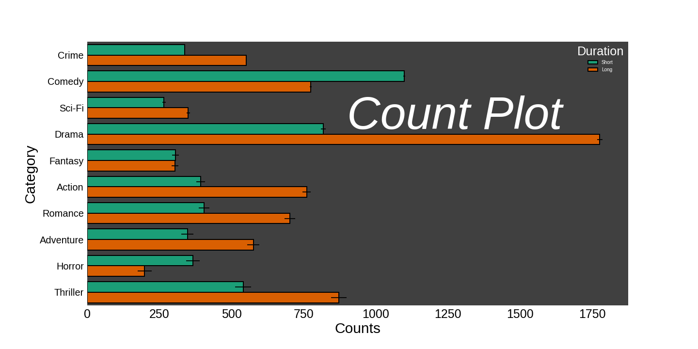

## Gallery (Under Construction)
A collection of data visualizations. Each final image below links to the markdown output of a Jupyter notebook with the corresponding code. Each section is designed to explore mainly the parameters that are specific to one type of plot to avoid repetition (e.g. adjusting labels or titles is the same for all), and at the last cell all of the extra modifications are made to make the final result look nice.

Table of Contents   
	- [Seaborn](#seaborn)  
	&nbsp;&nbsp;&nbsp;&nbsp; - [Colors](#colors)   
	&nbsp;&nbsp;&nbsp;&nbsp; - [Bar plot](#barplot)   
	&nbsp;&nbsp;&nbsp;&nbsp; - [Count plot](#countplot)   

## Seaborn

