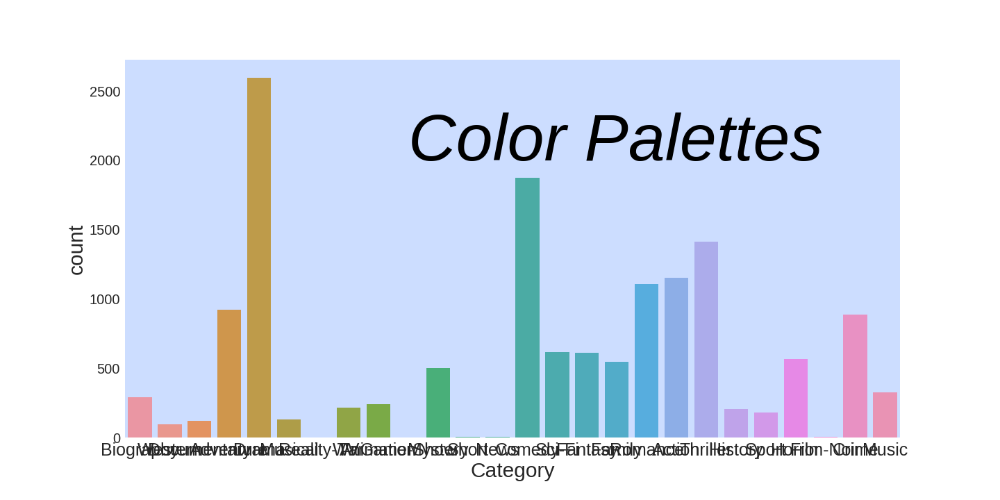

## Gallery
A collection of data visualizations. Each final image below links to a Jupyter notebook with the corresponding code.

Table of Contents   
	- [Colors](#colors)   
	- [Bar plot](#barplot)   
	- [Count plot](#countplot)   

