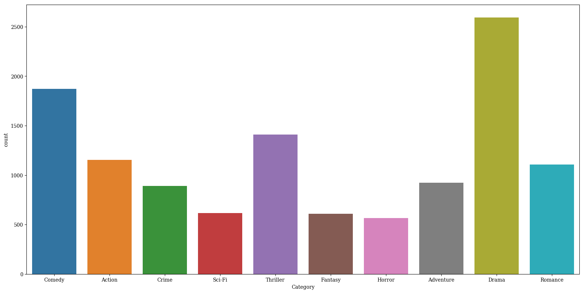
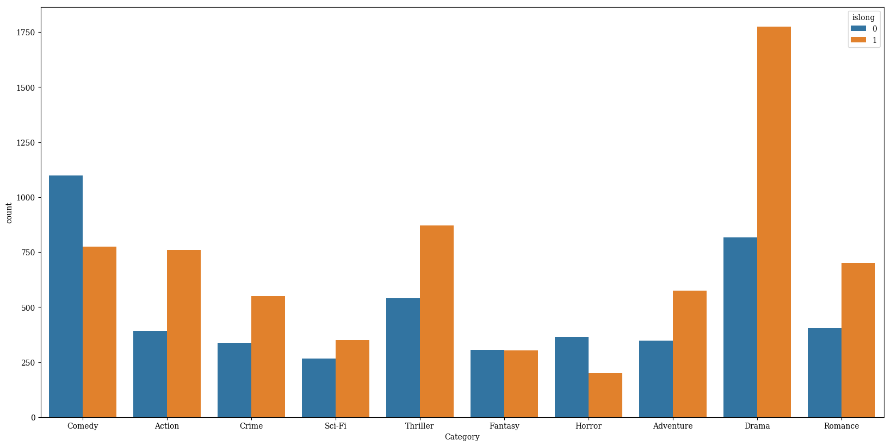
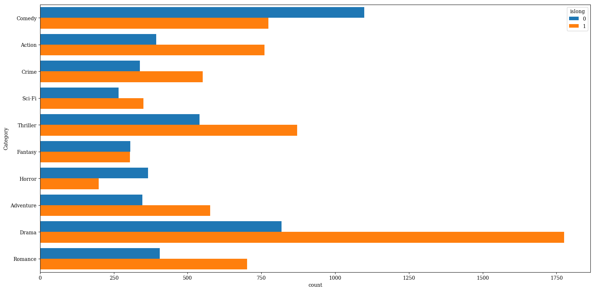
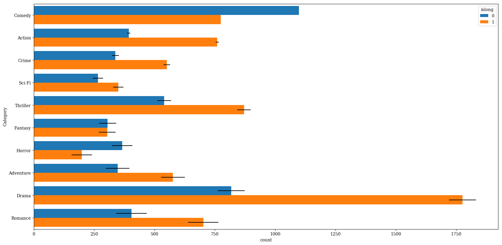
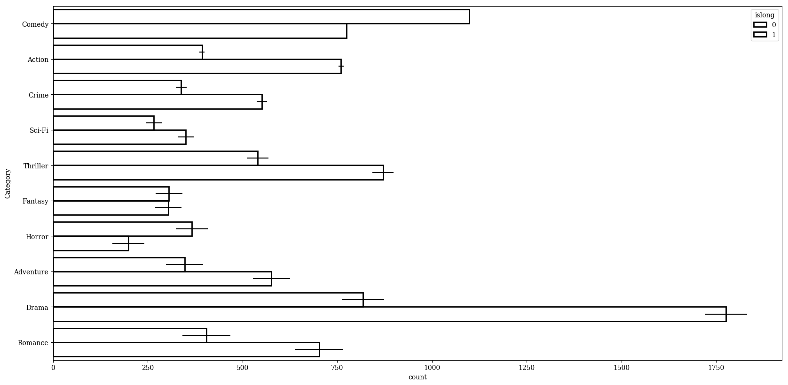
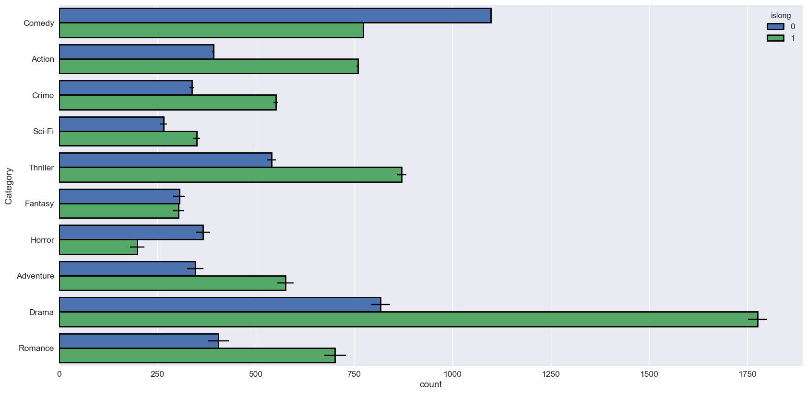
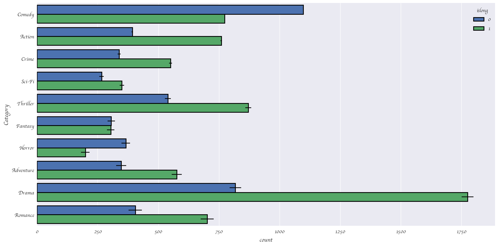
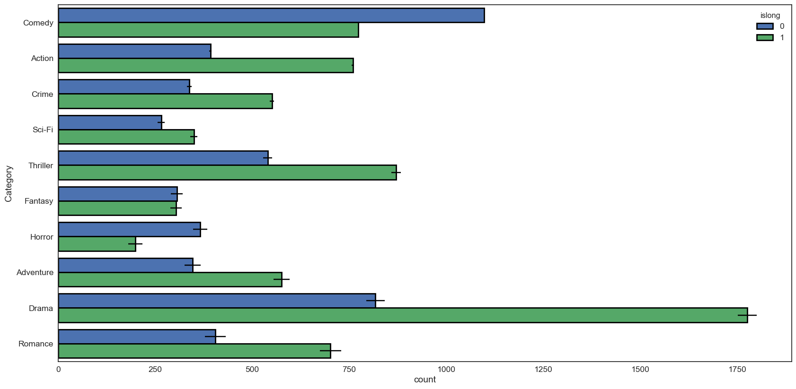
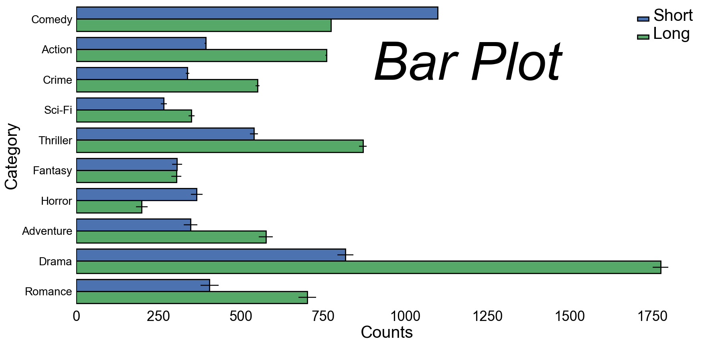

# seaborn.barplot
---
Bar graphs are useful for displaying relationships between categorical data and at least one numerical variable. `seaborn.countplot` is a barplot where the dependent variable is the number of instances of each instance of the independent variable.

dataset: [IMDB 5000 Movie Dataset](https://www.kaggle.com/deepmatrix/imdb-5000-movie-dataset)


```python
%matplotlib inline
import pandas as pd
import matplotlib.pyplot as plt
import seaborn as sns
import numpy as np
plt.rcParams['figure.figsize'] = (20.0, 10.0)
plt.rcParams['font.family'] = "serif"
```


```python
df = pd.read_csv('../../../datasets/movie_metadata.csv')
```


```python
df.head()
```


<div>
<style>
    .dataframe thead tr:only-child th {
        text-align: right;
    }

    .dataframe thead th {
        text-align: left;
    }

    .dataframe tbody tr th {
        vertical-align: top;
    }
</style>
<table border="1" class="dataframe">
  <thead>
    <tr style="text-align: right;">
      <th></th>
      <th>color</th>
      <th>director_name</th>
      <th>num_critic_for_reviews</th>
      <th>duration</th>
      <th>director_facebook_likes</th>
      <th>actor_3_facebook_likes</th>
      <th>actor_2_name</th>
      <th>actor_1_facebook_likes</th>
      <th>gross</th>
      <th>genres</th>
      <th>...</th>
      <th>num_user_for_reviews</th>
      <th>language</th>
      <th>country</th>
      <th>content_rating</th>
      <th>budget</th>
      <th>title_year</th>
      <th>actor_2_facebook_likes</th>
      <th>imdb_score</th>
      <th>aspect_ratio</th>
      <th>movie_facebook_likes</th>
    </tr>
  </thead>
  <tbody>
    <tr>
      <th>0</th>
      <td>Color</td>
      <td>James Cameron</td>
      <td>723.0</td>
      <td>178.0</td>
      <td>0.0</td>
      <td>855.0</td>
      <td>Joel David Moore</td>
      <td>1000.0</td>
      <td>760505847.0</td>
      <td>Action|Adventure|Fantasy|Sci-Fi</td>
      <td>...</td>
      <td>3054.0</td>
      <td>English</td>
      <td>USA</td>
      <td>PG-13</td>
      <td>237000000.0</td>
      <td>2009.0</td>
      <td>936.0</td>
      <td>7.9</td>
      <td>1.78</td>
      <td>33000</td>
    </tr>
    <tr>
      <th>1</th>
      <td>Color</td>
      <td>Gore Verbinski</td>
      <td>302.0</td>
      <td>169.0</td>
      <td>563.0</td>
      <td>1000.0</td>
      <td>Orlando Bloom</td>
      <td>40000.0</td>
      <td>309404152.0</td>
      <td>Action|Adventure|Fantasy</td>
      <td>...</td>
      <td>1238.0</td>
      <td>English</td>
      <td>USA</td>
      <td>PG-13</td>
      <td>300000000.0</td>
      <td>2007.0</td>
      <td>5000.0</td>
      <td>7.1</td>
      <td>2.35</td>
      <td>0</td>
    </tr>
    <tr>
      <th>2</th>
      <td>Color</td>
      <td>Sam Mendes</td>
      <td>602.0</td>
      <td>148.0</td>
      <td>0.0</td>
      <td>161.0</td>
      <td>Rory Kinnear</td>
      <td>11000.0</td>
      <td>200074175.0</td>
      <td>Action|Adventure|Thriller</td>
      <td>...</td>
      <td>994.0</td>
      <td>English</td>
      <td>UK</td>
      <td>PG-13</td>
      <td>245000000.0</td>
      <td>2015.0</td>
      <td>393.0</td>
      <td>6.8</td>
      <td>2.35</td>
      <td>85000</td>
    </tr>
    <tr>
      <th>3</th>
      <td>Color</td>
      <td>Christopher Nolan</td>
      <td>813.0</td>
      <td>164.0</td>
      <td>22000.0</td>
      <td>23000.0</td>
      <td>Christian Bale</td>
      <td>27000.0</td>
      <td>448130642.0</td>
      <td>Action|Thriller</td>
      <td>...</td>
      <td>2701.0</td>
      <td>English</td>
      <td>USA</td>
      <td>PG-13</td>
      <td>250000000.0</td>
      <td>2012.0</td>
      <td>23000.0</td>
      <td>8.5</td>
      <td>2.35</td>
      <td>164000</td>
    </tr>
    <tr>
      <th>4</th>
      <td>NaN</td>
      <td>Doug Walker</td>
      <td>NaN</td>
      <td>NaN</td>
      <td>131.0</td>
      <td>NaN</td>
      <td>Rob Walker</td>
      <td>131.0</td>
      <td>NaN</td>
      <td>Documentary</td>
      <td>...</td>
      <td>NaN</td>
      <td>NaN</td>
      <td>NaN</td>
      <td>NaN</td>
      <td>NaN</td>
      <td>NaN</td>
      <td>12.0</td>
      <td>7.1</td>
      <td>NaN</td>
      <td>0</td>
    </tr>
  </tbody>
</table>
<p>5 rows × 28 columns</p>
</div>


For the bar plot, let's look at the number of movies in each category, allowing each movie to be counted more than once.


```python
# split each movie's genre list, then form a set from the unwrapped list of all genres
categories = set([s for genre_list in df.genres.unique() for s in genre_list.split("|")])

# one-hot encode each movie's classification
for cat in categories:
    df[cat] = df.genres.transform(lambda s: int(cat in s))
# drop other columns
df = df[['director_name','genres','duration'] + list(categories)]
df.head()

```


<div>
<style>
    .dataframe thead tr:only-child th {
        text-align: right;
    }

    .dataframe thead th {
        text-align: left;
    }

    .dataframe tbody tr th {
        vertical-align: top;
    }
</style>
<table border="1" class="dataframe">
  <thead>
    <tr style="text-align: right;">
      <th></th>
      <th>director_name</th>
      <th>genres</th>
      <th>duration</th>
      <th>Reality-TV</th>
      <th>Family</th>
      <th>Biography</th>
      <th>Comedy</th>
      <th>Action</th>
      <th>Crime</th>
      <th>Sci-Fi</th>
      <th>...</th>
      <th>Mystery</th>
      <th>Film-Noir</th>
      <th>Sport</th>
      <th>Adventure</th>
      <th>Drama</th>
      <th>Romance</th>
      <th>Western</th>
      <th>War</th>
      <th>Animation</th>
      <th>News</th>
    </tr>
  </thead>
  <tbody>
    <tr>
      <th>0</th>
      <td>James Cameron</td>
      <td>Action|Adventure|Fantasy|Sci-Fi</td>
      <td>178.0</td>
      <td>0</td>
      <td>0</td>
      <td>0</td>
      <td>0</td>
      <td>1</td>
      <td>0</td>
      <td>1</td>
      <td>...</td>
      <td>0</td>
      <td>0</td>
      <td>0</td>
      <td>1</td>
      <td>0</td>
      <td>0</td>
      <td>0</td>
      <td>0</td>
      <td>0</td>
      <td>0</td>
    </tr>
    <tr>
      <th>1</th>
      <td>Gore Verbinski</td>
      <td>Action|Adventure|Fantasy</td>
      <td>169.0</td>
      <td>0</td>
      <td>0</td>
      <td>0</td>
      <td>0</td>
      <td>1</td>
      <td>0</td>
      <td>0</td>
      <td>...</td>
      <td>0</td>
      <td>0</td>
      <td>0</td>
      <td>1</td>
      <td>0</td>
      <td>0</td>
      <td>0</td>
      <td>0</td>
      <td>0</td>
      <td>0</td>
    </tr>
    <tr>
      <th>2</th>
      <td>Sam Mendes</td>
      <td>Action|Adventure|Thriller</td>
      <td>148.0</td>
      <td>0</td>
      <td>0</td>
      <td>0</td>
      <td>0</td>
      <td>1</td>
      <td>0</td>
      <td>0</td>
      <td>...</td>
      <td>0</td>
      <td>0</td>
      <td>0</td>
      <td>1</td>
      <td>0</td>
      <td>0</td>
      <td>0</td>
      <td>0</td>
      <td>0</td>
      <td>0</td>
    </tr>
    <tr>
      <th>3</th>
      <td>Christopher Nolan</td>
      <td>Action|Thriller</td>
      <td>164.0</td>
      <td>0</td>
      <td>0</td>
      <td>0</td>
      <td>0</td>
      <td>1</td>
      <td>0</td>
      <td>0</td>
      <td>...</td>
      <td>0</td>
      <td>0</td>
      <td>0</td>
      <td>0</td>
      <td>0</td>
      <td>0</td>
      <td>0</td>
      <td>0</td>
      <td>0</td>
      <td>0</td>
    </tr>
    <tr>
      <th>4</th>
      <td>Doug Walker</td>
      <td>Documentary</td>
      <td>NaN</td>
      <td>0</td>
      <td>0</td>
      <td>0</td>
      <td>0</td>
      <td>0</td>
      <td>0</td>
      <td>0</td>
      <td>...</td>
      <td>0</td>
      <td>0</td>
      <td>0</td>
      <td>0</td>
      <td>0</td>
      <td>0</td>
      <td>0</td>
      <td>0</td>
      <td>0</td>
      <td>0</td>
    </tr>
  </tbody>
</table>
<p>5 rows × 29 columns</p>
</div>


```python
# convert from wide to long format and remove null classificaitons
df = pd.melt(df,
             id_vars=['duration'],
             value_vars = list(categories),
             var_name = 'Category',
             value_name = 'Count')
df = df.loc[df.Count>0]
top_categories = df.groupby('Category').aggregate(sum).sort_values('Count', ascending=False).index
howmany=10
# add an indicator whether a movie is short or long, split at 100 minutes runtime
df['islong'] = df.duration.transform(lambda x: int(x > 100))
df = df.loc[df.Category.isin(top_categories[:howmany])]
# sort in descending order
#df = df.loc[df.groupby('Category').transform(sum).sort_values('Count', ascending=False).index]
```


```python
df.head()
```


<div>
<style>
    .dataframe thead tr:only-child th {
        text-align: right;
    }

    .dataframe thead th {
        text-align: left;
    }

    .dataframe tbody tr th {
        vertical-align: top;
    }
</style>
<table border="1" class="dataframe">
  <thead>
    <tr style="text-align: right;">
      <th></th>
      <th>duration</th>
      <th>Category</th>
      <th>Count</th>
      <th>islong</th>
    </tr>
  </thead>
  <tbody>
    <tr>
      <th>15136</th>
      <td>100.0</td>
      <td>Comedy</td>
      <td>1</td>
      <td>0</td>
    </tr>
    <tr>
      <th>15148</th>
      <td>106.0</td>
      <td>Comedy</td>
      <td>1</td>
      <td>1</td>
    </tr>
    <tr>
      <th>15164</th>
      <td>104.0</td>
      <td>Comedy</td>
      <td>1</td>
      <td>1</td>
    </tr>
    <tr>
      <th>15170</th>
      <td>106.0</td>
      <td>Comedy</td>
      <td>1</td>
      <td>1</td>
    </tr>
    <tr>
      <th>15172</th>
      <td>103.0</td>
      <td>Comedy</td>
      <td>1</td>
      <td>1</td>
    </tr>
  </tbody>
</table>
</div>


Basic plot


```python
p = sns.countplot(data=df, x = 'Category')
```





color by a category


```python
p = sns.countplot(data=df,
                  x = 'Category',
                  hue = 'islong')
```





make plot horizontal


```python
p = sns.countplot(data=df,
                  y = 'Category',
                  hue = 'islong')
```


Saturation


```python
p = sns.countplot(data=df,
                  y = 'Category',
                  hue = 'islong',
                  saturation=1)
```





Targeting a non-default axes


```python
import matplotlib.pyplot as plt
fig, ax = plt.subplots(2)
sns.countplot(data=df,
                  y = 'Category',
                  hue = 'islong',
                  saturation=1,
                  ax=ax[1])
```


    <matplotlib.axes._subplots.AxesSubplot at 0x111017278>


Add error bars


```python
import numpy as np
num_categories = df.Category.unique().size
p = sns.countplot(data=df,
                  y = 'Category',
                  hue = 'islong',
                  saturation=1,
                  xerr=7*np.arange(num_categories))
```





add black bounding lines


```python
import numpy as np
num_categories = df.Category.unique().size
p = sns.countplot(data=df,
                  y = 'Category',
                  hue = 'islong',
                  saturation=1,
                  xerr=7*np.arange(num_categories),
                  edgecolor=(0,0,0),
                  linewidth=2)
```


Remove color fill


```python
import numpy as np
num_categories = df.Category.unique().size
p = sns.countplot(data=df,
                  y = 'Category',
                  hue = 'islong',
                  saturation=1,
                  xerr=7*np.arange(num_categories),
                  edgecolor=(0,0,0),
                  linewidth=2,
                  fill=False)
```





```python
import numpy as np
num_categories = df.Category.unique().size
p = sns.countplot(data=df,
                  y = 'Category',
                  hue = 'islong',
                  saturation=1,
                  xerr=7*np.arange(num_categories),
                  edgecolor=(0,0,0),
                  linewidth=2)
```


```python
sns.set(font_scale=1.25)
num_categories = df.Category.unique().size
p = sns.countplot(data=df,
                  y = 'Category',
                  hue = 'islong',
                  saturation=1,
                  xerr=3*np.arange(num_categories),
                  edgecolor=(0,0,0),
                  linewidth=2)
```





```python
plt.rcParams['font.family'] = "cursive"
#sns.set(style="white",font_scale=1.25)
num_categories = df.Category.unique().size
p = sns.countplot(data=df,
                  y = 'Category',
                  hue = 'islong',
                  saturation=1,
                  xerr=3*np.arange(num_categories),
                  edgecolor=(0,0,0),
                  linewidth=2)
```





```python
plt.rcParams['font.family'] = 'Times New Roman'
#sns.set_style({'font.family': 'Helvetica'})
sns.set(style="white",font_scale=1.25)
num_categories = df.Category.unique().size
p = sns.countplot(data=df,
                  y = 'Category',
                  hue = 'islong',
                  saturation=1,
                  xerr=3*np.arange(num_categories),
                  edgecolor=(0,0,0),
                  linewidth=2)
```





```python
bg_color = 'white'
sns.set(rc={"font.style":"normal",
            "axes.facecolor":bg_color,
            "figure.facecolor":bg_color,
            "text.color":"black",
            "xtick.color":"black",
            "ytick.color":"black",
            "axes.labelcolor":"black",
            "axes.grid":False,
            'axes.labelsize':30,
            'figure.figsize':(20.0, 10.0),
            'xtick.labelsize':25,
            'font.size':20,
            'ytick.labelsize':20})


#sns.set_style({'font.family': 'Helvetica'})
#sns.set(style="white",font_scale=1.25)
num_categories = df.Category.unique().size
p = sns.countplot(data=df,
                  y = 'Category',
                  hue = 'islong',
                  saturation=1,
                  xerr=3*np.arange(num_categories),
                  edgecolor=(0,0,0),
                  linewidth=2)
leg = p.get_legend()
leg.set_title("")
labs = leg.texts
labs[0].set_text("Short")
labs[0].set_fontsize(25)
labs[0].set_size(30)
labs[1].set_text("Long")
leg.get_title().set_color('black')
p.axes.xaxis.label.set_text("Counts")
plt.text(900,2, "Bar Plot", fontsize = 95, color='Black', fontstyle='italic')
```


    <matplotlib.text.Text at 0x112bbc400>





```python
p.get_figure().savefig('../../figures/barplot.png')
```
