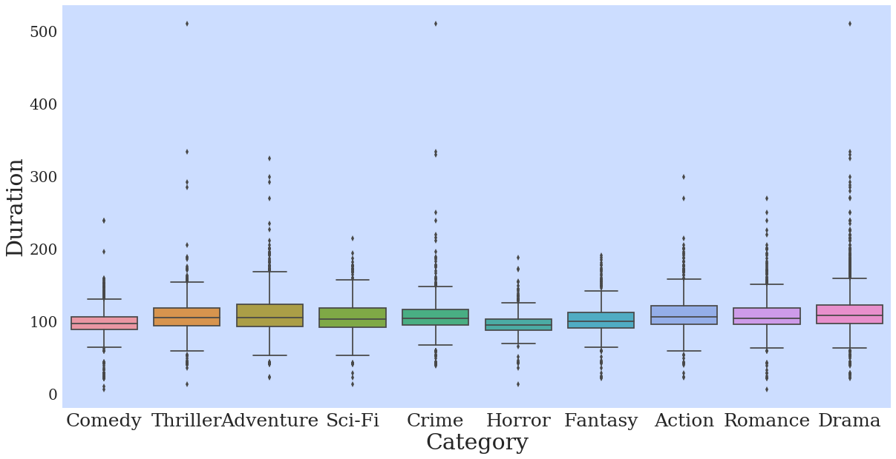
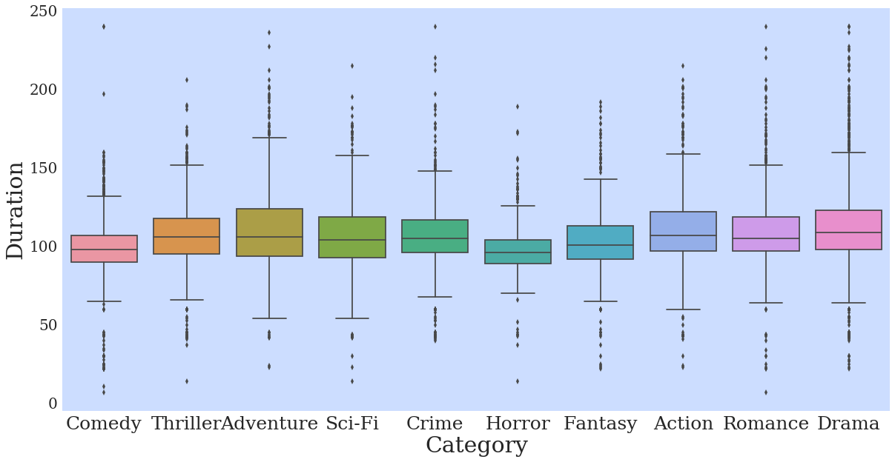
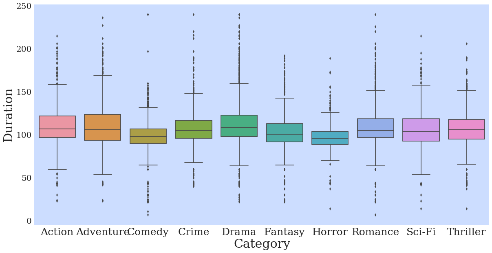
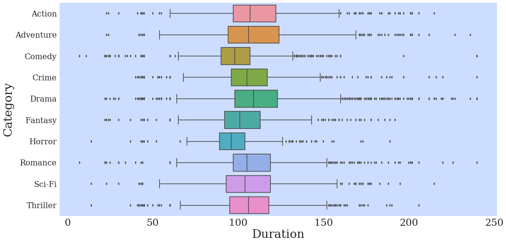
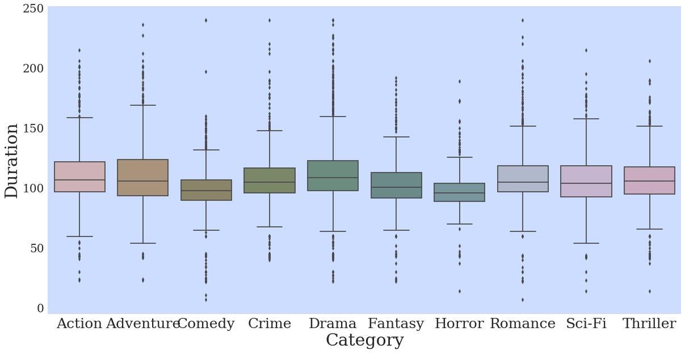
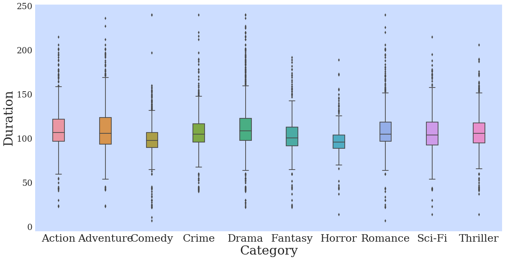
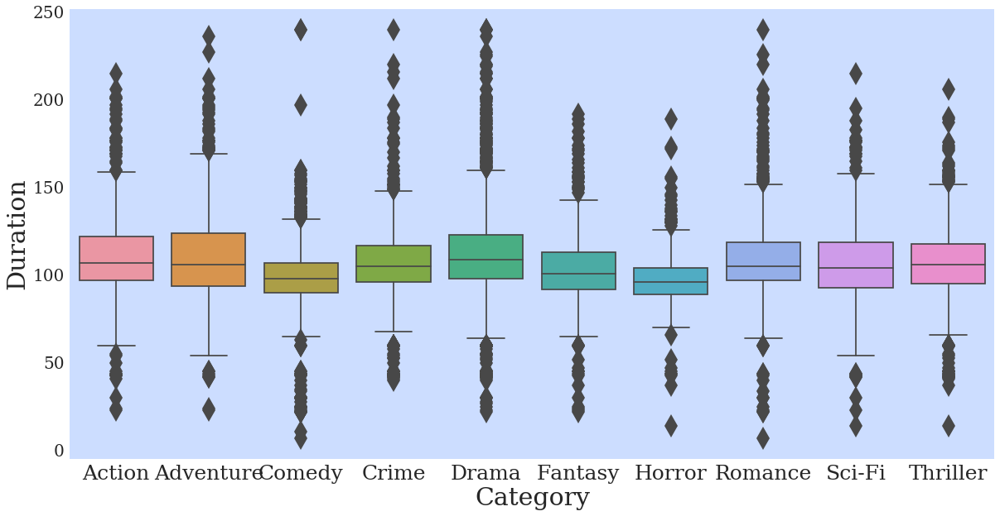
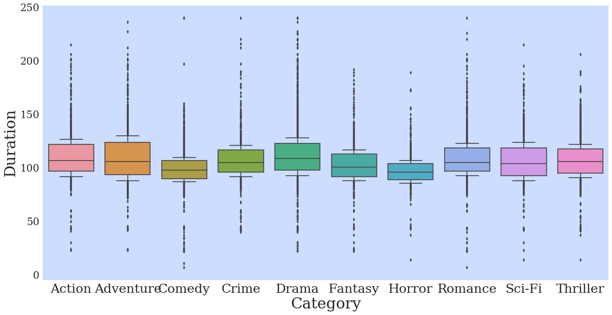
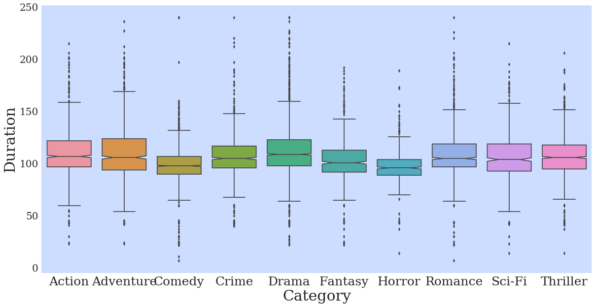
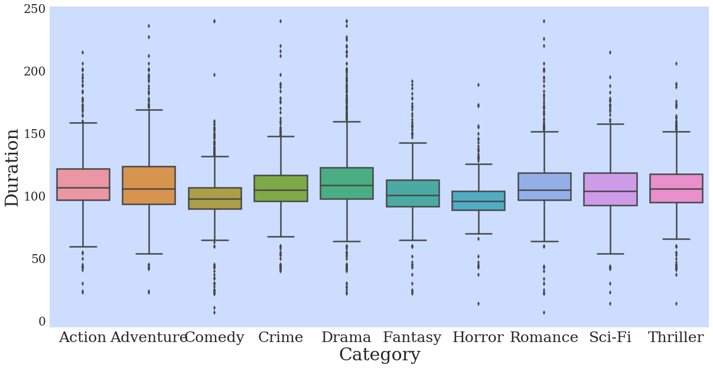

# seaborn.boxplot
---
Boxplots summarize numeric data over a set of categories. The data is divided into four groups called quartiles. A box is drawn connecting the innermost two quartiles, and a horizontal line is drawn at the position of the median (which always falls within the box). Usually, a second set of lines will be drawn some distance from the inner box denoting a "maximum" and "minimum" value for the data, and then values existing outside of these extrema are considered outliers and plotted as individual points. The location of these "whisker" lines is variable and generally some multiple of the innerquartile range (IQR), which is range of values covered by the inner box.

dataset: [IMDB 5000 Movie Dataset](https://www.kaggle.com/deepmatrix/imdb-5000-movie-dataset)


```python
%matplotlib inline
import pandas as pd
import matplotlib.pyplot as plt
import seaborn as sns
import numpy as np
plt.rcParams['figure.figsize'] = (20.0, 10.0)
plt.rcParams['font.family'] = "serif"
```


```python
df = pd.read_csv('../../datasets/movie_metadata.csv')
```


```python
df.head()
```


<div>
<style>
    .dataframe thead tr:only-child th {
        text-align: right;
    }

    .dataframe thead th {
        text-align: left;
    }

    .dataframe tbody tr th {
        vertical-align: top;
    }
</style>
<table border="1" class="dataframe">
  <thead>
    <tr style="text-align: right;">
      <th></th>
      <th>color</th>
      <th>director_name</th>
      <th>num_critic_for_reviews</th>
      <th>duration</th>
      <th>director_facebook_likes</th>
      <th>actor_3_facebook_likes</th>
      <th>actor_2_name</th>
      <th>actor_1_facebook_likes</th>
      <th>gross</th>
      <th>genres</th>
      <th>...</th>
      <th>num_user_for_reviews</th>
      <th>language</th>
      <th>country</th>
      <th>content_rating</th>
      <th>budget</th>
      <th>title_year</th>
      <th>actor_2_facebook_likes</th>
      <th>imdb_score</th>
      <th>aspect_ratio</th>
      <th>movie_facebook_likes</th>
    </tr>
  </thead>
  <tbody>
    <tr>
      <th>0</th>
      <td>Color</td>
      <td>James Cameron</td>
      <td>723.0</td>
      <td>178.0</td>
      <td>0.0</td>
      <td>855.0</td>
      <td>Joel David Moore</td>
      <td>1000.0</td>
      <td>760505847.0</td>
      <td>Action|Adventure|Fantasy|Sci-Fi</td>
      <td>...</td>
      <td>3054.0</td>
      <td>English</td>
      <td>USA</td>
      <td>PG-13</td>
      <td>237000000.0</td>
      <td>2009.0</td>
      <td>936.0</td>
      <td>7.9</td>
      <td>1.78</td>
      <td>33000</td>
    </tr>
    <tr>
      <th>1</th>
      <td>Color</td>
      <td>Gore Verbinski</td>
      <td>302.0</td>
      <td>169.0</td>
      <td>563.0</td>
      <td>1000.0</td>
      <td>Orlando Bloom</td>
      <td>40000.0</td>
      <td>309404152.0</td>
      <td>Action|Adventure|Fantasy</td>
      <td>...</td>
      <td>1238.0</td>
      <td>English</td>
      <td>USA</td>
      <td>PG-13</td>
      <td>300000000.0</td>
      <td>2007.0</td>
      <td>5000.0</td>
      <td>7.1</td>
      <td>2.35</td>
      <td>0</td>
    </tr>
    <tr>
      <th>2</th>
      <td>Color</td>
      <td>Sam Mendes</td>
      <td>602.0</td>
      <td>148.0</td>
      <td>0.0</td>
      <td>161.0</td>
      <td>Rory Kinnear</td>
      <td>11000.0</td>
      <td>200074175.0</td>
      <td>Action|Adventure|Thriller</td>
      <td>...</td>
      <td>994.0</td>
      <td>English</td>
      <td>UK</td>
      <td>PG-13</td>
      <td>245000000.0</td>
      <td>2015.0</td>
      <td>393.0</td>
      <td>6.8</td>
      <td>2.35</td>
      <td>85000</td>
    </tr>
    <tr>
      <th>3</th>
      <td>Color</td>
      <td>Christopher Nolan</td>
      <td>813.0</td>
      <td>164.0</td>
      <td>22000.0</td>
      <td>23000.0</td>
      <td>Christian Bale</td>
      <td>27000.0</td>
      <td>448130642.0</td>
      <td>Action|Thriller</td>
      <td>...</td>
      <td>2701.0</td>
      <td>English</td>
      <td>USA</td>
      <td>PG-13</td>
      <td>250000000.0</td>
      <td>2012.0</td>
      <td>23000.0</td>
      <td>8.5</td>
      <td>2.35</td>
      <td>164000</td>
    </tr>
    <tr>
      <th>4</th>
      <td>NaN</td>
      <td>Doug Walker</td>
      <td>NaN</td>
      <td>NaN</td>
      <td>131.0</td>
      <td>NaN</td>
      <td>Rob Walker</td>
      <td>131.0</td>
      <td>NaN</td>
      <td>Documentary</td>
      <td>...</td>
      <td>NaN</td>
      <td>NaN</td>
      <td>NaN</td>
      <td>NaN</td>
      <td>NaN</td>
      <td>NaN</td>
      <td>12.0</td>
      <td>7.1</td>
      <td>NaN</td>
      <td>0</td>
    </tr>
  </tbody>
</table>
<p>5 rows × 28 columns</p>
</div>


For the bar plot, let's look at the number of movies in each category, allowing each movie to be counted more than once.


```python
# split each movie's genre list, then form a set from the unwrapped list of all genres
categories = set([s for genre_list in df.genres.unique() for s in genre_list.split("|")])

# one-hot encode each movie's classification
for cat in categories:
    df[cat] = df.genres.transform(lambda s: int(cat in s))
# drop other columns
df = df[['director_name','genres','duration'] + list(categories)]
df.head()

```


<div>
<style>
    .dataframe thead tr:only-child th {
        text-align: right;
    }

    .dataframe thead th {
        text-align: left;
    }

    .dataframe tbody tr th {
        vertical-align: top;
    }
</style>
<table border="1" class="dataframe">
  <thead>
    <tr style="text-align: right;">
      <th></th>
      <th>director_name</th>
      <th>genres</th>
      <th>duration</th>
      <th>Comedy</th>
      <th>Sci-Fi</th>
      <th>Mystery</th>
      <th>Drama</th>
      <th>Sport</th>
      <th>Western</th>
      <th>Game-Show</th>
      <th>...</th>
      <th>Romance</th>
      <th>Documentary</th>
      <th>Short</th>
      <th>Reality-TV</th>
      <th>History</th>
      <th>Musical</th>
      <th>Film-Noir</th>
      <th>Biography</th>
      <th>War</th>
      <th>Action</th>
    </tr>
  </thead>
  <tbody>
    <tr>
      <th>0</th>
      <td>James Cameron</td>
      <td>Action|Adventure|Fantasy|Sci-Fi</td>
      <td>178.0</td>
      <td>0</td>
      <td>1</td>
      <td>0</td>
      <td>0</td>
      <td>0</td>
      <td>0</td>
      <td>0</td>
      <td>...</td>
      <td>0</td>
      <td>0</td>
      <td>0</td>
      <td>0</td>
      <td>0</td>
      <td>0</td>
      <td>0</td>
      <td>0</td>
      <td>0</td>
      <td>1</td>
    </tr>
    <tr>
      <th>1</th>
      <td>Gore Verbinski</td>
      <td>Action|Adventure|Fantasy</td>
      <td>169.0</td>
      <td>0</td>
      <td>0</td>
      <td>0</td>
      <td>0</td>
      <td>0</td>
      <td>0</td>
      <td>0</td>
      <td>...</td>
      <td>0</td>
      <td>0</td>
      <td>0</td>
      <td>0</td>
      <td>0</td>
      <td>0</td>
      <td>0</td>
      <td>0</td>
      <td>0</td>
      <td>1</td>
    </tr>
    <tr>
      <th>2</th>
      <td>Sam Mendes</td>
      <td>Action|Adventure|Thriller</td>
      <td>148.0</td>
      <td>0</td>
      <td>0</td>
      <td>0</td>
      <td>0</td>
      <td>0</td>
      <td>0</td>
      <td>0</td>
      <td>...</td>
      <td>0</td>
      <td>0</td>
      <td>0</td>
      <td>0</td>
      <td>0</td>
      <td>0</td>
      <td>0</td>
      <td>0</td>
      <td>0</td>
      <td>1</td>
    </tr>
    <tr>
      <th>3</th>
      <td>Christopher Nolan</td>
      <td>Action|Thriller</td>
      <td>164.0</td>
      <td>0</td>
      <td>0</td>
      <td>0</td>
      <td>0</td>
      <td>0</td>
      <td>0</td>
      <td>0</td>
      <td>...</td>
      <td>0</td>
      <td>0</td>
      <td>0</td>
      <td>0</td>
      <td>0</td>
      <td>0</td>
      <td>0</td>
      <td>0</td>
      <td>0</td>
      <td>1</td>
    </tr>
    <tr>
      <th>4</th>
      <td>Doug Walker</td>
      <td>Documentary</td>
      <td>NaN</td>
      <td>0</td>
      <td>0</td>
      <td>0</td>
      <td>0</td>
      <td>0</td>
      <td>0</td>
      <td>0</td>
      <td>...</td>
      <td>0</td>
      <td>1</td>
      <td>0</td>
      <td>0</td>
      <td>0</td>
      <td>0</td>
      <td>0</td>
      <td>0</td>
      <td>0</td>
      <td>0</td>
    </tr>
  </tbody>
</table>
<p>5 rows × 29 columns</p>
</div>


```python
# convert from wide to long format and remove null classificaitons
df = pd.melt(df,
             id_vars=['duration'],
             value_vars = list(categories),
             var_name = 'Category',
             value_name = 'Count')
df = df.loc[df.Count>0]
top_categories = df.groupby('Category').aggregate(sum).sort_values('Count', ascending=False).index
howmany=10
df = df.loc[df.Category.isin(top_categories[:howmany])]
df.rename(columns={"duration":"Duration"},inplace=True)

```


```python
df.head()
```


<div>
<style>
    .dataframe thead tr:only-child th {
        text-align: right;
    }

    .dataframe thead th {
        text-align: left;
    }

    .dataframe tbody tr th {
        vertical-align: top;
    }
</style>
<table border="1" class="dataframe">
  <thead>
    <tr style="text-align: right;">
      <th></th>
      <th>Duration</th>
      <th>Category</th>
      <th>Count</th>
    </tr>
  </thead>
  <tbody>
    <tr>
      <th>7</th>
      <td>100.0</td>
      <td>Comedy</td>
      <td>1</td>
    </tr>
    <tr>
      <th>19</th>
      <td>106.0</td>
      <td>Comedy</td>
      <td>1</td>
    </tr>
    <tr>
      <th>35</th>
      <td>104.0</td>
      <td>Comedy</td>
      <td>1</td>
    </tr>
    <tr>
      <th>41</th>
      <td>106.0</td>
      <td>Comedy</td>
      <td>1</td>
    </tr>
    <tr>
      <th>43</th>
      <td>103.0</td>
      <td>Comedy</td>
      <td>1</td>
    </tr>
  </tbody>
</table>
</div>


Basic plot


```python
p = sns.boxplot(data=df,
                x = 'Category',
                y = 'Duration')
```





The outliers here are making things a bit squished, so I'll remove them since I am just interested in demonstrating the visualization tool.


```python
df = df.loc[df.Duration < 250]
```


```python
p = sns.boxplot(data=df,
                x = 'Category',
                y = 'Duration')
```





Change the order of categories


```python
p = sns.boxplot(data=df,
                x = 'Category',
                y = 'Duration',
                order = sorted(df.Category.unique()))

```





Change the order that the colors are chosen


```python


```

Change orientation to horizontal


```python
p = sns.boxplot(data=df,
                y = 'Category',
                x = 'Duration',
                order = sorted(df.Category.unique()),
                orient="h")
```





Desaturate


```python
p = sns.boxplot(data=df,
                x = 'Category',
                y = 'Duration',
                order = sorted(df.Category.unique()),
                saturation=.25)
```





Adjust width of boxes


```python
p = sns.boxplot(data=df,
                x = 'Category',
                y = 'Duration',
                order = sorted(df.Category.unique()),
                width=.25)
```





Change the size of outlier markers


```python
p = sns.boxplot(data=df,
                x = 'Category',
                y = 'Duration',
                order = sorted(df.Category.unique()),
                fliersize=20)
```





Adjust the position of the whiskers as a fraction of IQR


```python
p = sns.boxplot(data=df,
                x = 'Category',
                y = 'Duration',
                order = sorted(df.Category.unique()),
                whis=.2)
```





Add a notch to the box indicating a confidence interval for the median


```python
p = sns.boxplot(data=df,
                x = 'Category',
                y = 'Duration',
                order = sorted(df.Category.unique()),
                notch=True)
```





```python
p = sns.boxplot(data=df,
                x = 'Category',
                y = 'Duration',
                order = sorted(df.Category.unique()),
                notch=False,
                linewidth=2.5)

```





Finalize


```python
sns.set(rc={"axes.facecolor":"#ccddff",
            "axes.grid":False,
            'axes.labelsize':30,
            'figure.figsize':(20.0, 10.0),
            'xtick.labelsize':25,
            'ytick.labelsize':20})


p = sns.boxplot(data=df,
                x = 'Category',
                y = 'Duration',
                palette = 'Paired',
                order = sorted(df.Category.unique()),
                notch=True)
plt.xticks(rotation=45)
l = plt.xlabel('')
plt.ylabel('Duration (min)')
plt.text(5.4,200, "Box Plot", fontsize = 95, color="black", fontstyle='italic')
```


    <matplotlib.text.Text at 0x7ff18f87b518>


```python
p.get_figure().savefig('../figures/boxplot.png')
```
