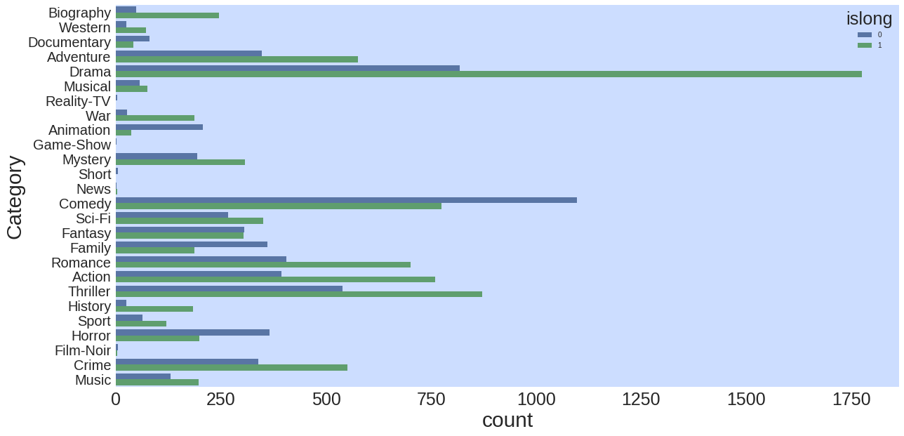
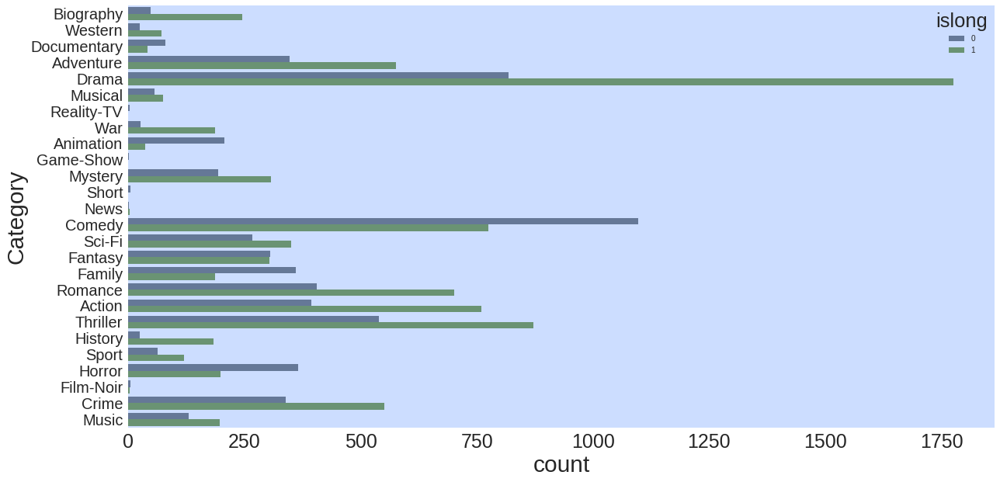
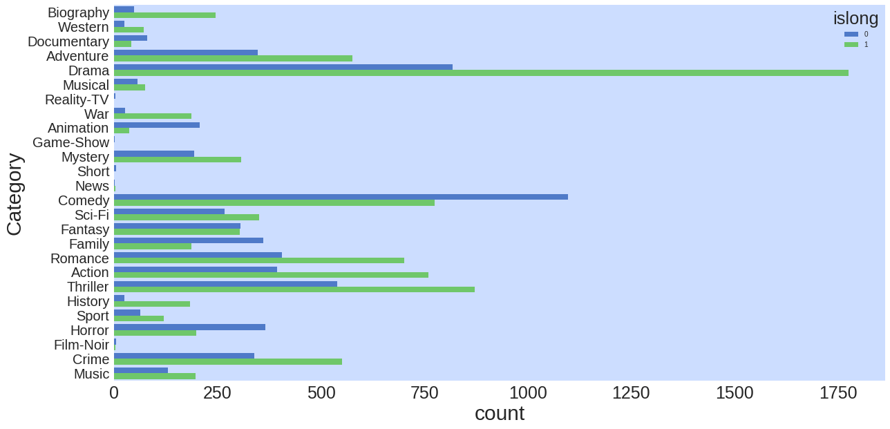
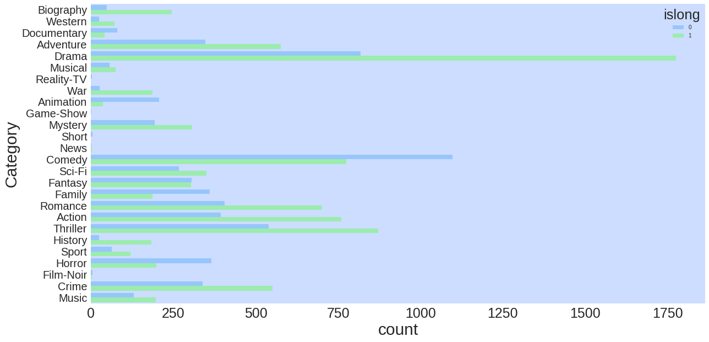
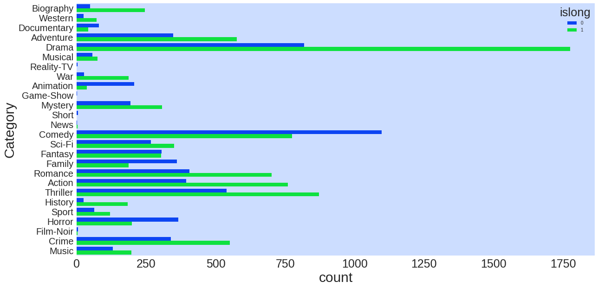
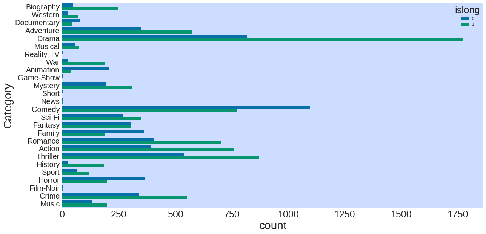
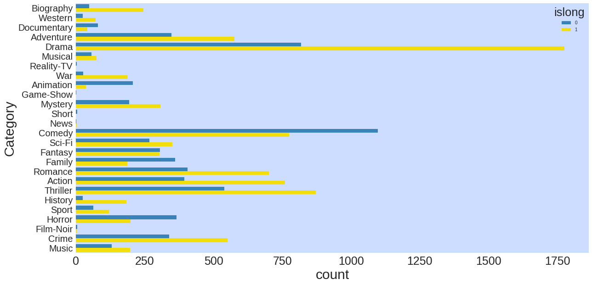
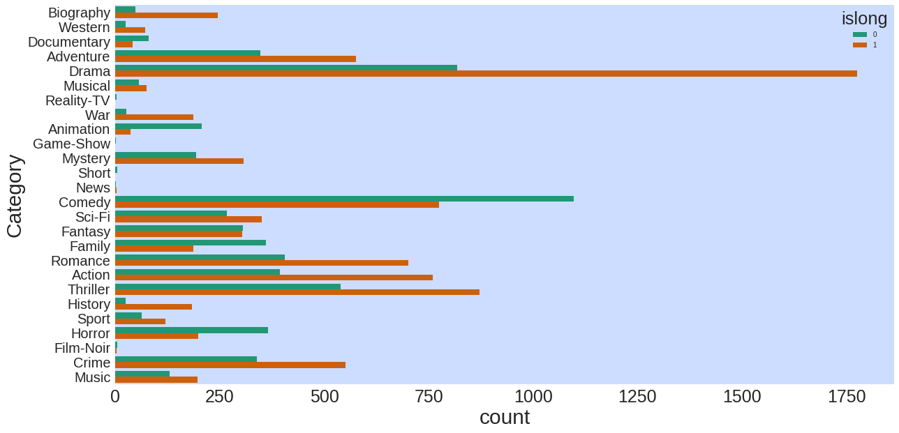

# seaborn.countplot
---
Bar graphs are useful for displaying relationships between categorical data and at least one numerical variable. `seaborn.countplot` is a barplot where the dependent variable is the number of instances of each instance of the independent variable.

dataset: [IMDB 5000 Movie Dataset](https://www.kaggle.com/deepmatrix/imdb-5000-movie-dataset)


```python
%matplotlib inline
import pandas as pd
import matplotlib.pyplot as plt
import seaborn as sns
plt.rcParams['figure.figsize'] = (20.0, 10.0)
```


```python
df = pd.read_csv('../../datasets/movie_metadata.csv')
```


```python
df.head()
```


<div>
<style>
    .dataframe thead tr:only-child th {
        text-align: right;
    }

    .dataframe thead th {
        text-align: left;
    }

    .dataframe tbody tr th {
        vertical-align: top;
    }
</style>
<table border="1" class="dataframe">
  <thead>
    <tr style="text-align: right;">
      <th></th>
      <th>color</th>
      <th>director_name</th>
      <th>num_critic_for_reviews</th>
      <th>duration</th>
      <th>director_facebook_likes</th>
      <th>actor_3_facebook_likes</th>
      <th>actor_2_name</th>
      <th>actor_1_facebook_likes</th>
      <th>gross</th>
      <th>genres</th>
      <th>...</th>
      <th>num_user_for_reviews</th>
      <th>language</th>
      <th>country</th>
      <th>content_rating</th>
      <th>budget</th>
      <th>title_year</th>
      <th>actor_2_facebook_likes</th>
      <th>imdb_score</th>
      <th>aspect_ratio</th>
      <th>movie_facebook_likes</th>
    </tr>
  </thead>
  <tbody>
    <tr>
      <th>0</th>
      <td>Color</td>
      <td>James Cameron</td>
      <td>723.0</td>
      <td>178.0</td>
      <td>0.0</td>
      <td>855.0</td>
      <td>Joel David Moore</td>
      <td>1000.0</td>
      <td>760505847.0</td>
      <td>Action|Adventure|Fantasy|Sci-Fi</td>
      <td>...</td>
      <td>3054.0</td>
      <td>English</td>
      <td>USA</td>
      <td>PG-13</td>
      <td>237000000.0</td>
      <td>2009.0</td>
      <td>936.0</td>
      <td>7.9</td>
      <td>1.78</td>
      <td>33000</td>
    </tr>
    <tr>
      <th>1</th>
      <td>Color</td>
      <td>Gore Verbinski</td>
      <td>302.0</td>
      <td>169.0</td>
      <td>563.0</td>
      <td>1000.0</td>
      <td>Orlando Bloom</td>
      <td>40000.0</td>
      <td>309404152.0</td>
      <td>Action|Adventure|Fantasy</td>
      <td>...</td>
      <td>1238.0</td>
      <td>English</td>
      <td>USA</td>
      <td>PG-13</td>
      <td>300000000.0</td>
      <td>2007.0</td>
      <td>5000.0</td>
      <td>7.1</td>
      <td>2.35</td>
      <td>0</td>
    </tr>
    <tr>
      <th>2</th>
      <td>Color</td>
      <td>Sam Mendes</td>
      <td>602.0</td>
      <td>148.0</td>
      <td>0.0</td>
      <td>161.0</td>
      <td>Rory Kinnear</td>
      <td>11000.0</td>
      <td>200074175.0</td>
      <td>Action|Adventure|Thriller</td>
      <td>...</td>
      <td>994.0</td>
      <td>English</td>
      <td>UK</td>
      <td>PG-13</td>
      <td>245000000.0</td>
      <td>2015.0</td>
      <td>393.0</td>
      <td>6.8</td>
      <td>2.35</td>
      <td>85000</td>
    </tr>
    <tr>
      <th>3</th>
      <td>Color</td>
      <td>Christopher Nolan</td>
      <td>813.0</td>
      <td>164.0</td>
      <td>22000.0</td>
      <td>23000.0</td>
      <td>Christian Bale</td>
      <td>27000.0</td>
      <td>448130642.0</td>
      <td>Action|Thriller</td>
      <td>...</td>
      <td>2701.0</td>
      <td>English</td>
      <td>USA</td>
      <td>PG-13</td>
      <td>250000000.0</td>
      <td>2012.0</td>
      <td>23000.0</td>
      <td>8.5</td>
      <td>2.35</td>
      <td>164000</td>
    </tr>
    <tr>
      <th>4</th>
      <td>NaN</td>
      <td>Doug Walker</td>
      <td>NaN</td>
      <td>NaN</td>
      <td>131.0</td>
      <td>NaN</td>
      <td>Rob Walker</td>
      <td>131.0</td>
      <td>NaN</td>
      <td>Documentary</td>
      <td>...</td>
      <td>NaN</td>
      <td>NaN</td>
      <td>NaN</td>
      <td>NaN</td>
      <td>NaN</td>
      <td>NaN</td>
      <td>12.0</td>
      <td>7.1</td>
      <td>NaN</td>
      <td>0</td>
    </tr>
  </tbody>
</table>
<p>5 rows × 28 columns</p>
</div>


For the bar plot, let's look at the number of movies in each category, allowing each movie to be counted more than once.


```python
# split each movie's genre list, then form a set from the unwrapped list of all genres
categories = set([s for genre_list in df.genres.unique() for s in genre_list.split("|")])

# one-hot encode each movie's classification
for cat in categories:
    df[cat] = df.genres.transform(lambda s: int(cat in s))
# drop other columns
df = df[['director_name','genres','duration'] + list(categories)]
df.head()

```


<div>
<style>
    .dataframe thead tr:only-child th {
        text-align: right;
    }

    .dataframe thead th {
        text-align: left;
    }

    .dataframe tbody tr th {
        vertical-align: top;
    }
</style>
<table border="1" class="dataframe">
  <thead>
    <tr style="text-align: right;">
      <th></th>
      <th>director_name</th>
      <th>genres</th>
      <th>duration</th>
      <th>Mystery</th>
      <th>Crime</th>
      <th>Biography</th>
      <th>Musical</th>
      <th>War</th>
      <th>Reality-TV</th>
      <th>Film-Noir</th>
      <th>...</th>
      <th>Short</th>
      <th>Music</th>
      <th>History</th>
      <th>Western</th>
      <th>Drama</th>
      <th>Romance</th>
      <th>Comedy</th>
      <th>Fantasy</th>
      <th>Animation</th>
      <th>Thriller</th>
    </tr>
  </thead>
  <tbody>
    <tr>
      <th>0</th>
      <td>James Cameron</td>
      <td>Action|Adventure|Fantasy|Sci-Fi</td>
      <td>178.0</td>
      <td>0</td>
      <td>0</td>
      <td>0</td>
      <td>0</td>
      <td>0</td>
      <td>0</td>
      <td>0</td>
      <td>...</td>
      <td>0</td>
      <td>0</td>
      <td>0</td>
      <td>0</td>
      <td>0</td>
      <td>0</td>
      <td>0</td>
      <td>1</td>
      <td>0</td>
      <td>0</td>
    </tr>
    <tr>
      <th>1</th>
      <td>Gore Verbinski</td>
      <td>Action|Adventure|Fantasy</td>
      <td>169.0</td>
      <td>0</td>
      <td>0</td>
      <td>0</td>
      <td>0</td>
      <td>0</td>
      <td>0</td>
      <td>0</td>
      <td>...</td>
      <td>0</td>
      <td>0</td>
      <td>0</td>
      <td>0</td>
      <td>0</td>
      <td>0</td>
      <td>0</td>
      <td>1</td>
      <td>0</td>
      <td>0</td>
    </tr>
    <tr>
      <th>2</th>
      <td>Sam Mendes</td>
      <td>Action|Adventure|Thriller</td>
      <td>148.0</td>
      <td>0</td>
      <td>0</td>
      <td>0</td>
      <td>0</td>
      <td>0</td>
      <td>0</td>
      <td>0</td>
      <td>...</td>
      <td>0</td>
      <td>0</td>
      <td>0</td>
      <td>0</td>
      <td>0</td>
      <td>0</td>
      <td>0</td>
      <td>0</td>
      <td>0</td>
      <td>1</td>
    </tr>
    <tr>
      <th>3</th>
      <td>Christopher Nolan</td>
      <td>Action|Thriller</td>
      <td>164.0</td>
      <td>0</td>
      <td>0</td>
      <td>0</td>
      <td>0</td>
      <td>0</td>
      <td>0</td>
      <td>0</td>
      <td>...</td>
      <td>0</td>
      <td>0</td>
      <td>0</td>
      <td>0</td>
      <td>0</td>
      <td>0</td>
      <td>0</td>
      <td>0</td>
      <td>0</td>
      <td>1</td>
    </tr>
    <tr>
      <th>4</th>
      <td>Doug Walker</td>
      <td>Documentary</td>
      <td>NaN</td>
      <td>0</td>
      <td>0</td>
      <td>0</td>
      <td>0</td>
      <td>0</td>
      <td>0</td>
      <td>0</td>
      <td>...</td>
      <td>0</td>
      <td>0</td>
      <td>0</td>
      <td>0</td>
      <td>0</td>
      <td>0</td>
      <td>0</td>
      <td>0</td>
      <td>0</td>
      <td>0</td>
    </tr>
  </tbody>
</table>
<p>5 rows × 29 columns</p>
</div>


```python
# convert from wide to long format and remove null classificaitons
df = pd.melt(df,
             id_vars=['duration'],
             value_vars = list(categories),
             var_name = 'Category',
             value_name = 'Count')
df = df.loc[df.Count>0]

# add an indicator whether a movie is short or long, split at 100 minutes runtime
df['islong'] = df.duration.transform(lambda x: int(x > 100))

# sort in descending order
#df = df.loc[df.groupby('Category').transform(sum).sort_values('Count', ascending=False).index]
```


```python
df.head()
```


<div>
<style>
    .dataframe thead tr:only-child th {
        text-align: right;
    }

    .dataframe thead th {
        text-align: left;
    }

    .dataframe tbody tr th {
        vertical-align: top;
    }
</style>
<table border="1" class="dataframe">
  <thead>
    <tr style="text-align: right;">
      <th></th>
      <th>duration</th>
      <th>Category</th>
      <th>Count</th>
      <th>islong</th>
    </tr>
  </thead>
  <tbody>
    <tr>
      <th>9</th>
      <td>153.0</td>
      <td>Mystery</td>
      <td>1</td>
      <td>1</td>
    </tr>
    <tr>
      <th>70</th>
      <td>126.0</td>
      <td>Mystery</td>
      <td>1</td>
      <td>1</td>
    </tr>
    <tr>
      <th>88</th>
      <td>130.0</td>
      <td>Mystery</td>
      <td>1</td>
      <td>1</td>
    </tr>
    <tr>
      <th>114</th>
      <td>138.0</td>
      <td>Mystery</td>
      <td>1</td>
      <td>1</td>
    </tr>
    <tr>
      <th>115</th>
      <td>157.0</td>
      <td>Mystery</td>
      <td>1</td>
      <td>1</td>
    </tr>
  </tbody>
</table>
</div>


Basic plot


```python
p = sns.countplot(data=df, x = 'Category')
```


color by a category


```python
p = sns.countplot(data=df,
                  x = 'Category',
                  hue = 'islong')
```


make plot horizontal


```python
p = sns.countplot(data=df,
                  y = 'Category',
                  hue = 'islong')
```





Saturation


```python
p = sns.countplot(data=df,
                  y = 'Category',
                  hue = 'islong',
                  saturation=.5)
```





Various palettes


```python
p = sns.countplot(data=df,
                  y = 'Category',
                  hue = 'islong',
                  saturation=.9,
                  palette = 'deep')
```


```python
p = sns.countplot(data=df,
                  y = 'Category',
                  hue = 'islong',
                  saturation=.9,
                  palette = 'muted')
```





```python
p = sns.countplot(data=df,
                  y = 'Category',
                  hue = 'islong',
                  saturation=.9,
                  palette = 'pastel')
```





```python
p = sns.countplot(data=df,
                  y = 'Category',
                  hue = 'islong',
                  saturation=.9,
                  palette = 'bright')
```





```python
p = sns.countplot(data=df,
                  y = 'Category',
                  hue = 'islong',
                  saturation=.9,
                  palette = 'dark')
```


```python
p = sns.countplot(data=df,
                  y = 'Category',
                  hue = 'islong',
                  saturation=.9,
                  palette = 'colorblind')
```





```python
p = sns.countplot(data=df,
                  y = 'Category',
                  hue = 'islong',
                  saturation=.9,
                  palette = ((50/255, 132/255.0, 191/255.0), (255/255.0, 232/255.0, 0/255.0)))
```





```python
p = sns.countplot(data=df,
                  y = 'Category',
                  hue = 'islong',
                  saturation=.9,
                  palette = 'Dark2')
```





```python
help(sns.color_palette)
```

    Help on function color_palette in module seaborn.palettes:
    
    color_palette(palette=None, n_colors=None, desat=None)
        Return a list of colors defining a color palette.
        
        Availible seaborn palette names:
            deep, muted, bright, pastel, dark, colorblind
        
        Other options:
            hls, husl, any named matplotlib palette, list of colors
        
        Calling this function with ``palette=None`` will return the current
        matplotlib color cycle.
        
        Matplotlib paletes can be specified as reversed palettes by appending
        "_r" to the name or as dark palettes by appending "_d" to the name.
        (These options are mutually exclusive, but the resulting list of colors
        can also be reversed).
        
        This function can also be used in a ``with`` statement to temporarily
        set the color cycle for a plot or set of plots.
        
        Parameters
        ----------
        palette: None, string, or sequence, optional
            Name of palette or None to return current palette. If a sequence, input
            colors are used but possibly cycled and desaturated.
        n_colors : int, optional
            Number of colors in the palette. If ``None``, the default will depend
            on how ``palette`` is specified. Named palettes default to 6 colors,
            but grabbing the current palette or passing in a list of colors will
            not change the number of colors unless this is specified. Asking for
            more colors than exist in the palette will cause it to cycle.
        desat : float, optional
            Proportion to desaturate each color by.
        
        Returns
        -------
        palette : list of RGB tuples.
            Color palette. Behaves like a list, but can be used as a context
            manager and possesses an ``as_hex`` method to convert to hex color
            codes.
        
        See Also
        --------
        set_palette : Set the default color cycle for all plots.
        set_color_codes : Reassign color codes like ``"b"``, ``"g"``, etc. to
                          colors from one of the seaborn palettes.
        
        Examples
        --------
        
        Show one of the "seaborn palettes", which have the same basic order of hues
        as the default matplotlib color cycle but more attractive colors.
        
        .. plot::
            :context: close-figs
        
            >>> import seaborn as sns; sns.set()
            >>> sns.palplot(sns.color_palette("muted"))
        
        Use discrete values from one of the built-in matplotlib colormaps.
        
        .. plot::
            :context: close-figs
        
            >>> sns.palplot(sns.color_palette("RdBu", n_colors=7))
        
        Make a "dark" matplotlib sequential palette variant. (This can be good
        when coloring multiple lines or points that correspond to an ordered
        variable, where you don't want the lightest lines to be invisible).
        
        .. plot::
            :context: close-figs
        
            >>> sns.palplot(sns.color_palette("Blues_d"))
        
        Use a categorical matplotlib palette, add some desaturation. (This can be
        good when making plots with large patches, which look best with dimmer
        colors).
        
        .. plot::
            :context: close-figs
        
            >>> sns.palplot(sns.color_palette("Set1", n_colors=8, desat=.5))
        
        Use as a context manager:
        
        .. plot::
            :context: close-figs
        
            >>> import numpy as np, matplotlib.pyplot as plt
            >>> with sns.color_palette("husl", 8):
            ...    _ = plt.plot(np.c_[np.zeros(8), np.arange(8)].T)
    


```python

```


```python

```


```python
help(sns.countplot)
```

    Help on function countplot in module seaborn.categorical:
    
    countplot(x=None, y=None, hue=None, data=None, order=None, hue_order=None, orient=None, color=None, palette=None, saturation=0.75, ax=None, **kwargs)
        Show the counts of observations in each categorical bin using bars.
        
        A count plot can be thought of as a histogram across a categorical, instead
        of quantitative, variable. The basic API and options are identical to those
        for :func:`barplot`, so you can compare counts across nested variables.
        
        Input data can be passed in a variety of formats, including:
        
        - Vectors of data represented as lists, numpy arrays, or pandas Series
          objects passed directly to the ``x``, ``y``, and/or ``hue`` parameters.
        - A "long-form" DataFrame, in which case the ``x``, ``y``, and ``hue``
          variables will determine how the data are plotted.
        - A "wide-form" DataFrame, such that each numeric column will be plotted.
        - Anything accepted by ``plt.boxplot`` (e.g. a 2d array or list of vectors)
        
        In most cases, it is possible to use numpy or Python objects, but pandas
        objects are preferable because the associated names will be used to
        annotate the axes. Additionally, you can use Categorical types for the
        grouping variables to control the order of plot elements.    
        
        Parameters
        ----------
        x, y, hue : names of variables in ``data`` or vector data, optional
            Inputs for plotting long-form data. See examples for interpretation.        
        data : DataFrame, array, or list of arrays, optional
            Dataset for plotting. If ``x`` and ``y`` are absent, this is
            interpreted as wide-form. Otherwise it is expected to be long-form.    
        order, hue_order : lists of strings, optional
            Order to plot the categorical levels in, otherwise the levels are
            inferred from the data objects.        
        orient : "v" | "h", optional
            Orientation of the plot (vertical or horizontal). This is usually
            inferred from the dtype of the input variables, but can be used to
            specify when the "categorical" variable is a numeric or when plotting
            wide-form data.    
        color : matplotlib color, optional
            Color for all of the elements, or seed for :func:`light_palette` when
            using hue nesting.    
        palette : seaborn color palette or dict, optional
            Colors to use for the different levels of the ``hue`` variable. Should
            be something that can be interpreted by :func:`color_palette`, or a
            dictionary mapping hue levels to matplotlib colors.    
        saturation : float, optional
            Proportion of the original saturation to draw colors at. Large patches
            often look better with slightly desaturated colors, but set this to
            ``1`` if you want the plot colors to perfectly match the input color
            spec.    
        ax : matplotlib Axes, optional
            Axes object to draw the plot onto, otherwise uses the current Axes.    
        kwargs : key, value mappings
            Other keyword arguments are passed to ``plt.bar``.
        
        Returns
        -------
        ax : matplotlib Axes
            Returns the Axes object with the boxplot drawn onto it.    
        
        See Also
        --------
        barplot : Show point estimates and confidence intervals using bars.    
        factorplot : Combine categorical plots and a class:`FacetGrid`.    
        
        Examples
        --------
        
        Show value counts for a single categorical variable:
        
        .. plot::
            :context: close-figs
        
            >>> import seaborn as sns
            >>> sns.set(style="darkgrid")
            >>> titanic = sns.load_dataset("titanic")
            >>> ax = sns.countplot(x="class", data=titanic)
        
        Show value counts for two categorical variables:
        
        .. plot::
            :context: close-figs
        
            >>> ax = sns.countplot(x="class", hue="who", data=titanic)
        
        Plot the bars horizontally:
        
        .. plot::
            :context: close-figs
        
            >>> ax = sns.countplot(y="class", hue="who", data=titanic)
        
        Use a different color palette:
        
        .. plot::
            :context: close-figs
        
            >>> ax = sns.countplot(x="who", data=titanic, palette="Set3")
        
        Use ``plt.bar`` keyword arguments for a different look:
        
        .. plot::
            :context: close-figs
        
            >>> ax = sns.countplot(x="who", data=titanic,
            ...                    facecolor=(0, 0, 0, 0),
            ...                    linewidth=5,
            ...                    edgecolor=sns.color_palette("dark", 3))
    


```python
p = sns.countplot(data=df, x = 'Category')
```


```python
p.get_figure().savefig('../figures/colors.png')
```


```python

```


```python

```
