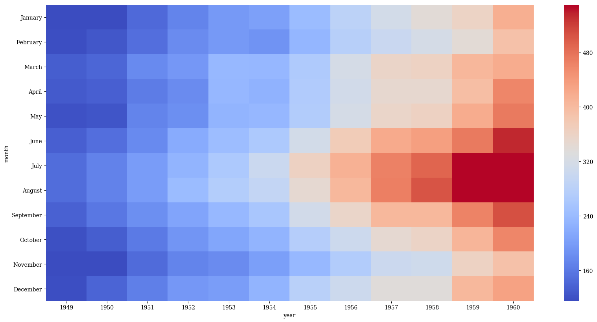

# seaborn.heatmap
---
Heat maps display numeric tabular data where the cells are colored depending upon the contained value. Heat maps are great for making trends in this kind of data more readily apparent, particularly when the data is ordered and there is clustering.

dataset: [Seaborn - flights](https://github.com/mwaskom/seaborn-data/blob/master/flights.csv)


```python
%matplotlib inline
import pandas as pd
import matplotlib.pyplot as plt
import seaborn as sns
import numpy as np
plt.rcParams['figure.figsize'] = (20.0, 10.0)
plt.rcParams['font.family'] = "serif"


```


```python
df = pd.pivot_table(data=sns.load_dataset("flights"),
                    index='month',
                    values='passengers',
                    columns='year')
df.head()
```


<div>
<style>
    .dataframe thead tr:only-child th {
        text-align: right;
    }

    .dataframe thead th {
        text-align: left;
    }

    .dataframe tbody tr th {
        vertical-align: top;
    }
</style>
<table border="1" class="dataframe">
  <thead>
    <tr style="text-align: right;">
      <th>year</th>
      <th>1949</th>
      <th>1950</th>
      <th>1951</th>
      <th>1952</th>
      <th>1953</th>
      <th>1954</th>
      <th>1955</th>
      <th>1956</th>
      <th>1957</th>
      <th>1958</th>
      <th>1959</th>
      <th>1960</th>
    </tr>
    <tr>
      <th>month</th>
      <th></th>
      <th></th>
      <th></th>
      <th></th>
      <th></th>
      <th></th>
      <th></th>
      <th></th>
      <th></th>
      <th></th>
      <th></th>
      <th></th>
    </tr>
  </thead>
  <tbody>
    <tr>
      <th>January</th>
      <td>112</td>
      <td>115</td>
      <td>145</td>
      <td>171</td>
      <td>196</td>
      <td>204</td>
      <td>242</td>
      <td>284</td>
      <td>315</td>
      <td>340</td>
      <td>360</td>
      <td>417</td>
    </tr>
    <tr>
      <th>February</th>
      <td>118</td>
      <td>126</td>
      <td>150</td>
      <td>180</td>
      <td>196</td>
      <td>188</td>
      <td>233</td>
      <td>277</td>
      <td>301</td>
      <td>318</td>
      <td>342</td>
      <td>391</td>
    </tr>
    <tr>
      <th>March</th>
      <td>132</td>
      <td>141</td>
      <td>178</td>
      <td>193</td>
      <td>236</td>
      <td>235</td>
      <td>267</td>
      <td>317</td>
      <td>356</td>
      <td>362</td>
      <td>406</td>
      <td>419</td>
    </tr>
    <tr>
      <th>April</th>
      <td>129</td>
      <td>135</td>
      <td>163</td>
      <td>181</td>
      <td>235</td>
      <td>227</td>
      <td>269</td>
      <td>313</td>
      <td>348</td>
      <td>348</td>
      <td>396</td>
      <td>461</td>
    </tr>
    <tr>
      <th>May</th>
      <td>121</td>
      <td>125</td>
      <td>172</td>
      <td>183</td>
      <td>229</td>
      <td>234</td>
      <td>270</td>
      <td>318</td>
      <td>355</td>
      <td>363</td>
      <td>420</td>
      <td>472</td>
    </tr>
  </tbody>
</table>
</div>


Default plot


```python
sns.heatmap(df)
```


    <matplotlib.axes._subplots.AxesSubplot at 0x10c53b7b8>


`cmap` adjusts the colormap used. I like diverging colormaps for heatmaps because they provide good contrast.


```python
sns.heatmap(df, cmap='coolwarm')
```


    <matplotlib.axes._subplots.AxesSubplot at 0x10c65d710>


`center` can be used to indicate at which numeric value to use the center of the colormap. Above we see most of the map using blues, so by setting the value of `center` equal to the midpoint of the data then we can create a map where there are more equal amounts of red and blue shades.


```python
midpoint = (df.values.max() - df.values.min()) / 2
sns.heatmap(df, cmap='coolwarm', center=midpoint)
```


    <matplotlib.axes._subplots.AxesSubplot at 0x10d448860>


Adjust the lower and upper contrast bounds with `vmin` and `vmax`. Everything below `vmin` will be the same color. Likewise for above `vmax`.


```python
midpoint = (df.values.max() - df.values.min()) / 2
sns.heatmap(df, cmap='coolwarm', center=midpoint, vmin=150, vmax=400)
```


    <matplotlib.axes._subplots.AxesSubplot at 0x10da59a90>


Alternatively, you can set `vmin` and `vmax` to lie outside of the range of the data for a more muted, washed-out look

```python
midpoint = (df.values.max() - df.values.min()) / 2
sns.heatmap(df, cmap='coolwarm', center=midpoint, vmin=-100, vmax=800)
```


    <matplotlib.axes._subplots.AxesSubplot at 0x10e038470>


`robust` sets contrast levels based on quantiles and works like an "auto-contrast" for choosing good values


```python
p = sns.heatmap(df, cmap='coolwarm', robust=True)
```





Label the rectangles with `annot=True`, which also chooses a suitable text color


```python
p = sns.heatmap(df, cmap='coolwarm', annot=True)
```


The format of the annotation can be changed with `fmt`  -- here I'll change from the default scientific notation to one decimal precision


```python
p = sns.heatmap(df, cmap='coolwarm', annot=True, fmt=".1f")
```


Any other parameters for the text, such as the font size, can be passed with `annot_kws`. 


```python
p = sns.heatmap(df, cmap='coolwarm', annot=True, fmt=".1f",annot_kws={'size':16})
```


`cbar` can be used to turn off the colorbar


```python
p = sns.heatmap(df,
                cmap='coolwarm',
                annot=True,
                fmt=".1f",
                annot_kws={'size':16},
                cbar=False)
```


`square` forces the aspect ratio of the blocks to be equal


```python
p = sns.heatmap(df,
                cmap='coolwarm',
                annot=True,
                fmt=".1f",
                annot_kws={'size':10},
                cbar=False,
                square=True)
```


`xticklabels` and `yticklabels` are booleans to turn off the axis labels


```python
p = sns.heatmap(df,
                cmap='coolwarm',
                annot=True,
                fmt=".1f",
                annot_kws={'size':10},
                cbar=False,
                square=True,
                xticklabels=False,
                yticklabels=False)
```


If you would like to hide certain values, pass in a binary `mask`


```python
mask = np.zeros(df.shape)
mask[1::2,1::2] = 1
p = sns.heatmap(df,
                cmap='coolwarm',
                annot=True,
                fmt=".1f",
                annot_kws={'size':10},
                cbar=False,
                square=True,
                xticklabels=False,
                yticklabels=False,
                mask=mask)
```


Finalize


```python
plt.rcParams['font.size'] = 20
bg_color = (0.88,0.85,0.95)
plt.rcParams['figure.facecolor'] = bg_color
plt.rcParams['axes.facecolor'] = bg_color
fig, ax = plt.subplots(1)
p = sns.heatmap(df,
                cmap='coolwarm',
                annot=True,
                fmt=".1f",
                annot_kws={'size':16},
                ax=ax)
plt.xlabel('Month')
plt.ylabel('Year')
ax.set_ylim((0,15))
plt.text(5,12.3, "Heat Map", fontsize = 95, color='Black', fontstyle='italic')
```


    <matplotlib.text.Text at 0x10ec6acf8>


```python
p.get_figure().savefig('../../figures/heatmap.png')
```
