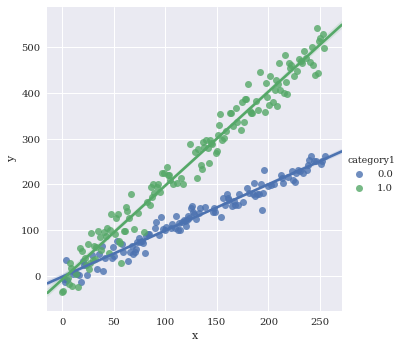
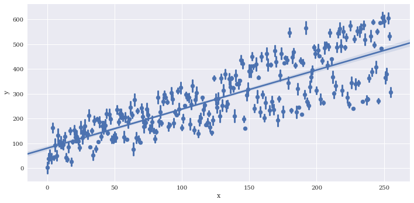

# seaborn.lmplot
---

Seaborn's `lmplot` is a 2D scatterplot with an optional overlaid regression line. This is useful for comparing numeric variables. Logistic regression for binary classification is also supported with `lmplot`.


```python
%matplotlib inline
import pandas as pd
import matplotlib.pyplot as plt
import seaborn as sns
import numpy as np
plt.rcParams['figure.figsize'] = (20.0, 10.0)
plt.rcParams['font.family'] = "serif"
np.random.seed(sum(map(ord,'lmplot')))
```


```python
# Generate some random data for 2 imaginary classes of points
n = 256
sigma = 15
x = range(n)
y = range(n) + sigma*np.random.randn(n)
category1 = np.round(np.random.rand(n))
category2 = np.round(np.random.rand(n))
df = pd.DataFrame({'x':x,
                   'y':y,
                   'category1':category1,
                   'category2':category2})
df.loc[df.category1==1, 'y'] *= 2
```

Basic plot


```python
sns.lmplot(data=df,
           x='x',
           y='y')
```


    <seaborn.axisgrid.FacetGrid at 0x7f3b3008dba8>


Color by species


```python
sns.lmplot(data=df,
           x='x',
           y='y',
           hue='category1')
```


    <seaborn.axisgrid.FacetGrid at 0x7f3ae69508d0>





Facet the categorical variables using `col` and/or `row`


```python
sns.lmplot(data=df,
           x='x',
           y='y',
           hue='category1',
           col='category1')
```


    <seaborn.axisgrid.FacetGrid at 0x7f3ae688edd8>


```python
sns.lmplot(data=df,
           x='x',
           y='y',
           hue='category1',
           row='category2')
```


    <seaborn.axisgrid.FacetGrid at 0x7f3ae67b7208>


Facet against two variables simultaneously


```python

```

Make a new variable to uniquely color the four different combinations


```python
df['combined_category'] = df.category1.map(str) +  df.category2.map(str)
sns.lmplot(data=df,
           x='x',
           y='y',
           hue='combined_category',
           row='category1',
           col='category2')
```


    <seaborn.axisgrid.FacetGrid at 0x7f3ae6674eb8>


Manually specify a maximum number of columns and let Seaborn automatically wrap with `col_wrap`.


```python
sns.lmplot(data=df,
           x='x',
           y='y',
           hue='combined_category',
           col_wrap=3,
           col='combined_category')
```


    <seaborn.axisgrid.FacetGrid at 0x7f3ae6693b70>


Adjust height of facets with `size`


```python
sns.lmplot(data=df,
           x='x',
           y='y',
           hue='combined_category',
           col_wrap=3,
           col='combined_category',
           size = 3)
```


    <seaborn.axisgrid.FacetGrid at 0x7f3ae4a7ebe0>


Adjust `aspect` ratio


```python
sns.lmplot(data=df,
           x='x',
           y='y',
           hue='combined_category',
           col_wrap=3,
           col='combined_category',
           size = 3,
           aspect=2)
```


    <seaborn.axisgrid.FacetGrid at 0x7f3adff385c0>


Reuse x/y axis labels with `sharex` and `sharey`


```python
sns.lmplot(data=df,
           x='x',
           y='y',
           hue='combined_category',
           row='category1',
           col='category2',
           sharex=True,
           sharey=True)
```


    <seaborn.axisgrid.FacetGrid at 0x7f3adfee2c18>


Adjust the `markers`. A full list of options can be found [here](https://matplotlib.org/examples/lines_bars_and_markers/marker_reference.html).


```python
sns.lmplot(data=df,
           x='x',
           y='y',
           hue='category1',
           markers=['s','X'])
```


    <seaborn.axisgrid.FacetGrid at 0x7f3adff33128>


Turn legend on/off with `legend`

```python
sns.lmplot(data=df,
           x='x',
           y='y',
           hue='category1',
           markers=['s','X'],
           legend=False)
```


    <seaborn.axisgrid.FacetGrid at 0x7f3adfb62710>


Pull legend inside plot with `legend_out=False`


```python
sns.lmplot(data=df,
           x='x',
           y='y',
           hue='category1',
           markers=['s','X'],
           legend_out=False)
```


    <seaborn.axisgrid.FacetGrid at 0x7f3adfa96d68>


```python

```
If there are multiple instances of each variable along x, you can provide a reduction function to `x_estimator` to visualize a summary statistic such as the mean.

```python
# Generate some repeated values of x with different y
df2 = df
for i in range(3):
    copydata = df
    copydata.y += 100*np.random.rand(df.shape[0])
    df2 = pd.concat((df2, copydata),axis=0)
sns.lmplot(data=df2,
           x='x',
           y='y',
           aspect=2)
```


    <seaborn.axisgrid.FacetGrid at 0x7f3adfa5b860>


Provide a summary function to `x_estimator`


```python
sns.lmplot(data=df2,
           x='x',
           y='y',
           x_estimator = np.mean,
           aspect=2)
```


    <seaborn.axisgrid.FacetGrid at 0x7f3adfa135c0>


Reduce the size of the confidence intervals around the summarized values wiht `x_ci`, which is given as a percentage 0-100.


```python
sns.lmplot(data=df2,
           x='x',
           y='y',
           x_estimator = np.mean,
           aspect=2,
           x_ci=50)
```


    <seaborn.axisgrid.FacetGrid at 0x7f3adf678dd8>





Bin the data along x. The regression line is still fit to the full data


```python
sns.lmplot(data=df2,
           x='x',
           y='y',
           aspect=2,
           x_bins=20)
```


    <seaborn.axisgrid.FacetGrid at 0x7f3adfa13da0>


Disable plotting of scatterpoints with `scatter=False`


```python
sns.lmplot(data=df2,
           x='x',
           y='y',
           aspect=2,
           scatter=False)
```


    <seaborn.axisgrid.FacetGrid at 0x7f3adf147e10>


Disable plotting of regression line with `fit_reg=False`


```python
sns.lmplot(data=df2,
           x='x',
           y='y',
           aspect=2,
           fit_reg=False)
```


    <seaborn.axisgrid.FacetGrid at 0x7f3adf135630>


Adjust the size of the confidence interval drawn around the regression line similar to `x_ci`. Here I'll disable it by setting to `None`


```python
sns.lmplot(data=df2,
           x='x',
           y='y',
           aspect=2,
           ci=None)
```


    <seaborn.axisgrid.FacetGrid at 0x7f3adf09cbe0>


Estimate a higher `order` polynomial, I just chose a value of 5 to demonstrate, but you should be careful choosing this parameter to avoid overfitting.


```python
sns.lmplot(data=df2,
           x='x',
           y='y',
           aspect=2,
           order=5)
```


    <seaborn.axisgrid.FacetGrid at 0x7f3adf13ee48>


Use [Lowess regression](https://en.wikipedia.org/wiki/Local_regression)


```python
sns.lmplot(data=df2,
           x='x',
           y='y',
           aspect=2,
           lowess=True)
```


    <seaborn.axisgrid.FacetGrid at 0x7f3adef97630>


Trim the regression line to match the bounds of the data with `truncate`


```python
sns.lmplot(data=df2,
           x='x',
           y='y',
           aspect=2,
           truncate=True)
```


    <seaborn.axisgrid.FacetGrid at 0x7f3adef40f28>


```python

```

Perform logistic regression with `logistic = True`. This fits a line to the log-odds of a binary classification. I'll create a fake predictor to illustrate.


```python
df2['feature1'] = 0.75*np.random.rand(df2.shape[0])
df2.loc[df2.category1 == 1, 'feature1'] = 0.25 + 0.75*np.random.rand(df2.loc[df2.category1 == 1].shape[0])
sns.lmplot(data=df2,
           x='feature1',
           y='category1',
           aspect=2,
           logistic=True)
```


    <seaborn.axisgrid.FacetGrid at 0x7f3adef06470>


Jitter can be added to make clusters of points easier to see with `x_jitter` and `y_jitter`. For this logistic regression all of the y points are either exactly 1 or 0, but the y_jitter adjusts the position where they are placed for visualization purposes.


```python
sns.lmplot(data=df2,
           x='feature1',
           y='category1',
           aspect=2,
           logistic=True,
           y_jitter=.1)
```


    <seaborn.axisgrid.FacetGrid at 0x7f3adef31198>


### Finalize 


```python
sns.set(rc={"font.style":"normal",
            "axes.facecolor":(0.9, 0.9, 0.9),
            "figure.facecolor":'white',
            "grid.color":'black',
            "grid.linestyle":':',
            "axes.grid":True,
            'axes.labelsize':30,
            'figure.figsize':(20.0, 10.0),
            'xtick.labelsize':25,
            'ytick.labelsize':20})
p = sns.lmplot(data=df,
           x='x',
           y='y',
           hue='combined_category',
           col='category2',
           size=10,
           sharey=True,
           legend_out=False,
           truncate=True,
           markers=['^','p','+','d'],
           palette=['#4daf4a','#1f78b4','#e41a1c','#7570b3'],
           hue_order = ['1.00.0', '0.00.0', '1.01.0','0.01.0'],
           scatter_kws={"s":200,'alpha':1},
           line_kws={"lw":4,
                     'ls':'--'})
leg = p.axes[0, 0].get_legend()
leg.set_title(None)
labs = leg.texts
labs[0].set_text("Type 0")
labs[1].set_text("Type 1")
labs[2].set_text("Type 2")
labs[3].set_text("Type 3")
for l in labs + [p.axes[0,0].xaxis.label, p.axes[0,0].yaxis.label, p.axes[0,1].xaxis.label, p.axes[0,1].yaxis.label]:
    l.set_fontsize(36)
p.axes[0, 0].set_title('')
p.axes[0, 1].set_title('')
plt.text(0,650, "Scatter Plot", fontsize = 95, color='black', fontstyle='italic')
p.axes[0,0].set_xticks(np.arange(0, 250, 100))
p.axes[0,0].set_yticks(np.arange(0, 700, 200))
p.axes[0,1].set_xticks(np.arange(0, 250, 100))
p.axes[0,1].set_yticks(np.arange(0, 700, 200))
```


    [<matplotlib.axis.YTick at 0x7f3adec1e0f0>,
     <matplotlib.axis.YTick at 0x7f3adec1eb70>,
     <matplotlib.axis.YTick at 0x7f3adebcacc0>,
     <matplotlib.axis.YTick at 0x7f3adebd2a58>]


```python
p.savefig('../../figures/lmplot.png')
```
