# seaborn.stripplot
---
A strip plot is a scatter plot where one of the variables is categorical. They can be combined with other plots to provide additional information. For example, a boxplot with an overlaid strip plot becomes more similar to a violin plot because some additional information about how the underlying data is distributed becomes visible.

dataset:


```python
%matplotlib inline
import pandas as pd
import matplotlib.pyplot as plt
import seaborn as sns
import numpy as np
plt.rcParams['figure.figsize'] = (20.0, 10.0)
plt.rcParams['font.family'] = "serif"
```


```python
df = pd.read_csv('../stripplot/shot_logs.csv',usecols=['player_name','SHOT_DIST','PTS_TYPE','SHOT_RESULT'])
players_to_use = ['kyrie irving', 'lebron james', 'stephen curry', 'jj redick']
df = df.loc[df.player_name.isin(players_to_use)]
df.head()
```


<div>
<style>
    .dataframe thead tr:only-child th {
        text-align: right;
    }

    .dataframe thead th {
        text-align: left;
    }

    .dataframe tbody tr th {
        vertical-align: top;
    }
</style>
<table border="1" class="dataframe">
  <thead>
    <tr style="text-align: right;">
      <th></th>
      <th>SHOT_DIST</th>
      <th>PTS_TYPE</th>
      <th>SHOT_RESULT</th>
      <th>player_name</th>
    </tr>
  </thead>
  <tbody>
    <tr>
      <th>14054</th>
      <td>8.0</td>
      <td>2</td>
      <td>missed</td>
      <td>stephen curry</td>
    </tr>
    <tr>
      <th>14055</th>
      <td>25.9</td>
      <td>3</td>
      <td>missed</td>
      <td>stephen curry</td>
    </tr>
    <tr>
      <th>14056</th>
      <td>23.8</td>
      <td>3</td>
      <td>made</td>
      <td>stephen curry</td>
    </tr>
    <tr>
      <th>14057</th>
      <td>27.5</td>
      <td>3</td>
      <td>made</td>
      <td>stephen curry</td>
    </tr>
    <tr>
      <th>14058</th>
      <td>29.3</td>
      <td>3</td>
      <td>missed</td>
      <td>stephen curry</td>
    </tr>
  </tbody>
</table>
</div>


Basic plot


```python
p = sns.stripplot(data=df, x='player_name', y='SHOT_DIST')
```


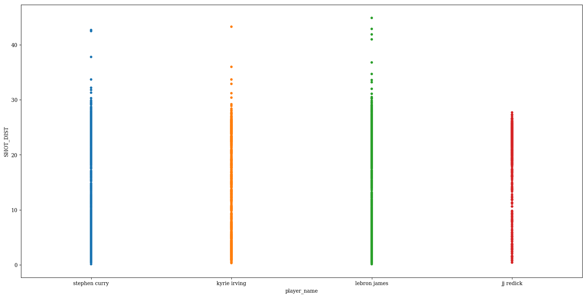


Change the `color` to represent whether the shot was made or missed


```python
p = sns.stripplot(data=df,
                  x='player_name',
                  y='SHOT_DIST',
                  hue='SHOT_RESULT')
```


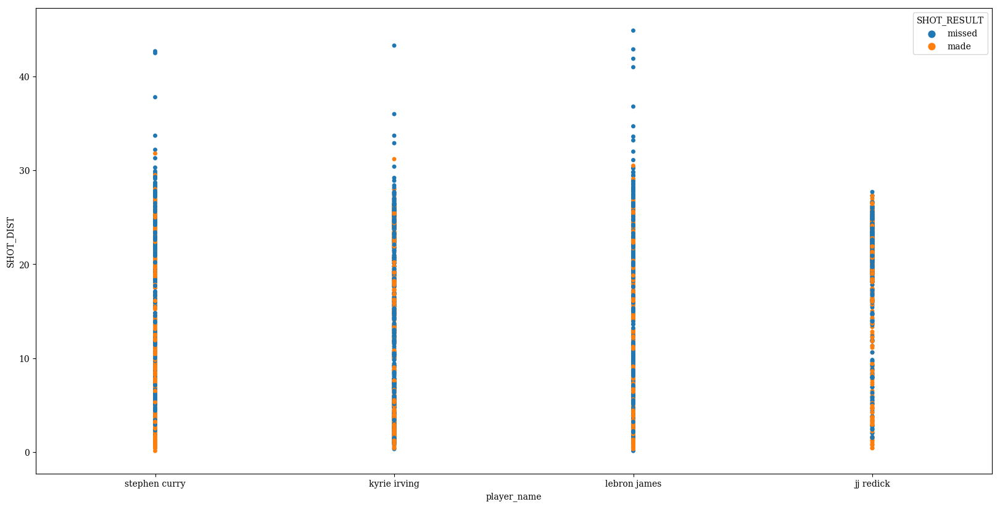


Change the `order` in which the names are displayed


```python
p = sns.stripplot(data=df,
                  x='player_name',
                  y='SHOT_DIST',
                  hue='SHOT_RESULT',
                  order=sorted(players_to_use))
```


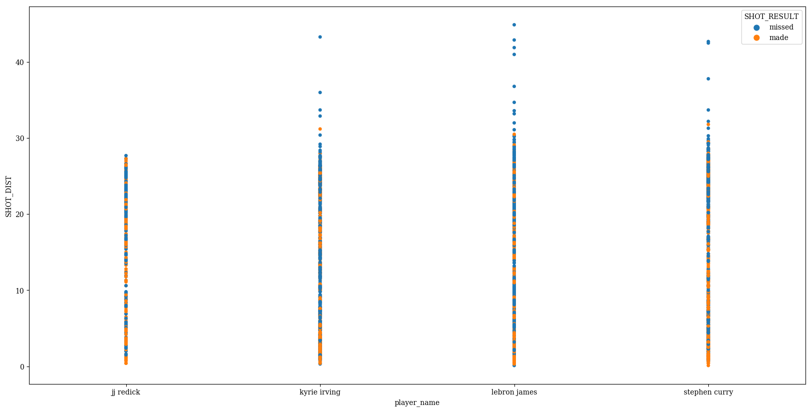


`jitter` can be used to randomly provide displacements along the horizontal axis, which is useful when there are large clusters of datapoints


```python
p = sns.stripplot(data=df,
                  x='player_name',
                  y='SHOT_DIST',
                  hue='SHOT_RESULT',
                  order=sorted(players_to_use),
                  jitter=0.25)
```


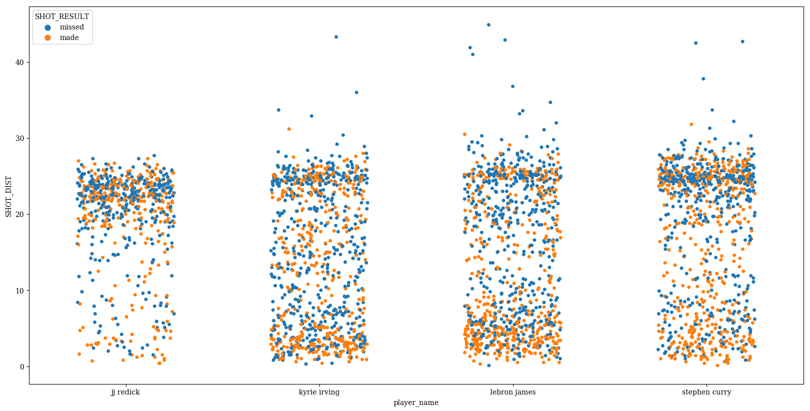


We see the default behavior is to stack the different hues on top of each other. This can be avoided with `dodge` (formerly called `split`)


```python
p = sns.stripplot(data=df,
                  x='player_name',
                  y='SHOT_DIST',
                  hue='SHOT_RESULT',
                  order=sorted(players_to_use),
                  jitter=0.25,
                  dodge=True)
```


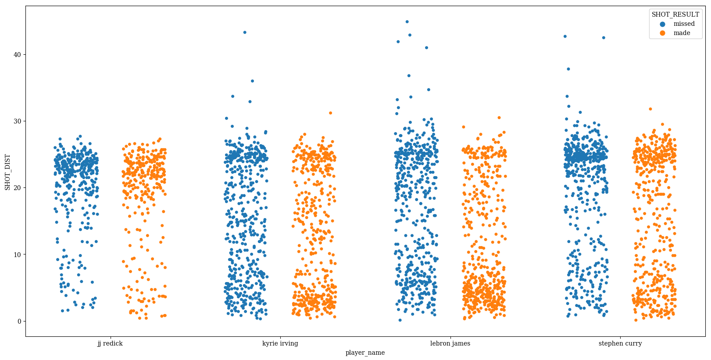


Flipping x and y inputs and setting `orient` to 'h' can be used to make a horizontal plot


```python
p = sns.stripplot(data=df,
                  y='player_name',
                  x='SHOT_DIST',
                  hue='SHOT_RESULT',
                  order=sorted(players_to_use),
                  jitter=0.25,
                  dodge=False,
                  orient='h')
```


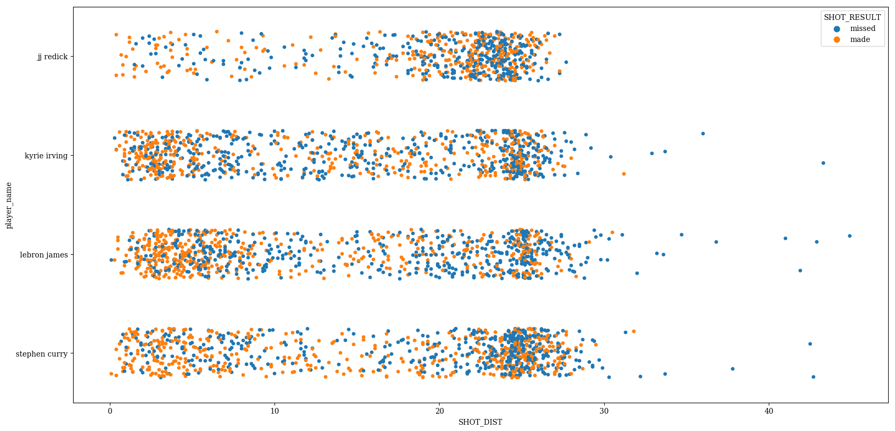


For coloring, you can either provide a single color to `color`...


```python
p = sns.stripplot(data=df,
                  y='player_name',
                  x='SHOT_DIST',
                  hue='SHOT_RESULT',
                  order=sorted(players_to_use),
                  jitter=0.25,
                  dodge=True,
                  orient='h',
                  color=(.25,.5,.75))
```


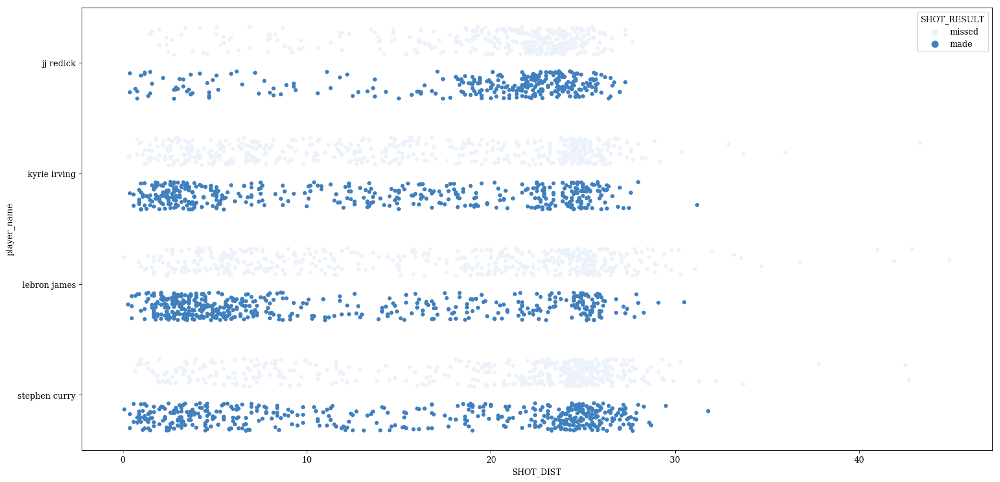


...or you can use one of the many variations of the `palette` parameter


```python
p = sns.stripplot(data=df,
                  x='player_name',
                  y='SHOT_DIST',
                  hue='SHOT_RESULT',
                  order=sorted(players_to_use),
                  jitter=0.25,
                  dodge=True,
                  palette=sns.husl_palette(2, l=0.5, s=.95))
```


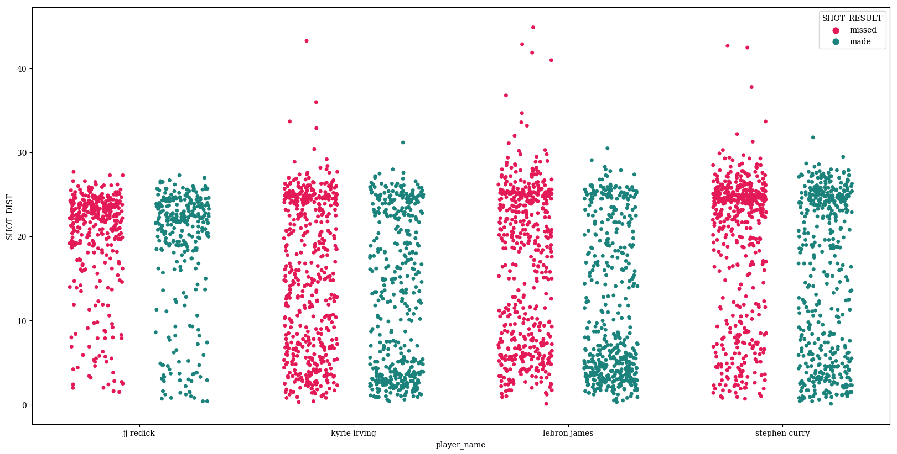


Adjust the marker `size`


```python
p = sns.stripplot(data=df,
                  x='player_name',
                  y='SHOT_DIST',
                  hue='SHOT_RESULT',
                  order=sorted(players_to_use),
                  jitter=0.25,
                  dodge=True,
                  palette=sns.husl_palette(2, l=0.5, s=.95),
                  size=8)
```


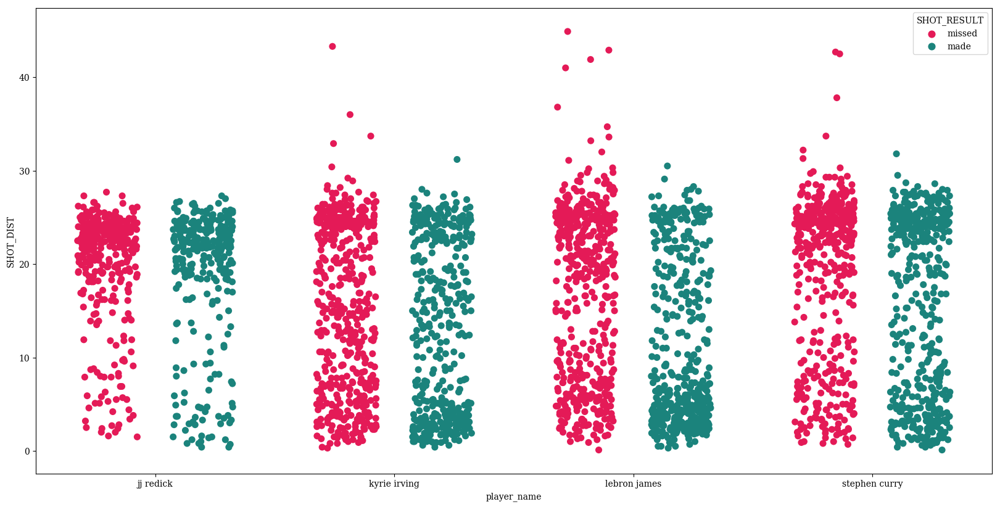


Adjust the `linewidth` of the edges of the circles


```python
p = sns.stripplot(data=df,
                  x='player_name',
                  y='SHOT_DIST',
                  hue='SHOT_RESULT',
                  order=sorted(players_to_use),
                  jitter=0.25,
                  dodge=True,
                  palette=sns.husl_palette(2, l=0.5, s=.95),
                  size=8,
                  linewidth=3)
```


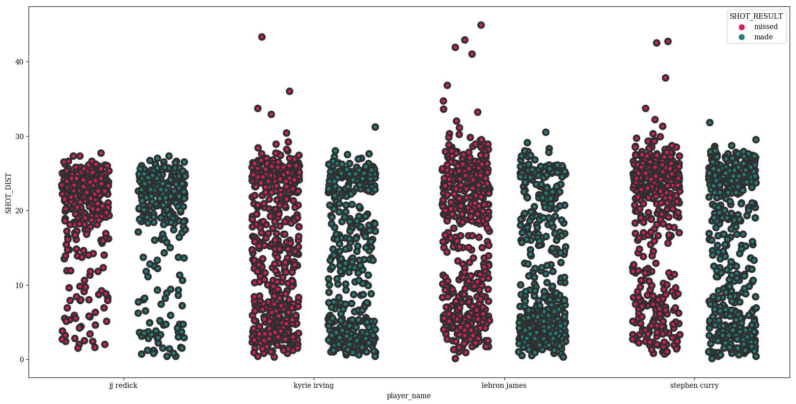


Change the color of these lines with `edgecolor`


```python
p = sns.stripplot(data=df,
                  x='player_name',
                  y='SHOT_DIST',
                  hue='SHOT_RESULT',
                  order=sorted(players_to_use),
                  jitter=0.25,
                  dodge=True,
                  palette=sns.husl_palette(2, l=0.5, s=.95),
                  size=8,
                  linewidth=3,
                  edgecolor='blue')
```


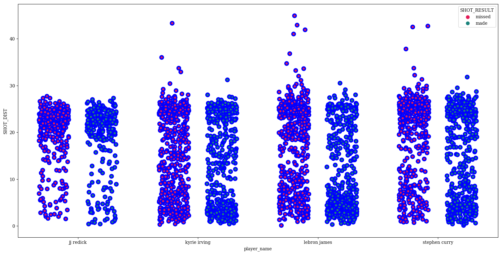


Swarmplots look good when overlaid on top of another categorical plot, like `boxplot`


```python
params = dict(data=df,
              x='player_name',
              y='SHOT_DIST',
              hue='SHOT_RESULT',
              #jitter=0.25,
              order=sorted(players_to_use),
              dodge=True)
p = sns.stripplot(size=8,
                  jitter=0.35,
                  palette=['#91bfdb','#fc8d59'],
                  edgecolor='black',
                  linewidth=1,
                  **params)
p_box = sns.boxplot(palette=['#BBBBBB','#DDDDDD'],linewidth=6,**params)
```


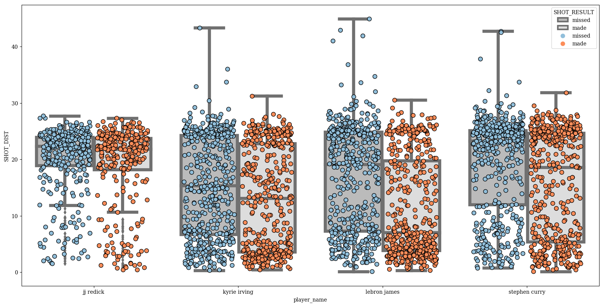


Finalize


```python
plt.rcParams['font.size'] = 30
params = dict(data=df,
              x='player_name',
              y='SHOT_DIST',
              hue='SHOT_RESULT',
              #jitter=0.25,
              order=sorted(players_to_use),
              dodge=True)
p = sns.stripplot(size=8,
                  jitter=0.35,
                  palette=['#91bfdb','#fc8d59'],
                  edgecolor='black',
                  linewidth=1,
                  **params)
p_box = sns.boxplot(palette=['#BBBBBB','#DDDDDD'],linewidth=6,**params)
handles,labels = p.get_legend_handles_labels()
#for h in handles:
#    h.set_height(3)
#handles[2].set_linewidth(33)

plt.legend(handles[2:],
           labels[2:],
           bbox_to_anchor = (.3,.95),
           fontsize = 40,
           markerscale = 5,
           frameon=False,
           labelspacing=0.2)
plt.text(1.85,35, "Strip Plot", fontsize = 95, color='Black', fontstyle='italic')
plt.xlabel('')
plt.ylabel('Shot Distance (ft)')
plt.gca().set_xlim(-0.5,3.5)
xlabs = p.get_xticklabels()
xlabs[0].set_text('JJ Redick')
for l in xlabs[1:]:
    l.set_text(" ".join(i.capitalize() for i in l.get_text().split() ))
p.set_xticklabels(xlabs)
```


    [<matplotlib.text.Text at 0x10f7e1c50>,
     <matplotlib.text.Text at 0x10be33f60>,
     <matplotlib.text.Text at 0x105cb5e48>,
     <matplotlib.text.Text at 0x10beff7f0>]


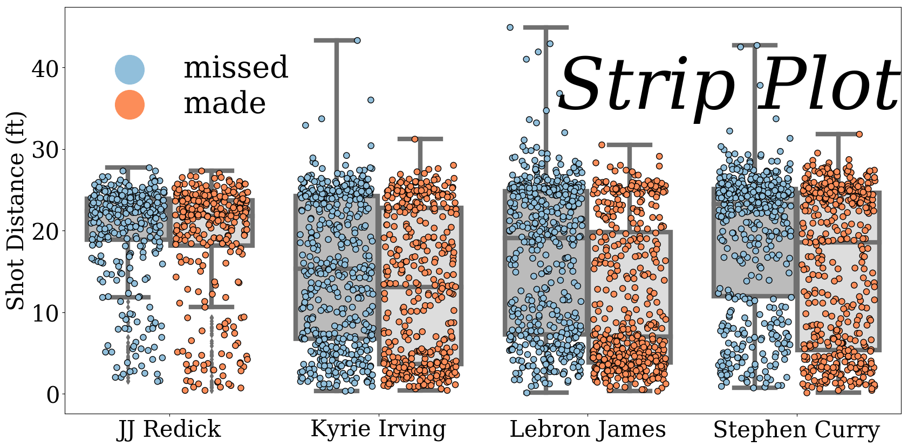


```python
p.get_figure().savefig('../../figures/stripplot.png')
```
