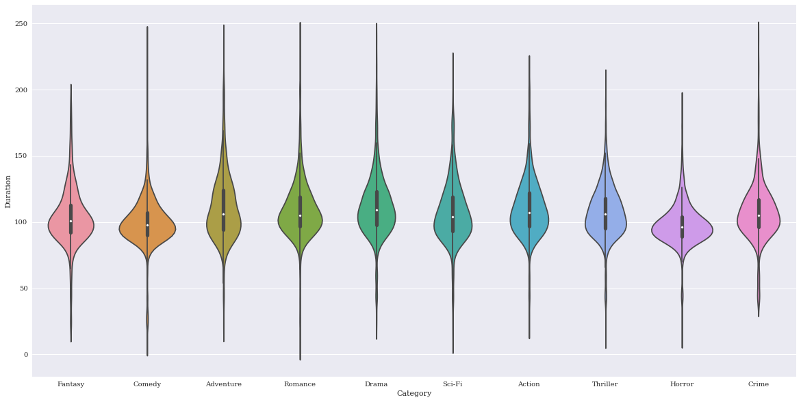

# seaborn.violinplot
---
Violinplots summarize numeric data over a set of categories. They are essentially a box plot with a kernel density estimate (KDE) overlaid along the range of the box and reflected to make it look nice. They provide more information than a boxplot because they also include information about how the data is distributed within the inner quartiles.
dataset: [IMDB 5000 Movie Dataset](https://www.kaggle.com/deepmatrix/imdb-5000-movie-dataset)


```python
%matplotlib inline
import pandas as pd
import matplotlib.pyplot as plt
import seaborn as sns
import numpy as np
plt.rcParams['figure.figsize'] = (20.0, 10.0)
plt.rcParams['font.family'] = "serif"
```


```python
df = pd.read_csv('../../../datasets/movie_metadata.csv')
```


```python
df.head()
```


<div>
<style>
    .dataframe thead tr:only-child th {
        text-align: right;
    }

    .dataframe thead th {
        text-align: left;
    }

    .dataframe tbody tr th {
        vertical-align: top;
    }
</style>
<table border="1" class="dataframe">
  <thead>
    <tr style="text-align: right;">
      <th></th>
      <th>color</th>
      <th>director_name</th>
      <th>num_critic_for_reviews</th>
      <th>duration</th>
      <th>director_facebook_likes</th>
      <th>actor_3_facebook_likes</th>
      <th>actor_2_name</th>
      <th>actor_1_facebook_likes</th>
      <th>gross</th>
      <th>genres</th>
      <th>...</th>
      <th>num_user_for_reviews</th>
      <th>language</th>
      <th>country</th>
      <th>content_rating</th>
      <th>budget</th>
      <th>title_year</th>
      <th>actor_2_facebook_likes</th>
      <th>imdb_score</th>
      <th>aspect_ratio</th>
      <th>movie_facebook_likes</th>
    </tr>
  </thead>
  <tbody>
    <tr>
      <th>0</th>
      <td>Color</td>
      <td>James Cameron</td>
      <td>723.0</td>
      <td>178.0</td>
      <td>0.0</td>
      <td>855.0</td>
      <td>Joel David Moore</td>
      <td>1000.0</td>
      <td>760505847.0</td>
      <td>Action|Adventure|Fantasy|Sci-Fi</td>
      <td>...</td>
      <td>3054.0</td>
      <td>English</td>
      <td>USA</td>
      <td>PG-13</td>
      <td>237000000.0</td>
      <td>2009.0</td>
      <td>936.0</td>
      <td>7.9</td>
      <td>1.78</td>
      <td>33000</td>
    </tr>
    <tr>
      <th>1</th>
      <td>Color</td>
      <td>Gore Verbinski</td>
      <td>302.0</td>
      <td>169.0</td>
      <td>563.0</td>
      <td>1000.0</td>
      <td>Orlando Bloom</td>
      <td>40000.0</td>
      <td>309404152.0</td>
      <td>Action|Adventure|Fantasy</td>
      <td>...</td>
      <td>1238.0</td>
      <td>English</td>
      <td>USA</td>
      <td>PG-13</td>
      <td>300000000.0</td>
      <td>2007.0</td>
      <td>5000.0</td>
      <td>7.1</td>
      <td>2.35</td>
      <td>0</td>
    </tr>
    <tr>
      <th>2</th>
      <td>Color</td>
      <td>Sam Mendes</td>
      <td>602.0</td>
      <td>148.0</td>
      <td>0.0</td>
      <td>161.0</td>
      <td>Rory Kinnear</td>
      <td>11000.0</td>
      <td>200074175.0</td>
      <td>Action|Adventure|Thriller</td>
      <td>...</td>
      <td>994.0</td>
      <td>English</td>
      <td>UK</td>
      <td>PG-13</td>
      <td>245000000.0</td>
      <td>2015.0</td>
      <td>393.0</td>
      <td>6.8</td>
      <td>2.35</td>
      <td>85000</td>
    </tr>
    <tr>
      <th>3</th>
      <td>Color</td>
      <td>Christopher Nolan</td>
      <td>813.0</td>
      <td>164.0</td>
      <td>22000.0</td>
      <td>23000.0</td>
      <td>Christian Bale</td>
      <td>27000.0</td>
      <td>448130642.0</td>
      <td>Action|Thriller</td>
      <td>...</td>
      <td>2701.0</td>
      <td>English</td>
      <td>USA</td>
      <td>PG-13</td>
      <td>250000000.0</td>
      <td>2012.0</td>
      <td>23000.0</td>
      <td>8.5</td>
      <td>2.35</td>
      <td>164000</td>
    </tr>
    <tr>
      <th>4</th>
      <td>NaN</td>
      <td>Doug Walker</td>
      <td>NaN</td>
      <td>NaN</td>
      <td>131.0</td>
      <td>NaN</td>
      <td>Rob Walker</td>
      <td>131.0</td>
      <td>NaN</td>
      <td>Documentary</td>
      <td>...</td>
      <td>NaN</td>
      <td>NaN</td>
      <td>NaN</td>
      <td>NaN</td>
      <td>NaN</td>
      <td>NaN</td>
      <td>12.0</td>
      <td>7.1</td>
      <td>NaN</td>
      <td>0</td>
    </tr>
  </tbody>
</table>
<p>5 rows × 28 columns</p>
</div>


For the bar plot, let's look at the number of movies in each category, allowing each movie to be counted more than once.


```python
# split each movie's genre list, then form a set from the unwrapped list of all genres
categories = set([s for genre_list in df.genres.unique() for s in genre_list.split("|")])

# one-hot encode each movie's classification
for cat in categories:
    df[cat] = df.genres.transform(lambda s: int(cat in s))
# drop other columns
df = df[['director_name','genres','duration'] + list(categories)]
df.head()

```


<div>
<style>
    .dataframe thead tr:only-child th {
        text-align: right;
    }

    .dataframe thead th {
        text-align: left;
    }

    .dataframe tbody tr th {
        vertical-align: top;
    }
</style>
<table border="1" class="dataframe">
  <thead>
    <tr style="text-align: right;">
      <th></th>
      <th>director_name</th>
      <th>genres</th>
      <th>duration</th>
      <th>Fantasy</th>
      <th>War</th>
      <th>Family</th>
      <th>Mystery</th>
      <th>Sport</th>
      <th>History</th>
      <th>Comedy</th>
      <th>...</th>
      <th>Sci-Fi</th>
      <th>Action</th>
      <th>Thriller</th>
      <th>Horror</th>
      <th>Crime</th>
      <th>Biography</th>
      <th>News</th>
      <th>Music</th>
      <th>Western</th>
      <th>Game-Show</th>
    </tr>
  </thead>
  <tbody>
    <tr>
      <th>0</th>
      <td>James Cameron</td>
      <td>Action|Adventure|Fantasy|Sci-Fi</td>
      <td>178.0</td>
      <td>1</td>
      <td>0</td>
      <td>0</td>
      <td>0</td>
      <td>0</td>
      <td>0</td>
      <td>0</td>
      <td>...</td>
      <td>1</td>
      <td>1</td>
      <td>0</td>
      <td>0</td>
      <td>0</td>
      <td>0</td>
      <td>0</td>
      <td>0</td>
      <td>0</td>
      <td>0</td>
    </tr>
    <tr>
      <th>1</th>
      <td>Gore Verbinski</td>
      <td>Action|Adventure|Fantasy</td>
      <td>169.0</td>
      <td>1</td>
      <td>0</td>
      <td>0</td>
      <td>0</td>
      <td>0</td>
      <td>0</td>
      <td>0</td>
      <td>...</td>
      <td>0</td>
      <td>1</td>
      <td>0</td>
      <td>0</td>
      <td>0</td>
      <td>0</td>
      <td>0</td>
      <td>0</td>
      <td>0</td>
      <td>0</td>
    </tr>
    <tr>
      <th>2</th>
      <td>Sam Mendes</td>
      <td>Action|Adventure|Thriller</td>
      <td>148.0</td>
      <td>0</td>
      <td>0</td>
      <td>0</td>
      <td>0</td>
      <td>0</td>
      <td>0</td>
      <td>0</td>
      <td>...</td>
      <td>0</td>
      <td>1</td>
      <td>1</td>
      <td>0</td>
      <td>0</td>
      <td>0</td>
      <td>0</td>
      <td>0</td>
      <td>0</td>
      <td>0</td>
    </tr>
    <tr>
      <th>3</th>
      <td>Christopher Nolan</td>
      <td>Action|Thriller</td>
      <td>164.0</td>
      <td>0</td>
      <td>0</td>
      <td>0</td>
      <td>0</td>
      <td>0</td>
      <td>0</td>
      <td>0</td>
      <td>...</td>
      <td>0</td>
      <td>1</td>
      <td>1</td>
      <td>0</td>
      <td>0</td>
      <td>0</td>
      <td>0</td>
      <td>0</td>
      <td>0</td>
      <td>0</td>
    </tr>
    <tr>
      <th>4</th>
      <td>Doug Walker</td>
      <td>Documentary</td>
      <td>NaN</td>
      <td>0</td>
      <td>0</td>
      <td>0</td>
      <td>0</td>
      <td>0</td>
      <td>0</td>
      <td>0</td>
      <td>...</td>
      <td>0</td>
      <td>0</td>
      <td>0</td>
      <td>0</td>
      <td>0</td>
      <td>0</td>
      <td>0</td>
      <td>0</td>
      <td>0</td>
      <td>0</td>
    </tr>
  </tbody>
</table>
<p>5 rows × 29 columns</p>
</div>


```python
# convert from wide to long format and remove null classificaitons
df = pd.melt(df,
             id_vars=['duration'],
             value_vars = list(categories),
             var_name = 'Category',
             value_name = 'Count')
df = df.loc[df.Count>0]
top_categories = df.groupby('Category').aggregate(sum).sort_values('Count', ascending=False).index
howmany=10
df = df.loc[df.Category.isin(top_categories[:howmany])]
df.rename(columns={"duration":"Duration"},inplace=True)

```


```python
df.head()
```


<div>
<style>
    .dataframe thead tr:only-child th {
        text-align: right;
    }

    .dataframe thead th {
        text-align: left;
    }

    .dataframe tbody tr th {
        vertical-align: top;
    }
</style>
<table border="1" class="dataframe">
  <thead>
    <tr style="text-align: right;">
      <th></th>
      <th>Duration</th>
      <th>Category</th>
      <th>Count</th>
    </tr>
  </thead>
  <tbody>
    <tr>
      <th>0</th>
      <td>178.0</td>
      <td>Fantasy</td>
      <td>1</td>
    </tr>
    <tr>
      <th>1</th>
      <td>169.0</td>
      <td>Fantasy</td>
      <td>1</td>
    </tr>
    <tr>
      <th>7</th>
      <td>100.0</td>
      <td>Fantasy</td>
      <td>1</td>
    </tr>
    <tr>
      <th>9</th>
      <td>153.0</td>
      <td>Fantasy</td>
      <td>1</td>
    </tr>
    <tr>
      <th>13</th>
      <td>151.0</td>
      <td>Fantasy</td>
      <td>1</td>
    </tr>
  </tbody>
</table>
</div>


Basic plot


```python
p = sns.violinplot(data=df,
                   x = 'Category',
                   y = 'Duration')
```


The outliers here are making things a bit squished, so I'll remove them since I am just interested in demonstrating the visualization tool.


```python
df = df.loc[df.Duration < 250]
```


```python
p = sns.violinplot(data=df,
                   x = 'Category',
                   y = 'Duration')
```





Change the order of categories


```python
p = sns.violinplot(data=df,
                   x = 'Category',
                   y = 'Duration',
                   order = sorted(df.Category.unique()))

```


Change the order that the colors are chosen

Change orientation to horizontal


```python
p = sns.violinplot(data=df,
                   y = 'Category',
                   x = 'Duration',
                   order = sorted(df.Category.unique()),
                   orient="h")
```


Desaturate


```python
p = sns.violinplot(data=df,
                   x = 'Category',
                   y = 'Duration',
                   order = sorted(df.Category.unique()),
                   saturation=.25)
```


Adjust width of violins


```python
p = sns.violinplot(data=df,
                   x = 'Category',
                   y = 'Duration',
                   order = sorted(df.Category.unique()),
                   width=.25)
```


Change the size of outlier markers


```python
p = sns.violinplot(data=df,
                   x = 'Category',
                   y = 'Duration',
                   order = sorted(df.Category.unique()),
                   fliersize=20)
```


Adjust the bandwidth of the KDE filtering parameter. Smaller values will use a thinner kernel and thus will contain higher feature resolution but potentially noise. Here are examples of low and high settings to demonstrate the difference.


```python
p = sns.violinplot(data=df,
                   x = 'Category',
                   y = 'Duration',
                   order = sorted(df.Category.unique()),
                   bw=.05)
```


```python
p = sns.violinplot(data=df,
                   x = 'Category',
                   y = 'Duration',
                   order = sorted(df.Category.unique()),
                   bw=5)
```


Finalize


```python
sns.set(rc={"axes.facecolor":"#e6e6e6",
            "axes.grid":False,
            'axes.labelsize':30,
            'figure.figsize':(20.0, 10.0),
            'xtick.labelsize':25,
            'ytick.labelsize':20})


p = sns.violinplot(data=df,
                   x = 'Category',
                   y = 'Duration',
                   palette = 'spectral',
                   order = sorted(df.Category.unique()),
                   notch=True)
plt.xticks(rotation=45)
l = plt.xlabel('')
plt.ylabel('Duration (min)')
plt.text(4.85,200, "Violin Plot", fontsize = 95, color="black", fontstyle='italic')
```


    <matplotlib.text.Text at 0x7f9c6e707e48>


```python
p.get_figure().savefig('../../figures/violinplot.png')
```
